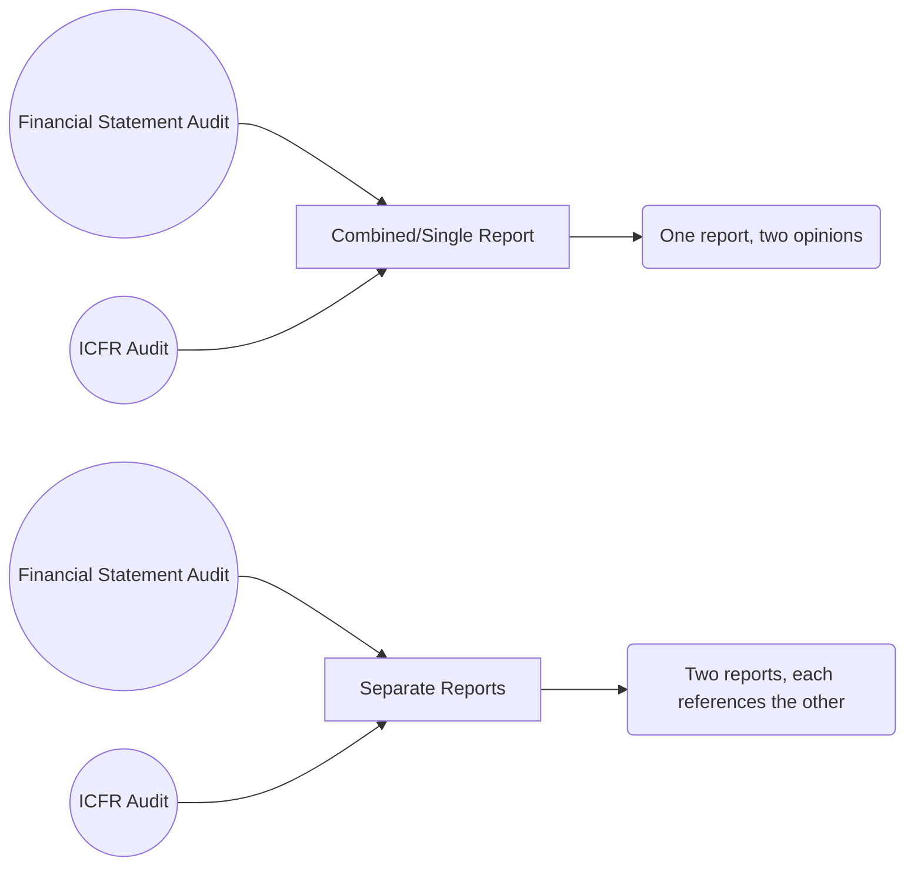

## 14.2 Separate vs. Integrated Reporting on Financial Statements and Internal Control

When conducting an integrated audit—an audit of both an entity’s financial statements and its Internal Control over Financial Reporting (ICFR)—the auditor can issue either a single (combined) report covering both aspects or two separate reports. Each approach comes with specific requirements regarding content, references, format, and regulatory compliance. Understanding the advantages and key considerations for each reporting structure is crucial for compliance with professional standards and for effective communication with stakeholders.

In this section, we examine:

• The nature and format of integrated vs. separate reports  
• Key components and references required under each approach  
• Common pitfalls and best practices for each reporting decision  
• COSO’s Internal Control—Integrated Framework as the generally accepted foundation for assessing ICFR effectiveness

---------------------------------------------------------------------------------------------------
## 1. Overview of Reporting Options

Auditors performing integrated audits have two principal ways to communicate their findings on financial statement fairness and on the effectiveness of the client’s ICFR:

1. A combined (single) report addressing both systems of control and financial statements.  
2. Two separate reports: one dedicated to financial statements and the other to ICFR.

Each format must conform to authoritative guidance issued by the PCAOB (for public companies) or relevant auditing standards (for non-issuers). The difference lies primarily in how the opinions are presented and how the body of the report is structured.

### 1.1 Combined (Single) Report

In a combined report format, the auditor merges both the financial statement audit opinion and the ICFR opinion into a single communication. Typically, the structure will include:

1. An introductory paragraph explaining the scope of the audits (financial statements and ICFR)  
2. Management’s responsibility for financial statements and internal control  
3. The auditor’s responsibility to express opinions on both items  
4. The basis for the auditor’s opinion (scope, standards, and audit procedures)  
5. The combined opinion paragraph(s) stating opinion on the financial statements and a separate opinion on the effectiveness of ICFR, all within one continuous report

By presenting a single report, the auditor can offer users a concise overview, ensuring that the financial statement audit opinion and ICFR opinion are readily accessible in one document. This format highlights the integrated nature of the engagement since one document clarifies that both audits were conducted concurrently, with sections referencing each other as needed.

### 1.2 Separate Reports

It is also permissible—and in some cases preferred—to issue two stand-alone reports:

1. A Financial Statements Report: Expresses the auditor’s opinion on the fairness of the financial statements according to the applicable framework (e.g., U.S. GAAP).  
2. An Internal Control Report: Expresses an opinion on whether ICFR is effective at year-end.

When the auditor decides to issue separate reports, each report includes a paragraph referencing the other audit to ensure that readers understand both engagements were performed as part of an integrated audit. For example, the report on the financial statements might contain a paragraph explaining that the auditor also performed an audit of the entity’s internal control over financial reporting. Similarly, the ICFR report would make a cross-reference back to the financial statement audit report.

This approach can be helpful if:

• Principals or stakeholders want clarity and in-depth discussion, each focused on a single subject matter.  
• Specific regulatory or contractual requirements mandate distinct deliverables or if certain audiences only require one of the opinions.  
• There are complexities in scope or timing, making two distinct reports easier for different user groups to reference.

---------------------------------------------------------------------------------------------------
## 2. Key Requirements and Considerations

Regardless of whether the auditor chooses a combined or separate report format, certain broad requirements must be carefully evaluated:

### 2.1 Reference to the COSO Framework

Most U.S. public companies (and many private entities) adopt the Committee of Sponsoring Organizations (COSO) “Internal Control—Integrated Framework” as a benchmark for designing, implementing, and evaluating ICFR. In either report structure:

• The auditor must reference that management has used the COSO framework as the basis for evaluating the effectiveness of ICFR.  
• This puts the communicated opinion into context, demonstrating that assessment criteria (i.e., the five components and 17 principles of COSO) have been consistently applied.  
• If the entity uses another recognized framework, such as COBIT for IT-focused controls, the auditor would highlight that instead, but COSO remains the primary standard accepted by most governing bodies.

### 2.2 Opinion Placement and Wording

In a combined report, the writer typically includes a single Opinion section with statements covering both the financial statements and ICFR. The paragraph often states:

• “In our opinion, the financial statements … present fairly …”  
• “Also, in our opinion, the Company maintained, in all material respects, effective internal control over financial reporting …”

If using separate reports, each report will contain a similar statement of opinion specific to its subject matter. Both must consistently refer to:

• The scope of the audit  
• The criteria used (e.g., COSO)  
• Any modifications, such as adverse or qualified opinions and the reasons behind them

### 2.3 Cross-References in Separate Reports

When separate reports are issued, each typically includes a pointing statement such as:

• “We also have audited, in accordance with the standards of the Public Company Accounting Oversight Board (United States), the Company’s internal control over financial reporting as of December 31, 20XX, based on [COSO framework]. Our report expressed [type of opinion] on the effectiveness of the Company’s internal control over financial reporting.”

Failing to cross-reference, or providing incomplete references, can create confusion among financial statement users about whether an integrated audit was performed.

### 2.4 Role of PCAOB AS 3320 in Integrated Audits

Public companies are subject to PCAOB auditing standards, including PCAOB AS 3320 (formerly AS 5 and subsequent amendments), which outlines how the integrated audit must be performed and how the separate or combined reports should reference one another. While details may evolve with updates to PCAOB standards, the underlying principle remains: transparency, consistency, and clarity in reporting both aspects of the engagement.

---------------------------------------------------------------------------------------------------
## 3. Practical Example: Single vs. Separate Reports

Below is a simplified illustration comparing the structure of a combined vs. a separate format. Note that actual auditing standards or firm policies may vary in format and wording.

In the above Mermaid diagram:

• The combined path merges both the Financial Statement Audit (A) and ICFR Audit (B) into a single report (D).  
• The separate path results in two documents (E), each with its own theme but referencing the other for an integrated perspective.

---------------------------------------------------------------------------------------------------
## 4. Advantages and Disadvantages

### 4.1 Combined (Single) Report

**Advantages**  
• A succinct format that allows users to see both opinions in one place  
• May reduce redundancies and simplify report distribution  
• Emphasizes the integrated nature of the engagement  

**Disadvantages**  
• May obscure detailed findings on either financial statements or internal control if readers seek to focus on one area  
• Users who only want one aspect might need to search through one integrated document  

### 4.2 Separate Reports

**Advantages**  
• Allows for in-depth coverage and tailored communication for each topic  
• Stakeholders who only need to review one opinion can do so without extensive referencing  
• Potentially clearer if material weaknesses or issues in ICFR do not affect the financial statements  

**Disadvantages**  
• Can be more time-consuming to prepare and review  
• Must ensure thorough cross-referencing to maintain clarity and compliance with PCAOB (or other standard-setter) requirements  

---------------------------------------------------------------------------------------------------
## 5. Common Pitfalls and Best Practices

**Pitfalls**  
• Omitting or inadequately referencing the separate report when issuing two standalone reports  
• Providing inconsistent language regarding the scope of either the financial statement audit or ICFR audit, which may raise questions about the nature of testing  
• Failing to mention the assessment framework (e.g., COSO) or misrepresenting management’s responsibility  

**Best Practices**  
• Confirm consistency of wording in all references across both reports if issued separately  
• Use subheadings or clear transitions to differentiate opinions for combined reports so that stakeholders can quickly locate relevant sections  
• Highlight any modifications or emphasis paragraphs that pertain separately to the financial statement audit vs. the internal control audit, especially if there are known deficiencies or scope limitations  

---------------------------------------------------------------------------------------------------
## 6. Summary

Determining whether to issue a single combined report or separate reports for the financial statements and the internal control audit is a strategic decision influenced by practical, legal, and stakeholder considerations. Regardless of the format, referencing recognized criteria like the COSO Internal Control—Integrated Framework is critical. Consistent cross-referencing, transparent disclosures, and alignment with PCAOB (or appropriate) standards will help ensure the reports convey a clear, intuitive message to all users.

---------------------------------------------------------------------------------------------------
## References and Resources

• PCAOB AS 3320: Detailed instructions on referencing the integrated audit in separate reports  
• COSO “Internal Control—Integrated Framework”: Guidance on the five components and 17 principles of internal control  
• Firm examples of integrated audits: Many large CPA firms publish sample integrated or separate reports on their websites or in public filings  
• Additional resources from professional bodies (AICPA, PCAOB) for best practices in reporting

---------------------------------------------------------------------------------------------------
## SEO-Optimized Quiz: Integrated vs. Separate Reporting for ICFR



### Which of the following statements best describes a combined (single) report in an integrated audit?

- [x] It includes opinions on both financial statements and ICFR within a single document.
- [ ] It merges management and auditor responsibilities into one paragraph.
- [ ] It is issued only when no material weaknesses exist in internal control.
- [ ] It is restricted to internal use within the company.

> **Explanation:** A combined report merges the financial statements opinion and the internal control opinion into a single document presented to external stakeholders.

---

### Which of the following is an advantage of issuing separate reports for financial statements and ICFR?

- [x] Each report can provide a more focused discussion on its specific area.
- [ ] Greater likelihood of an unmodified opinion on both reports.
- [ ] It is automatically less expensive to prepare.
- [ ] Reduced responsibility for the auditor regarding cross-referencing.

> **Explanation:** Separate reports allow the auditor to focus specifically on each engagement. However, they do require clear cross-referencing to be compliant with integrated audit standards.

---

### In a combined (single) report, what is the typical approach to presenting opinions on financial statements and ICFR?

- [x] Present each opinion in its own paragraph within one integrated report.
- [ ] Provide only one paragraph for both opinions without separation.
- [ ] Omit management’s responsibility if referencing the other report.
- [ ] Include only a management letter with no separate opinions.

> **Explanation:** Generally, a combined report presents the financial statement opinion and the ICFR opinion in separate paragraphs within one cohesive document.

---

### When issuing two separate reports, cross-referencing is used primarily to ensure:

- [x] Readers understand both audits were conducted in an integrated fashion.
- [ ] The financial statements are prepared under multiple accounting frameworks.
- [ ] The auditor does not have to mention the COSO framework.
- [ ] Management has no ongoing responsibilities regarding internal control.

> **Explanation:** Cross-referencing clarifies that the auditor’s engagements for financial statements and ICFR were part of one integrated audit process.

---

### Which standard provides guidance on referencing integrated audits in separate reports?

- [x] PCAOB AS 3320
- [ ] AICPA SAS 99
- [x] PCAOB AS 5
- [ ] IFRS 15

> **Explanation:** PCAOB AS 3320 (formerly AS 5 and updated/renumbered in PCAOB codification) offers guidelines on referencing integrated audits, although other standards may also be relevant.

---

### In the context of internal control opinions, referencing the COSO “Internal Control—Integrated Framework” ensures:

- [x] Stakeholders understand the criteria used to assess the internal control system.
- [ ] The auditor avoids any disclosure of control deficiencies.
- [ ] The financial statements are automatically free from errors.
- [ ] The audit will never uncover material weaknesses.

> **Explanation:** COSO is recognized as the standard framework for designing, implementing, and evaluating internal control systems. Referencing it gives readers clarity on the assessment basis.

---

### What is one disadvantage of using a single, combined report?

- [x] Users may have difficulty focusing on specific findings if they are only interested in one element.
- [ ] It violates PCAOB standards.
- [x] It automatically leads to a qualified opinion.
- [ ] It requires the use of dual-dating for the audit report.

> **Explanation:** Combined formats can be less convenient for those who want only one of the two opinions and prefer not to navigate a single report covering both.

---

### When preparing a separate report on ICFR, which of the following elements must be included?

- [x] A clear mention of the COSO framework if recognized as the basis for internal control evaluation.
- [ ] No reference to the auditor’s responsibility for financial statements.
- [ ] Detailed disclosures of all client operational procedures.
- [ ] A statement that management is not responsible for internal control.

> **Explanation:** The auditor’s ICFR report makes explicit mention of management’s responsibility references to the COSO framework, among other required elements.

---

### Best practice in a combined (single) report includes:

- [x] Using distinct subheadings or paragraphs for each opinion while referencing their integrated approach.
- [ ] Using only bullet points without headings.
- [ ] Completely separating the financial statement audit from the ICFR audit with no cross-linkages.
- [ ] Eliminating mention of any scope limitations or disclaimers.

> **Explanation:** Even in a single report, clarity is paramount. Separating sections for each opinion while noting their integrated nature helps the reader navigate content effectively.

---

### True or False: PCAOB standards mandate that the auditor must always issue a single combined report on financial statements and internal control.

- [x] False
- [ ] True

> **Explanation:** Auditors can choose between a single combined report or two separate reports, as long as each approach meets the relevant professional standards.



---------------------------------------------------------------------------------------------------
## For Additional Practice and Deeper Preparation

**[Auditing & Attestation CPA Mock Exams (AUD): Comprehensive Prep](https://www.udemy.com/course/aud-cpa-mock-exams/?referralCode=D064EF7BD4A84FC6403D)**  
• Tackle full-length mock exams designed to mirror real AUD questions—from risk assessment and ethics to internal control and substantive procedures.  
• Refine your exam-day strategies with detailed, step-by-step solutions for every scenario.  
• Explore in-depth rationales that reinforce understanding of higher-level concepts, giving you a decisive edge on test day.  
• Boost confidence and reduce exam anxiety by building mastery of the wide-ranging AUD blueprint.

_Disclaimer: This course is not endorsed by or affiliated with the AICPA, NASBA, or any official CPA Examination authority. All content is created solely for educational and preparatory purposes._
