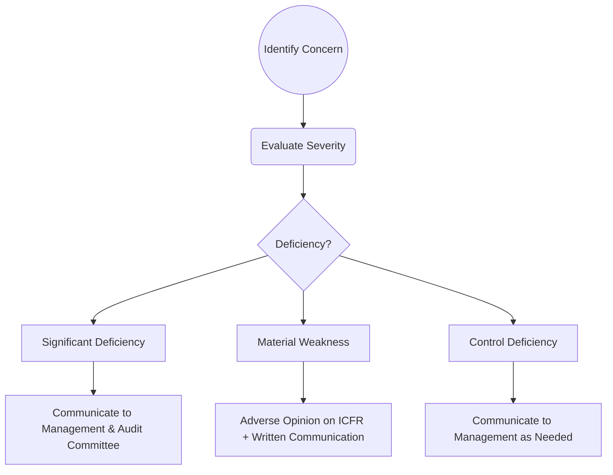

## 14.3 Communicating Deficiencies: Significant vs. Material Weaknesses

One of the central objectives of an audit of internal control over financial reporting (ICFR) is to identify deficiencies that could compromise the reliability of a company’s financial statements. Under established auditing standards (such as those promulgated by the PCAOB and the AICPA), external auditors are responsible for evaluating the severity of these internal control deficiencies and communicating them appropriately to management and those charged with governance (e.g., the audit committee). The crux of this section revolves around:

• The key differences among control deficiencies, significant deficiencies, and material weaknesses.  
• How each type impacts the external auditor’s opinion on ICFR.  
• Effective remediation strategies to mitigate control weaknesses.  
• Essential best practices in communicating these findings to stakeholders.

By understanding these concepts, CPA candidates and professionals will be better prepared to navigate both the technical and practical aspects of a robust internal control environment. This knowledge is also essential for addressing related questions in the AUD Exam Section of the Uniform CPA Examination.

---

## Deficiency Classifications

Auditing standards require auditors to assess the design and operating effectiveness of internal controls. When controls do not operate as intended or are missing altogether, deficiencies arise. The nature and severity of such deficiencies call for varying levels of response and communication.

### Control Deficiency

A control deficiency exists when the design or operation of a control does not allow management or employees, in the normal course of performing their functions, to prevent or detect and correct misstatements on a timely basis. In essence:

• Design deficiency: The proper control is absent or not properly designed.  
• Operation deficiency: A properly designed control does not function as intended or is otherwise ignored.  

Example: A control designed to reconcile bank statements monthly is in place, but the individual responsible for reconciling statements summarizes only deposits and does not verify checks against a control register. This operational lapse can allow misstatements to go undetected.

### Significant Deficiency

Significant deficiencies are less severe than material weaknesses but noteworthy enough to warrant timely attention by those responsible for oversight of the company’s financial reporting. Per PCAOB standards, a significant deficiency is:

“...a deficiency, or a combination of deficiencies, in internal control over financial reporting that is important enough to merit attention by those responsible for oversight of the company’s financial reporting, but is not severe enough to be called a material weakness.”

Typical indicator that a deficiency may be “significant” includes recurring immaterial errors, systematic issues in transaction processing, or insufficient segregation of duties that increases the risk of errors—though not necessarily of a magnitude to be material.

Example: A company with minor repeated reconciliation errors that, while not leading to a material misstatement, highlight a process breakdown. Over time, if left unaddressed, these errors could accumulate into more significant risk or undermine the integrity of the financial reporting process.

### Material Weakness

A material weakness is the most severe level of control deficiency. It indicates a reasonable possibility that a material misstatement in the financial statements will not be prevented, or detected and corrected, on a timely basis.

Key criteria for a material weakness:  
• Probability: There is a reasonable possibility (more than remote) of a material misstatement.  
• Magnitude: The potential misstatement could be large enough (material in amount) to affect the judgement of financial statement users.

Example: Management repeatedly overrides certain critical controls related to revenue recognition, such that fraudulent financial reporting becomes a likely possibility. In this scenario, the combination of override and heightened fraud risk creates a material weakness.

---

## Reporting Implications

External auditors must determine the impact of identified deficiencies on the overall opinion related to ICFR and, in integrated audits, on the financial statements. Communication requirements vary based on the severity of the deficiency:

1. **Material Weakness**  
   - If one or more material weaknesses exist at year-end, the opinion on ICFR must be adverse.  
   - It’s possible, however, for the auditor to issue an unqualified (clean) opinion on the financial statements if the material misstatement has been corrected or does not pervade the overall financial statements.  
   - Management and the audit committee are notified in writing.

2. **Significant Deficiency**  
   - Reported in writing to both management and the audit committee.  
   - Does not necessarily result in an adverse ICFR opinion unless elevated to a material weakness.  
   - Typically does not affect the auditor’s opinion on the financial statements, though corrective actions are vital to ensure the deficiency does not lead to future misstatements.

3. **Control Deficiency**  
   - Management is usually informed, but there is no requirement for formal written communication to the audit committee if the deficiency is neither significant nor material.  
   - Control deficiencies typically do not alter the auditor’s opinion on ICFR or the financial statements, barring escalation to a more severe category.

Below is a simple diagram illustrating how each level of deficiency impacts reporting:

In this diagram, each deficiency type leads to different levels of internal and external communication, as well as potentially altering the auditor’s opinion.

---

## Remediation Efforts

When a material weakness or significant deficiency is identified, remediation becomes a top priority. Management must take corrective actions as soon as possible to address control gaps and prevent future financial misstatements.

### Remediation of Material Weaknesses

• If a company remediates a material weakness before the end of the fiscal year, and sufficient time remains to test the newly implemented controls, the external auditor may be able to conclude that the material weakness no longer exists as of the fiscal year-end.  
• Successful remediation involves not only implementing new controls but also properly training and monitoring personnel to guarantee long-term effectiveness.  
• Some entities perform voluntary “remediation audits” (interim reviews focusing on the corrected controls) to ensure that controls are operating effectively in real-time, rather than waiting for the next integrated audit cycle.

### Steps in a Remediation Plan

1. **Root Cause Analysis**: Identify why the deficiency occurred. Was it ownership, design, or human error?  
2. **Design of Corrective Controls**: Determine specific steps—policy changes, training, or software solutions—to mitigate the risks.  
3. **Implementation**: Put the new controls in place, ensuring employees understand their responsibilities.  
4. **Testing**: Conduct walkthroughs, sample testing, and process reviews to validate that the control operates effectively.  
5. **Continuous Monitoring**: Maintain oversight to catch re-emergence of deficiencies.

---

## Glossary

• **Remediation**: The actions taken by management to address identified weaknesses in internal controls, ensuring that processes and procedures are adequately designed and operate effectively going forward.  
• **Reporting to Audit Committee**: Required communication for both significant deficiencies and material weaknesses in the internal control environment of public issuers.  
• **Modified Opinion on ICFR**: If a material weakness exists, the auditor typically issues an adverse opinion on ICFR; if the auditor’s ability to test controls is severely limited, a disclaimer of opinion may be warranted.

---

## Best Practices and Common Pitfalls

• **Best Practices**  
  - Conduct regular training on internal controls for employees at all levels.  
  - Maintain strong governance and oversight by the audit committee or board of directors.  
  - Integrate technology solutions (e.g., automated monitoring and real-time reporting) to identify unusual trends or reconciling items promptly.

• **Common Pitfalls**  
  - Inadequate segregation of duties, especially for smaller enterprises without distinct staffing roles.  
  - Overreliance on manual controls that are not independently reviewed or verified.  
  - Failure to address “minor” issues promptly, which can accumulate and transform into more severe deficiencies over time.  
  - Not allowing sufficient time to test newly remediated controls—a lapse that might result in an adverse opinion if an effective remediation can’t be demonstrated.

---

## References and Resources

### Official References

- PCAOB AS 1305, “Communications About Control Deficiencies.”  
  (https://pcaobus.org/oversight/standards/auditing-standards/details/AS1305)

### Additional Resources

- Whitepapers from major accounting firms, commonly titled “Effective Oversight of SOX 404 Remediation Projects,” which provide best practices on addressing and remediating identified weaknesses in a timely and methodical manner.  
- The Institute of Internal Auditors (IIA) offers guidance on optimal approaches to designing and implementing remediation projects for internal control weaknesses.  

---

## Communicating Deficiencies: Significant vs. Material Weaknesses – Comprehensive Quiz



### Which of the following best describes a significant deficiency?

- [ ] A type of control absence that prevents timely detection of material misstatements.
- [x] A deficiency important enough to merit attention but not as severe as a material weakness.
- [ ] A deficiency that automatically disclaims the auditor’s opinion on ICFR.
- [ ] A gap that leads directly to fraudulent activity in more than 50% of cases.

> **Explanation:** Significant deficiencies are noteworthy control issues requiring management and oversight attention, but they do not rise to the severity of a material weakness.

### A company identified a material weakness mid-year and successfully implemented new controls one month before year-end. What should the auditor typically do?

- [ ] Automatically conclude that the material weakness still exists.
- [x] Test the new controls if sufficient time exists to assess operating effectiveness.
- [ ] Issue a disclaimer of opinion on ICFR.
- [ ] Not mention the weakness in the audit report since it no longer exists.

> **Explanation:** If management remediates a material weakness before the end of the year, the auditor can test the newly implemented controls if enough time remains to assess their effectiveness.

### Which statement is true about reporting implications for a material weakness in an integrated audit?

- [ ] Only requires verbal communication to management if the weakness is severe.
- [ ] Leads to a qualified opinion on ICFR, with no effect on the financial statements.
- [x] Requires an adverse opinion on ICFR unless remediated timely and tested.
- [ ] Automatically causes the auditor to withdraw from the engagement.

> **Explanation:** A material weakness generally results in an adverse opinion on ICFR unless sufficiently remediated and tested before year-end.

### How are significant deficiencies typically communicated to the audit committee?

- [x] In writing by the external auditor.
- [ ] They do not need to be communicated.
- [ ] They are communicated only verbally with no formal follow-up.
- [ ] They are communicated only if management insists.

> **Explanation:** Both material weaknesses and significant deficiencies must be reported in writing to management and those charged with governance (e.g., the audit committee).

### Which of the following is a key difference between a significant deficiency and a control deficiency?

- [x] Significance of the potential misstatement risk.
- [ ] The presence of fraud.
- [x] The requirement to communicate to the audit committee is mandatory.
- [ ] The deficiency is caused solely by lack of documentation.

> **Explanation:** A difference lies in the severity or the significance of the deficiency and whether it is formally communicated to the audit committee. Control deficiencies do not necessarily involve formal reporting, while significant deficiencies do.

### Which scenario most likely indicates a material weakness?

- [x] Multiple instances of management override leading to potentially material fraud.
- [ ] Conflicting job duties in a small department without any fraud detected.
- [ ] A single immaterial misstatement discovered in a cash disbursements cycle.
- [ ] An expense report not approved within the expected timeline.

> **Explanation:** Management override that could lead to material misstatement is a strong indicator of a material weakness.

### Why might a minor control deficiency, if repeated and unresolved, become a significant deficiency?

- [x] It could accumulate or worsen over time, leading to a higher likelihood of material misstated balances.
- [ ] It automatically becomes a material weakness.
- [x] Only the auditor’s personal bias upgrades deficiencies from minor to significant over time.
- [ ] It is not possible for a minor deficiency to escalate.

> **Explanation:** Even small control gaps can accumulate in impact or risk over time, gradually escalating in severity if not properly remediated.

### When management remediates a significant deficiency, what step should an external auditor take next?

- [x] Perform procedures to verify the remediation is effective.
- [ ] Rely on management’s assertion without testing.
- [ ] Immediately reclassify the deficiency as material.
- [ ] Delay testing until the next annual audit period.

> **Explanation:** The external auditor must assess the operating effectiveness of remediated controls to confirm that the issue has been resolved.

### Which statement about adverse opinions on ICFR is correct?

- [x] An adverse opinion on ICFR can coexist with an unqualified opinion on the financial statements.
- [ ] Once an adverse opinion is issued, the engagement must be terminated.
- [ ] An adverse opinion on ICFR never coexists with an unqualified financial statement opinion.
- [ ] The opinion on ICFR and financial statements are always the same.

> **Explanation:** A material weakness can lead to an adverse opinion on ICFR, but if the misstatement was addressed appropriately, the financial statements could still receive an unqualified opinion.

### A deficiency that does not affect financial statements but has a significant impact on operational efficiency should be:

- [x] Reviewed by management for appropriate corrective actions.
- [ ] Automatically escalated to a material weakness.
- [ ] Omitted from the audit report entirely.
- [ ] Passed on to the next auditor without communication.

> **Explanation:** Even when a deficiency does not lead to financial statement misstatements, management should address and correct the deficiency if it significantly impacts operational efficiency or could escalate into a more serious issue in the future.



---

## For Additional Practice and Deeper Preparation

**[Auditing & Attestation CPA Mock Exams (AUD): Comprehensive Prep](https://www.udemy.com/course/aud-cpa-mock-exams/?referralCode=D064EF7BD4A84FC6403D)**  
• Tackle full-length mock exams designed to mirror real AUD questions—from risk assessment and ethics to internal control and substantive procedures.  
• Refine your exam-day strategies with detailed, step-by-step solutions for every scenario.  
• Explore in-depth rationales that reinforce understanding of higher-level concepts, giving you a decisive edge on test day.  
• Boost confidence and reduce exam anxiety by building mastery of the wide-ranging AUD blueprint.

_Disclaimer: This course is not endorsed by or affiliated with the AICPA, NASBA, or any official CPA Examination authority. All content is created solely for educational and preparatory purposes._
