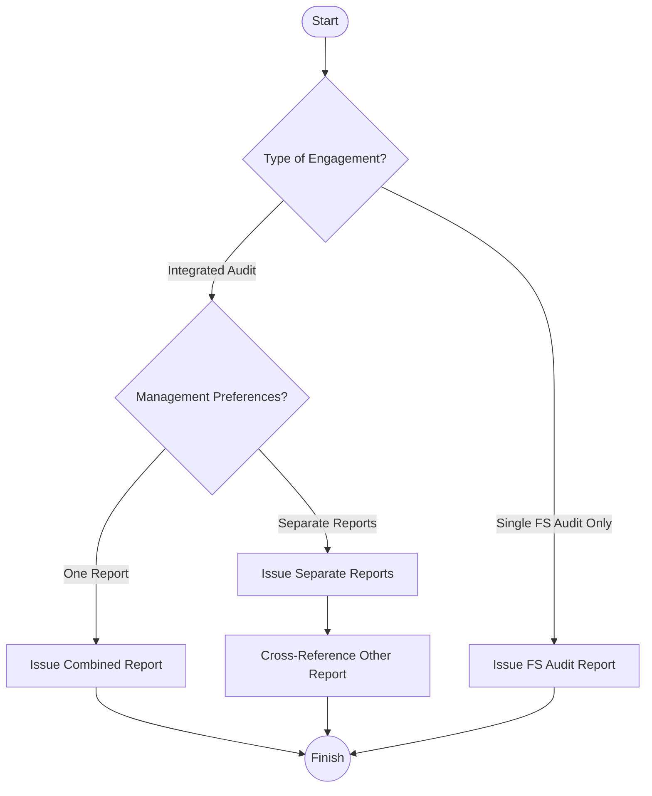

## 14.4 Use of Separate or Combined Reports for the Audit of an Entity’s Financial Statements and the Audit of Internal Control

An audit of an entity’s financial statements often goes hand-in-hand with an audit of the entity’s internal control over financial reporting (ICFR). When a public company or large private entity elects (or is required) to perform an integrated audit, a key decision emerges: should the auditor issue a combined report or separate reports for these two audits? This section explores the strategic, procedural, and practical considerations involved in choosing between a combined or separate reporting format. In addition, we review references to each report if separate and highlight relevant professional standards.

---

### The Integrated Audit Approach: A Quick Review

An integrated audit approach recognizes that tests of internal control and financial statement audits overlap in many ways. Rather than duplicating efforts, the auditor designs procedures (e.g., inspecting documents, testing transactions) to gather evidence that supports both the financial statement audit and the evaluation of internal control effectiveness. This approach:
• Improves efficiency.  
• Enhances overall audit quality by focusing on key controls tied to material misstatement risks.  
• Provides transparent insights into how controls affect financial reporting reliability.

---

### Advantages of a Combined Report

When the decision is made to issue one single report covering both the financial statements and internal control effectiveness, many auditors find it beneficial. Some key advantages include:

1. Streamlined User Communication  
   A combined report presents both opinions—one on the financial statements and one on the effectiveness of internal controls—within a single document. This format reduces the volume of separate reports and keeps stakeholders from having to refer to multiple documents.

2. Reinforced Connection Between Controls and Financial Statements  
   Because internal controls help ensure the accuracy and reliability of financial statements, a combined report helps illustrate the integrated nature of the audit. Stakeholders see more clearly that deficiencies in internal controls could lead to material misstatements.

3. Clarity and Efficiency  
   In an environment where time and clarity are critical, combining reports can reduce confusion and printing or distribution costs. Recipients can easily reference one authoritative document, increasing efficiency for management, audit committees, and external users alike.

#### Practical Real-World Example

Imagine a publicly traded technology firm, Quantum IT Innovations, Inc. As a rapidly growing company with a large, global user base, it faces scrutiny from regulators, investors, and lenders. By issuing a combined report, Quantum IT Innovations can provide a consolidated, streamlined opinion to stakeholders who want to understand both the reliability of the company’s financial statements and the soundness of its internal controls. This one document showcases consistency between the two audits and underscores the company’s commitment to transparency.

---

### When Separate Reports May Be Preferred

Despite the many advantages of a combined format, there are several situations where separate reports on ICFR and financial statements may be favorable or required:

1. Distinct Target Audiences  
   Certain users, such as banks or regulatory agencies, may primarily focus on one aspect of the entity’s financial health. A bank providing a credit facility, for instance, might be mostly concerned with the financial statements, while a regulator may focus on the entity’s controls. Issuing a separate report for each audience can streamline the review process for those specific stakeholders.

2. Different Report Release Dates  
   Occasionally, the entity may wish to expedite the release of the audited financial statements before all ICFR testing has concluded. In this scenario, separate reports allow for flexibility in timing. The financial statements report can be issued as soon as that audit is complete, while the internal control report may come at a later date, when ICFR testing is finalized.

3. Regulatory or Contractual Requirements  
   Some industries or jurisdictions have specific requirements for reporting. If specialized compliance regulations insist on a separate internal control report, or if there are unique contractual stipulations with external parties, separate reports may be necessary.

---

### Reference to the Other Report

When the auditor chooses to prepare separate reports, each report typically includes a paragraph referencing the other engagement. This cross-reference ensures that:

• Users are aware that an integrated approach was taken even though separate reports are being issued.  
• Readers of the financial statements can also be informed about the status of the ICFR audit (and vice versa).  
• No confusion arises about the scope of each engagement or the audit period covered.

#### Example Wording
“We have also audited the effectiveness of [Entity]’s internal control over financial reporting as of December 31, 20XX, in accordance with the standards of the Public Company Accounting Oversight Board (United States), and issued our report thereon dated [Month XX, 20XX].”

Including this paragraph in each separate report establishes a clear linkage and highlights the integrated nature of the two engagements. For more information on referencing other engagements, see [Chapter 13: Audit Reporting](../13-audit-reporting).

---

### Release Dates and Coordination

Even if reports are issued separately, many entities prefer both opinions to be dated the same moment in time. This alignment is possible if the auditor finishes both audit engagements simultaneously. However, in circumstances where the internal control assessment lags behind, the date on which sufficient evidence is obtained for ICFR would logically be later.

If in doubt, the auditor must confirm that procedures performed up to the date of each respective report remain valid. If a significant event occurs after the issuance of one report but before another, the auditor needs to consider whether to modify or amend previously issued opinions.

---

### Diagram: Combined vs. Separate Reports Workflow

Below is a simplified Mermaid.js diagram illustrating the decision flow for issuing a combined vs. a separate report:

Explanation:
1. The process begins with determining whether the entity is undergoing an integrated audit (financial statements plus internal control).  
2. If integrated, the auditor discusses management’s preference for either one combined report or separate reports.  
3. If separate reports are chosen, each one references the other.  
4. If only a financial statement audit is performed (non-integrated), the report is straightforward.  

This flowchart helps illustrate how an integrated audit may lead to either combined or separate audits and how references are handled in each scenario.

---

### Best Practices and Common Pitfalls

• Coordinate Early: The engagement team should discuss reporting preferences with management, the audit committee, and any significant users (lenders, regulators).  
• Avoid Confusion: Whether combined or separate, ensure clarity around scope, responsibilities, and opinion conclusions in each report.  
• Maintain Consistency: Ensure that dates, references, and language in each document (when separate) are consistent and correct.  
• Plan for Changes: Be prepared for last-minute issues that might affect timing—especially relevant for separate reports with staggered release dates.

---

### Glossary

• **Integrated Audit Approach**: A method in which auditors perform tests that serve both the financial statement audit and the internal control audit, avoiding redundant procedures.  
• **Combined vs. Separate**: The choice to present the financial statement opinion and the ICFR opinion in one report or in two different reports.  
• **Release Dates**: The official date(s) on which the audited financial statements and/or internal control report are issued.

---

### References and Resources

#### Official References  
- **PCAOB AS 3101**: Governs the form of the auditor’s report for issuers, including references to audits of internal control over financial reporting.  
- **AU-C Section 700**: Guides reporting for non-issuers (private companies) that may elect or be required to have their internal controls audited alongside financial statements.

#### Additional Resources  
- **“Best Practices in Integrated Audits” (Journal of Accountancy)**: Offers a deep dive into real-world implementations of integrated auditing.  
- **AICPA “Practice Advisory”**: Provides guidance on the practical considerations for combined vs. separate reporting in private companies, including sample language and tips.

---

## SEO-Optimized Quiz on Reporting Options for Financial Statements and ICFR



### Which of the following is an advantage of issuing a combined audit report?

- [x] Streamlined communication of both the financial statement and internal control opinions in a single document.
- [ ] Increased administrative burden due to multiple references in separate documents.
- [ ] Delayed release of financial statements.
- [ ] Elimination of the need for cross-referencing different audit opinions.

> **Explanation:** A combined audit report helps stakeholders by presenting both financial statement and internal control opinions in a single report, making it easier to understand how the two audits are interlinked.

---

### Why might an entity choose to issue separate reports for financial statements and internal control?

- [ ] They want to ensure that both the financial statement and internal control audits are completed prior to year-end.
- [x] They may plan to release financial statements promptly while ICFR testing continues.
- [ ] They are required by the PCAOB to always issue separate reports.
- [ ] They aim to remove references to internal control in their financial statement audit report.

> **Explanation:** When timing differences arise— for instance, the financial statement audit is finished but ICFR work remains—the entity might choose to issue the financial statement report first, and the internal control report later.

---

### In a separate report on ICFR, how do auditors typically inform users about the financial statement audit?

- [x] By including a paragraph referencing the financial statement audit report and its date.
- [ ] By creating an entirely new document that duplicates the financial statement audit report word-for-word.
- [ ] By omitting any mention of the financial statement audit altogether.
- [ ] By combining the text of the ICFR report with the standard unmodified opinion text.

> **Explanation:** Each report typically has a paragraph referencing the other, letting users know there is an integrated approach even if the reports are separate.

---

### How does an integrated audit approach benefit both the auditor and the client?

- [x] It streamlines testing by allowing the same procedures to provide evidence for both audits.
- [ ] It reduces the number of report options to only a combined format.
- [ ] It eliminates the requirement to issue an audit opinion on the financial statements.
- [ ] It ensures that audits can only be completed after the year-end period.

> **Explanation:** An integrated approach avoids redundant procedures by simultaneously generating evidence for the financial statements and internal control effectiveness.

---

### Which is NOT generally a reason for issuing separate reports on financial statements and internal control?

- [ ] Regulatory requirements mandating separate documentation.
- [ ] Different completion deadlines prompting separate release dates.
- [ ] Different users focusing on different aspects—for example, lenders on financial statements and regulators on ICFR.
- [x] To demonstrate that the internal controls have no bearing on the financial statements.

> **Explanation:** Internal controls have a direct bearing on the reliability of financial statements. Issuing separate reports does not negate their importance or connection to financial reporting.

---

### What key paragraph would you expect to see if financial statements and ICFR reports are issued separately?

- [ ] A summary condemning all internal controls.
- [ ] A concluding paragraph that merges both reports.
- [x] A reference paragraph in each report mentioning the separate scope and conclusion of the other.
- [ ] A paragraph stating the two reports are unrelated.

> **Explanation:** The reference paragraph ensures clarity about the other report’s existence and scope.

---

### Which standard specifically governs the form of the auditor’s report for issuers concerning internal control?

- [x] PCAOB AS 3101
- [ ] AU-C Section 700
- [ ] PCAOB AS 2201
- [ ] AICPA SSARS No. 21

> **Explanation:** PCAOB AS 3101 addresses the form and content of the auditor’s report for issuers, including how to handle references to an ICFR audit.

---

### In a separate report scenario, what potential complication might arise if the release dates differ significantly?

- [ ] There is no complication; the release dates never matter.
- [ ] The financial statements become invalid if the ICFR report is delayed.
- [ ] The auditor would need to disclaim an opinion on internal control until the financial statement is reissued.
- [x] A significant event occurring after the first report might affect the second report, potentially requiring updates or modifications.

> **Explanation:** If a major subsequent event arises after the financial statement opinion but before the ICFR report, the auditor may need to revisit the financial statement opinion or reference this new information in the ICFR report.

---

### Which of these is a best practice for ensuring clarity when issuing combined or separate reports?

- [x] Early coordination between the client and audit team regarding reporting expectations and deadlines.
- [ ] Keeping reference paragraphs intentionally vague.
- [ ] Avoiding mention of the integrated nature of the audits to reduce confusion.
- [ ] Issuing a single report months before the year-end to satisfy stakeholder demands quickly.

> **Explanation:** Planning and coordination ensure that both management and the auditor maintain clarity around scope, timelines, referencing, and final distribution of reports.

---

### True or False: If separate audit reports on financial statements and internal control are issued, there is no need for the auditor to cross-reference or mention one in the other.

- [ ] True
- [x] False

> **Explanation:** Best practices and professional standards generally advise referencing the other report to avoid confusion and underscore the integrated nature of the audits.



---

## For Additional Practice and Deeper Preparation

**[Auditing & Attestation CPA Mock Exams (AUD): Comprehensive Prep](https://www.udemy.com/course/aud-cpa-mock-exams/?referralCode=D064EF7BD4A84FC6403D)**  
• Tackle full-length mock exams designed to mirror real AUD questions—from risk assessment and ethics to internal control and substantive procedures.  
• Refine your exam-day strategies with detailed, step-by-step solutions for every scenario.  
• Explore in-depth rationales that reinforce understanding of higher-level concepts, giving you a decisive edge on test day.  
• Boost confidence and reduce exam anxiety by building mastery of the wide-ranging AUD blueprint.

_Disclaimer: This course is not endorsed by or affiliated with the AICPA, NASBA, or any official CPA Examination authority. All content is created solely for educational and preparatory purposes._
