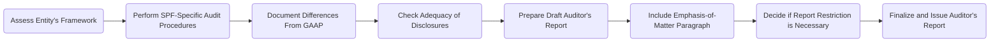

## 15.1 Special-Purpose Frameworks (Cash, Tax, Regulatory Basis)

Special-purpose frameworks (SPFs) refer to accounting bases other than Generally Accepted Accounting Principles (GAAP) or International Financial Reporting Standards (IFRS). These frameworks serve specific objectives, providing tailored financial reporting to meet the needs of particular users, such as regulators or tax authorities. While special-purpose frameworks can simplify accounting for some entities, auditors must carefully assess and document the appropriateness of any framework used.

This section focuses on:
• Definitions and types of special-purpose frameworks (cash basis, tax basis, regulatory basis, and others).  
• Best practices and considerations for performing an audit under special-purpose frameworks.  
• Unique reporting requirements and how to clearly communicate the nature of the framework to users of the financial statements.

---

### 1. Definition and Types of Special-Purpose Frameworks

A special-purpose framework is an organized system of accounting distinct from GAAP or IFRS. Special-purpose frameworks are designed to address specific needs or requirements. Three common SPFs include:

1. **Cash Basis**  
   - Revenues are recorded when cash is received.  
   - Expenses are recorded when cash is disbursed.  
   - Often used by small, closely held entities due to its simplicity and alignment with cash flow management.

2. **Tax Basis**  
   - Accounting principles mirror those used when preparing a tax return.  
   - Differences from GAAP can be significant (e.g., depreciation methods, recognition of certain expenses).  
   - Primarily intended for entities focused on tax compliance and reporting to tax authorities.

3. **Regulatory Basis**  
   - Required by specific regulatory bodies, such as state insurance commissions, banking regulators, or public utility commissions.  
   - Mandates certain unique disclosures or measurement criteria, potentially conflicting with GAAP.  
   - Often referred to as statutory accounting for insurance entities or regulatory accounting for public utilities.

Other SPFs may include contractual bases specified by an agreement or contract that dictates how certain transactions should be recorded.

---

### 2. Audit Considerations under Special-Purpose Frameworks

When auditing financial statements prepared under a special-purpose framework, auditors face unique considerations. These include:

1. **Framework Appropriateness**  
   - The auditor evaluates whether the chosen framework is suitable for the intended users.  
   - If the client’s objective is compliance with a regulator’s requirements, the regulatory basis must clearly reflect that.  
   - In some cases, the auditor may need to confirm that no statutory or contractual requirements conflict with professional standards.

2. **Clear Disclosure of Basis**  
   - Auditors ensure that the financial statements contain a clear description of the framework.  
   - Significant accounting policies must be disclosed, highlighting how and why they differ from GAAP.  
   - Any potential confusing or misleading items (e.g., accrual vs. non-accrual treatment of expenses) must be addressed and communicated transparently.

3. **Assessing Material Misstatements**  
   - Differences from GAAP can lead to unusual measurement and recognition methods.  
   - The auditor must ensure that each financial statement element is free from material misstatement according to the chosen basis of accounting.  
   - Knowledge of key differences (e.g., in depreciation, revenue recognition, or expense allocation) is critical to identifying risks of material misstatement.

4. **Documentation Requirements**  
   - The auditor must thoroughly document how the special-purpose framework’s principles are being applied.  
   - Audit steps should reference relevant authoritative guidance, such as AICPA’s “AU-C Section 800: Special Considerations—Audits of Financial Statements Prepared in Accordance with Special Purpose Frameworks.”

5. **Internal Control Considerations**  
   - Special-purpose frameworks can influence an entity’s internal control structure (for instance, fewer accruals may mean fewer complex consolidation controls).  
   - Auditors assess controls relevant to preventing and detecting material misstatements specific to SPF transactions.

---

### 3. Reporting on Special-Purpose Frameworks

#### 3.1 Auditor’s Report Modifications

For financial statements prepared under a special-purpose framework, the auditor’s report:

• **Names the Framework**  
  - Clearly indicates that the financial statements have been prepared in accordance with the cash, tax, or regulatory basis.  
  - States that the basis of accounting differs from GAAP (if GAAP-based users might be misled).

• **Adds an Emphasis-of-Matter Paragraph**  
  - Highlights that the statements are prepared under a special-purpose framework.  
  - Alerts readers that they are not intended for use by those requiring GAAP or IFRS-compliant financial statements (if applicable).

• **Restricts Use, When Necessary**  
  - Sometimes, under a contract basis or specific regulatory basis, statements may be restricted to the parties involved in the contract or regulation.  
  - The auditor’s report should include a statement restricting the report’s use to those specified parties.

#### 3.2 Example Auditor’s Report Structure

Below is a simplified flow diagram illustrating the path to creating an auditor’s report for an entity using a special-purpose framework:

**Figure 15.1:** Flow of an Audit Engagement Under a Special-Purpose Framework

---

### 4. Best Practices and Practical Examples

1. **Clear Contractual Understanding**  
   - Especially important under contractual or regulatory bases. If certain recognition or measurement standards differ from GAAP, the client and auditor should thoroughly document these differences and justifications.

2. **Tailored Disclosures**  
   - Provide comprehensive footnotes clarifying accounting treatments. For instance, under the cash basis, a note on the non-recognition of receivables is beneficial for users accustomed to GAAP statements.

3. **Case Study Example: Cash-Basis Farmer**  
   - Imagine a small family-owned farm operating on a cash basis to simplify its bookkeeping.  
   - Revenues are recognized when cash is received from produce sales; expenditures are recognized when checks are written for seeds, fertilizers, and equipment repairs.  
   - The auditor confirms that no misleading items appear when applying the cash basis (e.g., no large unpaid liabilities excluded that would distort the true picture for end users).  
   - An emphasis-of-matter paragraph in the auditor’s report clarifies that these statements do not follow GAAP, informing any potential lenders or external investors.

4. **Case Study Example: Tax-Basis Auto Repair Shop**  
   - A mid-sized auto repair shop aligns its accounting with IRS tax requirements for easier tax preparation.  
   - The auditor specifically focuses on vehicle parts inventory and potential differences in depreciation methods not aligned with GAAP.  
   - Additional disclosures are added to ensure clarity on the shop’s chosen methods and compliance with relevant tax regulations.

---

### 5. Common Pitfalls and Solutions

• **Insufficient Disclosure**: Failing to highlight key departures from GAAP can mislead readers.  
  - **Solution**: Provide an emphasis-of-matter paragraph and thorough disclosures detailing all significant accounting policies and how they differ from standard GAAP practice.

• **Inconsistency in Application**: Inadvertently applying GAAP principles in some instances and SPF rules in others.  
  - **Solution**: Maintain a consistent approach throughout all accounts and disclosures, clearly documenting any differences.

• **Regulatory Noncompliance**: Overlooking certain regulatory requirements for statutory or public-utility statements.  
  - **Solution**: Cross-check with the applicable regulator’s guidance and incorporate all mandated disclosures.

• **Unclear Intended Use**: Neglecting to specify that the statements are for certain users only.  
  - **Solution**: Include restrictive language in the report if necessary, and emphasize the framework’s limited purpose.

---

### 6. References and Resources

• **Official References**  
  - AU-C Section 800: “Special Considerations—Audits of Financial Statements Prepared in Accordance with Special Purpose Frameworks.”  
  - AICPA Practice Aid on “Cash- and Tax-Basis Financial Statements.”

• **Additional Resources**  
  - AR-C Section 70 from SSARS (Statements on Standards for Accounting and Review Services) for compilations and reviews of statements prepared under SPFs.  
  - Examples of regulatory-basis reporting for insurance and public utilities, often referred to as “statutory basis” or “regulatory basis.”

---

## Test Your Knowledge: Special-Purpose Frameworks Audit Quiz



### Which statement best describes a special-purpose framework in accounting?

- [ ] It is only used by public companies listed on U.S. stock exchanges.
- [x] It is a basis of accounting used other than GAAP or IFRS, such as a cash or tax basis.
- [ ] It always requires full accrual accounting aligned with international standards.
- [ ] It is prohibited for entities larger than $10 million in annual revenues.

> **Explanation:** Special-purpose frameworks apply accounting rules other than GAAP or IFRS. Common examples include cash basis, tax basis, or regulatory basis accounting.

### Under a cash-basis framework, when should revenue be recorded?

- [ ] When earned, regardless of cash collection.
- [x] When payment is received.
- [ ] When the invoice is issued.
- [ ] When a contract is signed.

> **Explanation:** Under a cash basis of accounting, revenue is recognized only when cash is actually received.

### An auditor’s report on financial statements using a special-purpose framework should:

- [x] Include an emphasis-of-matter paragraph highlighting the unique basis of accounting.
- [ ] Present the statements as if they conformed to GAAP.
- [ ] Avoid restricting use in any circumstances.
- [ ] Omit disclosures about the framework used.

> **Explanation:** The auditor must alert readers that the financial statements have been prepared using a special-purpose framework that differs from GAAP, typically in an emphasis-of-matter paragraph.

### Which of the following is most likely to be restricted-use?

- [ ] Cash-basis financial statements for the general public.
- [x] Financial statements prepared under a contractual basis for a specific lender.
- [ ] Tax-basis financial statements reported to shareholders in a public company.
- [ ] GAAP statements for a large corporation with international operations.

> **Explanation:** Contractual-basis statements are frequently restricted to parties detailed in the governing contract, as they are not intended for widespread public use.

### Why might an entity choose a tax basis for its financial statements?

- [x] To align accounting with the IRS tax return, reducing complexity.
- [ ] To fully conform to IFRS for cross-border operations.
- [x] Because it can simplify year-end adjustments related to the tax return.
- [ ] To comply with state insurance regulatory requirements.

> **Explanation:** An entity may pick a tax basis to streamline its processes by matching financial statements to tax requirements. This choice can minimize reconciliation differences and ease annual tax-filing tasks.

### What is one of the main risks when auditing tax-basis statements?

- [x] Failing to identify areas where tax-basis principles significantly diverge from GAAP.
- [ ] Overreliance on the entity’s historical cost approach.
- [ ] The unavailability of tax returns for review.
- [ ] Using confirmations with banks.

> **Explanation:** Tax-basis accounting often differs from GAAP in regards to items like depreciation, prepaid assets, and timing of revenue and expense recognition. Auditors must be alert to these divergences.

### An emphasis-of-matter paragraph regarding special-purpose frameworks typically:

- [x] Draws attention to the framework and its differences from GAAP.
- [ ] Is not required if the auditor issues an unmodified opinion.
- [x] Cautions that the statements might be inappropriate for users who need GAAP-basis results.
- [ ] Reviews the client’s internal control weaknesses in detail.

> **Explanation:** Emphasis-of-matter paragraphs ensure that financial statement users are aware of the unique basis of accounting and understand any limitations in comparability to GAAP or IFRS statements.

### In a cash-basis financial statement, which of the following would be excluded from the balance sheet?

- [x] Accounts receivable.
- [ ] Cash in the bank.
- [ ] Loans payable.
- [ ] Property and equipment.

> **Explanation:** Under cash-basis accounting, transactions are recorded only when cash changes hands. Accounts receivable are generally excluded because the related revenue has not yet been collected in cash.

### Which regulatory body’s requirements must be followed if an entity is required to prepare statutory-basis financial statements?

- [x] The specific regulatory agency overseeing the entity (e.g., state insurance commission).
- [ ] An international accounting federation.
- [ ] The Securities and Exchange Commission exclusively.
- [ ] The IRS only.

> **Explanation:** Entities that prepare statutory-basis statements must comply with the rules and guidelines set by their specific regulator, such as an insurance commission or banking regulator.

### Auditors performing integrated audits (financial statements and internal controls) on a public company:

- [x] Typically do not issue integrated opinions for special-purpose frameworks without specific regulatory requirements.
- [ ] Must always issue a qualified opinion for special-purpose frameworks.
- [ ] Are prohibited from auditing special-purpose frameworks.
- [ ] Must use IFRS as the base.

> **Explanation:** Special-purpose frameworks are usually not subject to integrated audits unless existing regulations specifically require them. Public companies generally use GAAP for financial reporting, but in the rare event they use a special-purpose framework for a specific requirement, the integrated audit scope may vary based on those regulatory mandates.



---

## For Additional Practice and Deeper Preparation

**[Auditing & Attestation CPA Mock Exams (AUD): Comprehensive Prep](https://www.udemy.com/course/aud-cpa-mock-exams/?referralCode=D064EF7BD4A84FC6403D)**  
• Tackle full-length mock exams designed to mirror real AUD questions—from risk assessment and ethics to internal control and substantive procedures.  
• Refine your exam-day strategies with detailed, step-by-step solutions for every scenario.  
• Explore in-depth rationales that reinforce understanding of higher-level concepts, giving you a decisive edge on test day.  
• Boost confidence and reduce exam anxiety by building mastery of the wide-ranging AUD blueprint.

_Disclaimer: This course is not endorsed by or affiliated with the AICPA, NASBA, or any official CPA Examination authority. All content is created solely for educational and preparatory purposes._
