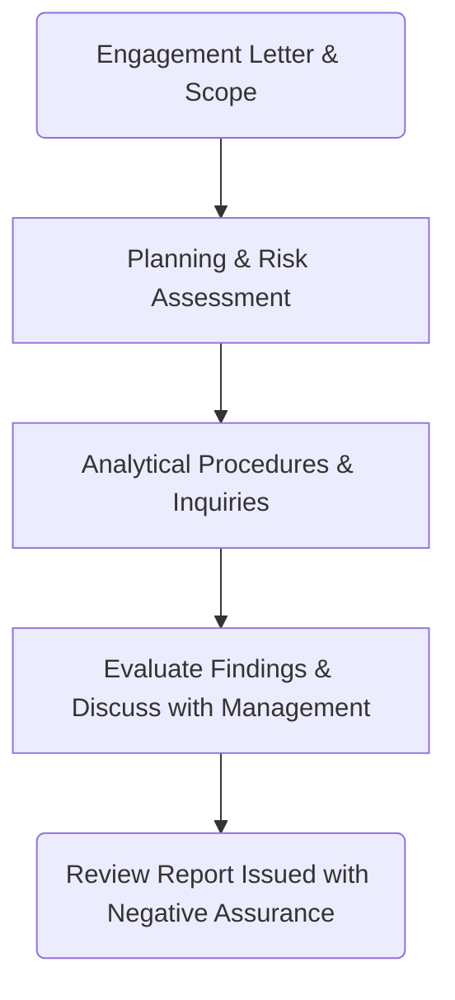

## 15.2 Interim Reviews of Public Companies (SAS vs. PCAOB Standards)

Interim reviews of public companies represent a crucial component of the financial reporting cycle, providing stakeholders with timely insights into a company’s performance in-between annual audits. Publicly traded companies are typically required to file quarterly reports (Form 10-Q) under the Securities Exchange Act of 1934, which must be accompanied by a review report from their external auditor. Unlike a full audit, an interim review provides limited (or negative) assurance rather than a positive opinion on the financial statements. This section explores the practical and theoretical considerations underpinning interim reviews of public companies, focusing on the similarities and differences between Standards of the American Institute of Certified Public Accountants (AICPA, or SAS) and the Public Company Accounting Oversight Board (PCAOB).

---

### 1. Purpose and Scope of Interim Reviews for Public Companies

Public companies generally issue interim financial statements every quarter, culminating in three quarterly filings (Q1, Q2, Q3) and the annual report (Q4) that typically undergoes a full audit. These interim reviews serve several purposes:

• Provide timely updates to investors, creditors, and regulators.  
• Allow management to identify and address financial reporting issues before year-end.  
• Offer negative assurance rather than an affirmative opinion, alerting users to any significant departures from U.S. Generally Accepted Accounting Principles (GAAP).

In an interim review engagement, auditors focus on analytical procedures, inquiries, and limited testing. This approach differs from the extensive corroborative testing and substantive procedures performed in a full audit.

---

### 2. The Limited Assurance (Negative Assurance) Concept

An interim review provides what is termed “negative assurance.” Rather than asserting that the financial statements are free of all material misstatements, the auditor states that nothing has come to their attention indicating that material modifications are necessary for the financial statements to be in conformity with GAAP. This contrasts with a typical audit opinion, which offers positive assurance that the financial statements present fairly, in all material respects, in conformity with GAAP.

• Negative assurance is a lower level of assurance compared to a full audit.  
• The auditor’s report clearly communicates the scope limitation inherent in an interim review.

---

### 3. SAS vs. PCAOB: Comparing the Standards

Interim reviews fall under separate sets of professional standards depending on whether the entity is a public company (issuer) or a nonpublic entity (nonissuer).

1. PCAOB Standards  
   The PCAOB sets the standards that auditors must follow for public company (issuer) engagements.  
   • Auditing Standard (AS) 4105 (Reviews of Interim Financial Information) provides principles and procedures specific to interim reviews.  
   • The PCAOB’s focus is on issuer engagements, meaning the reviews are tailored to the regulatory environment of public companies under SEC oversight.  
   • Greater emphasis is placed upon timely and transparent disclosures, as well as considerations of materiality that align with the needs of broader capital markets.  

2. SAS (AICPA) Standards  
   • For nonpublic engagements, guidance resides primarily in AR-C Section 90 of the AICPA’s Statement on Standards for Accounting and Review Services (SSARS), although SAS reviews also consider relevant guidance for certain interim engagements in specialized circumstances.  
   • The approach to performing interim reviews under SAS is conceptually similar—heavily reliant on inquiries, analytical procedures, and the assessment of any red flags regarding material misstatements.  
   • However, because nonpublic entities are not subject to the same SEC filing requirements, the frequency and scope of interim reviews (and independence expectations) can differ.

Despite certain procedural distinctions, both PCAOB standards (for issuers) and SAS/SSARS (for nonissuers) maintain similar core objectives—analyzing significant fluctuations, inquiring about unusual transactions, and ensuring that the interim financial statements are not materially misstated.

---

### 4. Required Procedures: Analytical Procedures and Inquiries

In an interim review, the auditor primarily performs analytical procedures and inquiries. Although less in-depth than those in a full audit, these steps aim to uncover unusual relationships or significant variances:

• Analytical Procedures:  
  - Ratio analysis (e.g., gross margin analysis, current ratio changes).  
  - Comparative period analysis (e.g., comparing current-quarter revenue with the same quarter of the prior year).  
  - Trend analysis to identify shifts in expenses, capital expenditures, or other key items.

• Inquiries of Management:  
  - Discuss the nature of any significant accounting policy changes since the last annual audit.  
  - Ask about large or unusual transactions that occurred during the interim period.  
  - Assess reasons behind material fluctuations in account balances and evaluate management’s explanations for plausibility.  

• Limited Test of Records:  
  - While typically less extensive than in a full audit, some corroborative testing may be performed if an issue warrants further investigation (e.g., a significant spike in revenue).

Below is a simplified visual overview of the typical interim review process:

In this flowchart, the auditor accepts the engagement, plans the review by understanding the company’s environment, conducts analytical procedures and inquiries, evaluates any findings with management, and finally issues a negative assurance report.

---

### 5. Reporting the Results of an Interim Review

Once an interim review is complete, the auditor issues a review report that typically includes:

• The scope of the engagement (a review rather than an audit).  
• The auditor’s responsibilities and a summary of the procedures performed.  
• A statement of negative assurance, noting that no material modifications are needed for conformity with GAAP, based on the limited review scope.  
• Any emphasis-of-matter or other-matter paragraphs as required (if there are notable concerns, uncertainties, or other issues that warrant disclosure).

If the auditor becomes aware of potential material misstatements or departures from GAAP, they may expand their procedures or, in rare circumstances, withdraw from the engagement if they cannot reasonably resolve the issues identified.

---

### 6. Best Practices, Common Pitfalls, and Strategies

• Best Practices:  
  1. Maintain open communication with management throughout the quarter; periodic check-ins reduce the risk of last-minute surprises.  
  2. Leverage data analytics tools to efficiently compare current-quarter metrics with historical norms, quickly identifying unusual patterns or trends that warrant further inquiry.  
  3. Document all inquiries thoroughly, including management’s responses and the basis for concluding whether further procedures are necessary.

• Common Pitfalls:  
  1. Overreliance on management representations without performing basic analytical procedures or corroboration of unusual items.  
  2. Failing to update the understanding of internal control changes that may have occurred since the last annual audit.  
  3. Inappropriately extending interim review conclusions to areas outside the established scope, potentially leading to misunderstandings among stakeholders.

• Strategies to Overcome Challenges:  
  1. Use targeted analytics that are specifically relevant to the company’s industry and known risk areas (e.g., analyzing inventory turnover in a retail company).  
  2. When significant estimates or accounting judgments arise in the quarter, coordinate closely with the annual audit team to ensure consistency.  
  3. Communicate with audit committees (or those charged with governance) proactively to keep them informed of interim findings.

---

### 7. Real-World Scenarios and Examples

• Example 1: Identifying Revenue Anomalies  
  An electronics manufacturer experiences a 30% increase in revenue in the second quarter compared to the first quarter. Through inquiries, the auditor learns of a one-time contract with a large hospital chain. Analytical procedures confirm the spike aligns with new product shipments. The auditor’s negative assurance report includes a highlight to indicate the nonrecurring nature of the revenue surge.

• Example 2: Detecting Unusual Fluctuations in Expenses  
  A technology firm suddenly reports significantly lower research and development (R&D) expenses in Q3. Inquiry reveals that portions of R&D were capitalized due to a new accounting policy. The auditor corroborates this policy’s validity and classification, ultimately concluding that the interim statements require no material modifications, but carefully documents the rationale for the negative assurance.

---

### 8. References, Resources, and Further Exploration

Below are key references and recommended resources to expand your understanding of interim reviews for public companies:

• Official References  
  - PCAOB Auditing Standard AS 4105, “Reviews of Interim Financial Information”  
  - SEC guidance on quarterly reports (Form 10-Q)  
  - AR-C Section 90 (SSARS) for reviews of nonissuers  
  - AICPA’s Statements on Auditing Standards (SAS) relevant to interim reviews for certain engagements

• Additional Resources  
  - SEC: Securities Exchange Act of 1934 for periodic reporting requirements  
  - “Review Engagements: AICPA Guide” for private entity or SSARS-based reviews  
  - AICPA Audit & Attest Standards site: https://www.aicpa.org/research/standards/auditattest

---

## Test Your Knowledge: Interim Review Engagements under SAS vs. PCAOB Standards



### An interim review for a public company typically provides which level of assurance?
- [ ] Full assurance that the financial statements are free from material misstatement
- [x] Negative assurance that nothing has come to the auditor’s attention indicating a need for material modifications
- [ ] Positive assurance on conformity with GAAP
- [ ] Absolute assurance on internal controls

> **Explanation:** Interim reviews issue negative assurance statements, indicating no evidence came to the auditor’s attention suggesting material modifications, rather than the full or positive assurance provided by an audit.

### Which regulatory filing typically includes interim financial statements reviewed by an external auditor for publicly traded companies?
- [ ] Form 8-K
- [ ] Proxy Statement
- [x] Form 10-Q
- [ ] Form 10-K

> **Explanation:** Public companies in the U.S. include quarterly financial statements in Form 10-Q, which must be reviewed by their external auditor.

### The main difference between PCAOB standards and SAS (AICPA) standards for interim reviews is:
- [x] PCAOB standards apply to issuers (public companies), while SAS primarily apply to nonpublic entities
- [ ] SAS permits negative assurance whereas PCAOB does not
- [ ] PCAOB requires a full audit for every quarter, but SAS does not
- [ ] There are no material differences between PCAOB and SAS standards

> **Explanation:** PCAOB standards govern reviews for public entities, while SAS (AICPA) standards guide nonpublic entity engagements. The approaches are similar but tailored to different regulatory environments.

### Negative assurance in an interim review means:
- [x] The auditor states no evidence was found indicating the financial statements require material modifications
- [ ] The auditor examines internal control systems extensively
- [ ] The auditor guarantees the absence of financial misstatements
- [ ] The auditor does not issue a report

> **Explanation:** Negative assurance offers a lower level of assurance, indicating that based on the limited review, no material misstatements came to the auditor’s attention.

### Which of the following is a key difference between an interim review and a full audit of financial statements?
- [x] An interim review focuses on analytical procedures and inquiries, while an audit involves extensive substantive testing
- [ ] An interim review includes testing of internal controls, while an audit does not
- [ ] An interim review requires positive assurance on GAAP compliance
- [ ] An audit is only performed quarterly, and reviews are performed annually

> **Explanation:** Interim reviews primarily rely on analytical procedures and inquiries, unlike a full audit that involves more thorough testing and positive assurance.

### Under which standard would an auditor likely perform a review of interim financial statements for a publicly traded company?
- [ ] AR-C Section 90
- [x] PCAOB AS 4105
- [ ] SSAE 18
- [ ] GAO Yellow Book

> **Explanation:** PCAOB AS 4105 specifically addresses reviews of quarterly financial information for public (issuer) entities.

### Which of the following describes a best practice for conducting an interim review?
- [x] Utilize analytical tools and data comparisons tailored to the industry’s risk areas
- [ ] Skip documentation since it is only a limited review
- [ ] Avoid discussing unusual trends with management
- [ ] Provide full audit-level testing procedures for revenue

> **Explanation:** Even though the review scope is limited, it is crucial to document procedures, perform relevant analytical reviews, and discuss significant findings with management.

### What action might an auditor take if they suspect a major material misstatement during an interim review?
- [x] Expand procedures to investigate the issue further
- [ ] Immediately issue an adverse opinion
- [ ] Discontinue the engagement without explanation
- [ ] Provide a disclaimer on the entire financial statement

> **Explanation:** If the auditor identifies a possible material misstatement, they can extend procedures to gain further evidence. Depending on the outcome, they may modify the report, withdraw, or perform additional procedures.

### Inquiries during an interim review would likely include which topic?
- [x] Significant accounting policy changes since the prior annual audit
- [ ] Detailed testing of transactions exceeding a materiality threshold
- [ ] Physical inventory observations
- [ ] Standard cost allocations review for the prior three years

> **Explanation:** Interim reviews focus on inquiries about significant changes and analytical procedures rather than detailed transactional testing or extended review of cost allocations.

### True or False: A company’s interim financial statements reviewed under PCAOB standards should include the same extensive substantive testing as a year-end audit.
- [ ] True
- [x] False

> **Explanation:** Interim reviews do not require the same level of substantive testing as year-end audits. They rely primarily on analytical procedures and inquiries, resulting in negative assurance rather than a full audit opinion.



---

## For Additional Practice and Deeper Preparation

**[Auditing & Attestation CPA Mock Exams (AUD): Comprehensive Prep](https://www.udemy.com/course/aud-cpa-mock-exams/?referralCode=D064EF7BD4A84FC6403D)**  
• Tackle full-length mock exams designed to mirror real AUD questions—from risk assessment and ethics to internal control and substantive procedures.  
• Refine your exam-day strategies with detailed, step-by-step solutions for every scenario.  
• Explore in-depth rationales that reinforce understanding of higher-level concepts, giving you a decisive edge on test day.  
• Boost confidence and reduce exam anxiety by building mastery of the wide-ranging AUD blueprint.

_Disclaimer: This course is not endorsed by or affiliated with the AICPA, NASBA, or any official CPA Examination authority. All content is created solely for educational and preparatory purposes._
