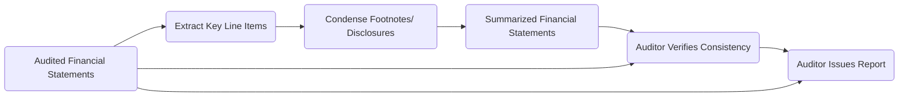

## 15.4 Reporting on Summarized Financial Statements

Summarized (or condensed) financial statements present core financial information in a compact format. They often appear in annual reports or investor materials, providing high-level insight into an entity’s performance without the detail of the full audited financial statements. While this abbreviated format caters to the need for brevity and ease of understanding, it also presents unique audit considerations. In this section, we will explore the concept of summarized financial statements, outline procedures for verifying their integrity, highlight common challenges, and discuss best practices for issuing a report on such financial data.

--------------------------------------------------------------------------------
## Overview of Summarized vs. Full Financial Statements

### 1. Purpose of Summarized Financials
• Summarized financial statements allow stakeholders to quickly review key metrics of an entity’s performance and financial position. These statements typically include major line items (e.g., total assets, revenues, net income) without extensive footnote disclosures.  
• They provide a valuable snapshot for readers with limited time or need for detail. However, they rely on the underlying accuracy of the entity’s full financial statements.

### 2. Relationship to the Full Audited Financial Statements
• Summarized (condensed) statements refer to, and depend on, the audited financial statements.  
• If the summarized statements are derived from audited financials that have been issued, the auditor’s duty is to determine whether the summarized version is consistent with the original, detailed audited reports.  
• An “in relation to” opinion states that in the auditor’s professional judgment, the summarized financials are fairly stated and consistent with the audited financial statements from which they derive.

--------------------------------------------------------------------------------
## Key Audit Procedures

When engaged to report on summarized financial statements, auditors typically perform a series of procedures to ensure that the condensed presentation aligns with the audited financial data. The following steps are integral to providing assurance on summarized financials:

### 1. Confirm Data Consistency
• Obtain or prepare a schedule mapping each summarized financial statement line to its corresponding item in the full audited financial statements.  
• Perform verification to confirm that the summarized figures agree with or reasonably relate to the detailed audited balances.

### 2. Assess Adequacy of Disclosures
• Summarized financial statements typically reflect condensed footnotes or minimal explanatory content.  
• The auditor must see that essential disclosures — areas critical to user understanding — remain accurate and sufficient to prevent misleading interpretations. Some key disclosures might include going concern considerations, major changes in accounting principles, or significant subsequent events.

### 3. Evaluate Omission of Material Items
• If material items essential to understanding the entity’s financial performance are omitted, the summarized statements risk misleading readers.  
• The auditor should assess and discuss with management any potentially significant omissions or omissions that could distort users’ perception based on the summarized data.

### 4. Reflecting Modifications in the Auditor’s Full Report
• If the opinion on the full financial statements was modified (e.g., qualified, adverse, or disclaimer), the summarized version’s report typically references that modification.  
• Ensure this reference and any related explanations are prominently disclosed in the summarized report so users understand the broader context of the full audit opinion.

--------------------------------------------------------------------------------
## Common Pitfalls and Best Practices

Below are potential pitfalls to watch out for when reporting on summarized financial statements and some recommended practices to mitigate issues:

### 1. Omission of Key Disclosures
• Pitfall: Condensing statements can inadvertently exclude vital information, such as intangible asset impairments, related-party transactions, or significant contingencies.  
• Best Practice: Adopt a formal review process that maps each summarized disclosure item to its corresponding entry in the full financial statements. Confirm that critical notes are not overlooked.

### 2. Misalignment with Full Statements
• Pitfall: Summarized figures may not properly reconcile with the detailed underlying statements due to clerical errors or omissions in the condensed format.  
• Best Practice: Perform a thorough cross-check of both sets of statements, verifying alignment of totals and sub-totals. Any adjustments or eliminations should be clearly explained.

### 3. Qualified or Adverse Opinions in Full Statements
• Pitfall: If the full audited financial statements received a qualified or adverse opinion and that fact is not disclosed in the summarized report, the summarized version may mislead users.  
• Best Practice: Always reference the original auditor’s opinion and nature of any qualifications prominently in the auditor’s report on the summarized financials.

### 4. Communication with Management and Those Charged with Governance
• Pitfall: Lack of communication can lead to unintentional misstatements or discrepancies in the summarized version.  
• Best Practice: Involve relevant stakeholders early in the summarization process. Work closely with the audit committee or those charged with governance to confirm that the condensed financial statements remain faithful to the spirit and detail of the full statements.

--------------------------------------------------------------------------------
## Practical Example

Suppose ABC Corporation issues an annual report containing only high-level metrics: total revenue, cost of sales, net income, total assets, total liabilities, and total equity. The audited financial statements for ABC Corporation show that the company’s gross margins were significantly impacted by a recent product recall. Summarizing the data without mentioning the recall or its impact on the margin could mislead readers. 

The auditor’s procedures would include:  
1. Comparing the condensed income statement line items to the final audited financial statements.  
2. Checking that the note regarding the product recall, while condensed, still clearly discloses the key facts and financial impact.  
3. Ensuring that the overall sense of ABC Corporation’s risk posture and performance is consistent between the condensed and full versions.

If the full statements were issued with an emphasis-of-matter paragraph for the recall, the summarized statements should also guide readers to that emphasis for complete information.

--------------------------------------------------------------------------------
## Sample Diagram: Flow of Summarized Financial Statement Assertions

Below is a Mermaid.js diagram illustrating the flow of information from full audited financial statements to summarized financial statements and the concurrent auditor’s review process.

1. Audited Financial Statements: The starting point containing complete figures and disclosures.  
2. Extract Key Line Items: Management decides which balances to include.  
3. Condense Footnotes/Disclosures: Management prepares abbreviated disclosures.  
4. Summarized Financial Statements: The new condensed presentation.  
5. Auditor Verifies Consistency: The auditor ensures figures match the source data.  
6. Auditor Issues Report: The conclusive “in relation to” opinion, referencing any modifications from the full set.

--------------------------------------------------------------------------------
## In Relation To Opinion

One of the significant concepts in reporting on summarized financial statements is the “in relation to” opinion. Unlike a full audit opinion, which addresses the broader presentation of financial statements and disclosures, an “in relation to” opinion specifically states that:

• The summarized statements are consistent with, and materially agree to, the data in the audited financials.  
• It does not re-issue or override the opinion on the full financial statements.  
• It highlights any modifications (qualified, adverse, or disclaimer) present in the full audit opinion so that users can refer to the complete set for further details.

--------------------------------------------------------------------------------
## Handling Qualified, Adverse, or Disclaimer of Opinion

If the auditor’s opinion on the full set of financial statements was less than unqualified (unmodified), it is crucial to incorporate a clear reference within the summarized statements’ auditor’s report. For instance, if the auditor’s report on the full financials was qualified due to a scope limitation, the condensed financial statements alone cannot bypass that limitation. The summarized version should explicitly caution readers that the full financial statements were qualified or otherwise modified, directing them to the complete auditor’s report for a comprehensive explanation.

--------------------------------------------------------------------------------
## References and Standards

• **AU-C Section 810, “Engagements to Report on Summary Financial Statements.”**  
  This authoritative guidance outlines the auditor’s responsibilities when reviewing and reporting on summary or condensed financial statements.  
• **AICPA Practice Aids**  
  Provide practical guidance on deciding which disclosures must remain in summarizing financial statements and how to best reference the underlying full set.  
• **IFRS Guidance on Condensed Interim Financial Statements (IAS 34)**  
  While primarily for interim reporting, IAS 34 offers insights into how condensed statements should retain the essence of full disclosures.

--------------------------------------------------------------------------------
## Glossary

• **Summarized (Condensed) Financial Statements**: A shorter form presentation of financial information that includes only major line items, high-level totals, or limited notes.  
• **In Relation To Opinion**: An opinion stating that the summarized financial information is consistent with and accurately reflects the information contained in the full audited financial statements.

--------------------------------------------------------------------------------
## Conclusion

Reporting on summarized financial statements requires careful scrutiny to ensure the condensed information remains faithful to the underlying full audited financial statements. Auditors must verify that no essential disclosures are omitted, that figures reconcile correctly, and that any nuances of the original opinion (including modifications) are adequately addressed. By adhering to established auditing standards and best practices, auditors provide stakeholders with assurance that the summarized data can be reliably used for high-level analysis and decision-making.

--------------------------------------------------------------------------------

## SEO-Optimized Quiz: Summarized Financial Statements Assurance



### When reporting on summarized financial statements, which aspect is the auditor primarily verifying?

- [x] Consistency with the audited financial statements.
- [ ] The adequacy of internal control over financial reporting.
- [ ] Management’s discussion and analysis accuracy.
- [ ] The completeness of all detailed footnotes.

> **Explanation:** An “in relation to” opinion specifically addresses whether the summarized financial statements match the audited set from which they are derived, not whether internal controls or the full footnote disclosures are sufficient.

### Which of the following best describes “summarized (condensed) financial statements”?

- [x] Shorter-form financial statements presenting only major line items and limited disclosures.
- [ ] Financial statements reporting only quarterly details.
- [ ] Audited financial statements with the same level of detail but fewer footnotes.
- [ ] Supplementary schedules presented solely for convenience.

> **Explanation:** Summarized financials are condensed versions of the full statements, emphasizing key balances and limited disclosures.

### What is a key consideration if an adverse opinion was issued on the full set of financial statements?

- [x] The auditor’s report on the summarized statements must reference the adverse opinion and implications.
- [ ] The adverse opinion has no impact on reporting for summarized financial statements.
- [ ] The client is not permitted to issue summarized financial statements.
- [ ] The auditor must conduct a new audit specifically for the summarized version.

> **Explanation:** If the full report was adverse, the summarized report cannot neutralize or ignore that. The auditor must reference it prominently, so users understand the context.

### Why should the auditor evaluate disclosures in the summarized financial statements?

- [x] To ensure critical information is not omitted or misstated in a way that misleads users.
- [ ] To restate the entire footnote details verbatim.
- [ ] To replace management’s responsibility for financial statements.
- [ ] To predict future economic conditions and risk factors.

> **Explanation:** While summarized statements are by definition abbreviated, certain disclosures are essential for faithful representation. Omitting these could mislead users.

### In verifying the consistency of summarized financial statements, which of the following procedures is most relevant?

- [x] Comparing major line items in the summarized version to the full audited balances.
- [ ] Performing extensive new tests of controls.
- [x] Recomputing derived numbers, such as ratios, ensuring they match figures from the full statements.
- [ ] Relying entirely on the client’s assertion without comparison to the audited data.

> **Explanation:** The auditor’s focus is alignment of the condensed information with audited numbers, often involving direct comparisons and recalculations.

### Which document provides the authoritative guidance for engagements to report on summary financial statements (under U.S. GAAS)?

- [x] AU-C Section 810.
- [ ] PCAOB AS 3105.
- [ ] GAAS Section 420.
- [ ] SSARS No. 9.

> **Explanation:** AU-C Section 810 is the specific U.S. GAAS standard addressing engagements to report on summary (condensed) financial statements.

### If management excludes critical information from the summarized financial statements that distorts users’ interpretation, the auditor should:

- [x] Modify their report to indicate the omission and potential misleading effect.
- [ ] Ignore it if the rest of the data matches the full audited statements.
- [x] Communicate with those charged with governance, requesting addition of the missing information.
- [ ] Issue an unqualified (unmodified) opinion regardless.

> **Explanation:** The auditor must ensure that the omission is appropriately addressed or reported to avoid misinterpretation by users. This may result in a modification or emphasis in the auditor’s report.

### Which of the following steps is vital before issuing a report on summarized financial statements?

- [x] Confirm that the underlying full financial statements are already audited.
- [ ] Complete a separate engagement letter for full audit procedures.
- [ ] Obtain a comfort letter from the entity’s underwriters.
- [ ] Issue a management representation letter specifically for the summarized statements.

> **Explanation:** Because the summarized statements derive from the full financials, the underlying statements must be audited and the opinion on those statements finalized before reporting on the summarized version.

### True or False: An “in relation to” opinion replaces the full audit opinion on the entity’s complete set of financial statements.

- [x] False
- [ ] True

> **Explanation:** The “in relation to” opinion does not replace the original opinion. It simply states that the summarized version is consistent with (or fairly stated in relation to) the full audited financial statements.

### What is one benefit of issuing summarized financial statements?

- [x] They offer a concise snapshot of financial performance and position for quick stakeholder review.
- [ ] They are used to bypass the disclosure of critical accounting policies.
- [ ] They can serve as a substitute for a full audit.
- [ ] They eliminate the need to comply with accounting standards.

> **Explanation:** Summarized statements are designed for quick, high-level insight; they do not replace full audited statements or lessen the need for compliance with relevant standards.



--------------------------------------------------------------------------------

## For Additional Practice and Deeper Preparation

**[Auditing & Attestation CPA Mock Exams (AUD): Comprehensive Prep](https://www.udemy.com/course/aud-cpa-mock-exams/?referralCode=D064EF7BD4A84FC6403D)**  
• Tackle full-length mock exams designed to mirror real AUD questions—from risk assessment and ethics to internal control and substantive procedures.  
• Refine your exam-day strategies with detailed, step-by-step solutions for every scenario.  
• Explore in-depth rationales that reinforce understanding of higher-level concepts, giving you a decisive edge on test day.  
• Boost confidence and reduce exam anxiety by building mastery of the wide-ranging AUD blueprint.

_Disclaimer: This course is not endorsed by or affiliated with the AICPA, NASBA, or any official CPA Examination authority. All content is created solely for educational and preparatory purposes._
