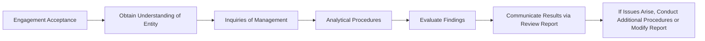

## 16.2 Form, Content, and Limitations of a Review Report

A review engagement plays a critical role in providing decision-makers with limited assurance on financial statements. While less rigorous than an audit, the review process adds credibility to financial information and fosters trust among stakeholders. This section explores the nature of a review engagement, the key procedures accountants typically perform, and the form and content of a standard review report. We also discuss the limitations of a review engagement and how these differences from an audit should be communicated to financial statement users.

---

## 1. Nature of a Review Engagement

A review engagement differs significantly from an audit in both scope and level of assurance. The American Institute of Certified Public Accountants (AICPA) outlines these differences in AR-C Section 90, “Review of Financial Statements.”

1.1 Limited (Negative) Assurance  
In a review engagement, the CPA provides limited assurance, often referred to as negative assurance. The practitioner states that they are “not aware of any material modifications” that should be made to the financial statements in order for them to be presented in accordance with the applicable financial reporting framework (e.g., U.S. GAAP). This stands in contrast to the reasonable (positive) assurance that accompanies an audit report.

1.2 Reliance on Inquiry and Analytical Procedures  
Because of the limited nature of the engagement, reviewers primarily rely on inquiries of management and analytical procedures. By design, the CPA does not perform extensive verification of account balances and transactions, nor do they carry out detailed tests of controls. Consequently, a review provides less assurance and has a lower level of scrutiny compared to an audit.

1.3 Management Responsibilities  
Management is responsible for preparing financial statements in accordance with the applicable framework. They must ensure the completeness and accuracy of the financial information and respond to inquiries honestly. The CPA often obtains a management representation letter to formally document management’s responsibilities and representations made during the review process.

1.4 When Is a Review Appropriate?  
A review engagement can be ideal for entities requiring a moderate level of assurance for lenders, investors, or regulatory bodies, but who do not need the extensive procedures associated with an audit. For instance, smaller companies or organizations with stable financial reporting environments may opt for a review to balance cost-effectiveness with some level of external assurance.

---

## 2. Typical Procedures in a Review Engagement

The procedures performed in a review engagement are substantially less in scope than an audit. Nonetheless, certain key steps ensure the accountant gathers sufficient evidence to support limited assurance.

2.1 Inquiries of Management  
The CPA makes inquiries about:
• Significant accounting policies and any changes in those policies.  
• Unusual or complex transactions that impact the financial statements.  
• Management’s process for preparing estimates and identifying potential errors.  
• Material events or transactions that may have occurred after the reporting period.  
• Related-party transactions, contingencies, or subsequent events that could affect the financial statements.

2.2 Analytical Procedures  
Analytical procedures compare current financial results to prior periods, budgets, or industry benchmarks to identify inconsistencies or unexpected trends. Notable steps include:  
• Comparative Analysis: Examining financial statement line items against historical data.  
• Ratio Analysis: Reviewing key ratios (e.g., current ratio, gross margin) for deviations from expectations.  
• Trend Analysis: Identifying significant fluctuations year over year or quarter over quarter.

2.3 Reading the Financial Statements  
Although no detailed tests of details are performed, the CPA carefully reads the financial statements to assess the overall presentation. They look for:  
• Proper classification of accounts in accordance with the relevant reporting framework.  
• Consistency of disclosures across financial statement periods.  
• Any obvious departures from the applicable reporting framework.

2.4 Additional Procedures if Red Flags Arise  
While typical review procedures do not involve the depth of an audit, if significant issues emerge (e.g., potential material misstatement, unusual transactions, or contradictory statements by management), the CPA may decide to perform additional procedures to resolve these concerns. If not resolved satisfactorily, the CPA might revise the report or retreat from the engagement entirely.

---

## 3. Form, Content, and Structure of the Review Report

A properly structured review report communicates the limited assurance provided, the nature of procedures performed, and the key distinctions from an audit.

3.1 Title and Addressee  
The review report begins with a title clearly indicating that it is a “Independent Accountant’s Review Report.” The addressee is typically the governing body (e.g., board of directors) or management of the organization.

3.2 Introduction Paragraph  
This paragraph clarifies the financial statements under review and states that they are the responsibility of management. It also indicates that the accountant’s responsibility is to conduct the review in accordance with Statements on Standards for Accounting and Review Services (SSARS).

3.3 Management’s Responsibility  
Within the review report, the accountant reaffirms that management is responsible for the preparation and fair presentation of the financial statements in accordance with the applicable financial reporting framework.

3.4 Accountant’s Responsibility and Basis for Limited Assurance  
This section explains that the accountant’s responsibility is to conduct the engagement in accordance with SSARS, specifically AR-C Section 90. It points out that a review primarily involves inquiry and analytical procedures, and that it is substantially less in scope than an audit, which provides a basis for only limited assurance.

3.5 Conclusion (Limited Assurance Paragraph)  
The standard conclusion states:  
“Based on our review, we are not aware of any material modifications that should be made to the accompanying financial statements in order for them to be in conformity with [applicable financial reporting framework].”  
This phrasing underscores the negative assurance provided in a review.

3.6 Signature, City, and State  
The report concludes with the signature of the accountant or firm and the city and state where they practice. The date of the review report is typically the date on which the accountant has completed the review procedures.

---

## 4. Limitations of a Review Engagement

4.1 Scope Limitations  
Because a review does not include tests of controls or detailed substantive procedures, there is an inherent limitation in the level of assurance provided. Financial statements may contain material misstatements that the limited procedures performed in a review would not detect.

4.2 No Opinion Expressed  
Unlike an audit, the CPA does not express an opinion on whether the financial statements fairly present the entity’s financial position. Instead, the CPA issues a negative assurance report, stating that no material modifications are needed based on information gleaned from a limited scope of procedures.

4.3 Reliance on Management Assertions  
Because the CPA primarily uses management’s responses to inquiries and performs analytical procedures, the review heavily relies on the integrity and completeness of those responses. The risk exists that management may inadvertently or deliberately conceal information.

4.4 Potential for Additional Procedures or Withdrawal  
If evidence arises during the review that suggests the financial statements may be materially misstated, the CPA may need to carry out additional procedures to address the concern. If the issue remains unresolved or indicates significant risk, the CPA can modify the review report or withdraw from the engagement.

---

## 5. Illustrative Diagram of a Typical Review Engagement Process

Below is a simple schematic (Mermaid diagram) illustrating the flow of typical review engagement procedures:

1. Engagement Acceptance: The CPA determines whether to accept the review engagement, considering independence and ethical requirements.  
2. Understand the Entity: The CPA gains knowledge of the business, its environment, and relevant accounting policies.  
3. Inquiries of Management: The CPA asks management about significant policies, procedures, and events.  
4. Analytical Procedures: The CPA reviews financial data for consistency, trends, and ratios.  
5. Evaluate Findings: The CPA analyzes results, identifies any potential issues, and determines completeness.  
6. Communicate Results: The accountant issues a review report.  
7. Additional Actions: If unresolved issues persist, additional procedures or report modifications may be needed.

---

## 6. Best Practices and Common Pitfalls

6.1 Best Practices  
• Obtain a Clear Engagement Letter: Before starting a review, the CPA should outline the scope, objectives, and limitations in writing to manage expectations.  
• Maintain Open Dialogue with Management: Frequent communication minimizes the risk of misunderstandings and clarifies issues promptly.  
• Document Thoroughly: Detailed working papers capturing inquiries, analytical procedures, and conclusions support the final report.  
• Address Inconsistencies Early: Promptly resolve discrepancies discovered during inquiry or analytical review to avoid last-minute complications.

6.2 Common Pitfalls  
• Insufficient Evidence: Failing to perform enough procedures (or thorough documentation) can undermine the credibility of the review.  
• Over-Reliance on Management: While the review depends on management’s information, the CPA must remain professionally skeptical.  
• Confusion with Audit Requirements: Sometimes a reviewer incorrectly applies audit-level procedures or inadvertently suggests an opinion-level assurance.  
• Inadequate Scope Clarification: Not communicating the limitations of a review to report users can lead to misunderstandings about the level of assurance provided.

---

## 7. References and Resources

• AR-C Section 90, “Review of Financial Statements.”  
• AICPA’s Official Guidance on SSARS for Reviews, Compilations, and Preparation Engagements.  
• AICPA Sample Review Reports, including modifications for known departures from GAAP.  
• Practice aids that help distinguish a review from a compilation or full-scope audit engagement.

---

## 8. Conclusion

A review engagement strikes a balance between the minimal involvement of compilations and the rigorous scrutiny of audits. Through inquiries and analytical procedures, the CPA gathers sufficient evidence to provide limited (negative) assurance on the financial statements. Understanding the form, content, and limitations of a review report is crucial for CPAs and users of financial information alike. By recognizing the inherent boundaries of a review and effectively communicating them, accountants can offer meaningful assurance in a cost-effective manner while upholding professional standards and public trust.

---

## Mastering Review Engagements: Key Concepts Quiz



### In a standard review engagement, what level of assurance does the CPA provide?

- [ ] Absolute assurance that the statements are free of material misstatements.
- [ ] Positive assurance that the statements are presented fairly in all material respects.
- [x] Limited (negative) assurance based on inquiry and analytical procedures.
- [ ] No assurance is provided at all.

> **Explanation:** A standard review engagement offers limited assurance, stating that the CPA is not aware of any material modifications needed. This is often phrased as negative assurance.

### Which of the following procedures forms the primary basis of a review engagement?

- [x] Inquiries and analytical procedures.
- [ ] Tests of controls and detailed substantive testing.
- [ ] External confirmations and inventory observations.
- [ ] Fraud examination and forensic analysis.

> **Explanation:** A review focuses on inquiries with management and analytical procedures. Detailed testing or confirmations are typically part of an audit, not a review.

### Which statement best describes the conclusion paragraph in a standard review report?

- [ ] It provides an opinion on the fairness of the financial statements.
- [x] It states that the accountant is not aware of any material modifications needed.
- [ ] It certifies that the financial statements are free from error.
- [ ] It expresses limited and positive assurance regarding the entity’s financials.

> **Explanation:** A review report concludes by saying, “We are not aware of any material modifications…,” which characterizes the limited assurance of a review.

### If, in the course of a review, the accountant suspects a material misstatement in the financial statements, what is the CPA’s next step?

- [x] Perform additional procedures to investigate the issue further.
- [ ] Issue a disclaimer of opinion immediately.
- [ ] Withdraw from the engagement without further investigation.
- [ ] Ignore the suspicion if management does not confirm.

> **Explanation:** In a review engagement, the CPA would conduct additional procedures as necessary to resolve doubts. If these are not resolved, the CPA may modify the report or withdraw.

### What happens if the accountant cannot complete the required review procedures due to management-imposed limitations?

- [x] The accountant may be required to withdraw from the engagement.
- [ ] The accountant issues an unmodified opinion.
- [ ] The accountant immediately upgrades procedures to an audit.
- [ ] The accountant finalizes the report as is.

> **Explanation:** If management’s restrictions prevent sufficient inquiry and analytical procedures, it undermines the reliability of the review. The accountant may need to withdraw or modify the report.

### Which of the following is typically included in a management representation letter for a review engagement?

- [x] A statement that management is responsible for the financial statements.
- [ ] A disclaimer that the financial statements are unaudited and may contain material errors.
- [ ] A guarantee that all records were checked by the CPA.
- [ ] The CPA’s findings on the fairness of the financial statements.

> **Explanation:** Management representation letters generally confirm management’s responsibilities, including the fair presentation of data, completeness of information, and acknowledgment of policies.

### Which section of the AICPA standards provides guidance on reviews of financial statements?

- [ ] SAS No. 99, “Consideration of Fraud in a Financial Statement Audit.”
- [ ] PCAOB AS 2201, “An Audit of Internal Control Over Financial Reporting.”
- [ ] SSAE No. 18, “Attestation Standards.”
- [x] AR-C Section 90, “Review of Financial Statements.”

> **Explanation:** AR-C Section 90 outlines the standards for performing and reporting on review engagements in accordance with SSARS.

### Regarding the scope of a review engagement, which statement is accurate?

- [ ] It is identical to an audit scope but excludes sampling.
- [x] It is substantially narrower than an audit due to limited procedures.
- [ ] It focuses primarily on external confirmations and recalculation of balances.
- [ ] It includes testing of internal controls similar to an audit.

> **Explanation:** Review engagements are narrower in scope and primarily include inquiries and analytics, not the extensive audit procedures or controls testing.

### How is "negative assurance" most accurately described in the context of a review engagement?

- [ ] Guaranteeing that the statements do not contain material misstatements.
- [x] Stating that the accountant is not aware of any material modifications needed.
- [ ] Reporting that the data is verified correct in all respects.
- [ ] Providing the same level of assurance as a full-scope audit.

> **Explanation:** Negative assurance means the accountant does not have knowledge of any material issues. It does not guarantee their absence, only that none were found based on the review.

### A review report typically includes:

- [x] A statement that it is substantially less in scope than an audit.
- [ ] A formal opinion on the fairness of the statements.
- [ ] Testing of internal controls and substantive procedures.
- [ ] A reasonable assurance conclusion.

> **Explanation:** The review report clarifies that it provides only limited assurance and that the scope is much narrower than an audit, which provides a reasonable assurance.



---

## For Additional Practice and Deeper Preparation

**[Auditing & Attestation CPA Mock Exams (AUD): Comprehensive Prep](https://www.udemy.com/course/aud-cpa-mock-exams/?referralCode=D064EF7BD4A84FC6403D)**  
• Tackle full-length mock exams designed to mirror real AUD questions—from risk assessment and ethics to internal control and substantive procedures.  
• Refine your exam-day strategies with detailed, step-by-step solutions for every scenario.  
• Explore in-depth rationales that reinforce understanding of higher-level concepts, giving you a decisive edge on test day.  
• Boost confidence and reduce exam anxiety by building mastery of the wide-ranging AUD blueprint.

_Disclaimer: This course is not endorsed by or affiliated with the AICPA, NASBA, or any official CPA Examination authority. All content is created solely for educational and preparatory purposes._
