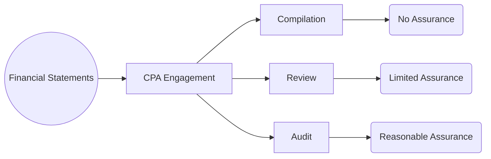

## 16.3 Compilation Reports and Disclaimers of Assurance

Compilation engagements occupy a unique position in the spectrum of financial statement services provided by Certified Public Accountants (CPAs). Unlike audit or review engagements, which offer varying levels of assurance, a compilation engagement provides no assurance on the financial statements’ compliance with any financial reporting framework. Instead, the CPA’s primary goal in a compilation engagement is to assist management in presenting financial information in the form of financial statements, without undertaking procedures that would verify the accuracy or completeness of underlying data.

This section explores the essential characteristics of compilation engagements, the disclaimers that must accompany any compiled financial statements, the requirements of the compilation report, and the provisions surrounding the omission of essential disclosures. We also discuss scenarios where the CPA may modify the compilation report if material misstatements or omissions are identified and left uncorrected.

-------------------------------------------------------------------------------
### 16.3.1 Understanding the Purpose of a Compilation Engagement

A **compilation engagement** is governed primarily by the Statements on Standards for Accounting and Review Services (SSARS), namely AR-C Section 80, “Compilation Engagements.” Under these guidelines:

1. The CPA assists management in **assembling the financial information** into financial statements based on the records, documents, or other representations provided by management.  
2. The CPA **does not perform** any procedures to obtain assurance dedicated to verifying or reviewing the accuracy or completeness of the information.  
3. The CPA’s essential responsibility is to **read the compiled financial statements** to identify any obvious misstatements or any form of nonconformance that stands out clearly.

In other words, a compilation is primarily about taking the client’s raw financial data and shaping it into formal financial statements without providing any level of assurance regarding their reliability, completeness, or conformity with Generally Accepted Accounting Principles (GAAP) or any other selected reporting framework.

-------------------------------------------------------------------------------
### 16.3.2 Key Elements of No Assurance

Because the CPA **does not audit or review** the financial statements in a compilation engagement, the resulting financial statements are accompanied by a clear disclaimer of assurance. This means:

- **No verification**: The CPA does not test internal controls or verify the completeness or accuracy of the underlying records.  
- **No opinion**: The CPA does not express an opinion about whether the statements are presented fairly, in conformity with GAAP, or any other framework.  
- **No conclusion**: Unlike a review report, which may provide limited assurance through procedures such as inquiries and analytical review, a compilation engagement provides **no assurance** whatsoever.  

In practice, the CPA disclaims any form of assurance to avoid misinterpretation by users of the financial statements. The standard language found in a compilation report clearly states that the engagement was performed in accordance with SSARS and that the CPA expresses no opinion or any other form of assurance.

-------------------------------------------------------------------------------
### 16.3.3 The Compilation Report

A **compilation report** differs significantly from audit and review reports:

1. **Disclaimers**: The primary component of the report is a set of disclaimers:  
   - The CPA did not audit or review the financial statements.  
   - The CPA does not express an opinion, a conclusion, or provide any assurance.  

2. **Statement of SSARS Compliance**: The report explicitly mentions that the engagement was conducted in accordance with SSARS—particularly referencing AR-C Section 80.

3. **Identification of the Financial Statements and Entity**: The report states which financial statements were compiled (e.g., Statement of Financial Position, Statement of Operations, etc.) and identifies management’s responsibility for them.

4. **Limitations**: The CPA acknowledges that no verification or inquiry procedures were performed and that the CPA is relying on management’s representations.

5. **Disclosure of Any Known Departures**: If the CPA becomes aware of material departures from the applicable financial reporting framework, the CPA should prompt management to correct. If management does not correct the issue, the CPA often has the option to **modify the compilation report** to address these known departures or—in extreme cases—to withdraw from the engagement.

#### Instances of Modification
A report modification may be necessary if:  
- The CPA identifies material misstatements that management refuses to correct.  
- The CPA identifies omitted disclosures that are required under the chosen financial reporting framework, and the omission could mislead users.  

When modifications occur, the CPA usually includes an additional paragraph in the compilation report explaining the nature of the departures from the reporting framework.

-------------------------------------------------------------------------------
### 16.3.4 Omission of Disclosures

Management may sometimes omit certain disclosures required by GAAP (or another framework) in their compiled financial statements. Such omissions are permissible if:

1. **The omission is clearly explained in the compilation report**.  
2. **The omission is not intended to mislead** the users of the financial statements.

A typical scenario includes smaller owner-managed businesses that prefer to release statements without certain footnotes to reduce complexity or costs. In such cases, the CPA should include a separate paragraph in the compilation report stating that disclosures were omitted, clarifying that if the disclosures were included, they might influence the users’ conclusions about the financial position or results of operations.

-------------------------------------------------------------------------------
### 16.3.5 Reading the Compiled Statements

Although the CPA does not perform audit or review procedures, the CPA is required to **read the compiled statements** for reasonableness and to detect any obvious material misstatements. This limited step includes:

- Checking consistency in amounts and headings.  
- Ensuring there are no glaring omissions of major financial statements categories (for instance, the complete absence of revenue or a missing balance sheet element when the client obviously has those transactions).  
- Observing that the financial statements are in a recognized form, reflecting a typical layout and structure aligned with the selected reporting framework.

If the CPA spots an apparent issue (e.g., the entity ignoring liquidation classification despite it evidently ceasing operations), the CPA should seek further explanations from management. If there is a clear departure from the financial reporting framework that is not remedied by management, that departure should be disclosed in the final compilation report or lead to the CPA’s withdrawal from the engagement.

-------------------------------------------------------------------------------
### 16.3.6 Practical Examples and Case Illustrations

Below are a few scenarios that showcase common events in compilation engagements:

1. **Case of Missing Disclosures**  
   - A small retail company decides to omit certain footnotes (e.g., related-party transactions, summary of accounting policies) from its financial statements.  
   - The CPA agrees to compile the statements and includes a paragraph explaining that necessary disclosures have been omitted and that their omission may influence users’ understanding.  
   - The CPA’s concluding statement clarifies that if all disclosures were included, they might alter the conclusions of the statement users.

2. **Case of Known Material Misstatement**  
   - A CPA compiles for a service firm that is materially overstating revenue.  
   - The CPA advises management to adjust the financial statements accordingly.  
   - If management refuses, the CPA may describe the misstatement in a separate paragraph in the compilation report or consider withdrawing from the engagement if the misstatement is highly deceptive or fraudulent.

3. **Case of Changing Framework**  
   - A CPA compiles a set of statements under GAAP but notices that the company has started to present some items aligned with an international standard.  
   - The CPA alerts management that they must maintain consistency within their chosen framework. If not corrected, the departure from GAAP is noted in the compilation report.  

-------------------------------------------------------------------------------
### 16.3.7 Diagram: Service Levels Comparison

To illustrate how a compilation stands in contrast to a review and an audit, consider the following diagram:

• In a **compilation**, the CPA compiles financial information and provides **no assurance**.  
• In a **review**, the CPA performs analytical procedures and inquiries, providing **limited (negative) assurance**.  
• In an **audit**, the CPA performs a wide array of substantive and control-based procedures, providing **reasonable (positive) assurance**.

-------------------------------------------------------------------------------
### 16.3.8 Best Practices and Common Pitfalls

1. **Engagement Letter**: Always use a thorough engagement letter clarifying the scope (i.e., no assurance) and the client’s responsibilities for the financial data’s accuracy.  
2. **Documentation**: Even though procedures are minimal, maintain proper records of communications, the final version of financial statements, and the compilation report.  
3. **Misinterpretation by Users**: Users (e.g., lenders, investors) may incorrectly assume some level of assurance. Combat this by emphasizing disclaimers repeatedly and clearly in the final report.  
4. **Known Departures**: If the CPA identifies any glaring misstatements or departures from the chosen framework, it is critical to communicate promptly with management, document the issue, and decide on the best course of action (disclosure in the report or withdrawal).  
5. **Consistency with AR-C Section 80**: Always cross-reference the current SSARS, verifying that standard wording and disclaimers are up to date.

-------------------------------------------------------------------------------
### 16.3.9 Glossary

• **Compilation**: An engagement where the CPA arranges a client’s financial data into statements without offering any assurance.  
• **No Assurance**: The absence of verification, testing, or procedures for validating financial statement integrity.  
• **Engagement Letter**: A written agreement outlining the scope, limitations, and responsibilities of each party in a professional engagement.  
• **Material Misstatement**: An error or omission that could influence the users’ decisions based on the financial statements.  

-------------------------------------------------------------------------------
### 16.3.10 References and Additional Resources

**Official References**  
- **AR-C Section 80, “Compilation Engagements.”**  
  Accessible via the AICPA’s Professional Standards, this section outlines the objectives and requirements of compilation engagements.  

**Additional Resources**  
- **AICPA Sample Compilation Reports**: These annotated examples cover reports for when disclosures are omitted, when there are known departures from GAAP, or other unique circumstances.  
- **AR-C Section 70**: Helpful for distinguishing key differences between “Preparation” and “Compilation” engagements.

-------------------------------------------------------------------------------

## Quiz: Mastering Compilation Engagements and Disclaimers



### Which of the following statements correctly describes a compilation engagement?

- [ ] The CPA offers full assurance on the financial statements.
- [x] The CPA assists in presenting financial information but does not verify underlying records.
- [ ] The CPA evaluates internal controls to ensure compliance with applicable frameworks.
- [ ] The CPA must always modify the report if management omits any disclosures.

> **Explanation:** In a compilation engagement, the CPA only compiles financial data into statement form and does not perform verification or controls testing, therefore provides no assurance.

### What is the primary purpose of the disclaimer in a compilation report?

- [ ] To indicate that the CPA has discovered material fraud.
- [ ] To certify that the financial statements are free from material misstatements.
- [x] To clarify that no opinion or assurance is provided.
- [ ] To reference the internal control opinion provided by the CPA.

> **Explanation:** A compilation report includes a disclaimer stating that the CPA does not provide an opinion or any form of assurance on the compiled financial statements.

### Under AR-C Section 80, the CPA must perform which of the following procedures during a compilation engagement?

- [x] Read the compiled financial statements to identify obvious material misstatements.
- [ ] Obtain an attorney’s letter to confirm legal contingencies.
- [ ] Evaluate the design effectiveness of internal controls.
- [ ] Perform detailed substantive testing on key accounts.

> **Explanation:** Under AR-C Section 80, the CPA’s main requirement is to read the compiled financial statements for “obvious” errors or misstatements, without extending to substantive testing or control evaluations.

### If a CPA becomes aware of a known departure from the applicable financial reporting framework that management refuses to correct, the CPA typically should:

- [ ] Issue an unqualified opinion.
- [ ] Perform testing of specific accounts.
- [x] Add a separate paragraph describing the departure or withdraw from the engagement.
- [ ] Omit all disclosures.

> **Explanation:** When the CPA detects an unresolved departure, the CPA can modify the compilation report by including a separate explanatory paragraph or consider withdrawing if the departure is significant.

### Which of the following best describes the omission of disclosures in compiled financial statements?

- [x] It is allowed if the omission is not meant to mislead and the CPA discloses the omission in the report.
- [ ] It is never allowed under any circumstances.
- [ ] It is allowed only if the CPA is also performing an audit.
- [x] It is allowed only if the statements still conform to GAAP in full.

> **Explanation:** Omitting disclosures is permissible in a compilation if clearly indicated in the report and if the omission does not mislead users. (Note that GAAP compliance might not hold if material disclosures are omitted, but such omission can still be acceptable if properly disclosed in a compilation engagement.)

### Which term describes the level of assurance provided by a compilation engagement?

- [ ] Reasonable assurance
- [ ] Limited assurance
- [ ] Positive assurance
- [x] No assurance

> **Explanation:** In a compilation engagement, no testing or verification is done, so there is no assurance offered on the financial statements.

### What is the main benefit for management to choose a compilation engagement over a review or audit?

- [ ] CPA provides an unmodified opinion.
- [ ] It ensures compliance with internal controls.
- [ ] The CPA issues a legal guarantee of financial statement accuracy.
- [x] It is generally less costly and requires minimal CPA procedures.

> **Explanation:** Compilation engagements generally require fewer procedures, thus lowering the cost compared to reviews or audits.

### A compilation report in compliance with SSARS should state that the financial statements:

- [ ] Are prepared in conformity with GAAS.
- [ ] Offer a high level of assurance for external users.
- [x] Were compiled by the CPA in accordance with SSARS and no assurance is expressed.
- [ ] Were prepared following Sarbanes-Oxley regulations.

> **Explanation:** SSARS requirements dictate that the compilation report informs users the financial statements were compiled and no assurance is provided.

### If a bank requests a CPA’s assurance on a client’s financial statements but the client opts for only a compilation, which of the following is true?

- [x] The compilation engagement may not satisfy the bank’s need for assurance.
- [ ] The CPA must perform additional procedures to give the bank limited assurance.
- [ ] The CPA should provide a disclaimer of assurance but also express an opinion on internal controls.
- [ ] The client’s financial statements are automatically deemed GAAP-compliant.

> **Explanation:** Because a compilation provides no assurance, it may not satisfy external users who demand a higher level of confidence, such as a review or an audit.

### A compilation report states: “We do not express an opinion, a conclusion, or provide any form of assurance.” This statement implies:

- [x] Users must be aware that no verification of the underlying records was conducted.
- [ ] The CPA performed extensive testing and found no issues.
- [ ] The CPA verified all balances and transactions.
- [ ] The CPA is providing limited assurance through analytical procedures.

> **Explanation:** The CPA’s disclaimer clarifies that the financial statements were compiled from client records but not audited or reviewed, hence no testing or conclusions.



-------------------------------------------------------------------------------
## For Additional Practice and Deeper Preparation

**[Auditing & Attestation CPA Mock Exams (AUD): Comprehensive Prep](https://www.udemy.com/course/aud-cpa-mock-exams/?referralCode=D064EF7BD4A84FC6403D)**  
• Tackle full-length mock exams designed to mirror real AUD questions—from risk assessment and ethics to internal control and substantive procedures.  
• Refine your exam-day strategies with detailed, step-by-step solutions for every scenario.  
• Explore in-depth rationales that reinforce understanding of higher-level concepts, giving you a decisive edge on test day.  
• Boost confidence and reduce exam anxiety by building mastery of the wide-ranging AUD blueprint.

_Disclaimer: This course is not endorsed by or affiliated with the AICPA, NASBA, or any official CPA Examination authority. All content is created solely for educational and preparatory purposes._
