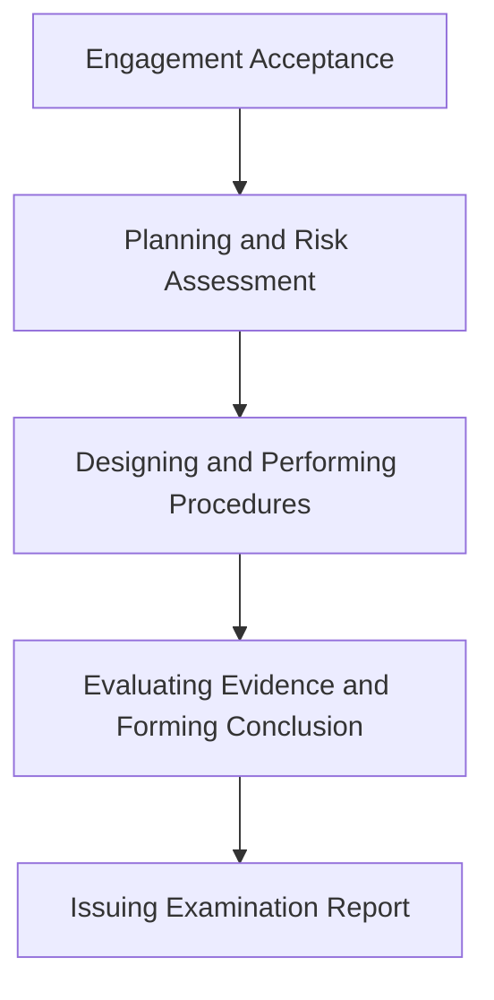
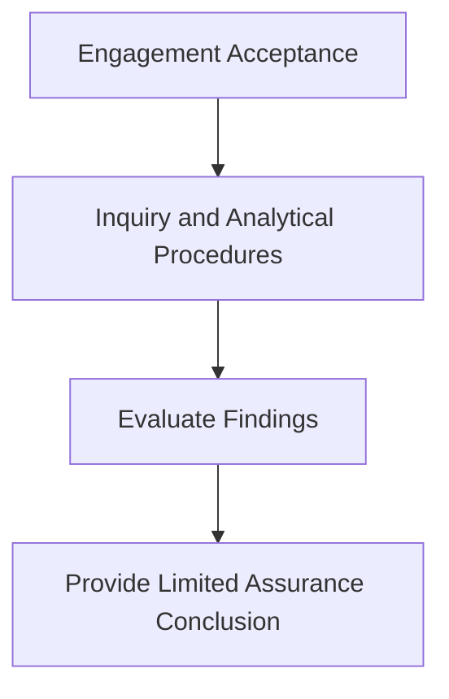

## 17.1 Examinations, Reviews, and Agreed-Upon Procedures (SSAE Standards)

Attestation engagements allow CPAs to provide assurance on subject matters beyond historical financial statements. The Statements on Standards for Attestation Engagements (SSAE) offer a flexible framework to examine, review, or perform agreed-upon procedures (AUP) on a variety of topics—ranging from compliance with specific regulations to sustainability metrics to internal controls unrelated to financial reporting. This section covers the essential aspects of SSAE engagements, focusing on the key differences between examinations, reviews, and agreed-upon procedures. We will also address the relevant AT-C sections, best practices, illustrative examples, and practical guidance to help professionals select and execute the right attestation engagement.

-------------------------------------------------------------------------------

### 1. Overview of the SSAE Framework

The SSAE framework, issued by the AICPA, governs engagements in which a CPA expresses an assurance conclusion about a subject matter other than historical financial statements (or about the assertion of a responsible party). This framework encompasses:

• A broad range of subject matters such as prospective financial information, compliance with laws/regulations, environmental performance, cybersecurity controls, and more.  
• The flexibility to choose the most appropriate level of assurance, based on the engagement’s purpose and the end users’ needs.  
• Detailed guidelines on how to carry out an attestation engagement, ensuring consistency, transparency, and high-quality professional standards.

Key references within SSAE include:

• AT-C Section 105: Concepts Common to All Attestation Engagements  
• AT-C Section 205: Examination Engagements  
• AT-C Section 210: Review Engagements  
• AT-C Section 215: Agreed-Upon Procedures Engagements  
• AT-C Section 305: Additional Requirements for Examination Engagements

-------------------------------------------------------------------------------

### 2. Distinguishing Attestation Engagements from Audits

While an **audit** (particularly a financial statement audit) also aims to provide assurance, it focuses on expressing an opinion on whether historical financial statements are free of material misstatement. In contrast:

• Attestation engagements can address broader or different subject matters and require the practitioner to evaluate or measure subject matter against relevant, agreed-upon criteria.  
• In an **examination**, the practitioner provides a high (reasonable) level of assurance, similar in rigor to an audit but not limited to financial statements.  
• In a **review**, the practitioner offers limited assurance through inquiry and analytical procedures. This is less in-depth compared to an examination.  
• In an **agreed-upon procedures** engagement, the practitioner only reports on factual findings based on procedures designed by the client or specified parties, without forming an opinion or conclusion.

-------------------------------------------------------------------------------

### 3. Examination Engagements

An **examination** under SSAE is analogous to an audit’s depth of assurance, but it is typically focused on subject matter other than historical financial statements. The practitioner conducts thorough procedures, performs testing, and issues an opinion on whether the subject matter is in conformity with the chosen criteria.  

#### 3.1 Key Characteristics of an Examination

• **Reasonable Assurance**: Provides a high level of assurance, similar to how audits provide a high level of assurance on financial statements.  
• **In-Depth Procedures**: The practitioner designs and performs comprehensive procedures to gather sufficient, appropriate evidence.  
• **Opining on Criteria**: A formal opinion is issued stating whether the subject matter aligns with the relevant criteria.  

#### 3.2 Real-World Example

Consider an **examination of a company’s cybersecurity controls** (common reference: SOC for Cybersecurity). The CPA would assess whether the controls are suitably designed and operating effectively. After evidence-gathering, testing, documentation, and evaluation, the CPA would conclude on the overall effectiveness of the system’s controls in relation to a recognized cybersecurity framework.

#### 3.3 Examination Engagement Visual

Below is a high-level mermaid diagram showing typical phases of an examination engagement:



• **Engagement Acceptance**: Define scope and criteria; ensure independence and capabilities.  
• **Planning and Risk Assessment**: Understand the subject matter, relevant risks, and controls.  
• **Designing and Performing Procedures**: Conduct tests, inquiries, and observations.  
• **Evaluating Evidence and Forming Conclusion**: Assess whether the evidence is sufficient to form an opinion.  
• **Issuing Examination Report**: Present a formal opinion on whether the subject matter meets the specified criteria.

-------------------------------------------------------------------------------

### 4. Review Engagements

A **review** under SSAE provides limited assurance on a subject matter. The CPA primarily relies on procedures such as inquiries of responsible personnel and analytical procedures. This level of engagement is less detailed than an examination.

#### 4.1 Key Characteristics of a Review

• **Limited Assurance**: The CPA can state that nothing came to their attention suggesting material nonconformity with criteria.  
• **Less Extensive Procedures**: Focuses on inquiry and analytical procedures rather than extensive testing or corroboration.  
• **Outcome**: A conclusion in a negative assurance format (e.g., “We are not aware of any material modifications that should be made…”).

#### 4.2 Example Scenario

If a company wants a review of **environmental sustainability metrics**, a CPA might perform comparative analysis, review data collection procedures, and inquire about anomalies or assumptions. The CPA would not verify each data point as extensively as in an examination, thus concluding with a limited assurance statement based on the data reviewed.

#### 4.3 Review Engagement Visual



• **Engagement Acceptance**: Agree on scope, criteria, and expectations with the client.  
• **Inquiry and Analytical Procedures**: Gather insights; identify any significant anomalies or discrepancies.  
• **Evaluate Findings**: Determine whether the subject matter appears to follow the agreed-upon criteria.  
• **Provide Limited Assurance Conclusion**: Usually expressed in “negative assurance” form.

-------------------------------------------------------------------------------

### 5. Agreed-Upon Procedures Engagements (AUP)

In an **agreed-upon procedures** engagement, the scope is defined by the client, regulators, or other specified parties. The CPA conducts the exact procedures requested and reports the factual results. No assurance—positive or negative—is expressed. Instead, the end users of the report draw their own conclusions from the results.

#### 5.1 Key Characteristics

• **No Opinion or Conclusion**: The CPA does not offer an opinion on the subject matter.  
• **Procedures Determined by Users**: Procedures are tailored to address specific concerns or requirements identified by the users.  
• **Factual Findings Report**: The final AUP report details the steps performed and the observations or findings without interpretation or conclusion.

#### 5.2 Example Scenario

A company’s lender might ask for certain procedures around the company’s accounts receivable—like checking the details for a sample of transactions to confirm pledged collateral. The CPA’s AUP report will outline precisely what was done and what was found, but not assert any opinion on the overall quality or correctness of all accounts receivable.

#### 5.3 AUP Engagement Visual

```mermaid
flowchart TB
    A[Define Scope and Procedures with Client]
    A --> B[Perform Agreed-Upon Procedures]
    B --> C[Document Factual Findings]
    C --> D[Issue AUP Report (No Opinion)]
```

• **Define Scope and Procedures with Client**: The parties specify which accounts, records, or processes will be tested, and how.  
• **Perform Agreed-Upon Procedures**: Execute the procedures step by step.  
• **Document Factual Findings**: Summarize results, such as exceptions or discrepancies found (if any).  
• **Issue AUP Report**: Provide the report to specified users to interpret the data themselves.

-------------------------------------------------------------------------------

### 6. Practical Guidance and Best Practices

1. **Define Clear Objectives and Criteria**: Before starting any attestation engagement, ensure that management, the CPA, and relevant third parties understand the subject matter and its measurement criteria.  
2. **Tailor Engagement Type**: Select an examination, review, or agreed-upon procedures based on the desired level of assurance and the needs of intended report users.  
3. **Maintain Strong Documentation**: Document the rationale behind the chosen procedures, the extent of evidence obtained, and the conclusions drawn. This is essential for transparency and compliance with SSAE quality standards.  
4. **Stay Current with Standards**: The SSAE framework evolves. Keep up to date with amendments, such as new AT-C sections or interpretive guidance.  
5. **Communicate Early with Stakeholders**: Clarify limitations, expectations, and scope among all parties to avoid misunderstandings over the level of assurance.  
6. **Evaluate Independence and Competence**: SSAE engagements follow the same independence and ethics regulations as standard audits. Ensure compliance with the AICPA Code of Professional Conduct.

-------------------------------------------------------------------------------

### 7. Common Pitfalls and How to Avoid Them

• **Unclear or Incomplete Criteria**: The subject matter must be measurable against recognized or developed criteria. Vague criteria lead to ambiguous conclusions.  
• **Overlapping Engagement Scopes**: Clearly distinguish between attestation engagements, audits, and consulting services to avoid confusion about the level of assurance or confidentiality.  
• **Insufficient Evidence**: For an examination, gather comprehensive evidence; for a review, perform appropriate inquiries and analytics. Lack of sufficient evidence compromises the reliability of any report.  
• **Miscommunication of Findings**: Particularly for AUP engagements, remind end users that the CPA is not providing an opinion or conclusion—only factual observations.  
• **Inadequate Planning**: Failing to plan engagement timelines or resources can lead to missed procedures or rushed evidence gathering.  

-------------------------------------------------------------------------------

### 8. References and Resources

• **Official References**  
  – [AT-C Sections 105–370](https://www.aicpa.org/research/standards/auditattest/attestationstandards.html) under the SSAE, providing detailed requirements for each type of engagement.  
  – **AICPA Guide: SOC for Cybersecurity**, a practical resource for conducting an examination of cybersecurity controls.  
• **Additional Resources**  
  – AICPA’s “Comparison of Services” charts for an overview of how attestation engagements fit alongside other CPA services.  
  – Industry-specific criteria frameworks (e.g., GRI or SASB for sustainability, NIST for cybersecurity controls) that serve as the measurement yardstick for attestation.  

-------------------------------------------------------------------------------

## Test Your Knowledge: SSAE Attestation Engagements Mastery Quiz



### In which type of attestation engagement does the CPA provide a high (reasonable) level of assurance on a subject matter?  
- [x] Examination  
- [ ] Review  
- [ ] Agreed-upon procedures  
- [ ] Compilation  

> **Explanation:** An examination is designed to provide a high level of (reasonable) assurance, similar to a financial statement audit, but directed at non-financial statement subject matter.

### Which SSAE engagement typically uses the phrasing, “We are not aware of any material modifications…” to express findings?  
- [ ] Examination  
- [x] Review  
- [ ] Agreed-upon procedures  
- [ ] Compilation  

> **Explanation:** Reviews typically use negative assurance or “we are not aware of any…” language, indicating limited assurance rather than the high level of assurance found in an examination.

### In an agreed-upon procedures engagement, who determines the specific procedures performed by the CPA?  
- [ ] The CPA determines the procedures.  
- [ ] A standard set of procedures is mandated by the AICPA.  
- [x] The client or other specified parties determine the procedures.  
- [ ] The IRS determines the procedures.  

> **Explanation:** In an AUP engagement, the procedures are set by the parties using the report (the client, regulatory bodies, or others) so they can address specific questions or concerns.

### Which SSAE engagement does NOT result in an opinion or conclusion but rather a presentation of factual findings only?  
- [ ] Examination  
- [ ] Review  
- [x] Agreed-upon procedures  
- [ ] Audit  

> **Explanation:** Even though an examination and a review yield an opinion or conclusion, agreed-upon procedures engagements only report on factual findings.

### What is the primary difference between a review and an examination under SSAE?  
- [x] The level of assurance provided  
- [ ] The type of subject matter evaluated  
- [x] The procedures involve inquiry and analytics versus extensive testing  
- [ ] The independence requirements do not apply to reviews  

> **Explanation:** Reviews provide a limited assurance level (using inquiry and analytic procedures), while examinations give a high level of assurance and require more extensive procedures.

### A company requests an opinion on whether its corporate social responsibility program meets a recognized sustainability framework’s criteria. It wants the highest assurance possible. Which engagement type is most suitable?  
- [ ] AUP  
- [x] Examination  
- [ ] Review  
- [ ] Compilation  

> **Explanation:** To provide the highest level of assurance (analogous to an audit), an examination is the most suitable engagement.

### In which SSAE engagement is the practitioner’s independence from the client still mandatory?  
- [x] Examination  
- [ ] Consulting service  
- [x] Review  
- [x] Agreed-upon procedures  

> **Explanation:** Independence is required for all SSAE engagements (examination, review, and AUP), as they involve assurance or findings that third parties rely on.

### When performing a review under SSAE, which of the following is typically NOT part of the practitioner’s procedures?  
- [x] Extensive testing of transactions  
- [ ] Inquiry of appropriate personnel  
- [ ] Analytical procedures  
- [ ] Evaluating responses for consistency  

> **Explanation:** A review primarily involves inquiry and analytical procedures; extensive transactional testing is characteristic of an examination, not a review.

### In an agreed-upon procedures (AUP) report, how should the CPA present the findings?  
- [ ] In an advisory format with recommendations  
- [ ] As a formal opinion  
- [ ] As a conclusion stating “no material issues found”  
- [x] Factual results of the procedures performed  

> **Explanation:** The CPA simply states the outcomes of the agreed-upon procedures without giving an opinion or conclusion.

### True or False: SSAE engagements can only be performed on historical financial statements.  
- [ ] True  
- [x] False  

> **Explanation:** SSAE engagements are specifically designed to provide assurance (or factual findings) on a broad range of non-financial or future-oriented subject matters, as well as various other areas beyond historical financial statements.



-------------------------------------------------------------------------------

## For Additional Practice and Deeper Preparation

**[Auditing & Attestation CPA Mock Exams (AUD): Comprehensive Prep](https://www.udemy.com/course/aud-cpa-mock-exams/?referralCode=D064EF7BD4A84FC6403D)**  
• Tackle full-length mock exams designed to mirror real AUD questions—from risk assessment and ethics to internal control and substantive procedures.  
• Refine your exam-day strategies with detailed, step-by-step solutions for every scenario.  
• Explore in-depth rationales that reinforce understanding of higher-level concepts, giving you a decisive edge on test day.  
• Boost confidence and reduce exam anxiety by building mastery of the wide-ranging AUD blueprint.

_Disclaimer: This course is not endorsed by or affiliated with the AICPA, NASBA, or any official CPA Examination authority. All content is created solely for educational and preparatory purposes._
