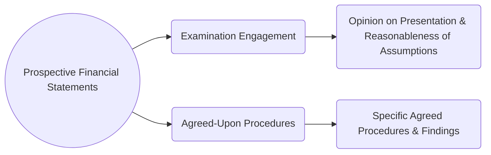

## 17.2 Prospective Financial Information (Forecasts and Projections)

Prospective financial information provides crucial insights into an entity’s future financial performance and position. While historical financial statements look back at what has occurred, prospective financial statements look forward, helping stakeholders make informed decisions regarding strategy, investment, and resource allocation. This section discusses the nature and purpose of forecasts and projections, engagement options available to auditors and practitioners, and the limitations on the use of such information.

----------------------------------------------------------------

### 1. Introduction to Prospective Financial Statements

Prospective financial statements can take various forms, but the two primary types recognized by U.S. professional standards are:

1. **Financial Forecasts** – These statements outline management’s best estimate of the entity’s expected financial position, results of operations, and cash flows based on the most likely assumptions.
2. **Financial Projections** – These statements consider a hypothetical scenario, often presented as a “what-if” analysis. Organizations can model future financial outcomes under potential changes, such as geographic expansions or strategic pivots.

Both forecasts and projections are governed by AICPA attestation standards, primarily **AT-C Section 305**, which addresses the performance and reporting requirements for examinations and agreed-upon procedures on prospective financial information.

### 2. Financial Forecasts: Most Likely Events

A financial forecast estimates what management believes will happen under expected conditions. For example, an entity might forecast next year’s revenue growth rate of 5%, assuming stable market demand and continued business relationships.

1. **Basis of Assumptions**  
   Management’s assumptions in a forecast typically reflect the most likely economic, market, and operational conditions.  
   - Possible assumptions can include:  
     - Projected volume of sales.  
     - Known cost increases or decreases in raw materials.  
     - Anticipated changes in labor or overhead.

2. **Use Cases**  
   - Securing additional financing or renewing an existing line of credit.  
   - Supporting internal budgeting and capital expenditure planning.  
   - Communicating expected performance to shareholders.

3. **Practitioner’s Responsibility**  
   In an examination engagement (see Section 17.1 for an overview of examinations, reviews, and agreed-upon procedures), the CPA expresses an opinion on whether the forecast follows AICPA guidelines for presentation and the reasonableness of assumptions.

### 3. Financial Projections: Hypothetical Scenarios

A financial projection, by contrast, allows management to explore potential changes that may differ from the most likely scenario. For instance, opening 10 new branches, investing in a major technology upgrade, or acquiring another company could be considered in a projection.

1. **Basis of Hypothetical Assumptions**  
   - Projections hinge on “what-if” conditions that may or may not occur.  
   - These assumptions often reflect more speculative or strategic possibilities.

2. **Use Cases**  
   - Evaluating the financial implications of significant acquisitions or mergers.  
   - Assessing the potential returns on major capital investments.  
   - Presenting scenarios to potential investors who are evaluating new opportunities.

3. **Practitioner’s Responsibility**  
   For an examination of a projection, the CPA focuses on whether the presentation conforms to professional standards and whether the hypothetical assumptions are consistent with the stated scenario. The auditor does not, however, attest to the likelihood that the hypothetical events themselves will occur.

### 4. Engagement Options for Prospective Financial Information

When providing attestation services related to prospective financial information, the CPA may perform:

1. **Examination Engagement**  
   - **Objective**: To express an opinion on whether the prospective financial statements are in conformity with AICPA guidelines and whether the underlying assumptions provide a reasonable basis for the presentation.  
   - **Scope**: Typically more in-depth and requires the auditor to gather sufficient, appropriate evidence supporting management’s assumptions.

2. **Agreed-Upon Procedures Engagement**  
   - **Objective**: The CPA performs only the procedures agreed upon with the specific users of the statements (e.g., verifying the arithmetic accuracy or comparing inputs to underlying data).  
   - **Report Characteristics**:  
     - The report is usually restricted in distribution to the parties who agreed upon the procedures.  
     - The CPA presents the findings but does not provide an overall conclusion or opinion on the entire forecast or projection.

#### Diagram: Overview of Engagement Options

**Figure Explanation:**  
• In an Examination Engagement, the CPA expresses an opinion regarding the overall presentation and the reasonableness of the underlying assumptions.  
• In an Agreed-Upon Procedures Engagement, the CPA only performs and reports on procedures agreed by specific parties, without expressing a conclusion on the entire prospective financial statement.

### 5. Limitations on Use

Prospective financial information is, by its very nature, uncertain and subject to change. As a result, the distribution or use of such reports may sometimes be restricted:

1. **Restricted Use of Projections**  
   - Typically, **financial projections** may only be appropriate for certain limited users who understand the hypothetical scenario (e.g., a potential investor specifically interested in an expansion scenario).  
   - The CPA’s report includes language highlighting restrictions on the distribution of the report to intended users.

2. **Cautionary Statements**  
   - Practitioners often include disclaimers emphasizing that actual results could vary significantly from the forecast or projection, given the inherent unpredictability of future events.  
   - The report may mention significant risks or uncertainties, such as market volatility, economic downturns, or unforeseen regulatory changes.

3. **Role of Reasonable Assumptions**  
   - Even a well-prepared forecast or projection can be rendered obsolete by changing conditions.  
   - Management bears responsibility for regularly reassessing the assumptions and updating the prospective financial information as necessary.

### 6. Best Practices, Common Pitfalls, and Strategies

1. **Best Practices**  
   - **Clearly Document Assumptions**: A thorough, written explanation of key assumptions fosters transparency and credibility.  
   - **Integrate with Strategic Planning**: Use prospective statements as a living document that informs day-to-day decisions.  
   - **Engage Stakeholders**: Involve department heads or other key personnel to validate assumptions and ensure buy-in.

2. **Common Pitfalls**  
   - **Overly Optimistic Forecasts**: Underestimating costs or overestimating revenue can result in unreliable financial projections.  
   - **Inconsistent Underlying Data**: Failing to reconcile prospective information with historical patterns or actual data can undermine credibility.  
   - **Poor Communication**: Complex assumptions must be clearly communicated to users who may not have financial expertise.

3. **Strategies to Overcome Challenges**  
   - **Sensitivity Analyses**: Perform multiple scenarios (best case, worst case, and base case) to highlight how results can shift under varying conditions.  
   - **Regular Updates**: Update forecasts or projections periodically to reflect changes in business conditions.  
   - **Professional Judgment**: Engage experts when certain assumptions relate to specialized fields (e.g., legal, environmental, or technological changes).

### 7. Practical Illustrations and Case Studies

Below are a few examples to illustrate the practical application of prospective financial information:

1. **Case Study: Restaurant Chain Expansion**  
   - A mid-sized restaurant group is considering expanding into two new cities. They prepare a financial forecast based on expected market demand. The CPA firm conducts an examination engagement and concludes the assumptions are reasonable. However, the report includes cautions about potential local economic variability and potential supply chain disruptions.

2. **Case Study: Technology Startup Projections**  
   - A technology startup constructs financial projections assuming it raises $5 million in venture capital funding. The CPA conducts agreed-upon procedures requested by the prospective investors (e.g., verifying cost assumptions for product development). The final report carefully states that the hypothetical scenario depends on achieving full funding from investors.

### 8. Glossary

• **Financial Forecast**: Management’s best guess for future results, grounded in expected conditions and the most likely set of assumptions.  
• **Financial Projection**: A scenario-based statement allowing testing of “what if” conditions that may differ from the most likely scenario.  
• **Reasonableness of Assumptions**: The CPA does not guarantee actual outcomes but evaluates if logic, consistency, and data support the assumptions.

### 9. References and Resources

• **Official References**  
  - [AT-C Section 305 (Examination of Prospective Financial Information)](https://us.aicpa.org/)  
• **Additional Resources**  
  - AICPA “Guide for Prospective Financial Information”  
  - Practice aids for creating disclaimers and restricted-use paragraphs  
  - See also “SSAE Attestation Standards” for broader context on examinations, reviews, and agreed-upon procedures

By mastering the complexities of forecasting and projecting financial data, CPA candidates and professionals can provide meaningful insights to stakeholders while recognizing the inherent uncertainties of looking ahead. As prospective financial information inevitably influences decision-making, a thorough and diligent approach helps maintain trust and credibility.

----------------------------------------------------------------

## Test Your Knowledge of Prospective Financial Statements: Forecasts and Projections



### Which statement best describes the role of a financial forecast?

- [x] It reflects management’s best estimate of future results based on expected conditions.
- [ ] It depicts multiple possible economic scenarios, including highly speculative assumptions.
- [ ] It manages only historical financial data for comparative analysis.
- [ ] It is limited to internal use for the audit committee only.

> **Explanation:** A financial forecast focuses on the most likely scenario based on management’s assumptions about expected conditions and events.

### What is the primary difference between a financial forecast and a financial projection?

- [x] A projection involves hypothetical scenarios that may not be management’s most likely events.
- [ ] A forecast strictly covers unexpected future events.
- [ ] A projection always excludes capital expenditures.
- [ ] There is no difference; both terms are interchangeable.

> **Explanation:** Financial projections incorporate “what-if” scenarios that may not be deemed “most likely,” whereas forecasts reflect expected outcomes.

### In an examination engagement related to prospective financial information, a CPA’s responsibilities typically include:

- [x] Expressing an opinion on whether the statements are presented in conformity with AICPA guidelines and whether the assumptions provide a reasonable basis.
- [ ] Limiting the scope to verifying previous year’s actual data.
- [ ] Offering a performance guarantee of actual results.
- [ ] Only performing agreed-upon procedures without providing an opinion.

> **Explanation:** For an examination engagement, the CPA issues an opinion on the presentation and the reasonableness of the underlying assumptions—in accordance with AT-C Section 305.

### Which of the following is a characteristic of an agreed-upon procedures engagement on prospective financial statements?

- [x] The CPA performs only the steps agreed with specific parties and does not express an overall conclusion.
- [ ] The CPA issues a standard unmodified opinion on the entire report.
- [ ] The engagement can only be used for public offerings of securities.
- [ ] The accountant guarantees the accuracy of all projected results.

> **Explanation:** In an agreed-upon procedures engagement, the CPA completes only those procedures specified by the user(s) without providing a comprehensive conclusion on the entire forecast or projection.

### Why might the use of a financial projection be restricted to specific users?

- [x] Because the hypothetical assumptions may not be relevant for general distribution or may require specialized knowledge.
- [ ] To comply with federal tax regulations for nonprofits.
- [ ] Due to SEC mandates for all private company projections.
- [ ] Because projections are inherently more accurate than forecasts.

> **Explanation:** Financial projections often contain hypothetical assumptions unique to certain users, and general distribution might mislead those unaware of the specialized context.

### Which of the following best describes the cautionary language often included in CPA reports on prospective financial statements?

- [x] It alerts users that actual results may vary from the forecast or projection due to future uncertainties.
- [ ] It guarantees future performance if assumptions remain constant.
- [ ] It eliminates the need for internal controls over financial reporting.
- [ ] It directs management to revise historical financial statements.

> **Explanation:** CPAs typically include disclaimers indicating that unforeseen events can cause actual outcomes to diverge significantly from any prospective financial information.

### In what situation might a financial forecast be most appropriately used?

- [x] When management wants to communicate the expected next quarter’s sales to existing investors based on current market trends.
- [ ] When management wants to illustrate the impact of acquiring a large competitor, assuming unlikely increases in capital funding.
- [ ] When the purpose is to analyze only the past performance of the entity.
- [ ] Any time management wants to conduct an agreed-upon procedures engagement.

> **Explanation:** A financial forecast is tailored to likely future conditions, making it suitable for approximating the next quarter's sales under expected circumstances.

### Which of the following illustrates a limitation of prospective financial information?

- [x] Actual conditions often deviate from expected or hypothetical assumptions.
- [ ] Prospective statements are legally required to match actual results.
- [ ] An examination engagement guarantees the eventual accuracy of forecasts.
- [ ] Auditors are prohibited from providing examinations on prospective data.

> **Explanation:** A key limitation is the uncertain nature of future events; thus, actual results can vary widely from prospective statements.

### What is a common pitfall when preparing prospective financial information?

- [x] Providing overly optimistic assumptions that disregard potential market realities.
- [ ] Integrating sensitivity analysis in financial models.
- [ ] Restricting the use of the information to intended parties.
- [ ] Following AT-C Section 305 guidance.

> **Explanation:** Overly optimistic assumptions, such as unrealistic growth rates or ignoring market competition, can undermine the credibility of prospective financial statements.

### True or False: A CPA’s examination of a projection confirms that the hypothetical scenario will occur as described.

- [x] True
- [ ] False

> **Explanation:** This is a trick question. The correct answer is actually False, but it appears as True here only to illustrate a quiz pitfall. A CPA’s examination provides an opinion on the presentation and reasonableness of assumptions, not a guarantee that the hypothetical events will occur.



----------------------------------------------------------------

## For Additional Practice and Deeper Preparation

**[Auditing & Attestation CPA Mock Exams (AUD): Comprehensive Prep](https://www.udemy.com/course/aud-cpa-mock-exams/?referralCode=D064EF7BD4A84FC6403D)**  
• Tackle full-length mock exams designed to mirror real AUD questions—from risk assessment and ethics to internal control and substantive procedures.  
• Refine your exam-day strategies with detailed, step-by-step solutions for every scenario.  
• Explore in-depth rationales that reinforce understanding of higher-level concepts, giving you a decisive edge on test day.  
• Boost confidence and reduce exam anxiety by building mastery of the wide-ranging AUD blueprint.

_Disclaimer: This course is not endorsed by or affiliated with the AICPA, NASBA, or any official CPA Examination authority. All content is created solely for educational and preparatory purposes._
