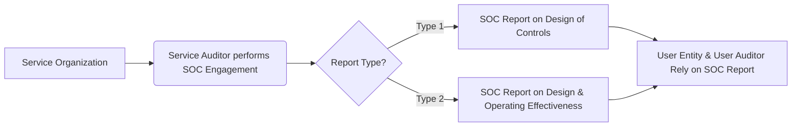

## 17.4 Service Organization Controls (SOC) Reports

Service Organization Controls (SOC) reports are critical attestation engagements performed by Certified Public Accountants (CPAs) to evaluate and report on the effectiveness of controls at service organizations. In today’s business environment, many companies (“user entities”) outsource vital functions—such as payroll processing, data hosting, and IT infrastructure—to service organizations. Because these outsourced operations can significantly impact the financial statements or data security of user entities, it becomes essential to assess the design and operating effectiveness of the controls in place.

This section explores the framework and requirements of SOC engagements, differentiates SOC 1®, SOC 2®, and SOC 3®, and clarifies how user auditors and user entities benefit from these reports. We also compare Type 1 vs. Type 2 reporting, examine the associated attestation standards, and highlight the importance of Trust Services Criteria (TSC) in SOC 2® engagements.

---

## SOC Overview

A “Service Organization” is any entity providing services that are part of user entities’ information systems or operations. Common examples include payroll processors, cloud computing providers, and data hosting centers. SOC reports enable stakeholders to assess whether the organization’s internal controls are properly designed and operating effectively to meet specific objectives.

### SOC 1®: Controls Relevant to User Entities’ Financial Statements

• Intended for engagements focused on controls over financial reporting.  
• Commonly used by payroll processors, claims processors, or third-party administrators.  
• Helps user entity auditors gain an understanding of how outsourced service processes impact a client’s financial statements.  

### SOC 2®: Controls Over Security, Availability, Processing Integrity, Confidentiality, and Privacy

• Focuses on Trust Services Criteria (TSC), covering key areas like Security, Availability, Processing Integrity, Confidentiality, and Privacy.  
• Especially relevant for technology, cloud, and data-centered service organizations—e.g., software-as-a-service (SaaS) providers, colocation data centers, or managed service providers.  
• Provides critical insight into whether the service organization meets stakeholder requirements for non-financial controls, such as data security.

### SOC 3®: General-Use Version of SOC 2®

• Similar in scope to SOC 2® but restricted in detail; it is designed for public distribution.  
• Often used for marketing or broad reassurance to the market about a service organization’s controls, without disclosing the same level of detail as a SOC 2®.  
• May be posted on a company’s website for transparency to current and prospective customers.

Below is a simplified table comparing the three types of SOC reports:

|                   | SOC 1®                                 | SOC 2®                                    | SOC 3®                         |
|-------------------|----------------------------------------|-------------------------------------------|---------------------------------|
| Purpose           | Controls relevant to user entities’ financial statements | Controls related to Security, Availability, Processing Integrity, Confidentiality, and Privacy | General-use summary of SOC 2® |
| Audience          | Restricted use: User entities and their auditors         | Restricted use: Management, user entities, and business partners        | General use: Publicly available |
| Criteria          | Control objectives set by service organization (relevant to financial reporting) | Trust Services Criteria (TSC)               | TSC (High-level summary)        |
| Detail Level      | Detailed for user auditor reliance                      | Detailed for stakeholder reliance           | Summary-level information       |

---

## Examination Nature

When obtaining a SOC report, the CPA firm (“service auditor”) issues an opinion on the service organization’s controls. These examinations can be conducted as Type 1 or Type 2 reports:

1. **Type 1**: Addresses the fairness of the presentation of the service organization’s system and the suitability of the design of controls as of a specific date.  
2. **Type 2**: Addresses the fairness of the presentation, suitability of the design, and operating effectiveness of controls over a specified period, generally at least six months.

User entity auditors rely on SOC 1® reports to identify and evaluate whether internal control aspects handled by external service providers are functioning effectively. This reliance reduces the need for direct testing at the service organization but may require additional procedures if significant risks remain.

---

## Description Criteria

For both SOC 1® and SOC 2® (including SOC 3®), the service organization’s description of its system must be aligned with the relevant criteria:

1. **System Description**: Outlines the nature of services provided, including the boundaries of the system and core processes.  
2. **Control Objectives/Trust Services Criteria**:  
   - **SOC 1®** focuses on control objectives tied to financial reporting.  
   - **SOC 2®** focuses on the TSC: Security, Availability, Processing Integrity, Confidentiality, and Privacy.  
3. **Controls**: Detailed descriptions of specific controls employed to meet each control objective or TSC principle.

An essential component is management’s assertion on whether the system description is fairly presented, the controls are suitably designed, and, for a Type 2 report, whether the controls operated effectively throughout the specified period.

---

## Key Concepts and Glossary

Below are important terms and concepts related to SOC reports:

• **Service Organization**: A third-party provider whose services are part of user entities’ information systems—such as payment processors, data centers, or benefits administrators.  
• **Service Auditor**: The CPA performing SOC engagements, examining controls at the service organization.  
• **User Entity**: The organization outsourcing one or more functions to a service organization.  
• **User Auditor**: The CPA auditing the user entity’s financial statements and evaluating the effect of service organization controls on the user entity’s risk environment.  
• **Type 1 Report**: Provides an opinion on the design suitability of controls at a specific point in time.  
• **Type 2 Report**: Provides an opinion on both the design and operating effectiveness of controls over a defined period.  
• **Trust Services Criteria (TSC)**: The principles (security, availability, processing integrity, confidentiality, and privacy) used in SOC 2® engagements.  
• **SSAE No. 18**: Attestation standard (AT-C Sections 320 & 205) governing Reporting on Controls at a Service Organization.  

Below is a simplified visual showing how these elements interact in the SOC reporting process:

---

## Practical Examples and Use Cases

1. **Payroll Processing (SOC 1®)**  
   A multiline corporation outsources payroll processing to a well-established service provider. The user entity’s financial statements heavily depend on accurate payroll figures. Here, a SOC 1® Type 2 report provides the user auditor comfort that the payroll service’s controls are designed and operating effectively.

2. **Cloud Storage (SOC 2®)**  
   A software development company uses a third-party cloud provider. Security and availability are critical for the company’s platform. A SOC 2® Type 2 report assures them that the provider meets specific TSC requirements, such as robust encryption and consistent uptime.

3. **High-Level Public Assurance (SOC 3®)**  
   A data center wants to publicly market its commitment to data security and availability. They choose to publish a SOC 3® report as evidence of an independent auditor’s assessment while keeping sensitive details for internal use only.

---

## Best Practices for Implementing SOC Engagements

• **Early Planning**: Service organizations should establish clear objectives for the engagement: Whether to focus on financial reporting (SOC 1®) or the TSC (SOC 2®, SOC 3®).  
• **Open Communication**: Communicate with the user auditors to identify specific areas of reliance and ensure their concerns are addressed in the SOC report.  
• **Robust Internal Controls**: Develop, document, and test internal controls regularly to prepare for a SOC examination.  
• **Periodic Gap Assessments**: Conduct frequent internal audits or readiness assessments before undergoing a formal SOC examination.  
• **Timely Reporting**: Ensure your Type 2 reporting period and issuance timeline aligns with user entities’ year-end audits to maximize reliance and reduce rework.

---

## Common Pitfalls and Challenges

• **Incomplete System Description**: Failing to detail critical processes or boundaries can lead to disclaimers or modifications in the final report.  
• **Unclear Responsibilities**: Roles of the service organization and subservice organizations (if any) must be distinctly outlined.  
• **Misalignment with User Needs**: Issuing a SOC 1® when user entities are more concerned about information security (SOC 2®) can result in insufficient coverage.  
• **Late Engagements**: Initiating a SOC examination too close to the user entity’s deadlines often leads to rushed procedures and suboptimal reliance.

---

## References and Resources

### Official References

• **SSAE No. 18 (AT-C Sections 320 & 205)** – “Reporting on an Examination of Controls at a Service Organization”  
• **AICPA’s “SOC Suite of Services”** – Guidance on SOC 1®, SOC 2®, SOC 3®, and related FAQs

### Additional Resources

• **AICPA Guide: Reporting on Controls at a Service Organization** – In-depth explanations, sample SOC reports, and best practices.  
• **Comparative Whitepapers from Major CPA Firms** – Overviews and case studies on how organizations implement and benefit from SOC reports.  
• **AICPA Matrix of SOC 1 vs. SOC 2 vs. SOC 3** – A quick reference tool assisting in determining which report type is most suitable.

---

## SEO-Optimized SOC Reporting Quiz: Test Your Knowledge of SOC 1, SOC 2, and SOC 3



### Which of the following best describes a SOC 1® report?

- [ ] A public-facing report outlining high-level details of a service organization’s controls.  
- [ ] A report primarily focused on data privacy regulations, such as GDPR.  
- [x] A restricted-use report evaluating controls over financial reporting.  
- [ ] A comprehensive review of the service organization’s system with minimal detail for user auditors.

> **Explanation:** SOC 1® reports concentrate on controls likely to impact a user entity’s financial statements. They are generally restricted to stakeholders needing assurance over financial reporting.

### Which SOC engagement would a cloud hosting provider typically undergo to address data security and availability concerns?

- [ ] SOC 1®  
- [x] SOC 2®  
- [ ] SOC 3®  
- [ ] None of the above

> **Explanation:** A cloud hosting provider storing client data and ensuring system availability often requires a SOC 2® report covering controls over Security and Availability under the Trust Services Criteria.

### What is the main distinction between a Type 1 and a Type 2 SOC report?

- [ ] Type 1 is restricted to SOC 1®, while Type 2 is restricted to SOC 2®.  
- [ ] Type 1 reports on data security, whereas Type 2 focuses on processing integrity.  
- [x] Type 1 evaluates the design of controls at a point in time; Type 2 evaluates design and operating effectiveness over a period.  
- [ ] They differ only in the complexity of control objectives.

> **Explanation:** A Type 1 SOC report examines whether controls are suitably designed as of a specific date, while Type 2 SOC report also includes tests of operating effectiveness over a period.

### Which of the following generally best describes a SOC 3® report?

- [ ] Contains extensive confidential data for user entity auditors.  
- [x] A general-use version of SOC 2® intended for broader distribution.  
- [ ] Valid solely for financial statement audits.  
- [ ] Exclusively reviews subservice organizations.

> **Explanation:** SOC 3® reports are a high-level, public-facing synopsis of SOC 2® findings, lacking the detailed controls and test results found in the full SOC 2® report.

### What document provides comprehensive guidance and illustrative SOC reports?

- [ ] Sarbanes-Oxley Act  
- [x] AICPA Guide: Reporting on Controls at a Service Organization  
- [ ] COSO Internal Control Integrated Framework  
- [ ] PCAOB Release No. 2017-002

> **Explanation:** The “AICPA Guide: Reporting on Controls at a Service Organization” contains official guidance, case studies, and sample reports specific to SOC engagements.

### How can a user auditor benefit from a service organization’s SOC 1® Type 2 report?

- [x] By using it to reduce substantive testing on outsourced financial applications.  
- [ ] By eliminating all auditing procedures at the user entity.  
- [ ] By confirming availability and confidentiality controls are in place.  
- [ ] By focusing primarily on intangible assets reporting.

> **Explanation:** A SOC 1® Type 2 report can enable user auditors to rely on the tested controls, potentially reducing their own control testing over those outsourced processes.

### Which principle(s) do SOC 2® engagements evaluate according to the Trust Services Criteria?

- [ ] Revenue recognition principles  
- [ ] Federal audit requirements  
- [x] Security, Availability, Processing Integrity, Confidentiality, and Privacy  
- [ ] Independence standards and ethics reviews

> **Explanation:** SOC 2® engagements are based on the Trust Services Criteria (TSC), which include Security, Availability, Processing Integrity, Confidentiality, and Privacy.

### Why might a service organization choose to issue both SOC 1® and SOC 2® reports?

- [ ] To replace the need for a SOC 3®.  
- [x] Because user entities require assurance over both financial control and non-financial/security control environments.  
- [ ] To avoid compliance with SSAE 18.  
- [ ] To satisfy government audit requirements only.

> **Explanation:** Some service organizations cater to clients needing assurance over financial reporting (SOC 1®) and over the TSC (SOC 2®), particularly where controls significantly impact user entities in both those areas.

### What is a key benefit of a readiness assessment before a SOC examination?

- [x] Identifying control gaps or weaknesses prior to the formal SOC audit.  
- [ ] Replacing the need for a SOC examination altogether.  
- [ ] Fulfilling the requirements for an integrated audit.  
- [ ] Guaranteeing an unqualified SOC opinion.

> **Explanation:** Readiness assessments allow the organization to find and address control gaps, improving the final results of a SOC examination.

### A Type 2 SOC 2® report ensures the service organization's controls:

- [x] Are both suitably designed and operating effectively over a specified period.  
- [ ] Are only designed in accordance with SEC regulations.  
- [ ] Are validated only for a single point in time.  
- [ ] Provide full insight into financial reporting processes.

> **Explanation:** SOC 2® Type 2 covers both design and operating effectiveness of controls across a defined period, focusing on the relevant TSC principles.



---

## For Additional Practice and Deeper Preparation

**[Auditing & Attestation CPA Mock Exams (AUD): Comprehensive Prep](https://www.udemy.com/course/aud-cpa-mock-exams/?referralCode=D064EF7BD4A84FC6403D)**  
• Tackle full-length mock exams designed to mirror real AUD questions—from risk assessment and ethics to internal control and substantive procedures.  
• Refine your exam-day strategies with detailed, step-by-step solutions for every scenario.  
• Explore in-depth rationales that reinforce understanding of higher-level concepts, giving you a decisive edge on test day.  
• Boost confidence and reduce exam anxiety by building mastery of the wide-ranging AUD blueprint.

_Disclaimer: This course is not endorsed by or affiliated with the AICPA, NASBA, or any official CPA Examination authority. All content is created solely for educational and preparatory purposes._
