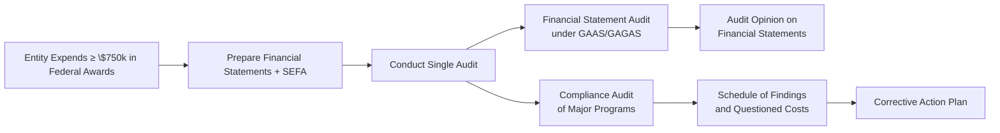

## 18.2 Audits of Entities Receiving Federal Awards (Single Audits)

In the United States, any organization expending significant federal grant funds must comply with specific audit requirements to ensure accountability and transparency. The Single Audit, governed by Uniform Guidance (2 CFR 200, Subpart F), is a consolidated engagement designed to address both an entity’s financial statements and its compliance with critical federal program requirements. This section explores the primary elements of Single Audits, the regulations guiding these engagements, and the practical steps auditors take to provide assurance over federal award expenditures.

---

## 1. Uniform Guidance Overview

### 1.1 Background and Applicability

• The Single Audit concept was introduced to streamline the audit process for entities managing federal grants. Instead of performing separate audits for each federal program, the Single Audit consolidates all required testing into one overarching engagement.  
• Title 2 of the Code of Federal Regulations (2 CFR 200, Subpart F) outlines the Uniform Guidance. Both governmental and nonprofit entities in the U.S. expending ≥ $750,000 in federal awards annually must typically undergo a Single Audit.  
• This threshold-based rule helps small entities avoid disproportionately burdensome audits, while offering a robust oversight mechanism for larger award recipients.

### 1.2 Elements of the Single Audit

1. Financial Statements: Audited under Government Auditing Standards (GAGAS or “Yellow Book”) and Generally Accepted Auditing Standards (GAAS).  
2. Compliance: Examination of whether federal funds were used in accordance with all relevant rules, regulations, and grant provisions.  
3. Internal Control: Assessment of controls surrounding financial reporting and major programs, ensuring federal funds remain protected from mismanagement or fraud.

### 1.3 Goals

1. Promote efficiency by combining an organization’s financial statement and federal compliance audits into a single engagement.  
2. Reduce redundancy and administrative burden for both the entity and oversight bodies.  
3. Provide transparency to granting agencies and stakeholders regarding how federal funds are utilized.

---

## 2. Scope of Single Audit

### 2.1 Alignment with Yellow Book and GAAS

Single Audits incorporate two primary streams of work:

1. A financial statement audit under GAAS and GAGAS. This portion focuses on whether the financial statements are fairly presented, in all material respects, per the relevant financial reporting framework (e.g., GAAP).  
2. A compliance audit addressing federal program requirements. This audit extends beyond standard GAAS to include additional procedures tailored to specific federal compliance questions.

### 2.2 Major Programs and Risk-Based Approach

• Not every federal program requires the same level of testing. The “major program” concept helps auditors focus on programs with the greatest potential for material noncompliance or that represent a substantial portion of total award expenditures.  
• Auditors typically use a risk-based approach, examining factors such as program size, complexity, and prior audit findings to determine which programs qualify as “major.”  
• Major programs undergo detailed compliance tests, while non-major programs may receive more limited scrutiny.

### 2.3 Common Compliance Areas

Entities receive and expend federal funds for varied purposes, but certain requirements consistently appear across federal programs. The Single Audit tests frequently include:  
• Allowable Costs: Ensuring expenditures align with federal cost principles.  
• Period of Performance: Confirming expenses occur within the proper timeframe.  
• Eligibility: Verifying that beneficiaries or subrecipients meet criteria for receiving funds.  
• Procurement: Reviewing the adequacy of contracting and purchasing processes.  
• Recordkeeping: Examining documentation supporting costs and matching contributions.

---

## 3. Financial Statement Audit under GAAS/GAGAS

### 3.1 General Requirements

Auditors of federal award recipients must adhere to GAAS and additional standards outlined by GAGAS (the “Yellow Book”) issued by the Government Accountability Office (GAO). Key differences from a standard commercial audit include:  
• Additional Ethical Requirements: GAGAS’s independence standards may be stricter, especially concerning nonaudit services.  
• Explicit Documentation of Internal Control: Auditors must demonstrate detailed consideration of internal controls related to financial statements and compliance.

### 3.2 Opinions on the Financial Statements

• The auditor issues an opinion on whether the entity’s financial statements are fairly presented according to the applicable accounting framework (e.g., U.S. GAAP).  
• While this portion follows typical GAAS procedures, the auditor also documents how GAGAS requirements (such as continuing professional education and independence) are met.

---

## 4. Compliance Audit for Major Programs

### 4.1 Nature of Compliance Testing

When auditing major programs, the auditor assesses whether the entity complies with laws, regulations, and grant provisions.  
• Testing procedures often include vouching expenditures, confirming eligibility criteria, reviewing procurement documentation, and verifying subrecipient monitoring practices.  
• Noncompliance or questionable uses of funds must be brought to management’s attention and disclosed where required.

### 4.2 Findings and Questioned Costs

If an auditor identifies ineligible or unallowable expenditures, these fall under “questioned costs.” Such costs typically must be reported in the Schedule of Findings and Questioned Costs.  
• Some findings indicate internal control weaknesses, such as inadequate segregation of duties or insufficient reviews of cost allocations.  
• Management responses, including corrective action plans, are typically published alongside the auditor’s findings.

### 4.3 Relationship with Other Engagements

• Single Audits may overlap or interact with other compliance reviews (e.g., state-specific audits or separate sponsor audits). Coordination with these engagements is critical to avoid duplication of effort and conflicting interpretations of the same data.

---

## 5. Reporting Requirements

In addition to the standard financial statement opinion, Single Audit engagements require unique reporting elements:

1. **Schedule of Expenditures of Federal Awards (SEFA):**  
   - Presents a comprehensive summary of federal awards expended during the audit period.  
   - The auditor issues an “in-relation-to” opinion on whether the SEFA is fairly stated relative to the financial statements taken as a whole.

2. **Schedule of Findings and Questioned Costs:**  
   - Summarizes any identified instances of noncompliance, material weaknesses, or significant deficiencies in internal control over major programs.  
   - Itemizes questioned costs, providing the dollar amounts and related compliance requirements.

3. **Corrective Action Plan:**  
   - The auditee’s detailed plan explaining how it will address each finding.  
   - May include timelines, assigned responsibilities, and management’s perspective on the reported issues.

### 5.1 Filing and Distribution

• Final Single Audit reports are typically submitted to the Federal Audit Clearinghouse, maintained by the U.S. Census Bureau.  
• Federal agencies and pass-through entities can review the reports to determine whether additional oversight or remediation steps are necessary.

---

## 6. Common Challenges and Best Practices

### 6.1 Challenges

• Complexity of Requirements: Entities can struggle to manage multiple funding sources and overlapping compliance rules.  
• Insufficient Documentation: Many findings arise from lack of documentation supporting costs or beneficiary eligibility.  
• Changing Regulations: Uniform Guidance evolves over time, requiring auditors and entity staff to stay current.

### 6.2 Best Practices

1. **Robust Grant Management Systems:** Implement software and processes ensuring consistent tracking of expenditures.  
2. **Frequent Training:** Keep staff updated on Uniform Guidance rules, especially allowable costs, procurement policies, and record retention.  
3. **Strong Internal Controls:** Emphasize segregation of duties, clear approval workflows, and effective oversight committees.  
4. **Early Auditor Involvement:** Engaging auditors early helps clarify documentation requirements and prevent last-minute surprises.

---

## 7. Real-World Example

Consider a university that receives $5 million in federal research grants. During the Single Audit:

• The financial statements are audited per GAGAS and GAAS, focusing on revenue recognition for grants and matching funds.  
• Major program testing involves verifying that research personnel costs are only charged within the dates authorized by the grant (period of performance), and that matching contributions (e.g., equipment usage or volunteer labor) are documented properly.  
• If the auditor discovers an over-allocation of staff time to the project beyond allowable thresholds, they may flag the related expenses as questioned costs.  
• The university issues a written corrective action plan to address timekeeping controls, ensuring personnel allocations are corrected to match actual hours worked for each project.

---

## 8. Diagram of the Single Audit Process

Below is a Mermaid diagram illustrating the simplified flow of a Single Audit:

Explanation:  
• Entities meeting the expenditure threshold must prep full financial statements and a SEFA.  
• The Single Audit includes the financial statement audit (Box D) and a compliance audit of major programs (Box E).  
• Any findings are summarized (Box G), and the audittee must detail corrective actions (Box H).

---

## 9. Glossary

• **Uniform Guidance:** Federal regulations guiding the overall administration of federal grants.  
• **Single Audit Threshold:** Any entity expending $750,000 or more in federal awards in a fiscal year must undergo a Single Audit.  
• **Major Program:** A federal program chosen for detailed compliance testing because of its size, risk, or unique conditions.  
• **Questioned Costs:** Costs identified by the auditor as unallowable or inadequately documented.  
• **SEFA (Schedule of Expenditures of Federal Awards):** A listing of expenditures for each federal award program, typically organized by CFDA number.  
• **CFDA Number (now Assistance Listing):** Unique identifier for each federal program.  
• **Findings:** Documented noncompliance or control weaknesses.  
• **Corrective Action Plan:** Management’s roadmap to address audit findings.

---

## 10. References for Further Exploration

• [2 CFR Part 200, Subpart F](https://www.ecfr.gov/current/title-2/subtitle-A/chapter-II/part-200) – Access the official text of the Uniform Guidance.  
• [Federal Audit Clearinghouse](https://harvester.census.gov/facweb/) – Central repository for Single Audit submissions.  
• AICPA Governmental Audit Quality Center – Offers resources and best practices for CPAs performing governmental and single audits.  
• National Association of State Auditors, Comptrollers, and Treasurers (NASACT) – Provides professional guidance and training materials.  

---

## Test Your Knowledge: Single Audits Under Uniform Guidance Quiz



### Single Audits are required for entities that:
- [ ] Receive any federal funding regardless of amount
- [x] Expend $750,000 or more in federal awards annually
- [ ] Are only state and local governments
- [ ] Have internal control deficiencies

> **Explanation:** Under 2 CFR 200, Subpart F, entities must undergo a Single Audit if they expend at least $750,000 in federal awards in a given fiscal year.

### The major program concept helps auditors:
- [x] Focus their testing on the most significant or risky federal programs
- [ ] Treat all programs equally in every audit
- [ ] Eliminate the need for testing low-risk programs
- [ ] Avoid performing a financial statement audit

> **Explanation:** Auditors use a risk-based approach to select “major programs” for intensive compliance testing, ensuring the most significant or highest-risk areas receive adequate scrutiny.

### One key difference in a Single Audit compared to a standard GAAS audit is:
- [x] The required testing of compliance with federal program requirements
- [ ] The absence of any internal control considerations
- [ ] Less emphasis on audit documentation
- [ ] The elimination of materiality thresholds

> **Explanation:** The hallmark of a Single Audit is its added scope of compliance testing under major programs, going beyond simple financial statement assurance.

### Questioned costs arise when:
- [x] The auditor identifies potential unallowable or unsupported expenditures under a federal award
- [ ] Management refuses to cooperate with the audit
- [ ] The auditor’s fees exceed the allotted budget
- [ ] An entity does not meet the Single Audit threshold

> **Explanation:** Costs become questioned when they appear unallowable or cannot be adequately supported with documentation that satisfies the federal grant terms.

### The Schedule of Expenditures of Federal Awards (SEFA) is:
- [x] A required component of a Single Audit
- [ ] A simple invoice summary from all vendors
- [x] Subject to an in-relation-to opinion by the auditor
- [ ] Enforced under FASB guidance only

> **Explanation:** The SEFA details the federal award expenditures by program. It is audited in relation to the basic financial statements, making its accuracy critical to the Single Audit report.

### Which of the following is part of the Single Audit reporting package?
- [x] The Schedule of Findings and Questioned Costs
- [ ] The general ledger of the prior year
- [ ] Confidential board meeting notes
- [ ] The press release of the entity’s annual budget

> **Explanation:** The Single Audit reporting package includes the financial statements, Schedule of Expenditures of Federal Awards (SEFA), and a Schedule of Findings and Questioned Costs among other required components.

### The auditor’s compliance testing for major programs typically includes:
- [x] Verifying eligibility and allowability of costs
- [ ] Speculating on future revenues
- [x] Reviewing internal control systems around award expenditures
- [ ] Only interviewing external stakeholders

> **Explanation:** Major programs require testing of compliance with all applicable grant requirements, including eligibility, allowable costs, and internal control systems.

### The Corrective Action Plan:
- [x] Outlines how the auditee will resolve any identified findings
- [ ] Is developed solely by the auditor
- [ ] Is optional under Uniform Guidance
- [ ] Replaces a standard management representation letter

> **Explanation:** Management must craft a Corrective Action Plan to address each issue reported in the Schedule of Findings and Questioned Costs.

### Which entity typically collects and stores Single Audit reports?
- [x] The Federal Audit Clearinghouse
- [ ] The Securities and Exchange Commission (SEC)
- [ ] The Federal Reserve Bank
- [ ] The White House Office of Management and Budget

> **Explanation:** The Federal Audit Clearinghouse (FAC) is responsible for collecting and disseminating Single Audit reports to relevant federal agencies and pass-through entities.

### True or False: Compliance requirements tested in a Single Audit are limited only to financial reporting controls.
- [ ] True
- [x] False

> **Explanation:** Single Audits also involve compliance with program-specific rules, procurement policies, cost principles, and other requirements beyond financial reporting controls.



---

## For Additional Practice and Deeper Preparation

**[Auditing & Attestation CPA Mock Exams (AUD): Comprehensive Prep](https://www.udemy.com/course/aud-cpa-mock-exams/?referralCode=D064EF7BD4A84FC6403D)**  
• Tackle full-length mock exams designed to mirror real AUD questions—from risk assessment and ethics to internal control and substantive procedures.  
• Refine your exam-day strategies with detailed, step-by-step solutions for every scenario.  
• Explore in-depth rationales that reinforce understanding of higher-level concepts, giving you a decisive edge on test day.  
• Boost confidence and reduce exam anxiety by building mastery of the wide-ranging AUD blueprint.

_Disclaimer: This course is not endorsed by or affiliated with the AICPA, NASBA, or any official CPA Examination authority. All content is created solely for educational and preparatory purposes._

---

By diligently understanding Single Audit requirements, entity personnel and auditors establish a foundation for transparent, accountable operations—effectively safeguarding public funds and maintaining the trust of federal program stakeholders.
