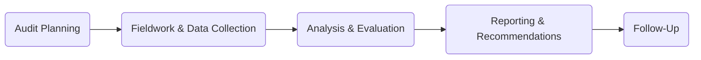

## 18.3 Other Specialized Governmental Engagements

In addition to financial and Single Audits covered in previous sections, governmental entities often require a range of specialized engagements. The scope of these engagements may extend beyond financial statement assurance and single audit compliance to focus on policy outcomes, operational effectiveness, efficiency, as well as unique compliance issues. These specialized audits, often mandated by regulatory requirements or legislative bodies, require auditors to have both a firm understanding of governmental standards—particularly as outlined by Government Auditing Standards (the “Yellow Book”)—and specialized training tailored to each engagement’s objectives and criteria.

This section provides a broad overview of specialized governmental auditing engagements commonly encountered by auditors working with federal, state, or local agencies. We discuss key performance audit requirements, state and local department audits, compliance engagements not covered by Single Audits, and program-specific reviews mandated by federal and state agencies. By understanding these specialized engagements in detail, auditors can effectively address the unique challenges, regulatory frameworks, and stakeholder expectations that accompany each type of audit.

---

## 18.3.1 Performance Audits

### Purpose and Scope
Performance audits primarily focus on evaluating whether government programs, operations, or activities are achieving their objectives effectively and efficiently, and in compliance with relevant laws and regulations. Unlike financial statement audits, which concentrate on financial reporting accuracy, performance audits explore broader questions such as:
• Are programs meeting policy goals and legislative intent?  
• Are resources being used economically, without waste or mismanagement?  
• Are internal controls adequately designed to support operational effectiveness?  

### Standards and Methodologies
Performance audits are executed in accordance with Generally Accepted Government Auditing Standards (GAGAS), often referred to as the Yellow Book. Key considerations include:
1. Planning and Project Management: Auditors develop detailed audit plans, perform stakeholder interviews, and gather background information on the program’s structure, objectives, and history.  
2. Data Collection and Analysis: Effective performance audits require robust datasets, interviews, observation, and documentary evidence supporting an assessment of program outcomes and efficiency.  
3. Reporting and Recommendations: Engagement results include not only findings and conclusions but also actionable recommendations for improvement. These recommendations often address policy, procedural, or operational modifications required to enhance public trust and accountability.

Auditors engaged in performance audits must balance investigative rigor with a sound understanding of:
• Organizational structures and policies.  
• Applicable regulations and performance metrics.  
• Analytical methods, including cost-benefit analysis, trend analysis, or benchmarking.  

### Common Objectives in Performance Audits
• Evaluating program effectiveness: Determining if programs are achieving intended results.  
• Assessing operational efficiency: Identifying potential cost savings or streamlined processes.  
• Monitoring compliance: Ensuring adherence to relevant statutes, regulations, or program guidelines.  

Below is a simplified visual overview of the performance audit process:

- Audit Planning: Define scope, objectives, and methodologies.  
- Fieldwork & Data Collection: Gather evidence, conduct interviews, perform observations.  
- Analysis & Evaluation: Use metrics and investigative approaches to interpret findings.  
- Reporting & Recommendations: Relay conclusions and improvement suggestions to stakeholders.  
- Follow-Up: Evaluate implementation of recommendations in subsequent engagements.

Performance audits can significantly enhance public sector accountability by shedding light on areas of potential improvement or by affirming that best practices are already in place.

---

## 18.3.2 Audits of State/Local Departments

### Unique Reporting Frameworks
Audit engagements with state and local departments frequently combine elements of financial, compliance, and operational reviews. Although the Yellow Book serves as a baseline for auditing standards, individual states often develop additional requirements or adopt alternative frameworks. For instance, a state might have its own statutory auditing guidance or specify unique attestation requirements for targeted programs (e.g., highway construction funds, public healthcare initiatives, or school districts).

### Key Areas of Focus
1. Budget Adherence: Determining whether approved budgets align with expenses and if budgetary controls are functioning properly.  
2. Use of Taxpayer Funds: Verifying that taxpayer revenue is being directed and allocated as legislated or promised by government authorities.  
3. Program Output and Outcomes: Evaluating results of government services and programs to ensure they meet constituents’ needs.  
4. Determining Compliance with Specific State Regulations: Verifying compliance with local ordinances, procurement regulations, and legislative mandates.

### Challenges and Best Practices
• Varying Regulatory Landscape: Multiple layers of local legislation can complicate compliance testing.  
• Stakeholder Expectations: Local communities, legislatures, and executive agencies may each have unique reporting preferences.  
• Public Transparency: Findings are often reported publicly, increasing scrutiny and the necessity for clear, comprehensible reports.

Auditors performing state or local audits should maintain strong lines of communication with departmental management to clarify scope and expectations. Thorough planning and continuous coordination help ensure timelines and reporting obligations are met.

---

## 18.3.3 Compliance Engagements Beyond the Single Audit

### When Compliance Engagements Arise
Not all governmental or grant-funded engagements meet monetary thresholds or structural requirements to necessitate a Single Audit (commonly required under the Uniform Guidance for large-scale federal expenditures). Nevertheless, certain legislative acts, regulations, or competitive grants still require independent verification of compliance, especially when:
• Specific risk factors are identified in a program, indicating a higher likelihood of misappropriation or noncompliance.  
• Known deficiencies from prior audits need targeted follow-up.  
• The granting agency, oversight body, or legislation mandates a separate compliance report.

### Structure of These Engagements
Compliance engagements typically adhere to GAGAS but may reference specialized regulations or frameworks from federal or state agencies. The auditor often issues:
• An opinion or conclusion on compliance with established criteria.  
• Report on internal controls over compliance when relevant.  
• Recommendations to address any identified departures from compliance.

### Reporting Requirements
These reports differ from standard Single Audit reporting. Instead of multiple federal programs or a major program focus, compliance engagements might only address specific regulations, discrete grant requirements, or targeted operational areas. In some instances, clients request a compliance attestation engagement solely to demonstrate adherence to regulations or internal policies for external stakeholders.

---

## 18.3.4 Program-Specific Reviews

### Purpose
Certain federal or state agencies, such as the Department of Housing and Urban Development (HUD) or U.S. Department of Agriculture (USDA), require direct or specialized reviews for grant programs under their jurisdiction. For instance, a housing authority receiving HUD funds may be subject to a HUD-specific audit covering:
• Project-based vouchers usage.  
• Tenant eligibility verification and rental calculations.  
• Compliance with capital fund programs.

Similarly, school districts participating in the USDA’s National School Lunch Program could have specialized compliance engagements to verify meal counts, eligibility processes, and use of federal reimbursements.

### Tailoring the Audit Methodology
Program-specific audits or reviews rely on:
• Agency-issued guidelines or manuals (e.g., HUD Handbook, USDA directives).  
• Targeted testing of beneficiary eligibility, program operations, and documentation.  
• Examination of unique performance metrics to ensure allowances are spent in pursuit of programmatic objectives.

Though narrower in scope than full Single Audits, the stakes can be high, as noncompliance could lead to significant financial or legal consequences for the entity. Thus, these reviews must be conducted rigorously, ensuring clear communication of findings with the awarding or oversight agency.

---

## Glossary

• **Performance Audit:** An engagement focusing on effectiveness, efficiency, and goal-pursuit, leveraging investigative and analytical approaches rather than only financial assertions.  
• **State/Local Departments:** Government and quasi-government organizations at sub-federal levels, often governed by specific legislative or regulatory requirements.  
• **Program-Specific Audit:** Audits that concentrate solely on one federal or state program’s finances and compliance (e.g., child nutrition programs).  
• **HUD (Department of Housing and Urban Development):** A federal agency whose programs (e.g., public housing, community planning) often mandate specialized auditing protocols.

---

## References and Additional Resources

• **Government Accountability Office (GAO)** – The “Yellow Book,” also known as Government Auditing Standards, provides guidelines for performance audits and other specialized engagements.  
  – Available at: https://www.gao.gov/yellowbook  
• **HUD Handbook** – Contains specific compliance and monitoring guides for housing programs.  
  – Available at: https://www.hud.gov/program_offices/administration/hudclips/handbooks  
• **USDA Guidance for Child Nutrition Programs** – Outlines reporting, recordkeeping, and compliance mandates for school-based meal programs.  
  – Available at: https://www.fns.usda.gov/cn  
• **Institute of Internal Auditors (IIA)** and **AICPA** – Offer continuing professional education courses, such as “Performance Auditing for Government,” covering advanced techniques in efficiency and compliance auditing.

---

## Quiz: Specialized Government Audits and Reviews



### A performance audit primarily focuses on:
- [x] Evaluating operational effectiveness and efficiency.
- [ ] Providing an opinion on the fairness of financial statements.
- [ ] Confirming whether a Single Audit threshold has been met.
- [ ] Auditing only capital expenditures in a federal program.

> **Explanation:** Performance audits delve into how well a program functions, ensuring operational effectiveness and efficiency, rather than expressing an opinion on financial statements.

### In addition to the Yellow Book, audits of state/local departments may require adherence to:
- [x] Individual state or municipal auditing standards.
- [ ] Only PCAOB standards.
- [ ] IFRS-based state regulations.
- [ ] A universal framework applying to all U.S. departments.

> **Explanation:** Some states and localities develop their own statutes or standards, adding layers to the normally used Yellow Book guidance.

### A key goal of compliance engagements outside the Single Audit threshold is:
- [x] Verifying that specific regulations or grant conditions have been met.
- [ ] Determining whether the program meets the major program threshold.
- [ ] Providing an unqualified opinion on the entity’s financial statements.
- [ ] Eliminating the need to review internal controls.

> **Explanation:** Compliance engagements focus on assessing adherence to specified legal or grant-related requirements, even if the Single Audit threshold is not reached.

### Which of the following best describes a program-specific review?
- [ ] A broad financial statement audit for an entire city government.
- [x] An audit focusing on a single program’s finances and compliance.
- [ ] A comprehensive review of all grant programs within an organization.
- [ ] A private sector operational audit with no regard for Yellow Book standards.

> **Explanation:** Program-specific reviews concentrate on the financial and compliance aspects of a single program.

### In specialized governmental audits, performance audits often include:
- [x] Cost-benefit analyses and the use of detailed metrics.
- [ ] Parallel audits of every department in the organization.
- [ ] Exclusive focus on capital asset verification.
- [ ] Minimal stakeholder engagement or interviews.

> **Explanation:** Performance audits rely on in-depth investigative and analytical methods, such as cost-benefit analyses or benchmarking, to evaluate a program’s efficiency and effectiveness.

### A budget adherence review in a state/local department audit may encompass:
- [x] Comparing actual expenditures to the authorized amounts.
- [ ] Reviewing only revenue recognition per GAAP standards.
- [ ] Ensuring IFRS compliance.
- [ ] Confirming internal control frameworks are identical across all states.

> **Explanation:** These audits often check if expenditures follow legislatively approved budgets, comparing planned vs. actual spend.

### When specialized reviews involve HUD programs, auditors typically reference:
- [x] The HUD Handbook and related federal regulations.
- [ ] Only PCAOB standards.
- [ ] The USDA’s guidelines for child nutrition.
- [ ] The Department of Defense compliance manual.

> **Explanation:** HUD requires compliance with its own handbook and relevant federal regulations, aligning with overall Yellow Book standards when appropriate.

### What is a primary element of performance audit reporting?
- [x] Recommendations for improvement.
- [ ] Only a statement that the financial statements are fairly presented.
- [ ] Analysis of IFRS-based depreciation models.
- [ ] A monthly newsletter summarizing city hall meetings.

> **Explanation:** Performance audits conclude with specific recommendations for improvement, addressing issues found during the engagement.

### Compliance engagements beyond Single Audits are often triggered by:
- [x] Legislative demands or specific grant requirements below the Single Audit threshold.
- [ ] The internal control framework alone.
- [ ] A uniform requirement for all large public companies.
- [ ] Real-time auditing in multinational corporations.

> **Explanation:** Some programs or agencies may require compliance reviews even when total expenditure is below Single Audit thresholds, often spurred by regulation or specific demands.

### A performance audit:
- [x] Focuses on operational results, efficiency, and effectiveness.
- [ ] Aims solely to assess the fairness of financial statements.
- [ ] Requires no compliance testing at all.
- [ ] Only applies to for-profit private entities.

> **Explanation:** Performance audits emphasize the efficient attainment of objectives and outcomes, as opposed to purely financial statement assurance.



---

## For Additional Practice and Deeper Preparation

**[Auditing & Attestation CPA Mock Exams (AUD): Comprehensive Prep](https://www.udemy.com/course/aud-cpa-mock-exams/?referralCode=D064EF7BD4A84FC6403D)**  
• Tackle full-length mock exams designed to mirror real AUD questions—from risk assessment and ethics to internal control and substantive procedures.  
• Refine your exam-day strategies with detailed, step-by-step solutions for every scenario.  
• Explore in-depth rationales that reinforce understanding of higher-level concepts, giving you a decisive edge on test day.  
• Boost confidence and reduce exam anxiety by building mastery of the wide-ranging AUD blueprint.  

_Disclaimer: This course is not endorsed by or affiliated with the AICPA, NASBA, or any official CPA Examination authority. All content is created solely for educational and preparatory purposes._
