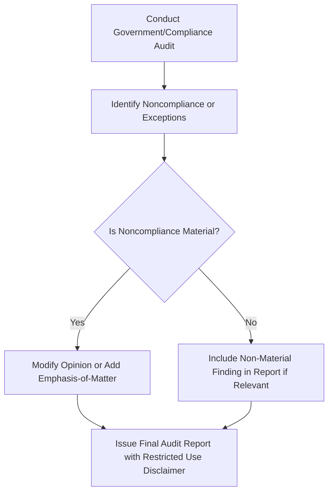

## 18.4 Restricted Use Reports and Compliance with Laws and Regulations

In governmental audits and other specialized engagements, auditors often face unique requirements regarding how and to whom their reports are distributed. Restricted use reports address specific bodies—such as legislative committees or regulatory agencies—and include cautions that the reports are not intended to be used by broader or unintended audiences. Additionally, auditors conducting governmental or compliance-focused engagements must remain vigilant about identifying, reporting, and addressing instances of material noncompliance or illegal acts.

This section will discuss (1) the nature and purpose of restricted use disclaimers, (2) the importance of reporting material noncompliance or suspected fraud, and (3) other communication requirements when dealing with potential illegal acts or confidentiality constraints. The goal is to help auditors navigating governmental and specialized engagements appreciate and fulfill their unique responsibilities under the relevant standards and regulations.

-------------------------------------------------------------------------------

### 1. Restricted Use Disclaimers

Auditors in governmental and compliance engagements frequently issue reports with a “restricted use” disclaimer. These disclaimers explicitly limit the distribution of the auditor’s report to specific agencies, regulatory bodies, or legislative committees and clarify that the report is not suitable for other individuals or broader audiences.

Restricted use statements commonly appear in the following scenarios:  
• When an auditor is engaged by a governmental entity to report findings solely to a funding agency, inspector general’s office, or legislative committee.  
• When the scope of the auditor’s procedures is defined by a contract or statute that limits distribution of the report.  
• When certain proprietary or confidential information must remain within specific government channels.  

Under the AICPA’s AU-C Section 905, “Alert That Restricts the Use of the Auditor’s Written Communication,” auditors must:  
• Clearly identify the intended users (e.g., specific regulatory agencies, oversight committees).  
• Explain that the report is not intended to be used by anyone other than the specified parties.  
• Provide a concise basis for the restriction.  

A properly worded restricted use alert helps avoid misunderstandings by clarifying that the report’s content may not be suitable for other contexts or decision-making needs.

-------------------------------------------------------------------------------

### 2. Reporting Material Noncompliance

In governmental audits (including those performed under Government Auditing Standards or Single Audit requirements), the auditor must assess and communicate instances of material noncompliance or suspected fraud:  

• **Definition of Material Noncompliance**: Noncompliance that could significantly affect the financial statements or the entity’s operations to the extent that it potentially alters user conclusions.  

• **Obligation to Inform**: If the auditor identifies noncompliance, they should evaluate the severity—both quantitative (e.g., monetary amounts involved) and qualitative (the nature of the noncompliance). If deemed material, the auditor typically includes the finding in their report and considers whether an opinion modification or emphasis-of-matter paragraph is warranted.  

• **Fraud vs. Noncompliance**: Although fraud involves intentional misrepresentation, noncompliance may also include oversights, regulatory breaches, or the misuse of restricted funds. Either can be grounds for reporting obligations under governmental audits.  

• **Implications for the Auditor’s Opinion**:  
  - If the noncompliance fundamentally affects the reliability of the financial statements, the auditor may need to issue a qualified or adverse opinion.  
  - If the noncompliance is pervasive and remains uncorrected, a disclaimer of opinion might be necessary.  
  - Where noncompliance exists but is not determined to be material, the auditor may include an emphasis-of-matter paragraph or a separate finding in the report.  

-------------------------------------------------------------------------------

### 3. Other Communication Requirements

Beyond the direct reporting of material noncompliance, some governmental audits may also demand more explicit communication protocols for suspected illegal acts:

• **Immediate Notification**: Certain statutes or regulations specify that suspected illegal acts must be reported immediately to an oversight agency, such as an inspector general’s office. For instance, the U.S. Department of Defense, Department of Health and Human Services (HHS), and other federal departments maintain inspector general offices with stringent reporting mandates.  

• **Confidentiality Considerations**: In deciding how to report potentially illegal acts, the auditor must balance professional confidentiality with legal and ethical obligations. Some engagements may involve explicit waivers of confidentiality or require immediate disclosure to designated authorities, possibly superseding client-auditor privilege.  

• **Whistleblower Protections**: Government audits often occur within a framework of whistleblower statutes that protect individuals who report wrongdoing. Auditors should be aware of these legal shields to guide clients or staff who may have knowledge of fraud or noncompliance.  

• **Standards Reference**:  
  - **GAO** guidelines often impose additional obligations on the auditor to ensure that suspected fraud is communicated to specific authorities.  
  - **AICPA**: Guidance on confidentiality and whistleblower considerations is provided in the AICPA Code of Professional Conduct as well as specialized governmental auditing standards.  

-------------------------------------------------------------------------------

### Mermaid Diagram: Restricted Use Report Journey

Below is a simple diagram illustrating the decision points an auditor may encounter when issuing a restricted use report and identifying material noncompliance in a governmental engagement.

In this flow:  
• If noncompliance or an exception is found, the auditor evaluates whether it is material.  
• If material, the auditor may modify the opinion or add an emphasis-of-matter paragraph.  
• Regardless of materiality, if the engagement scope or legislation requires restricted distribution, the report includes a restricted use disclaimer.  

-------------------------------------------------------------------------------

### 4. Glossary

• **Restricted Use Reports**: Communications intended only for specified parties (e.g., legislative committees, regulatory agencies) because of the scope and nature of the engagement.  
• **Material Noncompliance**: Instances of noncompliance that significantly affect the financial statements or operations of an entity and could alter the user’s decisions.  
• **Reporting Illegal Acts**: Additional reporting obligations common in governmental audits; suspected illegal acts often trigger immediate notifications to inspector general offices or other oversight bodies.  
• **Whistleblower**: An individual who comes forward with information about wrongdoing, protected under specific legal frameworks intended to shield them from retaliation.  

-------------------------------------------------------------------------------

### Practical Application: Case Study

Suppose an auditor is engaged by a state government department to review compliance with specific grant restrictions. During the engagement, the auditor discovers that a significant portion of the awarded funds was used for expenses unrelated to the grant’s purpose. Upon investigation, the auditor concludes this misuse is material. The proper course of action would include:

1. **Reporting This Noncompliance**: Documenting it in the audit findings and considering an opinion modification due to the potentially pervasive impact on the financial statements.  
2. **Restricted Use Disclaimer**: Because the engagement is under a legislative directive, the auditor would likely issue a disclaimer indicating that the report is intended exclusively for the legislative committee and not for full public distribution.  

This scenario highlights why auditors must be mindful of both the quantitative and qualitative significance of misused funds and how restricted use disclaimers help maintain clarity for readers not intended to rely on the specialized compliance report.

-------------------------------------------------------------------------------

### References and Additional Resources

1. **AICPA AU-C Section 905** – “Alert That Restricts the Use of the Auditor’s Written Communication”  
2. **Government Auditing Standards (GAO’s Yellow Book)** – Detailed requirements for addressing fraud, waste, and abuse in governmental audits  
3. **Inspector General Offices** – U.S. Department of Defense (DoD OIG), Department of Health & Human Services (HHS OIG), and other agencies’ specific directives  
4. **AICPA Code of Professional Conduct** – Guidance on confidentiality and whistleblower rules  
5. **GAO** – Standards for responding to fraud and other noncompliance found during governmental audits  

-------------------------------------------------------------------------------

## Master Your Knowledge of Restricted Use Reports and Compliance



### Which statement best describes a restricted use report?

- [x] A report intended only for specific parties due to its specialized scope 
- [ ] A report available for public viewing 
- [ ] Any report created for use by multiple stakeholders 
- [ ] A report summarizing only immaterial findings 

> **Explanation:** A restricted use report explicitly limits distribution to designated users (e.g., a governmental oversight committee) because the information may be unsuitable for broader readers.

### Under what circumstances should an auditor use a restricted use disclaimer?

- [ ] Whenever the report is more than 10 pages 
- [x] When a contract, statute, or the nature of findings necessitates limiting report distribution 
- [ ] When management prefers not to share key findings with external parties 
- [ ] Only when the auditor has identified fraud 

> **Explanation:** A restricted use disclaimer is employed when a report contains information intended solely for specified parties because it may not be appropriate for other audiences.

### If an auditor identifies material noncompliance during a governmental audit, which of the following is the most likely response?

- [x] Consider modifying the opinion or including an emphasis-of-matter paragraph 
- [ ] Exclude the noncompliance from the final audit report 
- [ ] Withhold issuance of the report until management corrects the issue 
- [ ] Only communicate the issue verbally to management 

> **Explanation:** Material noncompliance could necessitate modifying the audit opinion or highlighting it in an emphasis-of-matter paragraph. If significantly pervasive, an adverse or disclaimer of opinion might be warranted.

### In the context of governmental audits, what action might be required if an auditor suspects illegal acts?

- [x] Immediate reporting to the appropriate oversight agency or inspector general 
- [ ] Disclosure only to the board of directors 
- [ ] Delaying communication until the act is confirmed by legal proceedings 
- [ ] Omission from the audit report unless it impacts financial statement items 

> **Explanation:** Many statutes mandate that suspected illegal acts be reported promptly to relevant authorities, such as an inspector general’s office.

### How does an auditor handle confidentiality when required to report potential wrongdoing to a government oversight agency?

- [x] Assess whether legal or statutory provisions override professional confidentiality 
- [ ] Refuse to disclose any details about the illegal act 
- [x] Provide only minimal disclosure to avoid legal action 
- [ ] Seek management approval before informing any external party 

> **Explanation:** Auditor confidentiality can be impacted by governmental statutes that require immediate notification of suspected fraud or illegal acts. Legal obligations commonly trump standard confidentiality rules.

### What is the purpose of a “restricted use” alert within an audit that identifies compliance issues?

- [x] To prevent misinterpretation by users not intended to rely on the report 
- [ ] To highlight severe misconduct 
- [ ] To fulfill whistleblower requirements 
- [ ] To encourage the distribution of sensitive findings to the public 

> **Explanation:** A restricted use alert clarifies that the report is geared toward specific users and is not appropriate for other audiences who might misinterpret the findings.

### Which government body provides the Yellow Book standards regulating governmental audits?

- [x] The Government Accountability Office (GAO) 
- [ ] The Securities and Exchange Commission (SEC) 
- [x] The Federal Reserve Board 
- [ ] The AICPA 

> **Explanation:** The GAO issues Government Auditing Standards, commonly known as the Yellow Book, which govern audits of governments and some not-for-profit organizations.

### If an auditor performs an audit of a federal grant program, which of the following do they most likely need to include in the report?

- [x] A compliance section disclosing any instances of noncompliance 
- [ ] A separate internal memo evaluating whistleblower complaints 
- [ ] A management representation letter addressed to the audience 
- [ ] A KPI dashboard for successful program outcomes 

> **Explanation:** In governmental or Single Audits of federal programs, auditors typically prepare a section specifically addressing compliance (and internal control) findings.

### What is the primary difference between material and immaterial noncompliance?

- [x] Material noncompliance has a significant effect on financial statements or operations 
- [ ] Immaterial noncompliance must be reported to inspector generals 
- [ ] There is no difference in reporting requirements 
- [ ] Immaterial noncompliance triggers an immediate adverse opinion 

> **Explanation:** Material noncompliance is significant enough to impact user decisions and may require more explicit reporting or opinion modification, whereas immaterial noncompliance generally leads to less rigorous or different forms of disclosures.

### True or False: Whistleblower protections in governmental audits typically do not play a role in an auditor’s reporting obligations.

- [x] False
- [ ] True

> **Explanation:** Whistleblower protections can be central to an auditor’s obligations; individuals who come forward with knowledge of wrongdoing are often safeguarded by these legal provisions, influencing how auditors handle the reporting process.



-------------------------------------------------------------------------------

## For Additional Practice and Deeper Preparation

**[Auditing & Attestation CPA Mock Exams (AUD): Comprehensive Prep](https://www.udemy.com/course/aud-cpa-mock-exams/?referralCode=D064EF7BD4A84FC6403D)**  
• Tackle full-length mock exams designed to mirror real AUD questions—from risk assessment and ethics to internal control and substantive procedures.  
• Refine your exam-day strategies with detailed, step-by-step solutions for every scenario.  
• Explore in-depth rationales that reinforce understanding of higher-level concepts, giving you a decisive edge on test day.  
• Boost confidence and reduce exam anxiety by building mastery of the wide-ranging AUD blueprint.

_Disclaimer: This course is not endorsed by or affiliated with the AICPA, NASBA, or any official CPA Examination authority. All content is created solely for educational and preparatory purposes._
