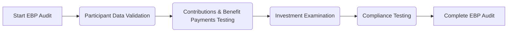

## 19.3 EBP-Specific Audit Procedures

Employee Benefit Plan (EBP) audits involve a unique set of considerations and compliance requirements that extend beyond a standard corporate audit. Whether you are auditing a 401(k), 403(b), defined benefit pension plan, or any other employer-sponsored plan, specialized audit procedures help ensure that participant data is accurate, contributions and benefit payments align with applicable regulations, investments are properly valued, and the plan complies with the Employee Retirement Income Security Act of 1974 (ERISA) and Department of Labor (DOL) requirements. This section explores essential EBP-specific audit procedures and provides practical insights to help external auditors handle these plans effectively.

---

### 1. Participant Data Validation

One of the most critical aspects of an EBP audit is verifying that participant data is accurate and complete. Inaccurate participant data can directly impact contribution amounts, benefit calculations, and overall plan compliance. 

1. **Testing Participant Eligibility**  
   • Examine key eligibility criteria (minimum age, service requirements) stated in plan documents.  
   • Verify that new entrants into the plan meet necessary service and age requirements.  
   • Ensure that employees excluded from the plan truly do not meet eligibility requirements (e.g., part-time restrictions).

2. **Validating Contribution Rates and Vesting Schedules**  
   • Confirm that each participant’s deferral elections align with the authorized amounts in payroll records and election forms.  
   • For employer contributions subject to vesting schedules, verify that participants are credited with the correct number of years of service.  
   • Check that vested percentages applied to participant balances are consistent with plan provisions.

3. **Benefit Calculations**  
   • For defined benefit plans, review actuarial reports to confirm that computations are based on accurate participant earnings and service histories.  
   • For defined contribution plans, validate that employer matches or profit-sharing contributions are allocated according to plan documents.  
   • Recalculate selected benefit distributions to test the mathematical accuracy and compliance with plan formulas.

4. **Inspection of Payroll Records and HR Files**  
   • Select a sample of participants and compare plan data to payroll records (e.g., wages, hours worked).  
   • Ensure that changes in employees’ status (new hires, terminations, promotions) are updated promptly in the plan’s records.

#### Practical Example: Participant Eligibility Testing
Consider a 401(k) plan that allows participation after completing one year of service. The auditor selects a random sample of 20 employees hired within the previous 18 months. By reviewing HR records and timekeeping systems, the auditor confirms that each individual who enrolled in the plan indeed surpassed one full year of service. The auditor also verifies that individuals excluded from the plan, such as part-time employees working fewer than 1,000 hours in the year, meet valid exclusion criteria.

---

### 2. Contributions and Benefit Payments

Since plan contributions come from both employer and employee sources, ensuring the accuracy and timeliness of these amounts is essential. Benefit payments—whether in the form of loans, distributions, or annuity payouts—must also adhere to plan documents and regulatory requirements.

1. **Confirming Contributions from Employees (Deferrals)**  
   • Inspect payroll registers and confirm that deferral amounts match the percentages or dollar amounts elected by participants.  
   • Trace a sample of deferral amounts to the plan’s trust or custodial account to ensure proper, timely deposit.  
   • Review evidence of timeliness, as ERISA mandates prompt remittance (generally within a few days for most small plans).

2. **Employer Matches and Other Contributions**  
   • Confirm that employer contributions (match or profit-sharing) agree with plan provisions and any relevant board approvals or corporate resolutions.  
   • Verify that the timing of such contributions aligns with plan rules and regulatory deadlines.

3. **Benefit Distributions and Loans**  
   • Evaluate distribution requests and verify that they are properly authorized and calculated in accordance with the plan’s vesting and distribution provisions.  
   • For hardship withdrawals, confirm that documentation supports participants’ financial needs in accordance with IRS guidelines and that amounts withdrawn do not exceed limits.  
   • Check loan agreements and repayment provisions to ensure compliance with plan policies, including any required interest rates or repayment schedules.

#### Practical Example: Testing Loan Provisions
A participant takes out a $10,000 loan from their 401(k) account. The auditor reviews the participant’s file to ensure the plan allows for loans and that the loan amount does not exceed IRS limits (e.g., 50% of the participant’s vested account balance or $50,000, whichever is smaller). The auditor then verifies that the participant’s payroll deductions correctly apply the repayment schedule, with interest, to repay the loan in five years or less.

---

### 3. Investments

Employee benefit plans often hold multiple types of investments, ranging from mutual funds and stable value funds to employer securities and alternative assets. Depending on whether the audit is limited-scope or full-scope under DOL regulations, the auditor’s required procedures can vary significantly.

1. **Limited-Scope Audit Considerations**  
   • If the plan elects a limited-scope audit, the auditor can rely on a certification from a qualified institution (e.g., bank or insurance carrier) for the value of plan investments.  
   • However, the auditor must still read the certified investment information, ensure it is prepared by a qualified institution, and reconcile the amounts with the plan’s financial statements.

2. **Full-Scope Audit Requirements**  
   • For a full-scope audit, the auditor performs detailed testing of valuation, existence, and ownership of plan assets.  
   • Complex or alternative investments (e.g., real estate, private equity) may require a specialist’s valuation.  
   • Verify that investments are recorded at fair value in accordance with the applicable financial reporting framework, typically using observable market data where available.

3. **Fair Value and Disclosures**  
   • Confirm the classification of investments in the fair value hierarchy (Level 1, Level 2, Level 3) and review disclosures for completeness.  
   • Carefully examine any footnotes describing the plan’s investment policies, valuation methods, and related party transactions.

#### Practical Example: Alternative Investments Valuation
A plan invests in a private equity fund that issues quarterly statements of net asset value (NAV). The auditor examines the fund’s most recent audited financial statements, inquiries about the investment manager’s valuation approach, and obtains independent pricing if available. The auditor may engage a valuation specialist to assess the reasonableness of the NAV supporting the plan’s recorded value.

---

### 4. Compliance Testing

Under ERISA, plan sponsors must comply with various rules intended to protect participants and plan assets. Auditors should perform tests that address both the letter and spirit of these regulations.

1. **Timeliness of Contributions**  
   • Review the timing of employee deferrals from the payroll dates to the dates funds are deposited into the plan’s account.  
   • Delays beyond a few days can be viewed as prohibited transactions if participants lose investment earnings on amounts that were not deposited timely.

2. **Prohibited Transactions**  
   • Evaluate whether plan assets have been used for any purpose other than paying plan benefits or legitimate administrative expenses.  
   • Inspect transactions with related parties (plan sponsor, fiduciaries) to ensure they comply with DOL regulations.

3. **Plan Document Requirements**  
   • Inspect amendments and restatements of the plan and ensure those changes are accurately reflected in operational practices.  
   • Verify that the plan sponsor has filed necessary forms and disclosures with the IRS and DOL (e.g., Form 5500).

#### Practical Example: Late Deposit of Employee Deferrals
During testing, the auditor discovers that employee deferrals were deposited into the plan’s trust account an average of 15 business days after payday. Because ERISA mandates timely deposits (often required within 7 business days or less for small plans), this delay could be deemed a prohibited transaction. The auditor documents the findings, discusses them with management, and may suggest management consult with ERISA counsel to correct the issue.

---

**Figure 19.3.1 – Overview of EBP-Specific Audit Steps**  
This flowchart illustrates the high-level process for EBP-specific audit procedures, starting with participant data validation and proceeding systematically through contributions, investments, and compliance testing.

---

## Glossary

• **Participant Eligibility**: The requirements (e.g., minimum age, length of service) individuals must fulfill to enroll in the plan.  
• **Hardship Withdrawals**: Early distributions from a defined contribution account granted under specific financial hardship conditions, as defined by IRS guidelines.  
• **Prohibited Transactions**: Transactions between a plan and disqualified persons (e.g., employers, fiduciaries) that violate ERISA rules, such as using plan assets in a manner that benefits the plan sponsor over participants.

---

## References and Resources

• **AICPA “Audit and Accounting Guide: Employee Benefit Plans”** – Comprehensive guidance on plan audits, with detailed chapters covering participant data, investments, and compliance concerns.  
• **DOL “Field Assistance Bulletins”** – Official bulletins clarifying common EBP compliance issues and providing practical implementation guidance.  
• **Accounting CPE Providers (Advanced EBP Engagements)** – Courses discussing specialized plan structures such as Employee Stock Ownership Plans (ESOPs) and 403(b) plans for nonprofit entities.

---

## EBP-Specific Audit Procedures Practice Quiz



### Which procedure is essential in validating participant data accuracy?

- [x] Comparing HR files, payroll records, and plan documents for consistency
- [ ] Reviewing vendor invoices for administrative fees
- [ ] Verifying internal control questionnaires from the previous auditor
- [ ] Inspecting unrelated corporate tax documents

> **Explanation:** Validating participant data involves ensuring that eligibility, contributions, and vesting information in the plan records match source documents such as HR files and payroll data.

### In a 401(k) plan, which of the following is a primary concern when auditing plan contributions?

- [x] Prompt remittance of employee deferrals into the plan
- [ ] Reporting corporate taxes correctly
- [ ] Ensuring board members are paid on time
- [ ] Verifying marketing expenses are minimized

> **Explanation:** For EBP audits, it is crucial to confirm that employee deferrals are deposited on time, as delays may result in ERISA violations and potential prohibited transactions.

### Under what condition can an auditor rely on a limited-scope certification for investment balances?

- [x] When the certification is issued by a qualified institution (bank or insurance company)
- [ ] When the plan sponsor’s CFO provides a written confirmation
- [ ] When the SEC issues an unqualified opinion on the institution
- [ ] When the auditor has full-scope testing results on hand

> **Explanation:** Limited-scope audits allow the auditor to rely on a certification from a qualified institution. The qualification must meet Department of Labor regulations for the reliance to be valid.

### How should an auditor typically address a plan’s complex or alternative investments in a full-scope audit?

- [x] Engage or consult with a specialist to determine fair values
- [ ] Exclude these investments from the scope
- [ ] Assume they are immaterial and bypass testing
- [ ] Only accept the client’s valuation without verification

> **Explanation:** Complex investments may require specialized valuation expertise. Engaging a valuation specialist helps gain reasonable assurance regarding fair value measurements.

### Which of the following best describes a prohibited transaction?

- [x] Using plan assets to pay the mortgage of the plan sponsor’s building
- [ ] Timely depositing employee contributions into the plan
- [x] Loaning plan assets to a disqualified person without regard for interest or repayment
- [ ] Properly allocating plan administrative fees

> **Explanation:** Prohibited transactions occur when plan assets benefit the plan sponsor or other disqualified persons over participants, such as using plan funds for personal or corporate needs.

### What is the main reason to recalculate a sample of benefit distributions?

- [x] To confirm mathematical correctness and consistency with plan terms
- [ ] To verify that marketing expenses are offset
- [ ] To ensure participants do not receive advice on tax planning
- [ ] To gather data for operational budgeting

> **Explanation:** Recalculation ensures that the plan properly applies vesting schedules, benefit formulas, and plan provisions, preventing underpayments or overpayments.

### When examining participant loan provisions, which is the most critical concern?

- [x] Verifying that loan amounts and terms comply with IRS limits
- [ ] Reviewing tax basis adjustments
- [x] Confirming that only management can receive plan loans
- [ ] Inspecting group insurance contracts

> **Explanation:** Participant loans must adhere to IRS rules regarding maximum loan amounts and repayment terms. Ensuring compliance protects the tax-advantaged status of the plan.

### Why is the timeliness of employee deferrals into the plan so important?

- [x] Late deposits can be considered prohibited transactions and result in loss of earnings for participants
- [ ] Early deposits generate negative audit opinions
- [ ] Deposits are irrelevant to the participants’ benefit calculations
- [ ] Delayed deposits help increase the sponsor’s net income

> **Explanation:** If contributions are not remitted promptly, participants may lose investment earnings, and the plan sponsor may face penalties under ERISA guidelines.

### Which step is most relevant for validating plan compliance with ERISA’s fiduciary standards?

- [x] Reviewing transactions with related parties to detect prohibited activities
- [ ] Ensuring the plan uses the same auditors every year
- [ ] Confirming participants are offered after-tax benefits
- [ ] Verifying all participants have access to free financial advice

> **Explanation:** ERISA’s fiduciary standards prohibit certain transactions with related or disqualified parties. Reviewing these transactions helps ensure compliance and protect plan assets.

### True or False: An auditor must ensure that EBP operational practices strictly follow the current plan document provisions.

- [x] True
- [ ] False

> **Explanation:** Auditors must confirm that plan operations align with the written plan document. Any deviation can jeopardize the plan’s qualified status and lead to compliance violations.



---

## For Additional Practice and Deeper Preparation

**[Auditing & Attestation CPA Mock Exams (AUD): Comprehensive Prep](https://www.udemy.com/course/aud-cpa-mock-exams/?referralCode=D064EF7BD4A84FC6403D)**  
• Tackle full-length mock exams designed to mirror real AUD questions—from risk assessment and ethics to internal control and substantive procedures.  
• Refine your exam-day strategies with detailed, step-by-step solutions for every scenario.  
• Explore in-depth rationales that reinforce understanding of higher-level concepts, giving you a decisive edge on test day.  
• Boost confidence and reduce exam anxiety by building mastery of the wide-ranging AUD blueprint.

_Disclaimer: This course is not endorsed by or affiliated with the AICPA, NASBA, or any official CPA Examination authority. All content is created solely for educational and preparatory purposes._
