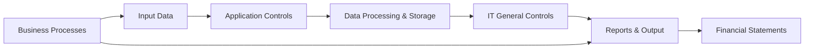

## 20.1 IT Auditing Fundamentals

As businesses rely increasingly on technology, the role of an IT auditor expands the traditional boundaries of manual audits to encompass the complex realm of digital systems. Modern auditing requires combining an understanding of financial processes with technical expertise to ensure that automated controls are effectively designed and operating as intended. This chapter explores the key principles of IT auditing, focusing on the objectives, common frameworks, and practical techniques auditors use to evaluate technology risks and financial statement implications.

---

### 1. The Expanding Scope of IT Auditing

Historically, external auditing focused on manual processes, physical records, and standardized testing of transactions. Although many of these foundational auditing principles still apply, the modern audit environment is vastly different. From enterprise resource planning (ERP) systems that process inventory transactions to cloud-based services hosting financial applications, technology is deeply interwoven into nearly every financial statement cycle.

#### 1.1 Why IT Auditing Matters

1. Potential Material Misstatements: Where data flows through complex systems, small inaccuracies can compound, leading to significant misstatements in financial statements.  
2. Regulatory Compliance: Frameworks such as Sarbanes-Oxley (SOX) and the Payment Card Industry Data Security Standard (PCI DSS) require strict controls over financial and sensitive information.  
3. Cybersecurity Threats: Ransomware, data breaches, and hacking attempts can disrupt operations and compromise data integrity. Auditors need to assess whether controls are adequate to prevent or detect these threats.  
4. Operational Efficiency: As automation and data analytics grow, the ability to safeguard these systems becomes synonymous with preserving financial accuracy.

---

### 2. Overview of IT Audit Objectives

IT auditors assess not only financial statements but also the controls that safeguard data and systems. A common set of core objectives drives IT audits:

1. **Confidentiality**: Sensitive data should be accessible only to authorized individuals.  
2. **Integrity**: Data should remain complete, accurate, and free from unauthorized modification.  
3. **Availability**: Systems and data should be accessible to authorized users when needed.

This is frequently referred to as the CIA triad of information security. In addition, **completeness** and **accuracy** are critical in a financial statement context. Auditors verify that every transaction is captured (completeness) and correctly recorded (accuracy).

---

### 3. Mapping IT to Financial Statement Cycles

Just as a financial audit maps significant accounts and transactions to risks, the IT audit process identifies systems, applications, and data flows that support those accounts. Key systems often include:

• General Ledger (GL) packages like Oracle Financials or SAP  
• Accounts Payable and Accounts Receivable systems  
• Inventory management and procurement modules  
• Payroll systems and HR databases  
• Reporting applications and decision-support tools

It is crucial for auditors to understand the architecture of each system to pinpoint potential vulnerabilities. This mapping typically involves reviewing network diagrams, databases, security configurations, and how data moves between applications.

---

### 4. IT General Controls (ITGCs)

**ITGCs** form the foundational layer of technology controls, supporting reliable operation of automated processes within the organization. These controls affect multiple applications and systems across an enterprise:

1. **Access Management**  
   - User provisioning: Ensuring that each user is assigned appropriate permissions aligned with job responsibilities.  
   - Password policies: Enforcing password complexity and change intervals.  
   - Privileged-user monitoring: Keeping track of administrators with elevated access and reviewing their actions regularly.

2. **Change Management**  
   - Request and Approval: Documented procedures for requesting and authorizing system or application changes.  
   - Testing and Rollout: Ensuring new changes are properly tested in a non-production environment before moving to production.  
   - Version Control: Keeping detailed logs on software versions to quickly troubleshoot issues and prevent unauthorized changes.

3. **Operations Management**  
   - Backup and Recovery: Established schedules for data backup and procedures for timely restoration.  
   - Incident Response: Frameworks to detect, respond to, and recover from anomalies, outages, or security breaches.  
   - Job Scheduling: Automated tasks (end-of-day financial processing, monthly closings) must be set up with proper monitoring to ensure successful completion.

When ITGCs are robust, confidence in the reliability of application-level controls increases. Conversely, weak ITGCs can undermine even well-designed application controls, as malicious or unauthorized changes to the system environment can go unnoticed.

---

### 5. Application Controls

**Application Controls** are embedded within specific software systems and aim to ensure the accuracy and completeness of transactions as they are processed. Examples include:

1. **Input Controls**  
   - Data validation checks: Prevent invalid entries (e.g., wrong dates or improperly formatted account numbers).  
   - Field-level security: Restrict who can update or view sensitive input fields.

2. **Processing Controls**  
   - Automated reconciliations: Compare totals (e.g., inventory movement against sales) to provide checks and balances.  
   - Exception reporting: Flag anomalies for management review, such as unusually large purchase orders.

3. **Output Controls**  
   - System-generated reports: Confirm data integrity by reconciling system output with independent records.  
   - Distribution restrictions: Ensure reports containing sensitive data reach only authorized personnel.

---

### 6. Risk-Based Scoping in IT Audits

Not all systems carry the same financial significance or risk of material misstatement. A **risk-based approach** to IT auditing ensures that resources are allocated to areas of highest impact:

1. **Identify Financial Relevance**: Determine which IT systems directly support material balances in the financial statements.  
2. **Evaluate Inherent and Control Risks**: Assess business processes, complexities, and system architectures that might pose a higher risk of errors or fraud.  
3. **Prioritize Testing**: Focus on critical applications (e.g., revenue, payroll) and significant transaction flows; consider historical control weaknesses or prior audit findings.  
4. **External Hosting Considerations**: Cloud-based and third-party hosted systems may require a thorough review of Service Organization Controls (SOC) reports from the hosting provider.

---

### 7. Gathering IT Audit Evidence

Auditors employ various techniques to collect evidence on the design and operating effectiveness of controls:

• **Reviewing System Documentation**: Evaluates system configuration, process narratives, and data flow diagrams to check for potential risks or control gaps.  
• **User Access Logs**: Examines who accessed the system, what actions were performed, and whether any unusual patterns suggest unauthorized activity.  
• **Change Tickets and Approvals**: Verifies that all system or application changes passed through a controlled, documented approval process.  
• **Reperformance of System Tasks**: Tests controls by attempting to replicate transactions, data entry, or system triggers to confirm that automated processes perform as designed.  
• **Interviews and Walkthroughs**: Gathers information from IT and finance personnel on how controls operate, cross-checking with procedures and system logs.

---

### 8. Practical Example: ITGC and Application Control in a Sales System

Consider a medium-sized retail organization named “TechGearCo.” They rely on an integrated sales solution (SalesAppX) that automatically captures orders from their e-commerce site and updates accounts receivable in the company’s ERP system.

1. **ITGC**:  
   • **Change Management**: TechGearCo uses a ticketing system to test and approve updates to SalesAppX before implementation.  
   • **Access Management**: Administrator rights to SalesAppX are restricted to two individuals, and password policies force frequent resets.  

2. **Application Controls**:  
   • **Input Controls**: The system only accepts 10-digit product codes and automatically rejects any entry not matching the code format.  
   • **Processing Controls**: Automated reconciliation matches the total dollar amount in the daily sales batch against accounts receivable records.  
   • **Output Controls**: An exception report flags any orders above a certain threshold for manager review.

By reviewing these ITGCs and application controls, the auditor ensures that sales data is accurately and completely captured, thus reducing the risk of material misstatements in the revenue account.

---

### 9. Common Pitfalls and Challenges

• **Overlooking Legacy Systems**: Older platforms may not have updated security controls, increasing the likelihood of unauthorized changes.  
• **Poor Documentation**: Inconsistent or outdated system narratives hinder the auditor’s ability to understand the flow of data.  
• **Rapid Cloud Adoption**: Moving systems off-premises can introduce complexities in verifying the hosting provider’s controls.  
• **Lack of IT Audit Expertise**: Financial auditors may lack the technical skills to evaluate system environments, underscoring the need for specialists.  
• **Underestimating Cybersecurity Threats**: A well-designed financial system can still be compromised if network and perimeter defenses are weak.

---

### 10. Best Practices and Strategies for Success

1. **Collaboration with IT and Security Teams**: Maintain an open dialogue with key personnel to understand how systems are configured and any ongoing changes or challenges.  
2. **Continuous Monitoring**: Use automated auditing tools and dashboards to detect anomalous transactions or system activities in near real-time.  
3. **Robust Documentation**: Keep system flowcharts, narratives, and procedure guidelines up-to-date.  
4. **Regular Training**: Audit and finance teams should stay abreast of emerging IT trends, cybersecurity developments, and evolving regulatory requirements.  
5. **Adoption of Established Frameworks**: Align internal control reviews with established standards like COBIT (Control Objectives for Information and Related Technology) or ISO/IEC 27001 to ensure comprehensive coverage.

---

### 11. Ethical Considerations in IT Auditing

IT auditors often encounter sensitive data, from personal financial details to strategic corporate information. Maintaining confidentiality, avoiding conflicts of interest, and ensuring objectivity are paramount. Auditors must:

• Comply with the AICPA Code of Professional Conduct regarding privacy and confidentiality.  
• Refrain from disclosing proprietary or personal data.  
• Assess potential biases if the firm provides consulting services on the same IT systems it audits (independence risk).

---

### 12. Regulatory and Institutional References

• **ISACA’s COBIT**: Offers detailed governance and management objectives for IT, widely referenced in IT audits.  
• **ISO/IEC 27001**: A global standard focusing on establishing, implementing, maintaining, and continually improving information security management systems.  
• **AICPA Audit Guides**: Provide guidance on how to evaluate IT controls within the context of financial audits.  
• **Security Guidelines** from national institutes (e.g., NIST in the U.S.) for cybersecurity and risk management best practices.

---

### Mermaid Diagram: Overview of IT Auditing Components

Below is a simplified visual of how IT General Controls and Application Controls interact with business processes and data flows:

• Boxes A, B, and C represent business process inputs and the application-level controls.  
• Boxes D and E depict data processing and safeguarding by IT general controls.  
• The final stage, Boxes F and G, illustrate the correlation to financial statement reporting.

---

### 13. Glossary

• **IT General Controls (ITGCs)**: Overarching controls that impact the entire IT environment, including change management, access security, and backup processes.  
• **Application Controls**: Automated checks or validations within a specific application or system, designed to ensure completeness and accuracy of data processing.  
• **Change Management**: Process governing how system changes are proposed, tested, approved, and implemented to prevent unauthorized or untested modifications.  
• **Confidentiality, Integrity, and Availability (CIA)**: The three core objectives for securing information systems against unauthorized access, modification, or disruption.  
• **COBIT**: A framework by ISACA for managing and governing enterprise IT.  
• **ISO/IEC 27001**: An international standard outlining requirements for an information security management system (ISMS).  

---

### Further Reading and Resources

• **ISACA: [www.isaca.org](https://www.isaca.org/)** – Offers standards, certifications (like CISA®), and practice guides for IT auditors.  
• **AICPA’s IT Audit Guidance** – Regularly updated to address emerging technologies in internal control over financial reporting.  
• **“Principles of Information Security” by Whitman and Mattord** – Comprehensive coverage of cybersecurity concepts.  
• **Coursera and edX** – Host numerous online courses on IT auditing, cybersecurity, and frameworks like ISO and COBIT.  
• **NIST Cybersecurity Framework** – Provides guidelines for improving the security, confidentiality, and resilience of critical infrastructure.

---

## Comprehensive IT Auditing Fundamentals Quiz



### Which of the following is a primary objective of IT auditing in a financial context?

- [x] Ensuring the confidentiality, integrity, and availability of data.
- [ ] Developing new software for the finance department.
- [ ] Eliminating all manual processes in the accounting cycle.
- [ ] Outsourcing all IT operations to a third party.

> **Explanation:** A fundamental goal of IT auditing is to ensure that data remains secure, accurate, and accessible (the CIA triad), helping prevent material misstatements and data breaches.

### Which framework is commonly referenced for enterprise IT governance and management?

- [x] COBIT
- [ ] GitHub
- [ ] SQL
- [ ] FTP

> **Explanation:** COBIT (Control Objectives for Information and Related Technology) is an ISACA framework that provides detailed governance and management objectives for IT environments.

### What is the primary purpose of IT General Controls (ITGCs)?

- [ ] To develop new ERP modules.
- [ ] To approve financial statements.
- [x] To support the reliability of applications and safeguard against risks in the IT environment.
- [ ] To remove all manual user inputs.

> **Explanation:** ITGCs encompass the essential layers of protection and oversight to ensure that all applications and systems within an organization run in a secure, consistent manner.

### Which of the following best describes change management in an IT environment?

- [x] A process for requesting, testing, approving, and implementing changes in systems and software.
- [ ] A system for granting unlimited access to all employees.
- [ ] A marketing strategy for introducing new campaigns.
- [ ] An informal process for random software updates.

> **Explanation:** Change management ensures that system modifications are documented, tested, and approved to reduce the risk of introducing errors or vulnerabilities.

### In a retail company IT environment, which control would be classified as an application control?

- [ ] Frequent backups of the company’s servers.
- [x] An input validation check preventing invalid product codes.
- [ ] Antivirus software for email servers.
- [x] An automated reconciliation that compares daily sales to accounts receivable records.

> **Explanation:** Application controls (e.g., input validation checks, automated reconciliations) are designed within a specific application to ensure accuracy and completeness of data.

### What is one of the key benefits of adopting a risk-based approach to IT audits?

- [ ] It requires audits on every single system in the organization equally.
- [x] It prioritizes testing and resources on areas most likely to lead to material misstatements.
- [ ] It eliminates the need for IT auditor expertise.
- [ ] It automatically guarantees an unqualified audit opinion.

> **Explanation:** A risk-based approach allocates audit efforts to the highest-risk areas, enhancing the efficiency and effectiveness of the overall audit.

### Which of the following is the overarching security model that focuses on protecting data from unauthorized access, alteration, and unavailability?

- [x] CIA (Confidentiality, Integrity, Availability)
- [ ] KPI (Key Performance Indicator)
- [ ] ROI (Return on Investment)
- [ ] ERP (Enterprise Resource Planning)

> **Explanation:** The CIA triad underpins all meaningful security measures, emphasizing data confidentiality, integrity, and availability.

### What is a potential pitfall when organizations rapidly adopt cloud services?

- [ ] Increased local server usage.
- [x] Difficulty verifying the effectiveness of third-party controls.
- [ ] Elimination of backup procedures.
- [ ] Lower cybersecurity risks.

> **Explanation:** When moving critical applications to the cloud, ensuring strong controls at the third-party provider is a top priority. SOC reports and onsite assessments can address this risk.

### Why is collaboration with IT and security teams crucial for auditors?

- [ ] To replace the need for financial audit tests.
- [ ] To conduct marketing campaigns.
- [x] To gain insights into system configurations and ongoing risks, supporting accurate risk assessments.
- [ ] To remove the separation of duties controls.

> **Explanation:** Auditors rely on specialized knowledge from IT and security personnel to understand system architectures and potential vulnerabilities, ensuring that the audit scope is properly defined.

### An auditor reviewing system access logs and verifying that updates were documented in change tickets is an example of:

- [x] Gathering IT audit evidence.
- [ ] Writing new software code.
- [ ] Eliminating segregation of duties.
- [ ] Performing a financial statement disclosure check.

> **Explanation:** Reviewing logs and change tickets is a common method of obtaining evidence about the operating effectiveness of IT controls.



---

## For Additional Practice and Deeper Preparation

**[Auditing & Attestation CPA Mock Exams (AUD): Comprehensive Prep](https://www.udemy.com/course/aud-cpa-mock-exams/?referralCode=D064EF7BD4A84FC6403D)**  
• Tackle full-length mock exams designed to mirror real AUD questions—from risk assessment and ethics to internal control and substantive procedures.  
• Refine your exam-day strategies with detailed, step-by-step solutions for every scenario.  
• Explore in-depth rationales that reinforce understanding of higher-level concepts, giving you a decisive edge on test day.  
• Boost confidence and reduce exam anxiety by building mastery of the wide-ranging AUD blueprint.

_Disclaimer: This course is not endorsed by or affiliated with the AICPA, NASBA, or any official CPA Examination authority. All content is created solely for educational and preparatory purposes._
