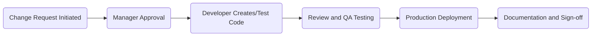

## 20.3 IT General Controls Testing and Documentation

Information Technology (IT) general controls (ITGCs) provide the foundational assurance that an organization’s systems and processes are secure, reliable, and meet the necessary auditing and compliance requirements. Strong ITGCs reduce the risk of material misstatements in financial reporting by ensuring that computer systems used to process, store, and communicate information are functioning correctly. These controls commonly include Access Management, Program Change Control, and Backup & Recovery, among other elements. In this section, we will explore key ITGC areas, discuss how auditors test and document each area, and highlight relevant best practices and emerging trends.

-------------------------------------------------------------------------------
### The Importance of IT General Controls

IT General Controls serve as the backbone for the broader information technology control environment. When well-designed, these controls mitigate the inherent risks in complex IT ecosystems. As businesses increasingly rely on technology for critical processes—ranging from financial transactions to data management—ensuring the reliability and security of these systems becomes essential. For auditors, effective ITGC testing and thorough documentation offer confidence that automated processes are working as intended, reducing the likelihood of financial reporting errors or fraud.

In many cases, ITGCs overlap and reinforce each other. For instance, a robust access management strategy supports secure program changes by ensuring that only authorized personnel deploy new code to production environments. Conversely, an effective change management process can limit the risk of unauthorized access by controlling which employees can release changes. Understanding these interdependencies helps auditors form a holistic view of an organization’s IT risk profile.

-------------------------------------------------------------------------------
## 1. Access Management

Access Management ensures that only authorized individuals have appropriate privileges to the organization’s systems and data. Poorly implemented or monitored access controls can lead to unauthorized transactions, data breaches, and even financial misstatements. The following elements are critical in assessing Access Management:

1.1 Password Policies  
• Complexity measures (minimum length, required character types).  
• Forced regular password changes (e.g., every 60–90 days).  
• Multi-factor authentication (MFA) for high-risk environments.  
• Lockout mechanisms after repeated failed login attempts.

1.2 User Provisioning  
• Procedures for creating and disabling user accounts.  
• Role-based or least-privilege assignments.  
• Timely termination of access when employees leave or change roles.  

1.3 Periodic Access Reviews  
• Frequent reviews of user access to ensure ongoing appropriateness.  
• Validation of access changes due to promotions, department transfers, or terminations.  

1.4 Testing Approach for Access Management  
• Select a representative sample of user accounts to verify alignment with approved roles.  
• Examine evidence (e.g., system logs, permission settings) to confirm that accounts for terminated employees have been removed promptly.  
• Review password configuration settings at the system level.  
• Investigate exceptions and unusual login attempts.  

-------------------------------------------------------------------------------
## 2. Program Change Control

Program Change Control is aimed at ensuring that changes to IT systems, applications, and underlying code follow a structured process from development to production. Weak or nonexistent change controls increase the risk of introducing unauthorized changes or untested modifications that can disrupt workflows, introduce new vulnerabilities, or distort financial data.

2.1 Change Ticket Process  
• Formal requests for system enhancements or bug fixes.  
• Approval from business owners and IT management.  
• Documented testing results before production deployment.

2.2 Segregation of Duties (SoD)  
• Limit developers’ direct access to the production environment.  
• Ensure that QA/testing teams and production support staff maintain distinct responsibilities.  

2.3 Testing Program Changes  
• Re-performance or walk-through of a sample of changes to confirm adherence to documented processes.  
• Verification of testing, approvals, and sign-offs.  
• Inspection of change logs to detect any unexpected modifications.  

2.4 Best Practices in Program Change Control  
• Automated change management tools to track requests, approvals, development tasks, and code reviews.  
• Clear responsibilities for each role—developer, tester, release manager—to avoid overlap and conflicts of interest.  

-------------------------------------------------------------------------------
## 3. Backup and Recovery

Effective Backup and Recovery plans are essential in safeguarding organizational data from unexpected events such as hardware failures, cyberattacks, or environmental disasters. These plans mitigate business continuity risks and financial reporting disruptions.

3.1 Backup Frequency and Integrity  
• Regular backups aligned with organizational needs and risk levels (e.g., daily, weekly).  
• Verification of backup integrity through periodic restoration tests.  
• Validation of successful backup completion (logs, notifications).

3.2 Secure Off-Site Storage  
• Off-site or cloud storage repositories for redundancy.  
• Encryption of backup media during storage and transit.  
• Physical security measures if using on-premises facilities for off-site backups.

3.3 Disaster Recovery Plan (DRP) Testing  
• Documentation of the procedures for restoring systems after catastrophic failures.  
• Annual or semi-annual DRP test (tabletop or live environment).  
• Analysis of test results to identify gaps and continuous improvement opportunities.

3.4 Testing Approach for Backup and Recovery  
• Obtain backup logs and restoration test results to confirm adherence to policies.  
• Inspect how backup data is stored and protected against unauthorized access.  
• Evaluate the relevance and timeliness of the organization’s DRP based on changes in business operations or technology landscape.  

-------------------------------------------------------------------------------
## 4. Documentation of IT General Controls

Documentation provides the audit trail that links an organization’s processes, approvals, and evidence, making it critical for demonstrating compliance. It also facilitates knowledge transfer among team members, especially in complex environments.

4.1 Flowcharts, Narratives, and Configuration Listings  
• Flowcharts visually capture the flow of data and control points.  
• Narratives thoroughly explain system processes and exceptions.  
• Configuration listings detail settings, version numbers, and other important attributes.

4.2 Indexing and Cross-Referencing  
• Each test document should be indexed for quick retrieval in the audit file.  
• Cross-referencing test steps to relevant control objectives ensures a clear audit trail.

4.3 Maintenance of Audit Files  
• Organize evidence in a centralized repository, applying version control where possible.  
• Follow best practices (e.g., AICPA guidance) on record retention.  
• Keep documents secure, especially those containing sensitive system details.

-------------------------------------------------------------------------------
## 5. Glossary

• **Access Review**: Periodic management verification that user accounts and permissions align with current job roles and responsibilities.  
• **Developer Segregation**: A policy preventing developers from directly modifying production code without oversight, ensuring separation of duties and reducing fraud or error risk.  
• **Disaster Recovery Plan (DRP)**: Documented procedures for restoring enterprise systems and data in the event of a catastrophic failure, tested regularly to validate effectiveness.

-------------------------------------------------------------------------------
## Real-World Illustrations and Mermaid Diagrams

Below is a simple diagram showing an overview of a typical change management process. This flow helps illustrate how a change ticket should progress from initiation to deployment:

• Step A: Request is initiated by an end-user or IT staff, capturing business needs or identified issues.  
• Step B: Change requests require formal manager approval before proceeding.  
• Step C: Developer works in a segregated development environment, creating or modifying code.  
• Step D: QA testing is performed, typically by a separate team.  
• Step E: Approved changes are deployed to production.  
• Step F: Documentation is updated with references to testing and approvals, closing the loop.

-------------------------------------------------------------------------------
## References and Additional Resources

• **COBIT**: A framework that offers in-depth objectives for IT processes. Notably, DSS02 (Manage Service Requests and Incidents) and DSS04 (Manage Continuity) outline procedures for maintaining control over changes and backups.  
• **Journal of Accountancy**: Perform a targeted search, e.g., “Auditing Program Change Controls,” on <https://www.journalofaccountancy.com/> for articles detailing best practices and case studies.  
• **ISACA’s CISA Certification Training**: Offers robust coverage of IT governance and controls, focusing on how to assess and proactively manage IT risks.  
• **AICPA**: Provides detailed guidelines on ITGC frameworks, especially relevant for audits conducted under the AICPA’s auditing standards.

By studying and applying recognized frameworks, standards, and best practices, auditors are better equipped to identify gaps, mitigate risks, and ensure confidence in the financial reporting process stemming from the IT environment.

-------------------------------------------------------------------------------
## Quiz: IT General Controls for Auditing



### Which of the following measures would most effectively prevent a developer from deploying code directly to a production environment?

- [ ] Enforcing a strict data backup policy
- [x] Implementing segregation of duties and a formal change approval process
- [ ] Conducting occasional access reviews
- [ ] Using complex password policies

> **Explanation:** Developer segregation is central to maintaining change control. By implementing a documented change management process and segregation of duties, we ensure that developers cannot deploy untested or unapproved changes to production.

### What is the primary objective of periodic access reviews?

- [ ] Identifying system performance issues
- [ ] Updating disaster recovery plans
- [x] Ensuring user permissions remain appropriate for current job responsibilities
- [ ] Validating complex password requirements

> **Explanation:** Access reviews periodically verify that employee permissions match their current role, preventing unauthorized access and reducing security risks.

### Which of the following backup strategies adds additional security protection?

- [ ] Storing unencrypted backups locally
- [x] Encrypting backup data during storage and transit
- [ ] Performing backups every two months
- [ ] Using only on-site storage for backups

> **Explanation:** Encryption during storage and transit helps maintain data confidentiality. On-site-only strategies create a single point of failure, while infrequent backups introduce continuity risks.

### During an audit of program change controls, which procedure would be most effective?

- [ ] Observing the password login prompt
- [x] Selecting a sample of changes and verifying approvals, testing evidence, and production deployment logs
- [ ] Reviewing only system-generated error reports
- [ ] Conducting a single interview with the IT manager

> **Explanation:** Re-performing or reviewing a sample of completed changes helps confirm consistency with established policies, including documented approvals and testing results.

### A flowchart depicting user provisioning and access termination is primarily used for:

- [x] Providing a clear visual representation of how user accounts are created, modified, and deactivated
- [ ] Documenting hardware inventory
- [ ] Illustrating industry trends
- [x] Serving as evidence of control steps and paths

> **Explanation:** Flowcharts visually demonstrate process flows and control points, aiding both understanding and audit documentation.

### Which framework is frequently referenced for IT governance and control objectives?

- [ ] ISO 8601
- [x] COBIT
- [ ] GAAS
- [ ] GRI Standards

> **Explanation:** COBIT (Control Objectives for Information and Related Technology) is a widely recognized framework providing governance and control guidelines for IT processes.

### In the context of Backup and Recovery, what is the significance of performing a restoration test?

- [x] Ensuring data can be successfully retrieved and is not corrupted
- [ ] Building inventory of software licenses
- [x] Complying with password policy requirements
- [ ] None of the above

> **Explanation:** Restoration tests confirm the completeness of backup data and the ability to recover it when needed, a critical component of business continuity.

### Which of the following best describes the concept of developer segregation?

- [ ] Developers have read-only access to production data for troubleshooting
- [x] Developers cannot directly modify production code, requiring an established approval and deployment process
- [ ] Developers manage all code changes, from creation to live deployment, without additional oversight
- [ ] Developers are responsible for independent risk assessments

> **Explanation:** Developer segregation prevents unauthorized or untested changes from being released, reducing system vulnerabilities and fraud risks.

### Why are formal change tickets essential in a program change control process?

- [x] They document every step of a change request, ensuring accountability and auditability
- [ ] They only allow electronic approvals
- [ ] They track hardware usage and software licenses
- [ ] They replace the need for any user acceptance testing

> **Explanation:** Change tickets maintain a record of requests, approvals, testing, and production releases, facilitating oversight, historical review, and audit compliance.

### True or False: IT general controls are only relevant for large enterprises with complex systems.

- [x] True
- [ ] False

> **Explanation:** While often emphasized in large organizations, IT general controls matter for all entities, regardless of size, due to increasing data and cybersecurity risks in any technology environment.



-------------------------------------------------------------------------------
## For Additional Practice and Deeper Preparation

**[Auditing & Attestation CPA Mock Exams (AUD): Comprehensive Prep](https://www.udemy.com/course/aud-cpa-mock-exams/?referralCode=D064EF7BD4A84FC6403D)**  
• Tackle full-length mock exams designed to mirror real AUD questions—from risk assessment and ethics to internal control and substantive procedures.  
• Refine your exam-day strategies with detailed, step-by-step solutions for every scenario.  
• Explore in-depth rationales that reinforce understanding of higher-level concepts, giving you a decisive edge on test day.  
• Boost confidence and reduce exam anxiety by building mastery of the wide-ranging AUD blueprint.

_Disclaimer: This course is not endorsed by or affiliated with the AICPA, NASBA, or any official CPA Examination authority. All content is created solely for educational and preparatory purposes._
