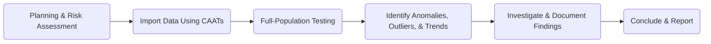
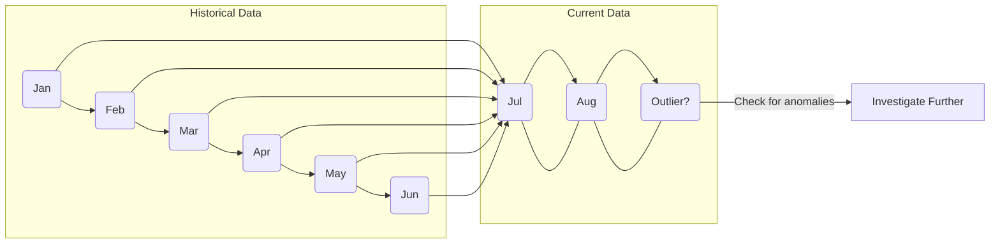

## 20.4 Data Analytics and Automated Tools in Audit

In today’s rapidly evolving digital environment, auditors face substantial challenges in managing and analyzing vast datasets. Traditional manual techniques and random sampling alone are no longer sufficient to ensure efficiency, accuracy, and insight. The sophistication of modern enterprise systems has prompted auditors to deploy specialized tools and techniques—collectively referred to as data analytics or Computer-Assisted Audit Techniques (CAATs)—to enhance audit coverage and identify risks and anomalies more effectively. Through these methods, auditors gain deeper visibility, real-time updates, and the ability to uncover patterns that might otherwise remain concealed.

This section explores key aspects of data analytics in auditing, including CAATs, predictive analytics, and real-time dashboards. We will discuss their benefits, potential pitfalls, and best practices in employing these automated tools within an audit engagement. By the end of this section, you will appreciate how these innovative approaches contribute to a more robust, risk-focused, and forward-looking audit.

---

## 1. Introduction to Computer-Assisted Audit Techniques (CAATs)

### 1.1 Overview
Computer-Assisted Audit Techniques (CAATs) refer to a range of automated tools—such as ACL, IDEA, or Alteryx—that allow auditors to import large data sets, perform trend analyses, match transactions, spot anomalies, and ultimately improve the quality of audit testing. CAATs enable auditors to go beyond traditional sampling and assess complete populations of transactions, significantly reducing the risk of oversight.

#### Key Characteristics of CAATs
• Automated Data Import: CAATs can handle high-volume data from various formats and systems, including accounting software, enterprise resource planning (ERP) systems, and databases.  
• Full-Population Testing: Instead of manual sampling, CAATs enable the analysis of all transactions, improving the likelihood of detecting exceptions.  
• Data Manipulation and Summarization: Built-in functions allow for classification, sorting, aging, and summarizing data, simplifying identification of irregularities.  
• Visualization and Reporting: Graphical dashboards and customized reporting features help auditors communicate findings to management and governance bodies effectively.

Below is a diagram illustrating how CAATs fit into the overall audit workflow:

### 1.2 Practical Applications and Case Studies
• Journal Entry Testing: Auditors can run tests on every journal entry posted during the year, highlighting any entries posted at unusual times (e.g., weekends or late nights).  
• Payroll Verification: CAATs can match human resources data with payroll records, flagging duplicate employee IDs or anomalies in pay scales.  
• Vendor Payment Analysis: By comparing authorized vendor lists to payment records, CAATs can reveal unauthorized or fictitious vendors.

### 1.3 Benefits and Considerations
• Extended Coverage: Full-population testing enhances the likelihood of identifying anomalies or errors.  
• Efficiency: Automated testing methods save time, allowing engagement teams to focus on analysis rather than data wrangling.  
• Data Integrity: Reliance on CAAT outputs requires verification of data completeness, accuracy, and reliability.  
• Skills and Training: Auditors must develop the necessary technical know-how and critical thinking skills to leverage these tools effectively.

---

## 2. Predictive Analytics

### 2.1 Introduction
Predictive analytics encompasses algorithms—often machine learning (ML) models—that learn from historical data and generate forecasts or detect unusual patterns. When integrated into audit procedures, predictive analytics assists auditors in assessing whether a client’s current operations deviate from their historical norms or from industry benchmarks.

### 2.2 Common Predictive Tools in Auditing
• Regression Analysis: Helps estimate expected values for key financial statement line items, such as revenue or expenses, based on known drivers (e.g., sales volume or market share).  
• Time-Series Forecasting: Projects current period results based on historical trends, allowing auditors to compare actual data against expected ranges.  
• Classification Models (Machine Learning): Flag outliers or suspicious transactions by identifying transaction characteristics consistent with fraudulent patterns.

An example of a time-series forecasting approach might involve analyzing monthly revenue transactions over the past two years. Spikes or sudden downturns in revenue for a particular product line that cannot be explained by business events might signal a need for deeper investigation:

### 2.3 Considerations When Using Predictive Analytics
• Data Quality: Models depend on reliable, clean, and comprehensive data. Incomplete or biased datasets can reduce effectiveness.  
• Model Overfitting: Overly complex models might mistake noise for patterns. Auditors should validate results against real-world logic and business context.  
• Analyst Expertise: Integrating statistical and machine learning techniques effectively requires specialized analytical skills.  
• Professional Judgment: Auditors must interpret model outputs with skepticism and verify that variances are not due to legitimate business or economic factors.

---

## 3. Real-Time Dashboards

### 3.1 Why Real-Time Dashboards Matter
Advances in technology have made it possible for auditors to monitor data feeds on a real-time or near real-time basis. By doing so, engagement teams can rapidly detect anomalies—such as unusual sales in remote locations or large, one-off transactions—before they become systemic issues or material misstatements. While dashboards can dramatically improve visibility and responsiveness, the auditor remains responsible for validating data integrity.

### 3.2 Examples of Real-Time Dashboards in Audit
• Transaction Monitoring Console: Provides a live feed of approved and posted financial entries, automatically flagging entries above a certain threshold for immediate review.  
• Inventory Movement Tracker: Monitors changes in inventory quantity and valuation, alerting auditors to sudden or unexplained spikes in usage or shipments.  
• Expense Analytics Board: Tracks employee expenditure, highlighting any expenses that exceed established budgets or deviate from historical norms.

### 3.3 Common Pitfalls and Mitigation Strategies
• Data Reliability: Because real-time dashboards rely on direct connections to client system APIs or data warehouses, errors or disruptions in these data feeds could present incomplete or inaccurate data.  
• Information Overload: A deluge of notifications and flagged items might cause auditors to miss truly significant issues. Setting meaningful thresholds and filters is crucial.  
• Security Risks: Real-time data interfaces must be designed with rigorous security protocols to protect sensitive financial information.

---

## 4. Best Practices and Future Outlook

### 4.1 Integrating Analytics Early in the Audit
Incorporate data analytics strategies at the planning phase to better inform inherent risk and control risk assessments. Early deployment ensures that data is ready and cleansed before the busy weeks of fieldwork, and it also gives auditors time to design targeted substantive procedures based on identified anomalies or risk factors.

### 4.2 Collaboration and Talent Development
Audit teams often include data specialists who collaborate closely with financial auditors. Organizations invest significantly in training their staff in data analytics platforms and advanced statistical methods. A multi-skilled team ensures robust analysis and sound professional judgment.

### 4.3 Evolving Standards and Regulatory Guidance
Regulators and standard-setters—such as the AICPA and the PCAOB—encourage the use of data analytics as part of a high-quality audit. However, standards lag behind the rapid pace of technological innovation. Auditors must stay current with new guidance related to auditing with data analytics and inform the audit committee about the nature, benefits, and limitations of emerging techniques.

### 4.4 Emerging Technologies
In addition to the current generation of data analytics and ML-driven tools, emerging trends like robotic process automation (RPA), natural language processing (NLP), blockchain analytics, and advanced artificial intelligence are poised to further transform audit practices. As these tools mature, their adoption alongside sophisticated audit methodologies is likely to become standard practice.

---

## 5. Glossary of Key Terms

• **CAATs:** Automated tools used to query, manipulate, summarize, or analyze data sets effectively.  
• **Full-Population Testing:** An approach where the auditor analyzes every record in a dataset rather than relying on a sampling method.  
• **Machine Learning (ML):** Algorithms that learn from historical data to predict or classify new events, such as anomalies or fraud.  
• **Predictive Analytics:** The use of statistical models and machine learning to forecast outcomes and detect unusual patterns in data.  
• **Real-Time Dashboards:** Visual representations of current data feeds that assist auditors in identifying transactions or metrics requiring immediate attention.

---

## 6. References and Additional Resources

• **AICPA “Guide to Audit Data Analytics”:** Offers detailed insights on sampling approaches, outlier detection techniques, and real-time analysis within an audit context.  
• **ISACA’s Digital Transformation Resource Center:** [https://www.isaca.org/resources](https://www.isaca.org/resources) – Provides comprehensive resources on leveraging advanced analytics in IT audits and frameworks for governance.  
• **Book – “Data Analytics for Internal Auditors” by Richard Cascarino:** A practical guide on how to integrate analytics into an audit workflow, including case studies and best practices.

---

## Quiz: Data Analytics & Automated Tools in Audit Mastery



### Auditors employ Computer-Assisted Audit Techniques (CAATs) primarily to:
- [ ] Guarantee 100% accuracy in all journal entries.
- [x] Perform full-population testing and uncover anomalies in large datasets.
- [ ] Eliminate the need for professional judgment.
- [ ] Reduce the engagement team size to a single auditor.

> **Explanation:** CAATs enable auditors to process large quantities of data, perform extensive testing, and identify anomalies; they do not eliminate the need for professional judgment nor guarantee absolute accuracy.

### Which of the following statements best describes predictive analytics in auditing?
- [x] Using historical data and machine learning to forecast expected results and detect unusual variations.
- [ ] Relying on manual checks to split transaction samples.
- [ ] Creating static checklists to track compliance with GAAP.
- [ ] Replacing audit teams with automated robots.

> **Explanation:** Predictive analytics leverage historical data and models to anticipate likely values and trends, signaling potential risks or anomalies for further investigative procedures.

### What is a key benefit of using real-time dashboards in an audit context?
- [ ] Eliminating the need for professional skepticism.
- [ ] Ensuring no data validation is needed.
- [x] Enabling instant visibility into transactions and facilitating timely detection of unusual activity.
- [ ] Making the audit process fully automated without human oversight.

> **Explanation:** Real-time dashboards provide near-instant visibility into transaction flows, allowing auditors to spot irregularities or anomalies and investigate promptly—though professional judgment and data validation remain essential.

### One primary consideration when using CAATs for full-population testing is:
- [ ] Reducing staff to cut costs.
- [ ] Eliminating the need for a final audit opinion.
- [x] Verifying data completeness and accuracy before relying on the results.
- [ ] Focusing solely on financial metrics, ignoring operational data.

> **Explanation:** Although CAATs enable large-scale testing, auditors must confirm data reliability before depending on the automated results.

### Which of the following might indicate overfitting in a machine learning model used for audit analytics?
- [x] The model identifies countless transactions as anomalies, yet upon further review, most are legitimate.
- [ ] The model fails to find any outliers despite known fraudulent transactions.
- [x] The model performs well on historical data but fails to detect anomalies in new data.
- [ ] The model is only tested on a small portion of the dataset.

> **Explanation:** Overfitting occurs when a model is overly tailored to a historical dataset and fails to generalize to new data, leading to either too many false positives or not detecting real anomalies.

### In the context of audit data analytics, time-series forecasting is most useful for:
- [x] Identifying unexpected trends in financial statement line items by comparing current period data to historical patterns.
- [ ] Calculating sample sizes for standard inventory observation.
- [ ] Limiting the scope of internal controls testing.
- [ ] Determining engagement fees.

> **Explanation:** Time-series forecasting allows comparison between predicted norms and current data, helping auditors identify deviations from expectations and prompting further investigation.

### How do auditors mitigate “information overload” when using real-time dashboards?
- [x] By setting carefully selected thresholds and filters to flag only material or unusual items.
- [ ] By disabling system alerts and emails.
- [x] By relying entirely on external experts’ interpretations.
- [ ] By ignoring the dashboard unless a material misstatement is suspected.

> **Explanation:** Without a focused approach, real-time dashboards can produce excessive alerts. Establishing rigorous filtering mechanisms and thresholds helps auditors focus on high-risk or material items.

### Which of the following represents a best practice in adopting automated tools within an engagement plan?
- [x] Integrating analytics into the early stages of audit planning to tackle data quality issues proactively.
- [ ] Delaying the use of analytics until the final audit procedures.
- [ ] Relying solely on the client to generate analytics reports.
- [ ] Storing logins and passwords on unsecured documents for convenience.

> **Explanation:** Incorporating analytics from the start ensures the audit team has sufficient time for data cleaning, risk assessment, and designing tests aligned with the identified anomalies or risk factors.

### In the future, which emerging technology is likely to complement data analytics practices in auditing?
- [x] Blockchain analytics for verifying distributed ledger integrity.
- [ ] Manual ledger cards for verifying historical transactions.
- [ ] Paper-based checklists for documenting outliers.
- [ ] Eliminating all compliance checks.

> **Explanation:** As blockchain usage grows, analytics focusing on distributed ledger data will become increasingly relevant, enabling auditors to validate transaction trails in real-time.

### Data analytics in auditing requires ongoing professional development because:
- [x] Techniques and technologies evolve rapidly, requiring auditors to maintain familiarity with new tools.
- [ ] Basic Excel skills acquired 20 years ago suffice for advanced audits.
- [ ] It eliminates the need for ethics or independence standards.
- [ ] No relevant financial knowledge is necessary.

> **Explanation:** Auditors must stay updated on emerging analytical tools, technologies, and best practices, maintaining the expertise necessary to perform high-quality audits.



---

## For Additional Practice and Deeper Preparation

**[Auditing & Attestation CPA Mock Exams (AUD): Comprehensive Prep](https://www.udemy.com/course/aud-cpa-mock-exams/?referralCode=D064EF7BD4A84FC6403D)**  
• Tackle full-length mock exams designed to mirror real AUD questions—from risk assessment and ethics to internal control and substantive procedures.  
• Refine your exam-day strategies with detailed, step-by-step solutions for every scenario.  
• Explore in-depth rationales that reinforce understanding of higher-level concepts, giving you a decisive edge on test day.  
• Boost confidence and reduce exam anxiety by building mastery of the wide-ranging AUD blueprint.

_Disclaimer: This course is not endorsed by or affiliated with the AICPA, NASBA, or any official CPA Examination authority. All content is created solely for educational and preparatory purposes._
