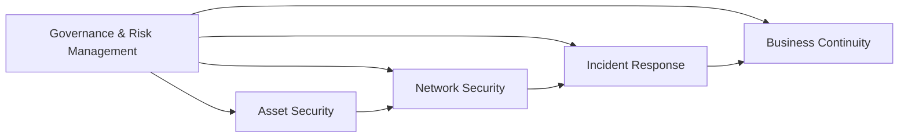
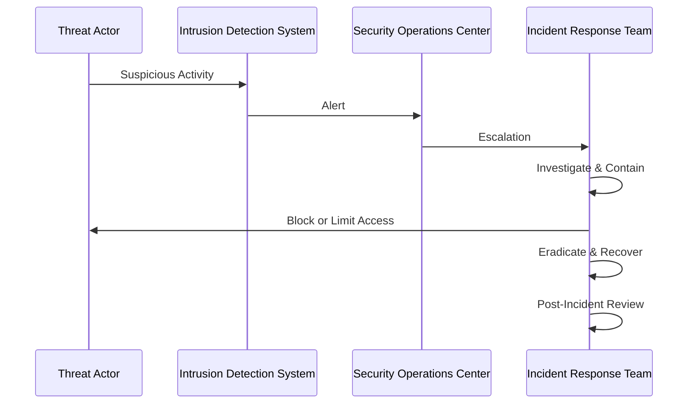

## 20.5 Cybersecurity Essentials for Auditors

Cybersecurity has become one of the most critical components an auditor must understand and evaluate in today’s rapidly evolving technological landscape. Increasingly sophisticated cyberattacks—ranging from ransomware to phishing—can compromise corporate systems and sensitive data, resulting in significant financial, reputational, and legal consequences. Auditors play a pivotal role in ensuring that organizations establish robust cybersecurity programs aligned with industry best practices. This section details essential cybersecurity domains, discusses the threat landscape, outlines the importance of incident response, and underscores the relevance of cyber insurance from an auditing perspective.

---

## 1. Key Cybersecurity Domains

Modern cybersecurity strategies generally revolve around several foundational domains. Understanding these domains is crucial for auditors tasked with evaluating the enterprise’s security posture:

1.1 Governance and Risk Management  
• Effective governance establishes accountability and oversight of cybersecurity initiatives.  
• Risk management processes identify and assess vulnerabilities, weighing potential impacts against mitigation costs.  
• Auditors must evaluate organizational structure, policies, and risk assessment methodologies—ensuring alignment with recognized frameworks like the NIST Cybersecurity Framework.

1.2 Asset Security  
• Asset security deals with identifying, classifying, and safeguarding an organization’s information assets (e.g., customer data, intellectual property).  
• Auditors verify data classification policies, access controls, encryption practices, and data lifecycle management to ensure assets are effectively protected.

1.3 Network Security  
• Network security includes firewalls, intrusion detection systems (IDS), and network segmentation strategies that guard against unauthorized access.  
• Auditors assess whether systems and tools in place align with leading practices, such as routine security monitoring, third-party penetration testing, and patch management processes.

1.4 Incident Management and Response  
• Preparation, detection, containment, eradication, and recovery are vital steps in an incident management process.  
• Auditors review whether the incident response plan is up to date, properly communicated, and tested periodically.  
• This domain also includes investigative activities such as log reviews and digital forensics.

1.5 Business Continuity and Disaster Recovery  
• Ensuring minimal operational disruption during and after a security event is an integral component of cybersecurity.  
• Auditors confirm that continuity plans robustly address cyber-risks, analyzing backup strategies, communication procedures, and recovery time objectives (RTOs).

Below is a visual diagram outlining these key cybersecurity domains and how they interconnect.

> The diagram highlights that governance and risk management provide the overarching framework, influencing policies and practices across all other cybersecurity domains.

---

## 2. Understanding the Threat Landscape

Staying informed about prevalent cyber threats enables auditors to better evaluate the entity’s defensive measures. Some of the most common and damaging threats include:

2.1 Ransomware  
• A form of malicious software that encrypts files, demanding payment for the decryption key.  
• Auditors gauge whether the organization maintains secure and tested backups, deploys updated anti-malware tools, and provides ongoing security awareness training.

2.2 Phishing and Social Engineering  
• Fraudulent emails or communications meant to trick individuals into revealing confidential information or credentials.  
• Auditors focus on employee training, simulated phishing campaigns, and processes that reduce the risk (e.g., multi-factor authentication, anti-spam filters).

2.3 Denial-of-Service (DoS) Attacks  
• Oversaturates a network or system with requests, rendering it inoperable for legitimate use.  
• Auditors look into business continuity provisions—like failover servers or backup networks that mitigate downtime risks.

2.4 Unauthorized System Access  
• Exploiting known or zero-day vulnerabilities in applications or operating systems.  
• Auditors examine patch management schedules, vulnerability scanning, and robust user access management controls.

2.5 Data Exfiltration  
• Stealing sensitive data from an entity’s network to an external location.  
• Auditors check for effective network monitoring, encryption-in-transit policies, and clear data classification measures.

---

## 3. Planning and Evaluating Cybersecurity Controls

3.1 NIST Cybersecurity Framework (CSF)  
• Widely adopted collection of industry standards and best practices for improving critical infrastructure cybersecurity.  
• The Framework Core identifies five main functions: Identify, Protect, Detect, Respond, and Recover.  
• Auditors often use this framework—or other recognized standards like ISO 27001—to benchmark the effectiveness of cybersecurity controls.

3.2 Intrusion Detection Systems (IDS) and Intrusion Prevention Systems (IPS)  
• Monitor networks or systems for malicious activity or policy violations, with IPS additionally capable of blocking or rejecting identified threats.  
• Auditors confirm that the IDS/IPS logs are regularly reviewed and any anomalies are investigated promptly.

3.3 Patch Management  
• Ensures systems remain up to date with vendor-released fixes for known vulnerabilities.  
• Auditors verify that patch logs are complete, updated in a timely manner, and thoroughly tested before deployment.

3.4 Endpoint Security  
• Involves securing individual devices (laptops, workstations, mobile devices) against malware and unauthorized access.  
• Auditors assess whether antivirus solutions are maintained and whether endpoint configurations align with security policies.

---

## 4. Incident Response

4.1 Defining an Incident Response Plan  
• Policy guiding staff actions in the event of a breach, including escalation paths, communication channels, and forensics.  
• A well-designed plan details roles and responsibilities for every stage of an incident, from detection to final review.

4.2 Testing and Validation  
• Effective organizations conduct tabletop exercises and simulation drills to validate the readiness and efficacy of their incident response.  
• Auditors ascertain that such exercises are documented, with lessons learned feeding back into improvements.

4.3 Post-Incident Analysis  
• A root-cause analysis identifying the weaknesses that enabled the incident to occur.  
• Auditors confirm whether the entity implements remedial measures and updates relevant controls to prevent recurrences.

> This sequence diagram demonstrates how an incident alert flows through various teams, culminating in resolution and review.

---

## 5. Cyber Insurance

5.1 Coverage Scope  
• An increasing number of organizations invest in cyber insurance policies to offset potential losses stemming from data breaches or ransomware attacks.  
• Typical coverage may include data breach notification costs, legal expenses, and financial restitution in case of lawsuits.

5.2 Limitations and Exclusions  
• Some policies exclude coverage if required security measures (e.g., multi-factor authentication) were not implemented.  
• Auditors should be aware of policy disclaimers, ensuring management fully grasps coverage limits.

5.3 Relevance to Audit  
• Auditors review the adequacy of cyber insurance relative to the organization’s risk profile.  
• They also verify compliance with the policy’s security requirements, as failure to meet them might invalidate coverage.

---

## 6. Best Practices and Common Pitfalls

6.1 Best Practices  
• Regularly update security policies and procedures to reflect emerging threats and regulatory changes.  
• Provide continuous security awareness training to employees.  
• Conduct periodic penetration tests and vulnerability assessments.

6.2 Common Pitfalls  
• Over-reliance on technological tools without sufficiently training staff.  
• Neglecting to perform timely software patching, leaving systems exposed.  
• Failing to track or review logs for suspicious events.  
• Insufficient incident response testing or outdated response plans.

---

## 7. References and Additional Resources

• Regulatory:  
  – GDPR (General Data Protection Regulation) in the EU  
  – HIPAA (Health Insurance Portability and Accountability Act) in the U.S.  

• Articles/Guidance:  
  – “Building a Resilient Cybersecurity Posture,” Journal of Accountancy  
  – NIST Cybersecurity Framework (CSF): https://www.nist.gov/cyberframework  

• Online Course:  
  – “Cybersecurity Fundamentals for Finance Professionals” (AICPA)  

---

## 8. Glossary

• NIST Cybersecurity Framework (CSF): A policy framework of computer security guidance and best practices for how organizations should assess and improve their ability to prevent, detect, and respond to cyber threats.  
• Intrusion Detection Systems (IDS): Tools that monitor network or system activities for suspicious or malicious actions.  
• Patch Management: The process of applying vendor-released patches or updates to address security vulnerabilities in software and operating systems.

---

## Cybersecurity Essentials Quiz



### Which cybersecurity domain focuses on identifying, classifying, and protecting an organization’s information assets?  
- [ ] Governance and Risk Management  
- [x] Asset Security  
- [ ] Incident Response  
- [ ] Network Security  

> **Explanation:** Asset Security ensures that critical data is identified, classified, and protected throughout its lifecycle.  

### What is often considered a crucial first step in incident response?  
- [ ] Containment  
- [ ] Post-Incident Review  
- [x] Detection and Escalation  
- [ ] Blocking Threat Actor  

> **Explanation:** Recognizing a threat or an incident and elevating it for immediate attention within the organization is key before pursuing containment strategies.  

### Which of the following is the primary framework adopted by many U.S. organizations to structure their cybersecurity approach?  
- [x] NIST Cybersecurity Framework (CSF)  
- [ ] COBIT  
- [ ] FASB  
- [ ] SSAE No. 18  

> **Explanation:** The NIST Cybersecurity Framework details best practices for preventing, detecting, and responding to cybersecurity threats.  

### In the event of a ransomware attack, what should an auditor look for first to determine organizational readiness?  
- [ ] Backup encryption strength  
- [x] Existence of secure and tested backups  
- [ ] Incident Response Plan location  
- [ ] Anti-phishing software  

> **Explanation:** Tested backups are critical to recovering from a ransomware incident without paying a ransom, so auditors often review the backup strategy’s reliability.  

### To mitigate the risk of unauthorized system access, which process is most crucial for keeping software secure?  
- [x] Patch Management  
- [ ] Governance Framework  
- [x] Network Firewalls  
- [ ] Business Continuity Planning  

> **Explanation:** Patch Management addresses known operating system and application vulnerabilities, ensuring that newly discovered exploits are rapidly closed.  

### What is the best reason for regular testing of an incident response plan?  
- [x] To confirm the plan’s effectiveness and ensure roles are understood  
- [ ] To satisfy regulatory auditors with a single compliance requirement  
- [ ] To minimize the cost of purchasing security software  
- [ ] To eliminate the need for business continuity plans  

> **Explanation:** Regular testing reveals potential weaknesses or misunderstandings, ensuring that the incident response team is well-prepared when an actual breach occurs.  

### Why is cyber insurance becoming increasingly significant in many organizations’ cybersecurity strategy?  
- [ ] It replaces the need for patch management  
- [x] It offsets potential financial losses from data breaches  
- [x] It reduces the cost of antivirus software  
- [ ] It covers all possible cyber-related risks without exclusions  

> **Explanation:** Cyber insurance helps limit financial damage from a breach—like legal fees, notifications, and settlements—though it never fully replaces proactive cybersecurity measures.  

### Which of the following is NOT a typical phase of an incident response process?  
- [ ] Preparation  
- [ ] Containment  
- [x] Conclusion of Audit Fieldwork  
- [ ] Recovery  

> **Explanation:** While an audit may be relevant, “Conclusion of Audit Fieldwork” is not a standard phase of the incident response process, which typically includes preparation, detection, containment, eradication, and recovery.  

### A strong cybersecurity governance framework primarily ensures what within an organization?  
- [x] Clear roles, responsibilities, and oversight regarding cyber risks  
- [ ] The immediate purchase of the latest antivirus tool  
- [ ] Minimal updates to policies and procedures  
- [ ] Elimination of the entire threat landscape  

> **Explanation:** Governance clearly defines accountability and procedures for overseeing cybersecurity efforts, helping integrate them into broader enterprise risk management.  

### Cyber insurance policies often have exclusions related to inadequate security measures. Are organizations still required to maintain cybersecurity controls if insured?  
- [x] True  
- [ ] False  

> **Explanation:** Cyber insurance policies typically exclude coverage if organizations fail to maintain certain baseline security controls, making robust cybersecurity defenses still essential.  



---

## For Additional Practice and Deeper Preparation

**[Auditing & Attestation CPA Mock Exams (AUD): Comprehensive Prep](https://www.udemy.com/course/aud-cpa-mock-exams/?referralCode=D064EF7BD4A84FC6403D)**  
• Tackle full-length mock exams designed to mirror real AUD questions—covering IT auditing, cybersecurity controls, and risk assessment.  
• Refine your exam-day strategies with detailed, step-by-step solutions for every scenario.  
• Explore in-depth rationales that reinforce understanding of higher-level concepts, giving you a decisive edge on test day.  
• Boost confidence and reduce exam anxiety by building mastery of the wide-ranging AUD blueprint.

_Disclaimer: This course is not endorsed by or affiliated with the AICPA, NASBA, or any official CPA Examination authority. All content is created solely for educational and preparatory purposes._
