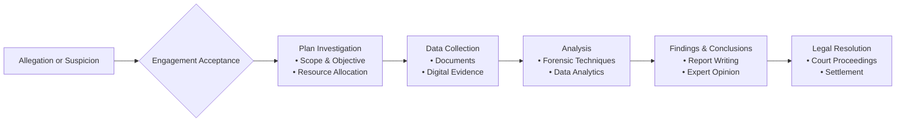

## 21.1 Overview of Forensic Accounting

Forensic accounting stands at the intersection of accounting, auditing, legal, and investigative disciplines. It serves as a critical function when financial disputes, fraudulent activities, or legal matters arise. By synthesizing these varied skill sets, forensic accountants develop a rigorous and legally defensible approach to uncovering and analyzing financial irregularities. They provide indispensable expertise in detecting fraud, reconstructing disputed transactions, presenting evidence, and offering testimony in courts or alternative dispute resolution settings.

This section explores the core aspects of forensic accounting—from understanding the nature and scope of forensic engagements to recognizing various subspecialties and addressing the critical importance of evidence handling, documentation, and effective communication.

---

### Introduction to Forensic Accounting

Forensic accounting is often perceived as detective work for finance. However, it is more accurately described as a specialized practice requiring:  
• A deep knowledge of accounting principles and auditing methodologies.  
• Skillful application of investigative techniques.  
• A profound understanding of legal frameworks, rules of evidence, and the litigation process.

Because the results of forensic investigations can be used in legal proceedings, maintaining high standards in evidence preservation and documentation is paramount. The overarching goal is to gather credible and reliable financial evidence to assist in case resolution, whether in a courtroom, arbitration proceeding, or other dispute resolution forum.

---

### The Role of Forensic Accounting

1. **Evidence Gathering for Legal Proceedings**  
   Forensic accountants examine documents, transactions, and financial records to identify irregularities or fraudulent behaviors. Their findings must withstand legal scrutiny, so every investigative step must be clearly documented and supported by robust evidence.

2. **Proactive and Reactive Engagements**  
   • **Reactive engagements** generally occur after an allegation of misconduct or the discovery of potential fraud. The forensic accountant’s role is to investigate, quantify damages, and analyze the extent of financial misstatements.  
   • **Proactive engagements** involve conducting risk assessments, compliance reviews, or internal controls evaluations to detect potential vulnerabilities before they escalate into fraudulent activities.  

3. **Collaboration with Legal Teams and Law Enforcement**  
   Forensic accountants often work alongside legal counsel, internal auditors, and sometimes law enforcement agencies. Their findings and analyses inform legal strategies, support pleadings, and may serve as the foundation for settlement negotiations or court proceedings.

---

### Engagement Types in Forensic Accounting

Forensic accounting engagements are versatile and can be molded to the client’s specific needs or circumstances. They can be broadly categorized based on the nature and objective of the task:

• **Fraud Investigations** – Initiated upon suspicion of asset misappropriation, financial statement fraud, or other illicit activities.  
• **Litigation Support** – Involves providing expert opinions, damage assessments, or transaction reconstructions in ongoing or pending litigation.  
• **Valuation Disputes** – Focuses on analyzing and verifying the veracity of valuation reports, particularly in acquisitions, business interruptions, partnership dissolutions, or intangible asset disputes.  
• **Bankruptcy and Insolvency** – Includes tracing funds, identifying questionable transfers, and distinguishing between legitimate business transactions and fraudulent activities in restructuring contexts.  
• **Regulatory Investigations** – Addresses compliance breaches or potential violations of statutes like the Foreign Corrupt Practices Act (FCPA) or securities laws.

---

### Key Forensic Subspecialties

Forensic accounting professionals often specialize in one or more subspecialties. Among the most prominent are:

1. **Fraud Detection and Deterrence**  
   • **Objective**: Identify patterns or anomalies suggesting occupational fraud, bribery, concealed liabilities, or financial statement manipulation.  
   • **Techniques**: Utilization of data analytics, ratio analyses, and interviews to isolate anomalies.  
   • **Outcome**: Develop measures (e.g., tightened internal controls) that deter future fraud.

2. **Litigation Support**  
   • **Objective**: Provide court-ready financial analysis, including quantifying damages, tracing funds, and reconstructing transactions that are in dispute.  
   • **Techniques**: In-depth document review, deposition support, expert witness testimony.  
   • **Outcome**: Clarify complex financial matters in a legal setting, facilitating informed judgments or settlements.

3. **Valuation Disputes**  
   • **Objective**: Examine contested valuations related to intangible assets, M&A negotiations, or damage claims (e.g., business interruption).  
   • **Techniques**: Applying valuation models, discount rate assessments, market comparisons, and reasonableness checks.  
   • **Outcome**: Provide an unbiased analysis of fair value, supporting negotiation or litigation processes.

---

### Importance of Documentation and Evidence Custody

Given that forensic accounting findings may serve as evidence in a court of law, meticulous documentation is indispensable. A formal **chain of custody** ensures that every piece of evidence is accounted for, from collection and examination to presentation in court. Preserving the integrity of documents, digital records, and other evidence is paramount. This formalized process typically includes:

1. **Initial Collection**  
   Document or electronically capture every item to be analyzed and assign unique identifiers.  
2. **Secure Storage**  
   Safely store documents or digital media in locked environments or encrypted repositories, maintaining detailed logs of any access or transfers.  
3. **Controlled Analysis**  
   Track each instance of evidence examination or duplication.  
4. **Documenting Conclusions**  
   Carefully record investigative steps, results, and sources, ensuring everything can be reproduced or verified if questioned in litigation.

---

### Effective Communication and the Expert Witness Role

Forensic accountants must be adept at communicating technical financial findings to lawyers, judges, juries, and other stakeholders who may lack deep accounting or auditing expertise. Key communication aspects include:

• **Report Writing** – Clear, concise, and logically structured narratives that detail conclusions, methods, and supporting evidence.  
• **Oral Presentations** – Summaries of intricate financial data in layman’s terms, supported by exhibits, charts, or timelines.  
• **Expert Witness Testimony** – Presenting opinions based on specialized knowledge while maintaining impartiality. Challenges may arise during cross-examination; thus, confidence, composure, and clarity are vital.

---

### Practical Example: Investigating a Suspected Fraud

Consider a mid-sized manufacturing firm noticing a consistent discrepancy in inventory records. A forensic accounting team is brought in to investigate:

1. **Initial Assessment**  
   Through interviews, the team learns of potential segregation-of-duties issues.  
2. **Data Gathering**  
   They collect inventory logs, supplier invoices, and shipping documents.  
3. **Analysis**  
   Using data analytics, they identify a pattern indicating that unauthorized shipments were recorded at inflated values, pointing to a scheme to siphon funds.  
4. **Reporting and Recommendations**  
   The forensic accountants provide a formal report to management, explaining the scheme and recommending improved internal controls, surveillance, and employee training to deter future fraud.

---

### Diagram: Forensic Accounting Investigation Flow

Below is a simplified Mermaid.js diagram illustrating the typical flow of a forensic accounting investigation, from initial suspicion to final reporting:

**Explanation:**  
• The process typically begins with an allegation or suspicion of wrongdoing.  
• After accepting the case and scoping the engagement, the forensic accountants collect relevant data.  
• Through systematic analysis and evidence review, they arrive at findings and conclusions.  
• These results may inform legal decisions, negotiations, or subsequent improvements in an organization’s internal controls system.

---

### Institutions, Regulations, and Additional Resources

• **Association of Certified Fraud Examiners (ACFE) ([ACFE.org](https://www.acfe.org))**  
  – Offers comprehensive fraud resources and grants the Certified Fraud Examiner (CFE) credential.  

• **AICPA’s Forensic and Valuation Services ([AICPA FVS](https://www.aicpa.org/interestareas/forensicandvaluation))**  
  – Provides specialized publications, training materials, and practice aids relevant to forensic accounting.

• **Potential Regulatory Frameworks**  
  – Sarbanes-Oxley Act (SOX) for public company oversight.  
  – GAAS (Generally Accepted Auditing Standards) and PCAOB (Public Company Accounting Oversight Board) standards, as relevant in financial statement contexts.  
  – Federal Rules of Evidence defining admissibility and chain of custody benchmarks.  

• **Books**  
  – “Forensic and Investigative Accounting” by D. Larry Crumbley, Lester E. Heitger, and G. Stevenson Smith.  
  – “Principles of Fraud Examination” by Joseph T. Wells.

• **Online Courses**  
  – “Forensic Accounting and Fraud Examination” offered by West Virginia University on Coursera.  
  – edX modules focusing on financial crime and investigative techniques.

These resources can deepen knowledge of forensic methodology, fraud detection tools, and best practices in evidence handling and courtroom presentations.

---

## SEO-Optimized Quiz: Mastering the Fundamentals of Forensic Accounting



### Which of the following best describes forensic accounting?  
- [x] The integration of accounting, auditing, and investigative skills to analyze financial data for legal contexts.  
- [ ] The construction of new accounting systems for small businesses.  
- [ ] The study of mergers and acquisitions solely in financial technology companies.  
- [ ] The viral marketing strategies for accounting firms.  

> **Explanation:** Forensic accounting is about applying investigative and accounting expertise for legal or dispute resolution situations, distinguishing it from other accounting specialties.

### What is the primary benefit of maintaining a formal evidence custody process in forensic accounting?  
- [x] Ensuring the integrity and admissibility of gathered evidence in legal proceedings.  
- [ ] Guaranteeing that each accountant can access any file without restriction.  
- [ ] Permitting unauthorized individuals to handle evidence if time constraints exist.  
- [ ] Simplifying the chart of accounts.  

> **Explanation:** A detailed chain of custody ensures that evidence remains secure, intact, and legally credible—crucial in forensic engagements.

### In forensic accounting, a reactive engagement is characterized by:  
- [x] Investigating potential fraud or irregularities already alleged or discovered.  
- [ ] Preventing any potential conflict of interest in an acquisition scenario.  
- [ ] Performing annual audits of internal controls for investor confidence.  
- [ ] Registering new ventures with state authorities.  

> **Explanation:** Reactive engagements occur after flags have been raised or fraud suspected, differentiating them from proactive checks aimed at fraud prevention.

### An example of a proactive forensic engagement is:  
- [x] Conducting a compliance review of a company’s procurement process to detect vulnerabilities.  
- [ ] Responding to an already discovered asset misappropriation scheme.  
- [ ] Quantifying damages after a breach of contract lawsuit.  
- [ ] Preparing final statements for a corporate liquidation in bankruptcy.  

> **Explanation:** A proactive engagement involves reviewing processes, controls, and procedures to identify potential risks before wrongdoing occurs.

### Which of the following is not typically a forensic accounting subspecialty?  
- [x] Real estate property management for commercial landlords.  
- [ ] Fraud detection and deterrence.  
- [ ] Litigation support.  
- [ ] Valuation disputes.  

> **Explanation:** Real estate property management may involve accounting functions, but it is not a distinct forensic accounting subspecialty.

### Why is communication skill crucial for a forensic accountant who serves as an expert witness?  
- [x] They must present complex financial evidence clearly to a potentially non-technical audience.  
- [ ] They need to conceal any incriminating evidence.  
- [ ] They must ensure that opposing counsel cannot question them.  
- [ ] They must always interpret evidence in favor of their clients.  

> **Explanation:** Clear communication allows judges, juries, and attorneys to understand complex accounting matters, which is essential for legal proceedings.

### When a forensic accountant is engaged for litigation support, which of the following activities might they perform?  
- [x] Calculate economic damages and reconstruct disputed transactions.  
- [ ] Administer annual external audits for internal control opinions.  
- [ ] Approve mergers and acquisitions as a regulatory official.  
- [ ] Provide operational management for a public company.  

> **Explanation:** Litigation support often involves damage calculations, transaction tracing, and offering expert opinions in legal disputes.

### In the context of forensic accounting, “chain of custody” refers to:  
- [x] The documented process of handling, transferring, and securing evidence.  
- [ ] A system for scheduling vacation time among accountants.  
- [ ] A legal concept unrelated to financial investigations.  
- [ ] A method for pricing intangible assets.  

> **Explanation:** The chain of custody is a detailed record of evidence possession and handling—from its origin to its final use in litigation.

### Which organization offers the Certified Fraud Examiner (CFE) credential and robust fraud resources?  
- [x] Association of Certified Fraud Examiners (ACFE).  
- [ ] The National Association of State Boards of Accountancy (NASBA).  
- [ ] The Institute of Internal Auditors (IIA).  
- [ ] The Financial Accounting Standards Board (FASB).  

> **Explanation:** The ACFE is dedicated to fraud detection and prevention resources, including the CFE designation.

### Forensic accounting often includes presenting findings in court. Which statement is true regarding expert witness testimony?  
- [x] An expert witness must remain impartial, offering opinions based on specialized knowledge rather than advocacy.  
- [ ] An expert witness must always advocate for the party who pays for their services.  
- [ ] An expert witness should avoid presenting any exhibits.  
- [ ] An expert witness typically has minimal credentials in the accounting field.  

> **Explanation:** A forensic accountant testifying must be impartial and rely on professional expertise, aligning with ethical obligations in the courtroom.



---

## For Additional Practice and Deeper Preparation

**[Auditing & Attestation CPA Mock Exams (AUD): Comprehensive Prep](https://www.udemy.com/course/aud-cpa-mock-exams/?referralCode=D064EF7BD4A84FC6403D)**  
• Tackle full-length mock exams designed to mirror real AUD questions—from risk assessment and ethics to internal control and substantive procedures.  
• Refine your exam-day strategies with detailed, step-by-step solutions for every scenario.  
• Explore in-depth rationales that reinforce understanding of higher-level concepts, giving you a decisive edge on test day.  
• Boost confidence and reduce exam anxiety by building mastery of the wide-ranging AUD blueprint.

_Disclaimer: This course is not endorsed by or affiliated with the AICPA, NASBA, or any official CPA Examination authority. All content is created solely for educational and preparatory purposes._
