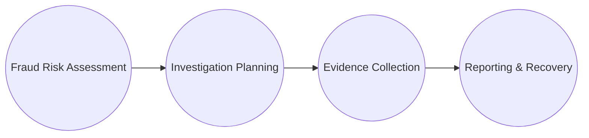
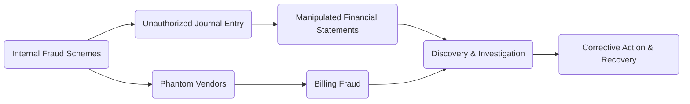

## 21.2 Fraud Examination Methods and Testing

Fraud is a universal threat to organizations, ranging from small-scale misappropriation to large-scale financial statement manipulation. In this section, we delve into the methods and testing procedures necessary to detect, investigate, and ultimately prevent financial fraud. We will also discuss interview techniques, targeted testing approaches, and provide practical resources for deeper, more effective forensic investigations.

---

## The Fraud Examination Lifecycle

Fraud examinations generally follow a lifecycle that helps ensure a structured and methodical approach. Recognizing this cycle—and understanding each phase—is crucial for auditors, forensic accountants, and investigative professionals aiming to combat fraudulent activity.

1. **Fraud Risk Assessment**  
   Organizations conduct fraud risk assessments to identify potential vulnerabilities, the likelihood of specific fraud schemes (e.g., billing fraud, financial statement manipulation), and any existing controls that could mitigate those risks. The assessment also looks for “red flags” such as unexplained transactions, irregular financial trends, or suspicious employee behavior.

2. **Investigation Planning**  
   Once a preliminary concern or suspicion arises, senior management, auditors, legal counsel, or external experts formulate an investigation plan. This plan defines:  
   • The scope of the investigation and the specific objectives  
   • The resources and expertise required (e.g., forensic accountants, IT specialists)  
   • Potential involvement of legal counsel or law enforcement  
   • The timeline for activities such as interviews, on-site visits, and review of relevant documents  

3. **Evidence Collection**  
   Effective fraud investigations hinge on the systematic collection of evidence, which may include:  
   • Review of documents, emails, contracts, and accounting ledgers  
   • Physical inspections of inventory counts and asset valuations  
   • Electronic data analysis (separating legitimate transactions from anomalies)  
   • Interviews with employees, management, and possibly external parties like vendors or customers  
   During this process, ensuring a chain of custody for exhibits or documents is critical to preserving the integrity and admissibility of evidence in potential legal proceedings.

4. **Reporting and Recovery**  
   In the final stage, investigators compile the findings into comprehensive reports, summarizing the nature of fraudulent activities, supporting evidence, and recommended corrective steps. Recovery efforts may include initiating restitution claims, filing insurance claims for fraud loss coverage, or correction of internal control weaknesses. In some cases, forensic accountants and auditors testify in court regarding their findings, working closely with legal advisors to present evidence clearly and accurately.

---

## Interview Techniques

Interviews serve as a powerful investigative tool to elicit valuable information from witnesses, suspects, and other involved parties. While the core objective is to reveal facts and establish truth, skilled interviewers must balance rapport-building with professional skepticism.

### The Reid Technique
One commonly referenced method is the Reid Technique, which involves a structured approach to interrogation and interviewing:
• Establishing a non-accusatory setting initially to build rapport  
• Observing verbal and non-verbal cues that may indicate deception  
• Encouraging open-ended responses to obtain more detailed information  

### Best Practices for Effective Interviews
• Maintain an empathetic but objective demeanor to reduce defensive behavior from the interviewee.  
• Use open-ended questions (e.g., “Walk me through your process for handling expense reimbursements.”) to encourage free-flowing answers.  
• Actively listen for inconsistencies and follow up with probing questions to clarify.  
• Pay attention to body language—e.g., excessive fidgeting, sudden posture changes, or hesitation can be red flags.  
• Record the interview if legally permissible, while always respecting organizational and privacy guidelines.

---

## Targeted Testing

When ordinary audit procedures or preliminary assessments indicate heightened risk of fraud, investigators employ specialized testing methods. These targeted tests are designed to identify or corroborate irregularities that standard procedures might miss.

### Specialized Procedures
1. **Extended Cut-Off Tests**  
   By extending the review of transactions immediately before and after the financial close, investigators can uncover attempts to shift revenue or expenses improperly between periods.

2. **Re-Performance of Suspicious Journal Entries**  
   Investigators recast suspect transactions to see if they align with documented support. For instance, an unusual entry involving large adjustments near the end of a reporting period warrants a closer look.

3. **Verification of “Shell Company” Addresses**  
   Shell companies, often created solely for fraudulent billing, may lack a legitimate physical presence. Investigators cross-reference vendor addresses with external databases (e.g., real estate records) and conduct site visits or phone verifications to confirm authenticity.

4. **Analyzing Vendor Master Files**  
   • Duplicate vendor names, addresses, or suspicious vendor IDs  
   • “Phantom” suppliers or those only associated with a single individual within the organization  
   • Excessive invoice amounts that vary significantly from the market rate  

5. **Comparing Physical Records with Electronic Data**  
   Physical documents (e.g., original receipts, purchase orders) are matched against electronic records to detect forgeries, unauthorized alterations, or incomplete deletions.

These targeted tests often reveal hidden patterns or point to areas requiring deeper examination. Practitioners combine these specialized procedures with broader audit and forensic techniques to build a robust case against fraud.

---

## Practical Examples and Case Studies

• **Case Study: Billing Fraud**  
  A mid-sized manufacturing firm experienced unusual spikes in their “Repair and Maintenance” expense category shortly before holiday seasons. A fraud risk assessment flagged potential invoice padding by the in-house Facilities Manager. Targeted testing revealed that the address for a supplier was a post office box that the Facilities Manager had rented. Cross-referencing data with vendor master files exposed the shell company. Upon further investigation, management discovered thousands of dollars in overbilling.

• **Case Study: Financial Statement Manipulation**  
  In an attempt to meet revenue targets, a controller recorded last-minute sales transactions without valid documentation. Extended cut-off tests showed that these transactions were dated just days after the new fiscal year started, indicating improper revenue recognition. Additional steps, including interviews with sales personnel, confirmed that shipments had not yet occurred, thereby proving fraudulent reporting.

---

## Glossary of Key Terms

• **Fraud Risk Assessment**: A structured approach used to identify vulnerabilities within an organization’s processes that are susceptible to fraudulent activities.  
• **Reid Technique**: A set of interview and interrogation methods aimed at detecting deception and eliciting truthful statements, commonly used by law enforcement and forensic investigators.  
• **Shell Company**: A legal entity typically devoid of active business operations, created for the purpose of hiding or obscuring financial transactions, often used in billing fraud schemes.

---

## References and Additional Resources

• **Association of Certified Fraud Examiners (ACFE)**: Publishes the “Report to the Nations,” an extensive study on occupational fraud trends, methods, and statistics.  
• **The CPA Journal**: Features articles like “Advanced Fraud Interviewing Techniques,” which detail effective ways to approach suspect interviews.  
• **ACFE’s “Fraud Investigation” Track**: A specialized training program that covers modern detection strategies, data analytics, and investigative best practices.  
• **International Standards on Auditing (ISA)** and **AICPA Guidance**: Offer frameworks for incorporating fraud consideration into audit planning.

---

## Best Practices, Challenges, and Strategies

• **Best Practices**:  
  – Maintain professional skepticism at all times.  
  – Document all findings meticulously to preserve the legal integrity of evidence.  
  – Use digital forensics for email and data trail analysis, especially where complex ERP systems are involved.  

• **Common Pitfalls**:  
  – Overlooking small discrepancies (e.g., repeated “round figure” entries or consistent internal transfers on the same date every month).  
  – Relying too heavily on routine audit tests and missing newly emerging fraud tactics.  

• **Strategies to Overcome Challenges**:  
  – Continuous training on fraud detection methods and emerging technologies (AI-based anomaly detection).  
  – Collaboration with IT specialists, and when appropriate, with local or federal law enforcement.  
  – Frequent updates to policies and procedures aligned with industry standards (e.g., COSO framework enhancements for fraud-risk controls).

---

## Diagrams for Clarification

Below is a simple overview of how different fraud schemes might flow within an organization, from initiation to discovery, highlighting potential control breaks:

• **Unauthorized Journal Entries**: Common in financial statement manipulations.  
• **Phantom Vendors**: Typical approach for billing fraud or asset misappropriation.  
• **Discovery & Investigation**: Triggered by suspicious anomalies or whistleblower tips.  
• **Corrective Action & Recovery**: Internal controls upgraded, legal action taken, restitution sought.

---

## SEO-Optimized Fraud Examination Quiz



### Which step in the fraud examination lifecycle helps organizations identify potential vulnerabilities and red flags? 
- [ ] Investigation Planning
- [ ] Evidence Collection
- [x] Fraud Risk Assessment
- [ ] Reporting and Recovery

> **Explanation:** Fraud Risk Assessment is the phase focusing on identifying potential schemes, vulnerabilities, and red flags within the organizational processes.

### What is the main purpose of the Reid Technique in fraud investigations?
- [x] Detect deception and elicit truthful statements
- [ ] Identify shell companies
- [ ] Automate data analysis
- [ ] Provide guidelines for financial statement analyses

> **Explanation:** The Reid Technique is commonly used in structured interviews and interrogations to detect deception and encourage truthful disclosures.

### Which of the following specialized procedures helps uncover revenue that may be recorded in the wrong accounting period?
- [ ] Relying on standard audit confirmations
- [ ] Cross-referencing employee expense reports
- [x] Extended cut-off tests
- [ ] Reviewing multi-year tax returns

> **Explanation:** Extended cut-off tests review transactions around period-end to check for premature revenue recognition or late expense recording.

### A shell company can best be described as:
- [x] A fictitious entity created for fraudulent transactions
- [ ] A legitimate entity undergoing restructuring
- [ ] An official vendor approved by government agencies
- [ ] A business with no vulnerabilities to exploitation

> **Explanation:** Shell companies lack real operations and often serve as vehicles for fraudulent billing, money laundering, or other illicit activities.

### In targeted testing, verifying vendor addresses and cross-referencing them with public records is performed primarily to:
- [x] Detect fictitious suppliers or shell companies
- [x] Confirm the authenticity of vendor relationships
- [ ] Assess compliance with environmental regulations
- [ ] Validate internal human resource policies

> **Explanation:** Investigators compare vendor addresses (e.g., with local real estate records) to confirm legitimacy and rule out fraudulent entities.

### Which of the following is a common pitfall in detecting fraud?
- [x] Overlooking minor irregularities
- [ ] Involving legal counsel
- [ ] Documenting all findings carefully
- [ ] Exercising professional skepticism

> **Explanation:** Fraud often starts with small irregularities that, if unnoticed, can lead to bigger issues. Overlooking these clues is a common pitfall.

### For effective interviews in fraud cases, it is recommended to:
- [x] Use open-ended questions
- [ ] Immediately accuse the interviewee
- [x] Observe non-verbal cues
- [ ] Avoid taking any notes

> **Explanation:** Combining open-ended questioning and careful observation of body language promotes more comprehensive information gathering.

### What is a key outcome of the Reporting and Recovery stage in the fraud examination lifecycle?
- [ ] Initiation of the interview process
- [x] Preparation of comprehensive findings and recommendations
- [ ] Collection of testimony from management
- [ ] Risk assessment for new system implementations

> **Explanation:** This stage culminates in a summarized report, corrective actions, and recovery efforts, including potential legal remedies.

### In a forensic investigation, the act of “re-performing suspicious journal entries” primarily helps investigators:
- [ ] Reduce the administrative workload
- [ ] Minimize the cost of the audit
- [x] Validate the accuracy and legitimacy of the entries
- [ ] Ensure compliance with inventory management

> **Explanation:** Re-performance is used to confirm whether transactions are consistent with supporting documentation and authorized approvals.

### True or False: Fraud interviewing techniques largely rely on confrontational, accusatory questioning to elicit the truth.
- [x] False
- [ ] True

> **Explanation:** Investigative interviews generally use non-accusatory methods, focusing on rapport-building, open-ended queries, and structured approaches like the Reid Technique.



---

## For Additional Practice and Deeper Preparation

**[Auditing & Attestation CPA Mock Exams (AUD): Comprehensive Prep](https://www.udemy.com/course/aud-cpa-mock-exams/?referralCode=D064EF7BD4A84FC6403D)**  
• Tackle full-length mock exams designed to mirror real AUD questions—from risk assessment and ethics to internal control and substantive procedures.  
• Refine your exam-day strategies with detailed, step-by-step solutions for every scenario.  
• Explore in-depth rationales that reinforce understanding of higher-level concepts, giving you a decisive edge on test day.  
• Boost confidence and reduce exam anxiety by building mastery of the wide-ranging AUD blueprint.

_Disclaimer: This course is not endorsed by or affiliated with the AICPA, NASBA, or any official CPA Examination authority. All content is created solely for educational and preparatory purposes._
