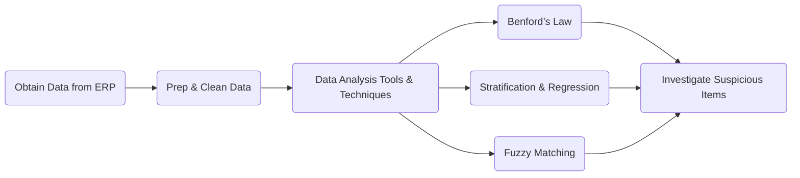

## 21.3 Data Mining for Irregularities

Data mining for irregularities is an essential component of forensic accounting and investigative audits, allowing professionals to detect hidden anomalies, fraud schemes, and errors buried within massive datasets. As organizations increasingly rely on integrated Enterprise Resource Planning (ERP) systems to manage their financial and operational activities, the volume and complexity of data have grown exponentially. This chapter explores how using advanced data analytics tools, such as IDEA, ACL, Alteryx, and open-source technologies, can reveal suspicious patterns and strengthen an investigator’s ability to uncover illicit activity or misstatements.

--------------------------------------------------------------------------------

### 1. Relevance of Data Analytics

Data analytics plays a critical role in detecting potential financial irregularities, especially when dealing with thousands or even millions of transactions. Traditional manual sampling may miss subtle anomalies that occur unpredictably. Modern forensic accountants employ data mining techniques to:

• Analyze 100% of transactions rather than a small sample.  
• Identify unusual correlations, outliers, or anomalous patterns (e.g., repeated round-dollar transactions).  
• Merge data from multiple systems (e.g., HR, payroll, purchasing) to spot trends like ghost employees, duplicate payments, or suspicious vendor relationships.  

When harnessed effectively, data analytics transforms the audit approach from reactive to proactive, enabling teams to detect fraud at its earliest stages and prevent further financial damage.

--------------------------------------------------------------------------------

### 2. Common Techniques

Several data mining techniques have emerged as cornerstones of forensic investigations. Each method offers unique insights into transaction flows and helps isolate areas requiring deeper examination.

#### 2.1 Benford’s Law Analysis

Benford’s Law states that in naturally occurring datasets (e.g., populations, stock prices, accounting figures), the distribution of leading digits follows a predictable pattern: the digit “1” appears as the leading digit more frequently than “2,” “2” appears more frequently than “3,” and so on. Fraudsters who fabricate numbers often fail to replicate this natural distribution, resulting in unusual spikes or dips in certain leading digits.

Benford’s Law analysis involves:

• Extracting key numeric fields (e.g., invoice totals, journal entry amounts).  
• Calculating the frequency of each leading digit.  
• Comparing the observed frequencies with the expected Benford distribution.  
• Flagging significant deviations that may require further investigation.

#### 2.2 Stratification and Regression

Stratification involves grouping transactions into various segments (e.g., by amount, date range, department) to uncover unusual concentrations or patterns. This technique helps investigators spot anomalies more readily than when transactions are mixed together.

Regression analysis adds an extra layer of insight. By examining how one variable (e.g., expense reimbursements) correlates with another (e.g., employee roles, department budgets), investigators can identify unexpected relationships or outliers that deviate from typical behavior. For example:

• A particular department consistently exceeds normal variance in travel expenses.  
• Certain employees show disproportionate overtime wages compared to peers.  
• Large, one-time payments occur outside standard business cycles and lack supporting rationale.

#### 2.3 Fuzzy Matching

Fuzzy matching identifies near-duplicates or close textual matches in data fields, such as vendor names, invoice references, addresses, or product descriptions. Fraudsters may slightly alter a name or address to create a shell corporation or process a duplicate payment. Fuzzy matching reduces the chance of missing these pseudo-duplicates by accommodating variations in spelling, formatting, or abbreviations.

--------------------------------------------------------------------------------

### 3. Challenges in Data Filtering and Integration

While data mining methods offer powerful detection capabilities, several challenges impede effective analytics:

1. **Data Quality**: Incomplete or inaccurate records distort results. Missing fields, inconsistent input practices, or multiple entries for the same entity (e.g., vendor or customer) may dilute key fraud indicators.  
2. **Complex Data Integration**: Combining data from disparate systems (HR, accounting, supply chain, etc.) requires meticulous mapping and transformation. Different data definitions, formats, and file structures must be reconciled to allow holistic analysis.  
3. **Scalability**: As organizations grow, the volume of data becomes immense. Efficient tools, optimized databases, and robust computing infrastructure are necessary to run advanced analytics with minimal latency.  
4. **False Positives**: Overly sensitive algorithms might produce too many false alarms, causing investigators to chase non-fraudulent anomalies or anecdotal patterns. Balancing sensitivity and specificity is key.

--------------------------------------------------------------------------------

### 4. Practical Visual Overview

Below is a mermaid diagram illustrating a simplified workflow for data mining in forensic investigations. This flow highlights how auditors and forensic accountants preprocess, analyze, and interpret large datasets to identify red flags.

--------------------------------------------------------------------------------

### 5. Tools and Technologies

Forensic accountants rely on a variety of specialized platforms to perform data analytics:

| Tool/Software                       | Key Features                                    | License Type  | Use Cases                                              |
|------------------------------------|-------------------------------------------------|---------------|--------------------------------------------------------|
| IDEA (CaseWare)                     | Automated testing of 100% transactions, scripting, advanced import/export | Commercial    | Financial statement audits, fraud discovery            |
| ACL by Galvanize                    | Data mining, easy-to-use scripts, powerful reporting                           | Commercial    | Continuous auditing, regulatory compliance analytics   |
| Alteryx                             | User-friendly workflows, data blending, analytics automation                   | Commercial    | Rapid data preparation, advanced statistical modeling  |
| Python (Pandas, Scikit-learn, etc.)| Highly customizable, vast libraries, open-source community                     | Open Source   | Machine learning, anomaly detection, custom analyses   |

--------------------------------------------------------------------------------

### 6. Best Practices for Data Mining in Forensic Investigations

1. **Plan Thoroughly**: Define clear objectives, scope, and the specific fraud risks or irregularities you intend to uncover.  
2. **Validation and Verification**: Cross-check automated anomalies with secondary or tertiary data sources (e.g., external addresses, HR records).  
3. **Document Rigorously**: Maintain thorough documentation of assumptions, analytical methods, and findings for potential legal proceedings or internal reviews.  
4. **Collaborate with IT**: Engage with IT professionals early to resolve data extraction and compatibility issues.  
5. **Continuous Monitoring**: Implement ongoing data analytics rather than limiting forensic reviews to ad-hoc or annual exercises.  

--------------------------------------------------------------------------------

### 7. Glossary

• **Benford’s Law**: A probability principle indicating that leading digits in many naturally occurring datasets follow a predictable logarithmic distribution, often used to detect anomalies in financial data.  
• **Fuzzy Matching**: Approximate string matching technique used to identify similar (but slightly different) text entries, helping uncover duplicate or suspicious records.  
• **ERP (Enterprise Resource Planning) System**: An integrated platform managing core business processes—finance, HR, operations, supply chain, and more—within a centralized database.  

--------------------------------------------------------------------------------

### 8. References and Further Readings

• Tools:  
  – [IDEA by CaseWare](https://www.caseware.com/idea/)  
  – ACL by Galvanize  
  – Python (using Pandas, NumPy, Scikit-learn libraries)

• Articles:  
  – “Implementing Data Analytics in Fraud Detection” in the Association of Certified Fraud Examiners (ACFE) Journal  

• Online Courses:  
  – “Data Analytics for Forensic Accountants” (AICPA, Wiley, Gleim)

These resources extend beyond the scope of this section, offering detailed discussions on advanced detection strategies, software usage, and emerging best practices.

--------------------------------------------------------------------------------

## Test Your Knowledge: Data Mining for Irregularities in Forensic Accounting Quiz



### Which aspect makes data analytics highly relevant for detecting financial irregularities?

- [x] The ability to analyze 100% of transactions to uncover hidden anomalies
- [ ] The reliance on manual sampling to reduce workload
- [ ] The restriction to public data rather than private company records
- [ ] The feature that only external auditors can utilize data analytics

> **Explanation:** Data analytics allows forensic accountants to evaluate the entire population of data (rather than a small sample), making the detection of hidden or unpredictable anomalies far more likely.

### Which technique tests whether the distribution of leading digits in numeric information matches a predictable logarithmic pattern?

- [x] Benford’s Law Analysis
- [ ] Fuzzy Matching
- [ ] Regression Analysis
- [ ] Internal Rate of Return

> **Explanation:** Benford’s Law uses the natural logarithmic distribution of first digits to detect manipulated or fabricated figures.

### What is the main purpose of fuzzy matching in forensic audits?

- [x] To identify near-duplicate entries or close textual matches that might indicate duplicate payments or shell companies
- [ ] To calculate the probability of errors in manual journal entries
- [ ] To segregate costs by department for variance analysis
- [ ] To perform ratio analysis on financial statements

> **Explanation:** Fuzzy matching helps uncover repeated or disguised records by aligning similar names or references that differ slightly in spelling or format.

### Which of the following describes a common challenge faced in performing data analytics for fraud detection?

- [x] Data quality issues, such as incomplete or inconsistent records
- [ ] The minimal volume of available data
- [ ] Inflexibility of data analytics tools in the market
- [ ] The mandatory requirement to perform only manual testing

> **Explanation:** Incomplete, inconsistent, or duplicated data fields hinder reliable analysis. Integrating large sets from various sources can also complicate the forensic process.

### In stratification analysis, transactions are typically grouped based on:

- [x] Amount ranges, date ranges, or classification categories
- [ ] Random alphabetical order to reduce bias
- [x] Department codes or employee classifications
- [ ] Company-wide revenue split per quarter only

> **Explanation:** Stratification involves grouping transactions by amounts, time periods, business units, or any other relevant category to reveal unusual concentrations or patterns that warrant deeper investigation.

### Which function do specialized forensic accounting tools like IDEA or ACL provide that commonly exceeds standard spreadsheet analysis?

- [x] The ability to test entire populations of data and run automatic red flag detection scripts
- [ ] Restricting the number of transactions tested to a fraction of the data
- [ ] Manual ratio calculations for financial statement comparisons
- [ ] Limited data import from only one system

> **Explanation:** Tools such as IDEA or ACL are purpose-built for auditing and forensic work, enabling users to inspect entire datasets, run sophisticated scripts, and identify anomalies or anomalies swiftly.

### Why is data transformation critical before conducting forensic data analytics?

- [x] It standardizes data formats and resolves inconsistencies, ensuring accurate results
- [ ] It obfuscates sensitive information to maintain auditor independence
- [x] It eliminates the need for advanced analytics software
- [ ] It reduces data volumes by deleting half of all records

> **Explanation:** Data transformation aligns disparate data sources and addresses missing or duplicate fields, providing a clean and standardized dataset for accurate analysis.

### Which main approach is recommended to minimize false positives in fraud detection analytics?

- [x] Balancing sensitivity and specificity in the chosen analytic models
- [ ] Ignoring all minor anomalies and investigating only major deviations
- [ ] Using only manual reviews without automated tools
- [ ] Conducting no further testing unless management indicates suspicion

> **Explanation:** A model that is overly sensitive floods investigators with false positives, while insufficient sensitivity may miss genuine fraud. The key is to balance both to achieve optimal detection and efficiency.

### When combining data from HR, expense tracking, and accounting ledger systems, which step is most crucial?

- [x] Ensuring data fields are consistently defined and aligned for accurate merging
- [ ] Using as many different file formats as possible
- [ ] Minimizing testing to limit the risk of discovering anomalies
- [ ] Disregarding any data older than one month

> **Explanation:** Consistent data definitions and format alignment are essential in multi-source data analyses to generate reliable, cohesive insights.

### Data analytics can aid forensic accountants in identifying red flags by:

- [x] Cataloging suspicious transactions and prioritizing them for further review
- [ ] Completely replacing manual investigation and interviews
- [ ] Guaranteeing the absence of fraudulent activities
- [ ] Restricting the analysis to only immaterial transaction amounts

> **Explanation:** Data analytics provides the initial detection of potential anomalies. Forensic accountants still need to verify findings with manual processes, interviews, and other investigative procedures.



--------------------------------------------------------------------------------

## For Additional Practice and Deeper Preparation

**[Auditing & Attestation CPA Mock Exams (AUD): Comprehensive Prep](https://www.udemy.com/course/aud-cpa-mock-exams/?referralCode=D064EF7BD4A84FC6403D)**  
• Tackle full-length mock exams designed to mirror real AUD questions—from risk assessment and ethics to internal control and substantive procedures.  
• Refine your exam-day strategies with detailed, step-by-step solutions for every scenario.  
• Explore in-depth rationales that reinforce understanding of higher-level concepts, giving you a decisive edge on test day.  
• Boost confidence and reduce exam anxiety by building mastery of the wide-ranging AUD blueprint.

_Disclaimer: This course is not endorsed by or affiliated with the AICPA, NASBA, or any official CPA Examination authority. All content is created solely for educational and preparatory purposes._
