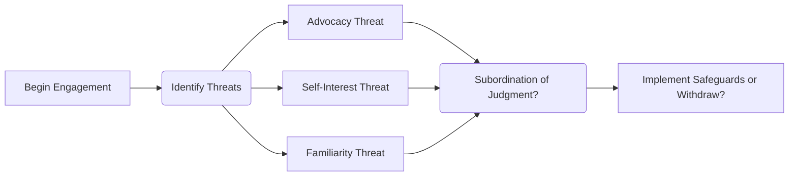

## 21.5 Ethics and Independence in Forensic Engagements

Ethics and independence are cornerstones of any professional accounting engagement, but they take on particular nuances in forensic assignments. Unlike traditional external audits—where independence is rigorously required to maintain credibility—engagements in a forensic capacity may inherently involve an element of advocacy. Consequently, forensic accountants must pay special attention to balancing objective analysis with the legitimate interests of their clients. This section provides a deep dive into the ethical principles, independence requirements, and practical guidelines that govern forensic accounting and investigative audits, ensuring professionals conduct their work with integrity and reliability.

---

## 1. Impartiality in a Forensic Context

### 1.1 Objectivity vs. Advocacy in Litigation
When a forensic accountant is retained by legal counsel or a litigant, the potential arises for an advocacy stance. This can conflict with the typical independence standards found in auditing. However, within the forensic realm, some professional standards permit an appropriate level of advocacy—provided it does not compromise factual accuracy and integrity.

• Avoid “hired-gun” syndrome: The forensic accountant’s role is to present findings grounded in evidence, not to blindly defend a position.  
• Clarify role in the engagement letter: Clearly defining the forensic professional’s scope and objectives helps to set boundaries and expectations.  

### 1.2 Engagement Letter and Scope Definition
One of the most effective strategies for preserving impartiality is a well-crafted engagement letter. This document should:

• Outline the precise services to be performed (e.g., fraud examination, litigation support, or expert testimony).  
• Address any potential conflicts of interest.  
• Clarify the fee arrangement—particularly if it includes contingency components that might challenge objectivity.

---

## 2. AICPA Code of Professional Conduct and Forensic Ethics

### 2.1 Key Prohibitions and Principles
The American Institute of Certified Public Accountants (AICPA) Code of Professional Conduct remains a foundational guideline for CPAs in forensic engagements:

• No Misrepresentation: CPAs must not falsely represent or omit material facts in their reports or testimonies.  
• Avoid Subordination of Judgment: Pressures from a client or legal team should never override the professional’s obligation to remain honest and independent.  
• Contingent Fee Arrangements: While certain forensic services may allow contingency-based fees, CPAs must ensure that such agreements do not undermine their objectivity.

### 2.2 Balancing Independence and Legal Strategy
Given the nature of legal disputes, forensic accountants often work closely with attorneys. Transparency is vital: the accountant should be forthright about the limitations of data, the potential for bias, and any reliance on client-provided information. Upholding the following principles helps maintain integrity:

• Professional Skepticism: Continuously challenge presented facts, validate results, and corroborate evidence through independent means where possible.  
• Ethical Decision-Making Frameworks: Use professional judgment informed by ethical codes and relevant regulations.

---

## 3. Confidentiality Obligations

### 3.1 Handling Sensitive Data
Forensic accountants may access highly sensitive client data: bank records, private emails, intellectual property documents, and more. Ensuring the highest level of data security is not optional—it is mandatory. Best practices include:

• Implementing secure document exchange platforms.  
• Limiting access to sensitive information strictly to team members with a direct need to know.  
• Storing and disposing of data according to recognized data protection frameworks (e.g., encryption, secure shredding).

### 3.2 Non-Disclosure Agreements (NDAs) and Privileged Communications
Often, forensic professionals are required to sign NDAs or fall under attorney-client privilege when engaged by counsel. While privilege can shield certain communications from discovery, the CPA must remain vigilant about not divulging safeguarded information publicly or to unauthorized entities. 

---

## 4. Common Ethical Challenges and Best Practices

### 4.1 Advocacy Threat
When the facts favor a particular client’s position, it can be tempting to “push the envelope.” However, CPAs should remember that an excessive advocacy threat may call into question their independence and credibility in courts or regulatory inspections. 

**Key Strategies to Manage Advocacy Threat**  
• Maintain factual documentation: Keep a clear audit trail of all evidence and procedures.  
• Provide objective rebuttals: If an attorney demands a stance not supported by evidence, communicate the professional risks and ethical obligations.  

### 4.2 Subordination of Judgment
Client or firm pressures can lead to overriding professional opinion—a pitfall that risks severe disciplinary action. When faced with such a scenario, the CPA should:

• Document dissenting opinions and underlying reasons.  
• Seek guidance from a firm’s ethics or compliance officer.  
• If necessary, withdraw from the engagement to preserve integrity.

### 4.3 Contingency Fee Arrangements
While contingency fees or success fees are sometimes negotiated in legal contexts, they can potentially bias an expert’s conclusions. As a best practice, the forensic accountant should consider alternative fee structures or robust disclosures to highlight areas where partiality could be questioned.

---

## 5. Practical Example: Fraud Investigation with Independence Concerns

Imagine a CPA engaged to investigate alleged embezzlement by a public company’s chief financial officer. The law firm representing the board of directors hires the CPA under a contingency arrangement—meaning payment is contingent upon recovering losses from the CFO. 

• As the forensic accountant gathers evidence, they discover discrepancies that suggest potential wrongdoing by other executives.  
• The law firm instructs the forensic accountant to direct focus solely on the CFO’s actions, even though other employees may also be implicated.  
• Ethical Dilemma: The CPA must decide whether to continue a narrow investigation or broaden the scope to ensure completeness and honesty in the final report.  
• Potential Resolution: The CPA documents the conversation, clarifies that ignoring evidence could undermine the report’s credibility, and updates the engagement letter to allow for a broader investigation.

---

## 6. Visualizing Independence Threats: A Mermaid Diagram

Below is a simple Mermaid diagram illustrating the interplay between key ethical threats (Advocacy, Self-Interest, and Familiarity) in forensic engagements and how they might feed into subordination of judgment:

In this visual:  
• “Identify Threats” underscores the initial risk assessment.  
• Each arrow leads to possible ethical pitfalls, such as subordination of judgment, prompting the question of whether additional safeguards or withdrawal is necessary.

---

## 7. Glossary of Key Terms

- **Advocacy Threat**: A threat to objectivity or independence arising if the forensic professional becomes aligned with the client’s cause to a degree that impedes unbiased judgment.  
- **Contingency Fee**: A fee structure where payment is contingent on a favorable outcome or financial settlement, risking impartial decision-making.  
- **Subordination of Judgment**: Occurs when a professional, faced with pressure from a client or superior, relinquishes their objective opinion and professional skepticism.

---

## 8. References and Further Exploration

• **AICPA**:  
  - “Code of Professional Conduct” and “Statements on Standards for Forensic Services.” These resources outline crucial do’s and don’ts for ethics in forensic engagements.  
• **Association of Certified Fraud Examiners (ACFE)**:  
  - The ACFE’s code of ethics addresses conflicts of interest, confidentiality, and integrity, providing further guidance for forensic work.  
• **“Ethics in Forensic Accounting”** by the AICPA Forensic & Valuation Services Section:  
  - Offers comprehensive insights into real-world dilemmas and case studies relevant to ethical challenges in forensic settings.

---

## 9. Conclusion

Maintaining ethics and independence in forensic accounting and investigative audits stands as a cornerstone for enhancing trust, credibility, and the profession’s reputation. By adhering to professional codes, clarifying engagement objectives, and rigorously managing confidentiality, forensic accountants can effectively balance their dual role as both investigators and—in some cases—advocates within a legal framework. The stakes are high, and any lapses in judgment may not only expose CPAs to severe penalties but also undermine the accuracy and reliability of their findings. Adopting best practices, safeguarding against conflicts, and exercising professional skepticism equip forensic accountants to serve their clients ethically, uphold justice, and strengthen public confidence in the accounting profession.

---

## Ethics and Independence in Forensic Accounting Quiz



### Which of the following best describes an advocacy threat?
- [ ] A fee arrangement separate from a formal engagement letter.  
- [ ] Data collection methods potentially violating confidentiality.  
- [x] A threat to objectivity arising when the forensic professional supports the client’s position too strongly.  
- [ ] An error in client’s financial statements due to oversight.

> **Explanation:** Advocacy threat arises when a forensic professional goes beyond objective analysis and becomes excessively aligned with the client’s cause, potentially compromising independence.

### What is the primary risk associated with a contingency fee arrangement in a forensic engagement?
- [ ] High administrative costs.  
- [ ] Unclear lines of responsibility.  
- [x] Bias or partiality in the conclusions reached.  
- [ ] Difficulty in collecting evidence.

> **Explanation:** When the accountant’s compensation depends on the litigation outcome, it may introduce bias into the process, affecting the forensic accountant’s objectivity.

### How can CPAs best address subordination of judgment issues?
- [x] Document differing opinions and, if necessary, withdraw from the engagement.  
- [ ] Defer all professional decisions to the client’s legal team.  
- [ ] Omit contrary evidence to maintain rapport with the client.  
- [ ] Design an alternate fee structure that maximizes revenue.

> **Explanation:** A key strategy is to clearly document any areas of disagreement, consult necessary ethical guidelines, and consider withdrawal if pressures threaten professional skepticism or integrity.

### Which principle is central to the AICPA Code of Professional Conduct in forensic engagements?
- [x] Avoidance of misrepresentation of facts.  
- [ ] Aggressive short-term profit maximization.  
- [ ] Complete reliance on contingency fees.  
- [ ] Maintaining absolute client advocacy above all.

> **Explanation:** Truthful and accurate representation of facts is essential. Aggressive or biased reporting compromises the forensic accountant’s professional obligations under the AICPA Code of Conduct.

### What does it mean to maintain confidentiality in a forensic setting?
- [x] Ensuring sensitive case information is accessible only to authorized persons.  
- [x] Protecting client data by adhering to secure storage and disposal methods.  
- [ ] Subordinating professional skepticism to attorney-client privilege.  
- [ ] Sharing all client data across departments to increase firm awareness.

> **Explanation:** Confidentiality means restricting the circulation of sensitive information to those directly involved in the engagement and implementing rigorous data protection measures.

### When might a forensic accountant need to expand the scope of their investigation?
- [x] If initial findings suggest that additional parties are involved in wrongdoing.  
- [ ] When the client requests to omit flattering evidence.  
- [ ] If the fees negotiated are insufficient.  
- [ ] The forensic accountant should never change the scope once set.

> **Explanation:** If evidence indicates a broader pattern of misconduct or points toward different individuals, the forensic accountant should consider expanding investigative procedures to maintain thoroughness and accuracy.

### Which document provides the foundational structure for professional conduct in forensic engagements?
- [x] The AICPA Code of Professional Conduct.  
- [ ] The Uniform Commercial Code (UCC).  
- [x] Statements on Standards for Forensic Services.  
- [ ] Internal Revenue Code.

> **Explanation:** The AICPA Code and related Statements on Standards for Forensic Services serve as primary references for ethical and practice-based guidelines in forensic engagements.

### Why might a forensic accountant create a detailed engagement letter before commencing work?
- [x] To clarify duties, scope, and limitations, thus mitigating future misunderstandings.  
- [ ] To finalize the client’s legal argument strategy in court.  
- [ ] To delegate all responsibilities to the client’s attorney.  
- [ ] To shift risk management entirely to the client.

> **Explanation:** The engagement letter defines expectations, objectives, billing arrangements, and safeguards that help maintain transparency and protect both the accountant and the client.

### What is the primary purpose of applying professional skepticism in a forensic assignment?
- [x] To thoroughly evaluate gathered evidence without assuming it is correct or complete.  
- [ ] To disregard all client input.  
- [ ] To assume client innocence and downplay red flags.  
- [ ] To navigate possible fee negotiations more effectively.

> **Explanation:** Professional skepticism ensures that the forensic accountant critically assesses all aspects of the evidence, maintaining an objective stance throughout the investigative process.

### True or False: An accountant who uncovers additional irregularities beyond the original scope should always cease the investigation immediately. 
- [ ] True  
- [x] False

> **Explanation:** If new issues arise, the forensic accountant typically either expands the scope to address them or documents the findings and consults with the client for appropriate next steps. Ceasing the investigation may overlook critical facts.



---

## For Additional Practice and Deeper Preparation

**[Auditing & Attestation CPA Mock Exams (AUD): Comprehensive Prep](https://www.udemy.com/course/aud-cpa-mock-exams/?referralCode=D064EF7BD4A84FC6403D)**  
• Tackle full-length mock exams designed to mirror real AUD questions—from risk assessment and ethics to internal control and substantive procedures.  
• Refine your exam-day strategies with detailed, step-by-step solutions for every scenario.  
• Explore in-depth rationales that reinforce understanding of higher-level concepts, giving you a decisive edge on test day.  
• Boost confidence and reduce exam anxiety by building mastery of the wide-ranging AUD blueprint.

_Disclaimer: This course is not endorsed by or affiliated with the AICPA, NASBA, or any official CPA Examination authority. All content is created solely for educational and preparatory purposes._
