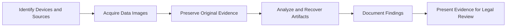

## 21.6 Tools and Technologies in Forensic Audits

Modern forensic audits increasingly rely on advanced tools and emerging technologies to efficiently identify fraudulent behavior, trace digital footprints, and uncover a myriad of concealed activities. As the volume of financial data expands and transactions become more complex, technology-driven approaches help forensic accountants work more accurately and effectively in managing digital evidence. This section delves into the core categories of tools and technologies that forensic auditors employ, focusing on Digital Forensics, Blockchain Analysis, and Machine Learning/Artificial Intelligence (AI). It also discusses industry best practices, common pitfalls, and strategies for successful investigations.

---

## 1. Digital Forensics

Digital forensics is the cornerstone of modern forensic audits, as financial fraud increasingly intersects with digital systems. Through digital forensics, forensic accountants and investigators can:

• Inspect compromised systems (e.g., laptops, servers, and cloud storage) to discover hacking incidents or malicious software.  
• Identify and recover hidden, deleted, or encrypted data on hard drives, USB devices, and mobile phones.  
• Track email exchanges, chat logs, and social media communications for illegal activity.  
• Preserve evidence in formats acceptable to legal authorities, ensuring a proper chain of custody.

### 1.1 Common Digital Forensic Tools

• EnCase: A widely used proprietary suite that allows examiners to image devices, search for evidence, and perform in-depth analysis with robust support from software updates and developer communities.  
• FTK (Forensic Toolkit): Another leading platform offering disk imaging, data carving for deleted files, password cracking, and advanced analytics.  
• Open-Source Forensic Suites: Tools like Autopsy and The Sleuth Kit provide cost-effective, community-supported investigation capabilities, frequently utilized for smaller organizations or in academic settings.

### 1.2 Practical Example: Recovering Deleted Emails

Imagine a scenario where an internal whistleblower reports that a senior manager has been manipulating vendor invoices. The suspect attempts to cover their tracks by deleting evidence from the corporate email server. A forensic auditor will:  
1. Create a bit-by-bit image of the server to avoid altering the original data.  
2. Use a digital forensic tool (e.g., EnCase or FTK) to recover deleted emails and hidden fragments in the server’s slack space.  
3. Analyze timestamps and metadata to identify suspicious patterns, such as mass deletions or tampering with system logs.  

By meticulously preserving and documenting these steps, the auditor ensures the recovered evidence is admissible in potential legal proceedings.

### 1.3 Diagram: Digital Forensic Process

Below is a high-level depiction of a typical digital forensic workflow using Mermaid.js:



This workflow emphasizes the critical steps of identifying devices, creating forensically sound images, preserving evidence integrity, analyzing findings, and finally reporting results.

---

## 2. Blockchain Analysis

As cryptocurrencies and other blockchain-based assets continue to grow in popularity, forensic accountants must develop skills to investigate transactions recorded on decentralized ledgers. Although blockchain transactions are transparent and publicly traceable, participants often use pseudonymous addresses, making it challenging to identify the real owners.

### 2.1 Tracing Crypto Transactions

• Immutability: Blockchain transactions, once verified and added to a block, cannot be modified or deleted, providing an unalterable record.  
• Address Identification: While actual user identities may be obscured, patterns in transaction flows and known transaction “clusters” can sometimes reveal real-world accounts, especially if an exchange or another regulated entity is involved.  
• Specialized Analysis Tools: Platforms like CipherTrace, Chainalysis, and Elliptic use clustering algorithms and big data analytics to map suspicious addresses and link them to known entities or dark web marketplaces.

### 2.2 Practical Example: Investigating Suspect Wallets

A financial investigator discovers a mid-level executive suspiciously received multiple cryptocurrency payments from an external wallet. The company’s policies prohibit undisclosed outside compensation. The forensic accountant can:

1. Use a blockchain analytics platform to track the suspicious wallet.  
2. Identify related wallets that regularly transact with it.  
3. Pinpoint whether the wallet interacts with any regulated exchanges that might hold Know Your Customer (KYC) data.  
4. Request relevant exchange records (via legal avenues) to match the wallet to a particular individual.  

By combining blockchain analytics tools with traditional investigative methods, a forensic auditor can piece together the evidence chain.

### 2.3 Diagram: Simplified Blockchain Investigation

```mermaid
flowchart LR
    A[Public Ledger (Blockchain)] --> B[Suspicious Wallet Address]
    B --> C[Link Analysis]
    C --> D[Associated Wallets/Transactions]
    D --> E[Regulated Exchange (KYC Data)]
    E --> F[Identify Real-World Owner]
```

This diagram outlines a simplified approach to linking on-chain addresses to real-world identities through regulated exchanges and clustering techniques.

---

## 3. Machine Learning and Artificial Intelligence (AI)

Machine learning and AI techniques empower forensic auditors to process vast datasets more efficiently and target anomalies that might otherwise remain hidden. Patterns of fraud often repeat in subtle ways over large transaction volumes. By training algorithms to detect suspicious trends, investigators can dramatically accelerate the detection of discrepancies.

### 3.1 Key Applications in Forensic Audits

• Anomaly Detection: Supervised and unsupervised learning models can detect outliers in transactional data, such as abnormal invoice amounts, unusual vendor addresses, or spikes in employee reimbursements.  
• Link Analysis: Graph-based algorithms reveal relationships between seemingly unrelated entities (i.e., shell companies, offshore accounts) by identifying social networks or business connections.  
• Natural Language Processing (NLP): Emails, text messages, or social media posts can be scanned for specific keywords or suspicious content, saving countless hours of manual review.

### 3.2 Practical Example: Procurement Fraud

A global organization with thousands of suppliers might have challenges monitoring each transaction. By using a machine learning model trained on normal purchasing behavior, the organization can flag suspicious entries, such as:  
• Repeated large invoices submitted just below an approval threshold.  
• Payments routed to newly created bank accounts with no previous transaction history.  
• Vendors with addresses that match an employee’s known address.

Auditors can investigate these red flags more closely, thereby focusing their resources efficiently.

### 3.3 Pitfalls and Considerations

• Data Quality: Inaccurate or incomplete data jeopardizes the efficacy of machine learning algorithms.  
• Model Bias: Improperly trained models might overlook new fraudulent patterns or falsely identify legitimate transactions.  
• Explainability: Auditors must understand how an AI system arrives at specific conclusions—a black box model can be problematic in courts, where the reliability and methodology of evidence must be transparent.

---

## 4. Best Practices for Technology Use in Forensic Audits

1. Maintain a Verified Chain of Custody  
   Always document when, how, and by whom digital evidence was acquired, transferred, and analyzed.

2. Follow Regulatory Guidance  
   • Adhere to FinCEN (Financial Crimes Enforcement Network) regulations, such as those dealing with digital asset transactions and suspicious activity reporting.  
   • In certain industries, standards (e.g., SANS Institute guidelines) provide recommended protocols for collecting and analyzing digital evidence.

3. Collaborate with IT Professionals and Law Enforcement  
   Coordinate with internal IT teams and, when necessary, law enforcement agencies to gather comprehensive data without violating privacy or legal constraints.

4. Keep Software and Skills Updated  
   • Regularly update digital forensic tools to handle the latest forms of encryption or data storage.  
   • Seek continuing education through relevant institutions such as ACFE (Association of Certified Fraud Examiners) or NACVA (National Association of Certified Valuators and Analysts).

5. Document Every Step  
   Clearly record your processes, findings, and the rationale behind each investigative decision so that the evidence is admissible in court and the results can be replicated if challenged.

---

## 5. Glossary

• Digital Forensics: The process of extracting and analyzing digital evidence for legal review, ensuring a verified chain of custody.  
• Blockchain: A decentralized ledger using cryptographic methods to record transactions in blocks, creating an immutable record.  
• Cryptocurrency: A type of digital currency secured by cryptography, often reliant on blockchain technology (e.g., Bitcoin, Ethereum).

---

## 6. Additional Resources

• Regulatory:  
  – [FinCEN (Financial Crimes Enforcement Network)](https://www.fincen.gov/) for guidance on digital assets and money-laundering regulations.

• Institutions & Training:  
  – [SANS Institute](https://www.sans.org/) offers specialized digital forensics courses and certifications.  
  – [ACFE](https://www.acfe.com/) provides comprehensive certification programs focused on fraud detection and prevention.  
  – [NACVA](https://www.nacva.com/) includes forensic education for fraud examinations and valuation engagements.

• Proprietary Tools:  
  – [EnCase](https://opentext.com/products-and-solutions/products/discovery-and-investigation/encase) and [FTK](https://accessdata.com/products-services/forensic-toolkit-ftk) for disk imaging and investigative workflows.  
  – [Chainalysis](https://www.chainalysis.com/), [CipherTrace](https://ciphertrace.com/), or [Elliptic](https://www.elliptic.co/) for blockchain analytics.

• Specialized Courses:  
  – “Blockchain and Financial Forensics” modules offered by ACFE or NACVA, focusing on tracing digital currency transactions.

---

## SEO-Optimized Quiz: Test Your Knowledge of Tools and Technologies in Forensic Audits



### Digital forensics commonly includes:
- [x] Recovering deleted data from hard drives
- [ ] Interviewing suspects in a corporate setting
- [ ] Conducting manual cash counts
- [ ] Designing internal control processes

> **Explanation:** Digital forensics often deals with recovering data that has been deleted or hidden on computer systems, among several other investigative tasks.

### Which of the following best describes the core function of blockchain analysis?
- [ ] To make network access faster and more efficient
- [x] To trace and reconstruct transactions on a decentralized ledger
- [ ] To replace traditional external audits entirely
- [ ] To generate new cryptocurrencies automatically

> **Explanation:** Blockchain analysis focuses on unraveling and reconstructing transactions on a blockchain, helping investigators link suspicious wallets and addresses.

### Machine learning helps forensic auditors primarily by:
- [ ] Limiting their investigation to small data sets
- [ ] Bypassing regulatory requirements
- [x] Identifying anomalies and patterns in large volumes of data
- [ ] Guaranteeing zero false positives

> **Explanation:** Machine learning enhances data handling capacity, allowing auditors to spot suspicious patterns or anomalies in extremely large data sets, though it does not eliminate false positives.

### A risk when using machine learning in forensic audits is:
- [ ] Improving audit quality
- [ ] Reducing the time spent on investigative tasks
- [ ] Increasing the transparency of investigations
- [x] Potential bias or lack of explainability in the model

> **Explanation:** Machine learning models can contain biases and may function as a “black box,” requiring careful scrutiny to maintain integrity and reliability in court.

### EnCase and FTK are examples of:
- [x] Digital forensic software suites
- [ ] Regulatory frameworks
- [x] Tools for capturing and analyzing data from electronic devices
- [ ] New cryptocurrency exchanges

> **Explanation:** EnCase and FTK are powerful, specialized software programs used by digital forensic investigators to capture, image, and analyze data from various devices.

### In blockchain technology, transactions are:
- [x] Permanently recorded and immutable
- [ ] Secretly deleted at regular intervals
- [ ] Easily altered by miners
- [ ] Universally anonymous and untraceable

> **Explanation:** A key blockchain feature is its immutable ledger; once verified, transactions cannot be changed or removed.

### Which of the following best defines digital forensics?
- [x] The process of extracting and analyzing digital evidence under rigorous standards
- [ ] Creating encrypted currency for an organization
- [x] Recovering deleted usernames and passwords from compromised systems
- [ ] Designing a corporate accounting system from scratch

> **Explanation:** Digital forensics is dedicated to preserving and analyzing digital evidence, often including deleted files, while following legally defensible protocols.

### The main benefit of open-source tools like Autopsy and The Sleuth Kit is:
- [x] They can be used without licensing fees
- [ ] They automatically resolve all fraud cases
- [ ] They are unknown to most forensic accountants
- [ ] They are based on outdated programming languages

> **Explanation:** Open-source tools reduce costs and allow greater customization for forensic accountants working within limited budgets or specialized environments.

### A key reason forensic auditors collaborate with IT professionals is:
- [x] To ensure data is collected properly and legally
- [ ] To avoid discovering large-scale fraud
- [ ] To bypass audit standards
- [ ] To extend the investigation indefinitely

> **Explanation:** IT professionals have specialized knowledge about system architecture and regulatory constraints, ensuring that data is collected appropriately and in a defensible manner.

### SANS Institute provides:
- [x] Digital forensics training and certifications
- [ ] Direct control over the blockchain ledger
- [ ] Real-time transaction verification for online retailers
- [ ] Automated system optimization for big data

> **Explanation:** The SANS Institute is renowned for its robust certifications, training, and conferences in cybersecurity and digital forensics.



---

## For Additional Practice and Deeper Preparation

**[Auditing & Attestation CPA Mock Exams (AUD): Comprehensive Prep](https://www.udemy.com/course/aud-cpa-mock-exams/?referralCode=D064EF7BD4A84FC6403D)**  
• Tackle full-length mock exams designed to mirror real AUD questions—from risk assessment and ethics to internal control and substantive procedures.  
• Refine your exam-day strategies with detailed, step-by-step solutions for every scenario.  
• Explore in-depth rationales that reinforce understanding of higher-level concepts, giving you a decisive edge on test day.  
• Boost confidence and reduce exam anxiety by building mastery of the wide-ranging AUD blueprint.

_Disclaimer: This course is not endorsed by or affiliated with the AICPA, NASBA, or any official CPA Examination authority. All content is created solely for educational and preparatory purposes._
