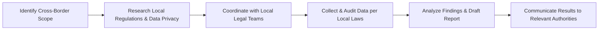
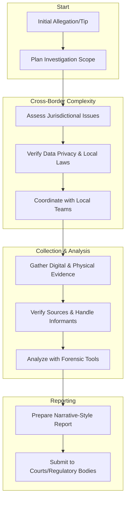

## 21.7 Additional Considerations for Forensic Audits

Forensic auditing spans a broad array of investigative activities designed to discover, analyze, and present evidence related to suspected wrongdoing or fraud. In today’s globalized business environment, forensic auditors must be equipped to handle evolving challenges, from cross-border investigations subject to international regulations, to working with confidential informants, to preparing sophisticated, narrative-style reports that stand up to scrutiny by legal bodies, regulators, and corporate stakeholders. This section delves into these and other key considerations to ensure a well-rounded approach to modern forensic audits.

--------------------------------------------------------------------------------
## Global Investigations

### Overview
Forensic audits often involve businesses and transactions that extend beyond national borders. These cross-border activities can complicate data collection, evidence handling, and reporting requirements. Different countries have distinct regulations related to banking, privacy, data retention, and corporate governance. Consequently, forensic auditors conducting global investigations must be familiar with:

• Differences in accounting and legal frameworks across jurisdictions.  
• Data privacy laws, such as the General Data Protection Regulation (GDPR) in the European Union, which impose strict rules on handling and transferring personal data.  
• Communication barriers arising from cultural and linguistic differences.  

### Data Privacy Concerns
Collecting evidence in countries with stringent data privacy regulations requires advanced planning and respect for local laws. Non-compliance can lead to fines, legal actions, or invalidation of evidence. Key steps include:

1. Identifying applicable data privacy regulations in each jurisdiction (e.g., GDPR, HIPAA for healthcare data in the U.S., PIPEDA in Canada).  
2. Obtaining legal counsel to ensure the collection, storage, and analysis of evidence align with local regulations.  
3. Implementing secure methods of transferring and storing data, such as encryption and controlled-access systems, to reduce the risk of data breaches.  

### Multijurisdictional Collaboration
Forensic teams must frequently coordinate with local experts, law enforcement authorities, and legal advisors to navigate region-specific nuances. Collaboration involves establishing clear protocols for:

1. Communicating with stakeholders in each jurisdiction.  
2. Clarifying roles and responsibilities among teams.  
3. Addressing currency conversion issues, tax laws, and country-specific financial processes.

Below is a simplified illustration of the multijurisdictional approach in global forensic investigations:

The cooperation of diverse legal, linguistic, and financial specialists is essential for ensuring the integrity of the investigation.

--------------------------------------------------------------------------------
## Confidential Informants

### Role of Informants
In complex fraud situations, inside information can be invaluable. Confidential informants—company employees, industry insiders, or external affiliates—may provide leads not apparent from external evidence alone. Forensic accountants must handle such sources with care and diligence:

• Validate the credibility of the informant’s claims and check for ulterior motives.  
• Preserve anonymity to protect the informant and maintain trust.  
• Follow legal and ethical guidelines for gathering information from informants.

### Best Practices
When working with confidential informants:

1. Understand the risks that come with unverified information. Document efforts taken to corroborate the data.  
2. Maintain detailed records of all interactions, ensuring they can be traced back if required in court (while shielding informant identities, as permitted by law).  
3. Consider potential retaliation issues within the organization. When appropriate, inform management or legal counsel so they can take steps to protect the whistleblower.

--------------------------------------------------------------------------------
## Reporting Style in Forensic Audits

### Traditional vs. Narrative-Driven Reports
Unlike standard financial statement audits, forensic audit reports often resemble a detailed narrative—similar to a case study. They aim to paint a clear picture of:

• The timeline and sequence of pertinent events.  
• Discovered patterns indicating possible fraudulent activity.  
• Concealment methods used by perpetrators.  
• Interviews conducted, documented with direct quotes and references to supporting exhibits.  

### Structuring a Forensic Report
Forensic reports need to be robust enough to hold up under the intense scrutiny of courts, arbitration panels, or regulatory bodies. Common components include:

1. Executive Summary: High-level overview of findings and conclusions.  
2. Background: Explanation of the investigation’s context, scope, and objectives.  
3. Methodology: Detailed overview of the investigative process, sources of evidence, and analytical tools used.  
4. Findings: Factual findings arranged chronologically or by incident, supported by exhibits, digital evidence, and interview summaries.  
5. Conclusion & Recommendations: Clearly summarized results, remedial actions, and suggestions for future risk mitigation.

When writing, forensic accountants must keep the potential reading audience in mind—often non-accounting audiences such as judges, jurors, and attorneys. Clarity and well-labeled exhibits are essential.

--------------------------------------------------------------------------------
## Glossary

• **Data Privacy Laws**: Regulations that govern how personal data should be collected, processed, and shared. Key examples include the GDPR in the EU. These laws often dictate permissible evidence collection methods and cross-border data transfers.  

• **Confidential Informant**: An individual who provides sensitive or insider knowledge, often under conditions of anonymity, to aid an investigation or prevent harm.  

• **Global Investigations**: Investigative engagements spanning multiple countries. Practitioners must navigate diverse legal landscapes, linguistic challenges, and regulatory requirements.

--------------------------------------------------------------------------------
## Official Regulations, Institutions, and Tools

### International Institutions
• **Financial Action Task Force (FATF)**: Publishes recommendations for combating money laundering and terrorist financing that guide efforts in multinational investigations.  
• **European Data Protection Board (EDPB)**: Oversees the consistent application of GDPR across EU member states.

### Financial and Forensic Tools
• **E-Discovery Platforms**: Solutions like Relativity, Nuix, or OpenText can handle vast amounts of electronic data across multiple jurisdictions, aiding in efficient and legally compliant data capture and review.  
• **Digital Forensics Software**: Specialized tools (e.g., EnCase, Cellebrite) designed for extracting, preserving, and analyzing electronic evidence from devices such as computers, phones, and servers.

### References for Further Exploration
• **Global Forensic Accounting** by D. Tarantino: Comprehensive guide to cross-border fraud investigations, focusing on the complexities of international regulations.  
• **FATF Recommendations** (www.fatf-gafi.org): Official documents offering authoritative guidance on anti-money laundering and counter-isolation of terrorist financing methods.  
• **Association of Certified Fraud Examiners (ACFE)**: Offers resources, seminars, and certification programs to hone forensic skills.  

--------------------------------------------------------------------------------
## Best Practices and Pitfalls

1. **Coordinate Early with Legal Advisors**: Minimizes the risk of evidence being dismissed due to procedural or regulatory violations.  
2. **Maintain Thorough Documentation**: Create a detailed audit trail from initial suspicion to final report, ensuring every investigative step is properly recorded.  
3. **Adapt to Cultural Norms**: When investigating in foreign countries, cultural sensitivity fosters collaboration and trust with local officials and informants.  
4. **Invest in Training**: Specialist knowledge on digital forensics, interview techniques, and specialized accounting software can greatly enhance investigative efficacy.  
5. **Address Ethical Dilemmas**: Maintaining independence and objectivity is a cornerstone of any forensic engagement. Clearly identify and document any conflicts of interest.

--------------------------------------------------------------------------------
## Potential Challenges and Strategies to Overcome Them

• **Language Barriers**  
  – Use translators or local forensic accountants fluent in the relevant languages.  
• **Complex Legal Environments**  
  – Engage legal professionals in each jurisdiction to interpret local rules on data privacy, anti-corruption, or corporate liability.  
• **Data Overload**  
  – Employ advanced analytics and e-discovery tools to filter large data sets quickly.  
• **Anonymity Concerns**  
  – Establish whistleblower hotlines and protected channels, ensuring compliance with local whistleblower protection laws.

--------------------------------------------------------------------------------
## Diagrams Representing the Forensic Audit Process

Here is a simplified flowchart that encapsulates core elements of additional forensic considerations, spanning from initial planning to final reporting in a global and complex environment:

--------------------------------------------------------------------------------
## Quiz: Test Your Mastery of Forensic Audit Nuances



### Global investigations require special considerations due to:
- [x] Differing local regulations, data privacy laws, and cultural nuances.
- [ ] Uniform legal frameworks across all jurisdictions.
- [ ] Minimal collaboration with local teams.
- [ ] Avoidance of specialized tools or software.

> **Explanation:** Each jurisdiction has unique regulations, languages, and cultural considerations, requiring specialized approaches and sometimes local collaboration.

### A confidential informant in a forensic audit:
- [x] May provide increased insight and hidden information unavailable through standard channels.
- [ ] Automatically discredits any testimony.
- [ ] Removes the need for physical evidence.
- [ ] Is always known to executive management.

> **Explanation:** Confidential informants can be critical in uncovering hidden fraud schemes. However, their identities must often remain anonymous for their protection, and their leads must always be validated.

### How does GDPR primarily affect cross-border forensic investigations?
- [ ] It disallows any form of data collection.
- [ ] It has no impact on forensic work.
- [x] It imposes strict rules governing personal data collection and data transfers across borders.
- [ ] It only applies to the financial industry.

> **Explanation:** The GDPR sets stringent guidelines on how personal data is gathered, stored, and transferred, thus creating additional steps for evidence handling in forensic audits.

### Which best describes the difference between a standard audit report and a forensic audit report?
- [ ] Both reports always contain a disclaimer of opinion.
- [x] Forensic reports are often more narrative, focusing on specific events, timelines, and exhibits.
- [ ] There is no difference; they follow the same format.
- [ ] Standard audit reports include more legal references.

> **Explanation:** Forensic reports often adopt a more detailed, story-like format, presenting a clear picture of suspects, evidence, methods, and timelines.

### Which stakeholder is most likely to review a forensic audit report?
- [x] A judge or jury in a legal dispute.
- [ ] Only the CFO of the audited entity.
- [x] Law enforcement agencies or regulators.
- [ ] Individuals with no interest in the outcome.

> **Explanation:** Forensic reports often serve legal and regulatory processes and may be used as critical evidence in court or by law enforcement.

### When handling data in a global investigation:
- [x] Cybersecurity measures and encryption should be used to protect sensitive information.
- [ ] Only minimal protective measures are necessary.
- [ ] Data privacy laws do not apply.
- [ ] Instruct employees to transmit data via personal email for convenience.

> **Explanation:** In cross-border and sensitive audits, safeguarding information with cybersecurity best practices is essential, especially under regulations like GDPR.

### Cross-border investigations may require:
- [x] Collaboration with experts familiar with local languages or cultural norms.
- [ ] Ignoring foreign regulations since they don’t apply.
- [x] Use of local legal counsel to interpret regional statutes.
- [ ] Excluding any evidence obtained outside the auditor’s home country.

> **Explanation:** Investigations in foreign countries necessitate knowledge of the local environment, including language and legal frameworks, to ensure compliance and uphold evidence validity.

### Ensuring anonymity for a confidential informant helps:
- [x] Protect the informant from retaliation.
- [ ] Makes the source automatically unreliable.
- [ ] Violates the rights of stakeholders.
- [ ] Eliminate the need to gather external evidence.

> **Explanation:** Protecting the informant fosters trust and encourages whistleblowers to come forward, which can be crucial for evidence gathering.

### Which of the following best describes the recommended structure of a forensic audit report?
- [x] Executive Summary, Background, Methodology, Findings, Conclusion & Recommendations
- [ ] No formal structure is needed.
- [ ] Only an Opinion Paragraph.
- [ ] A single-page memo referencing only key points.

> **Explanation:** Managing large volumes of data and sometimes complex timelines requires a structured, clear approach in forensic reporting.

### Under data privacy laws, it is true that:
- [x] Personal data must be collected and processed according to region-specific regulations.
- [ ] Forensic accountants can gather any data they deem relevant without restriction.
- [ ] Data disclosure is mandatory in every phase of the investigation.
- [ ] Local data privacy laws never trump international guidelines.

> **Explanation:** Different countries’ privacy laws often restrict how, when, and why personal information can be collected or transferred. Non-compliance can invalidate the evidence and lead to legal consequences.



--------------------------------------------------------------------------------
## For Additional Practice and Deeper Preparation

**[Auditing & Attestation CPA Mock Exams (AUD): Comprehensive Prep](https://www.udemy.com/course/aud-cpa-mock-exams/?referralCode=D064EF7BD4A84FC6403D)**  
• Tackle full-length mock exams designed to mirror real AUD questions—from risk assessment and ethics to internal control and substantive procedures.  
• Refine your exam-day strategies with detailed, step-by-step solutions for every scenario.  
• Explore in-depth rationales that reinforce understanding of higher-level concepts, giving you a decisive edge on test day.  
• Boost confidence and reduce exam anxiety by building mastery of the wide-ranging AUD blueprint.

_Disclaimer: This course is not endorsed by or affiliated with the AICPA, NASBA, or any official CPA Examination authority. All content is created solely for educational and preparatory purposes._
