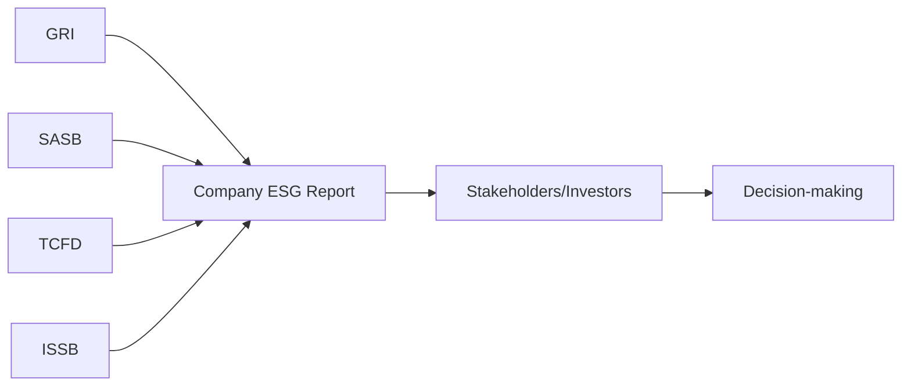

## 22.1 Emerging ESG Reporting Frameworks

Environmental, Social, and Governance (ESG) reporting has emerged as a prime consideration for organizations worldwide due to growing expectations from investors, regulators, and the public at large. In this section, we explore the fundamental concepts of ESG, discuss the leading ESG reporting frameworks, and highlight the relevance of independent assurance for nonfinancial disclosures.

---

### 1. Understanding ESG: Environmental, Social, and Governance

ESG refers to three central factors in measuring an organization’s sustainability and ethical impact:

1. **Environmental (E):**  
   • Climate change and carbon emissions  
   • Energy efficiency and resource management  
   • Waste management and pollution control  
   • Biodiversity and land use

2. **Social (S):**  
   • Labor practices and employee well-being  
   • Occupational health and safety  
   • Community relations and human rights  
   • Diversity, equity, and inclusion (DEI)

3. **Governance (G):**  
   • Board composition and structure  
   • Executive remuneration and compensation policies  
   • Shareholder rights and transparency  
   • Anti-corruption and whistleblower policies  

By assessing these factors, an organization’s stakeholders—including socially responsible investors—evaluate its resilience, ethical practices, and long-term viability. Particularly in recent years, ESG has become an integral part of financial decision-making, prompting companies to integrate broader sustainability considerations into their corporate strategies.

---

### 2. Popular ESG Reporting Frameworks

Several organizations have developed standardized frameworks and guidelines to harmonize ESG disclosures. While these frameworks share broad sustainability objectives, each offers unique metrics and focuses on different aspects of ESG performance.

#### 2.1 Global Reporting Initiative (GRI)
The **Global Reporting Initiative (GRI)** has been at the forefront of sustainability reporting since its inception. GRI Standards guide organizations in disclosing a wide range of social and environmental impacts, ensuring consistency and comparability across different sectors.

• **Sector-Specific Standards:** GRI publishes sector supplements tailored to industries such as mining, financial services, and agriculture.  
• **Emphasis on Stakeholder Inclusiveness:** GRI encourages organizations to consider the information needs of various stakeholder groups.  
• **Material Topics:** Companies identify material ESG topics through stakeholder engagement and feedback processes.

#### 2.2 Sustainability Accounting Standards Board (SASB)
The **Sustainability Accounting Standards Board (SASB)** focuses on financially material sustainability topics for more than 70 industries. SASB’s standards are closely aligned with U.S. capital market expectations.

• **Industry-Focused:** Each industry has specific metrics that link ESG factors to potential financial outcomes.  
• **Investor Perspective:** SASB’s approach addresses investor needs, highlighting material information that can influence investment decisions.  
• **Quantitative Disclosures:** Metrics often specify quantitative measurements, leading to more data-driven ESG reporting.

#### 2.3 Task Force on Climate-related Financial Disclosures (TCFD)
The **Task Force on Climate-related Financial Disclosures (TCFD)**, established by the Financial Stability Board, provides a framework to disclose climate-related risks and opportunities.

• **Risk Management Focus:** Recommends disclosures covering governance, strategy, risk management, and metrics/targets.  
• **Climate-Centric:** Concentrates on the financial implications of climate change, guiding businesses on integrating climate scenarios into planning.  
• **Integration with Mainstream Reporting:** Encourages disclosures in annual or integrated reports to enhance transparency for investors.

#### 2.4 International Sustainability Standards Board (ISSB)
The **International Sustainability Standards Board (ISSB)**—launched under the IFRS Foundation—strives to unify global sustainability disclosure standards.

• **Consolidation of Frameworks:** Building upon the work of existing bodies, including GRI, SASB, and TCFD, to create a single, consistent reporting standard.  
• **Global Reach:** Seeks international adoption to harmonize sustainability reporting worldwide.  
• **Investor-Focused and Decision-Useful:** Emphasizes financial materiality and comparability to meet the needs of capital market stakeholders.

---

### 3. Audit and Assurance Relevance

As ESG reporting continues to gain prominence, many organizations seek external assurance to enhance the credibility of their sustainability disclosures. The auditor’s role may include:

1. **Validating Nonfinancial Data:** Ensuring that reported environmental and social metrics—such as greenhouse gas (GHG) emissions, employee turnover rates, or community investments—are complete and accurate.  
2. **Assessing Alignment with Frameworks:** Verifying whether disclosures meet the requirements of selected reporting frameworks, such as GRI or SASB.  
3. **Evaluating Narrative Consistency:** Checking qualitative disclosures (e.g., board policies on diversity) and confirming alignment with underlying documentation or internal policies.  
4. **Providing Limited or Reasonable Assurance:** Depending on the engagement scope, assurance can be limited (negative assurance) or reasonable (positive assurance). In either case, stakeholders benefit from increased reliability of ESG information.

This assurance not only builds trust with investors but also encourages internal process improvements that can foster long-term organizational resilience.

---

### 4. Nonfinancial Data and the ESG Glossary

In the realm of ESG reporting, several terms recur frequently. Below is a concise glossary.

• **Nonfinancial Data:**  
  Information that reflects an organization’s impact or risk in environmental and social domains without direct monetary quantification. Examples include carbon footprint, water usage, employee satisfaction, and diversity ratios.

• **GRI (Global Reporting Initiative):**  
  A widely recognized pioneer in sustainability reporting, offering detailed standards across environmental, social, and governance matters.

• **SASB:**  
  Focuses on financially material ESG matters unique to each industry, aiding investor decision-making in U.S. capital markets.

• **TCFD:**  
  Provides guidelines on climate risk disclosures crucial for understanding how climate change could affect an organization’s financial health.

• **ISSB (International Sustainability Standards Board):**  
  Aims to create a global benchmark for sustainability reporting, bringing together existing frameworks into a coherent set of standards.

---

### 5. Practical Examples and Real-World Scenarios

Implementing ESG reporting frameworks can be complex. Below are two short examples of how organizations might adopt these standards:

1. **Case Study: Manufacturing Company Using GRI**  
   A large manufacturing company with factories across different continents might adopt GRI Standards to address a broad range of impacts. Beyond offering aggregated carbon emissions data, it discloses metrics like supplier audits for social compliance and invests in local community training programs.

2. **Case Study: Financial Institution Using SASB and TCFD**  
   A global bank may choose SASB standards for industry-specific metrics (e.g., lending practices, cybersecurity, and data protection) while integrating TCFD guidelines to communicate its exposure to climate-related risks, such as the carbon intensity of its loan portfolio.

Both cases highlight the importance of sector- and risk-based approaches to ESG, underlining how ESG disclosures can be tailored and relevant to stakeholders.

---

### 6. Visual Overview of ESG Frameworks

Below is a simplified mermaid diagram illustrating the interplay among the major ESG standards:

• **GRI, SASB, TCFD, and ISSB** each influence a company’s ESG report, shaping disclosures that feed into investor and other stakeholder decision-making.  
• As these frameworks evolve, they increasingly intersect, leading to more harmonized reporting standards.

---

### 7. Key Considerations for Auditors

Auditors engaged to provide assurance on ESG data need to be aware of:

• **Framework Selection:** Understanding the unique requirements, metrics, and underlying assumptions of each framework.  
• **Data Collection and Integrity:** Assessing internal controls over nonfinancial data, including data quality, data governance, and IT systems.  
• **Materiality Determination:** An ESG matter may be material due to significant stakeholder interest or potential financial implications.  
• **Documentation and Evidence:** Collecting sufficient and appropriate evidence for the conclusions reached, particularly for reasonable assurance engagements.  
• **Emerging Standards:** Staying updated on evolving standards from ISSB and other bodies, which may cause frequent changes in reporting requirements.

---

### 8. References and Further Exploration

• **Official Institutions & Resources:**  
  - [GRI Standards](https://www.globalreporting.org/standards)  
  - [SASB Standards](https://www.sasb.org/)  
  - [TCFD Recommendations](https://www.fsb-tcfd.org/recommendations/)  
  - [ISSB - IFRS Foundation](https://www.ifrs.org/groups/international-sustainability-standards-board/)

• **Further Reading:**  
  - “ESG: Do You Know the Standards?” in the Journal of Accountancy  
  - AICPA resources and toolkits for sustainability assurance  

• **Online Courses:**  
  - Coursera’s “Sustainable Finance and ESG Investing”  
  - “IFRS Sustainability Disclosure Standards Updates” on [IFRS.org](https://www.ifrs.org/)

By consulting these materials, auditors and financial professionals can stay informed about developments that shape ESG reporting requirements and assurance engagements.

---

## ESG Assurance Knowledge Check



### The primary objective of the Global Reporting Initiative (GRI) Standards is to:

- [ ] Focus exclusively on reducing greenhouse gas emissions.
- [ ] Measure only financial impacts of sustainability initiatives.
- [x] Provide broad guidance on social and environmental disclosures.
- [ ] Create regulatory mandates for global carbon taxes.

> **Explanation:** GRI Standards encompass a wide array of social and environmental metrics and are not limited to financial or climate-only measurements. They offer comprehensive guidance for organizations across sectors.  

### Which framework emphasizes financially material sustainability topics for investors in U.S. capital markets?

- [ ] International Sustainability Standards Board (ISSB)
- [x] Sustainability Accounting Standards Board (SASB)
- [ ] Task Force on Climate-related Financial Disclosures (TCFD)
- [ ] Global Reporting Initiative (GRI)

> **Explanation:** SASB’s founding principle is to focus on financial materiality and relevance for investors, particularly in U.S. capital markets.  

### TCFD’s major contribution to ESG reporting lies in:

- [ ] Providing specific sector-level metrics for social impacts.
- [x] Recommending climate-related risk disclosures in mainstream reports.
- [ ] Developing global environmental policies enforceable by governments.
- [ ] Measuring carbon emissions on a plant-by-plant basis only.

> **Explanation:** TCFD focuses on climate risk disclosures, emphasizing consistent reporting on governance, strategy, risk management, and metrics/targets within financial filings or integrated reports.  

### The core mission of the International Sustainability Standards Board (ISSB) is to:

- [x] Harmonize sustainability reporting standards globally.
- [ ] Improve IFRS-based financial disclosures only.
- [ ] Define mandatory carbon tax schemes.
- [ ] Provide in-depth sector-specific metrics targeted only at consumers.

> **Explanation:** ISSB’s goal is to unify and standardize sustainability reporting frameworks internationally, providing consistent global standards to enhance comparability and clarity.  

### In ESG reporting, which of the following is considered “nonfinancial data”?

- [ ] Net income from operations.
- [ ] Price-Earnings ratio (P/E).
- [x] Employee turnover rate.
- [ ] Cash flow from investing activities.

> **Explanation:** Employee turnover rate is a social metric that indicates workforce stability and morale, reflecting nonfinancial performance.  

### A reasonable assurance engagement on ESG disclosures most closely resembles:

- [x] A traditional financial statement audit in terms of evidence gathering.
- [ ] A casual conversation with the client to confirm beliefs.
- [ ] Only performing analytical reviews of carbon emissions data.
- [ ] No requirement to document findings.

> **Explanation:** Reasonable assurance engagements require the rigorous collection of evidence and documentation similar to that of a standard financial statement audit to provide a positive opinion.  

### One key difference between limited and reasonable assurance in ESG engagements is:

- [ ] Only reasonable assurance requires professional skepticism.
- [x] Reasonable assurance involves a more in-depth testing of data and controls.
- [ ] Limited assurance excludes reporting on social impact data.
- [ ] Reasonable assurance is entirely qualitative without data verification.

> **Explanation:** Reasonable assurance involves more extensive procedures and higher scrutiny, whereas limited assurance is narrower in scope and primarily focuses on inquiries and limited analytics.  

### SASB-based reporting helps stakeholders by:

- [ ] Providing mandatory government regulations for carbon reduction.
- [ ] Focusing solely on philanthropic activities.
- [ ] Issuing a uniform code of ethics for all industries.
- [x] Linking industry-specific ESG factors to business performance and investor needs.

> **Explanation:** SASB customization by industry ensures reports highlight specific ESG risks and opportunities most relevant to corporate financial performance and investor decision-making.  

### In ESG auditing, “data integrity” primarily refers to:

- [x] The completeness, accuracy, and reliability of nonfinancial data.
- [ ] The company’s commitment to philanthropic giving.
- [ ] Ensuring prices of raw materials remain stable.
- [ ] Reducing the frequency of financial restatements.

> **Explanation:** Data integrity involves safeguarding that the information captured and reported in ESG disclosures is trustworthy—comprehensive, precise, and consistent.  

### Some organizations integrate TCFD recommendations into their annual reports because:

- [x] They want to show investors how climate risks affect their financial outlook.
- [ ] It is a legal requirement in all countries.
- [ ] They are forced by the GRI to include TCFD metrics.
- [ ] It eliminates the need for financial statements.

> **Explanation:** TCFD focuses on climate risk transparency, and including TCFD disclosures in annual reports helps investors understand the climate-related risks and opportunities that may shape a firm’s financial stability.



---

## For Additional Practice and Deeper Preparation

**[Auditing & Attestation CPA Mock Exams (AUD): Comprehensive Prep](https://www.udemy.com/course/aud-cpa-mock-exams/?referralCode=D064EF7BD4A84FC6403D)**  
• Tackle full-length mock exams designed to mirror real AUD questions—from risk assessment and ethics to internal control and substantive procedures.  
• Refine your exam-day strategies with detailed, step-by-step solutions for every scenario.  
• Explore in-depth rationales that reinforce understanding of higher-level concepts, giving you a decisive edge on test day.  
• Boost confidence and reduce exam anxiety by building mastery of the wide-ranging AUD blueprint.

_Disclaimer: This course is not endorsed by or affiliated with the AICPA, NASBA, or any official CPA Examination authority. All content is created solely for educational and preparatory purposes._
