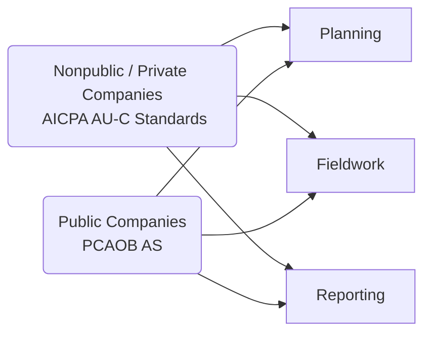

## A.1 Overview

As the regulatory landscape for auditing in the United States continues to evolve, it is essential for practitioners—both aspiring and experienced—to have a strong command of key professional standards. Two major bodies provide authoritative literature in this realm:

• The American Institute of Certified Public Accountants (AICPA), through its Auditing Standards Board (ASB)  
• The Public Company Accounting Oversight Board (PCAOB), established by the Sarbanes-Oxley Act (SOX) to oversee audits of public companies (issuers)

Understanding where each set of standards applies, how they are codified, and how to efficiently reference them is critical for exam preparation and practical auditing work.

---

### The AICPA and Its Role

The AICPA is a voluntary membership organization but holds significant influence in the development of Generally Accepted Auditing Standards (GAAS). Its Auditing Standards Board (ASB) promulgates:

• Statements on Auditing Standards (SAS)
• Clarified Statements on Auditing Standards (AU-C Sections)

Historically, nonpublic company audits in the United States are performed under the directives issued by the AICPA’s ASB. As the professional environment has evolved, the AICPA introduced the “Clarified Statements on Auditing Standards” (SASs) into the **AU-C** codification format to enhance clarity, structure, and alignment with the International Standards on Auditing (ISAs). Practitioners typically cite these standards as “AU-C 200,” “AU-C 315,” “AU-C 700,” and so forth.

---

### PCAOB and Its Mandate

The PCAOB was created in response to high-profile corporate scandals in the early 2000s and derives its authority from the Sarbanes-Oxley Act of 2002. The PCAOB’s standards govern audits of public companies (issuers) and certain broker-dealers. Distinct features of PCAOB oversight include:

• Registration and inspection of public accounting firms conducting issuer audits  
• Enforcement actions against firms or individuals violating PCAOB standards or rules  
• Issuance of Auditing Standards (AS), collaborative rulemaking, and guidance notes  

Examples of PCAOB standards include AS 2110 (Identifying and Assessing Risks of Material Misstatement) and AS 2201 (An Audit of Internal Control Over Financial Reporting That Is Integrated with An Audit of Financial Statements). Mastery of these numbering conventions is beneficial for quick reference and research.

---

### Preparing for the CPA Exam

In the context of the Uniform CPA Examination, especially the Auditing and Attestation (AUD) section, you will be asked to:

1. Distinguish between requirements under AICPA standards for nonpublic entities vs. PCAOB standards for public entities.  
2. Identify the scope and objectives of main standards, such as AU-C 200 (Overall Objectives of the Independent Auditor) or PCAOB AS 2201 (Internal Control Audits).  
3. Apply knowledge of how each standard influences audit planning, fieldwork, evidence-gathering, and reporting.  

Exam questions may focus on areas of overlap (e.g., risk assessment procedures) or differences (e.g., integrated audits for public companies required by PCAOB AS 2201 vs. voluntary for nonpublic companies under AU-C sections).

---

### Navigating the Codification: Quick Tips

Quick navigation is vital in both exam settings and real-world engagements. Here are a few practical strategies:

1. **Learn the Key Sections:** For AICPA Clarified Standards (AU-C), remember that AU-C 200 deals with overall objectives, AU-C 300 with planning, AU-C 315 with understanding the entity and its environment, and AU-C 700 with audit reports.  
2. **Cross-Reference Tools:** AICPA’s online resource and printed materials often include cross-references between old SAS numbers and new AU-C sections.  
3. **Bookmark PCAOB Standards:** Keep a concise chart that pairs the PCAOB AS numbers with their subject matter. For instance, AS 2110 covers risk assessment, while AS 2315 addresses audit sampling.  
4. **Know Interpretation Documents:** Both AICPA and PCAOB issue interpretations to clarify ambiguous areas or address new challenges. Stay up-to-date with these releases; they often contain critical guidance.  

Below is a simple diagram illustrating how each set of standards influences audit engagements:

> This diagram highlights the parallel tracks auditors follow depending on their client type—nonpublic vs. public entities.

---

### Historical Development and Current Trends

Prior to the establishment of the PCAOB, all GAAS were effectively set by the AICPA’s ASB—influenced by pronouncements from the American Accounting Association, SEC guidance, and other professional bodies. After Sarbanes-Oxley, the PCAOB assumed standard-setting and enforcement authority for public company audits. While the PCAOB initially adopted the existing GAAS framework, it has subsequently issued its own standards, which sometimes mirror or refine AICPA principles.

In practice, many auditing concepts remain similar across both bodies. For instance, the notion of professional skepticism is equally emphasized, and risk-based approaches to auditing financial statements are fundamental. However, public company auditors face additional layers of regulation (e.g., more stringent independence rules, mandatory integrated audits of financial statements and internal control).

---

### Applying the Standards: Practical Insights

1. **Planning the Audit:** Under both AU-C 300 and PCAOB AS 2101, the standards emphasize a top-down, risk-based approach. For a nonpublic entity, an auditor may have more latitude in deciding the extent of internal control testing, while for a public company client, integrated audits necessitate a deeper evaluation of internal control over financial reporting.  
2. **Evidence Collection:** Regardless of whether the engagement follows AICPA or PCAOB requirements, sufficiency and appropriateness of audit evidence remain foundational principles.  
3. **Audit Documentation:** PCAOB standards (e.g., AS 1215) and AICPA AU-C sections (e.g., AU-C 230) outline documentation requirements. Noncompliance may lead to disciplinary actions or even litigation.  
4. **Reporting Responsibilities:** AICPA’s AU-C 700 series guides reporting on financial statements for nonpublic entities. PCAOB’s AS 3101 sets forth requirements for public issuers, including the new requirement to communicate critical audit matters (CAMs).  
5. **Ethical Standards:** Although not strictly within auditing standards themselves, practitioners must be mindful of the AICPA Code of Professional Conduct and PCAOB Ethics rules, which shape independence and objectivity.

---

### Glossary

• **AU-C Sections:** The codified format of Clarified Auditing Standards used by the AICPA. For instance, AU-C 315 covers the auditor’s responsibilities to understand the entity’s environment and identify risks of material misstatement.  
• **PCAOB AS (Auditing Standards):** Standards primarily for audits of public companies in the U.S., encompassing everything from risk assessment (AS 2110) to internal control auditing (AS 2201).  
• **SAS (Statements on Auditing Standards):** Issued by the AICPA’s Auditing Standards Board pre-clarification, many of these have been integrated into AU-C sections.  
• **Interpretations:** Formal announcements clarifying ambiguous points or providing additional guidance on how to apply a standard in specific scenarios.

---

### Official Regulations and Resources

Below are essential references to deepen your understanding:

• **AICPA** – [https://www.aicpa.org/research/standards/auditattest](https://www.aicpa.org/research/standards/auditattest)  
  - Offers links to the Clarified Statements on Auditing Standards (AU-C) and related interpretations.  
  - Useful “Audit and Accounting Manual” can guide you through application examples.

• **PCAOB** – [https://pcaobus.org/oversight/standards/auditing-standards](https://pcaobus.org/oversight/standards/auditing-standards)  
  - Access to Auditing Standards (AS), staff guidance, and updates on newly adopted rulings.

• **Reading**  
  - AICPA “Audit and Accounting Manual” provides step-by-step structure for using SAS and AU-C references.  
  - PCAOB Staff Guidance includes interpretive releases on recently adopted standards.

• **Online Courses**  
  - “AICPA Codification Navigation” offered by various CPA review programs. These sessions guide you through finding relevant sections within the codification during real engagements or exam scenarios.  

Staying current with new releases and comparing AICPA and PCAOB updates ensures you will be well-prepared to meet any audit engagement’s demands—public or private—and excel in the AUD section of the CPA Exam.

---

## Key AICPA and PCAOB Auditing Standards: Test Your Knowledge



### Which entity primarily develops auditing standards for nonpublic companies in the United States?

- [x] The AICPA Auditing Standards Board (ASB).
- [ ] The SEC (Securities and Exchange Commission).
- [ ] The Financial Accounting Standards Board (FASB).
- [ ] The Government Accountability Office (GAO).

> **Explanation:** The AICPA Auditing Standards Board (ASB) is responsible for developing auditing standards (generally referred to as GAAS) for nonpublic (private) companies in the U.S.

### Which organization was established under the Sarbanes-Oxley Act to oversee audits of public companies?

- [x] The PCAOB.
- [ ] The AICPA.
- [ ] The FASB.
- [ ] The IRS.

> **Explanation:** The Public Company Accounting Oversight Board (PCAOB) was created by the Sarbanes-Oxley Act of 2002 to oversee the audits of public companies, enhancing the reliability of financial reporting.

### AU-C 315, an AICPA standard, focuses on which aspect of an audit?

- [x] Understanding the entity and its environment to identify risks of material misstatement.
- [ ] Auditing internal control over financial reporting in an integrated audit.
- [ ] Final audit documentation and archiving requirements.
- [ ] Expressing an adverse opinion on internal control deficiencies.

> **Explanation:** AU-C 315 deals with the auditor’s responsibility to identify and assess risks of material misstatement through an understanding of the entity, its environment, and internal controls.

### PCAOB AS 2201 is primarily concerned with:

- [x] The audit of internal control over financial reporting that is integrated with an audit of financial statements.
- [ ] Reporting on special-purpose frameworks.
- [ ] Assessing going concern for nonpublic entities.
- [ ] Fraud risk assessments in a governmental audit.

> **Explanation:** AS 2201 provides guidance on how auditors should conduct an integrated audit of a public company’s financial statements and its system of internal control over financial reporting.

### What is the primary difference between the PCAOB and the AICPA standard-setting scope?

- [x] The PCAOB focuses on standards for public companies (issuers), while the AICPA primarily focuses on nonpublic entities.
- [ ] The PCAOB sets only independence rules, while the AICPA focuses strictly on fraud guidelines.
- [x] The AICPA focuses on GAAP creation, while the PCAOB solely handles tax compliance.
- [ ] Both organizations have identical scopes for all companies.

> **Explanation:** The PCAOB oversees audits of public companies, whereas the AICPA’s Auditing Standards Board establishes auditing standards for nonpublic entities in the U.S.

### Interpretations are best described as:

- [x] Formal guidances clarifying application of existing standards in specific circumstances.
- [ ] Independent rules that override official auditing standards.
- [ ] Regulations issued by the SEC for newly listed companies.
- [ ] Synonymous with GAAP codifications.

> **Explanation:** Interpretations do not replace authoritative standards, but they provide clarification or guidance on how to apply specific auditing standards effectively.

### Which of the following is most closely linked to the concept of professional skepticism?

- [x] Maintaining an attitude that includes a questioning mind and a critical assessment of audit evidence.
- [ ] Relying entirely on the representations of management.
- [x] Automatically assuming that every transaction is fraudulent.
- [ ] Filing immediate charges upon discovering a discrepancy.

> **Explanation:** Professional skepticism requires auditors to continuously adopt a questioning mindset and critically evaluate evidence and management representations without assuming wrongdoing outright or complete trust.

### What is the main objective of PCAOB AS 2110?

- [x] Identifying and assessing risks of material misstatement.
- [ ] Setting independence guidelines for auditors.
- [ ] Establishing rules for special-purpose frameworks.
- [ ] Defining the correct form of a standard audit report.

> **Explanation:** PCAOB AS 2110 governs the risk assessment process in a public company audit, ensuring auditors properly identify and evaluate areas where material misstatements might occur.

### How do AU-C sections help auditors in practice?

- [x] They provide clarity on the overall objectives, planning, conduct, and reporting elements in a private company audit.
- [ ] They only focus on ethical issues in auditing.
- [ ] They replace all GAAP rules regarding revenue recognition.
- [ ] They only apply to government auditing in specific states.

> **Explanation:** AU-C sections organize the AICPA’s Clarified Statements on Auditing Standards, which serve as a roadmap covering every phase of an audit of nonpublic entities.

### True or False: GAAS for nonpublic companies in the United States remain entirely separate and unrelated to PCAOB standards.

- [ ] True
- [x] False

> **Explanation:** Although PCAOB standards primarily address public company audits, they have origins in AICPA-issued GAAS. Many concepts overlap, and both emphasize fundamental audit principles such as independence, due care, and professional skepticism.



---

## For Additional Practice and Deeper Preparation

**[Auditing & Attestation CPA Mock Exams (AUD): Comprehensive Prep](https://www.udemy.com/course/aud-cpa-mock-exams/?referralCode=D064EF7BD4A84FC6403D)**  
• Tackle full-length mock exams designed to mirror real AUD questions—from risk assessment and ethics to internal control and substantive procedures.  
• Refine your exam-day strategies with detailed, step-by-step solutions for every scenario.  
• Explore in-depth rationales that reinforce understanding of higher-level concepts, giving you a decisive edge on test day.  
• Boost confidence and reduce exam anxiety by building mastery of the wide-ranging AUD blueprint.

_Disclaimer: This course is not endorsed by or affiliated with the AICPA, NASBA, or any official CPA Examination authority. All content is created solely for educational and preparatory purposes._
