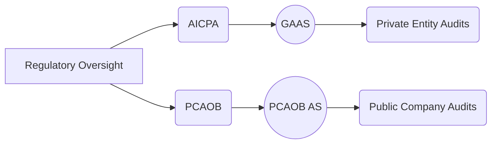

## A.2 General Structure and Scope

The landscape of auditing standards in the United States largely revolves around two primary bodies: the American Institute of Certified Public Accountants (AICPA) and the Public Company Accounting Oversight Board (PCAOB). Each body has established comprehensive guidelines and principles to shape how auditors fulfill their professional obligations. While both sets of standards share fundamental objectives—strengthening the reliability of audited financial statements and fostering public trust in capital markets—distinct differences exist in their scope, applications, and specific requirements. In this section, we examine the overarching structure of the AICPA and PCAOB auditing standards, addressing how each set defines the auditor’s purpose, responsibilities, and methodologies, along with key concepts such as independence, documentation, integrated audits, and a risk-based approach.

-------------------------------------------------------------------------------

### 1. Overview of AICPA and PCAOB

The AICPA sets the tone for non-public entity audits, with its Statements on Auditing Standards (SASs) codified within Generally Accepted Auditing Standards (GAAS). When auditing private companies, nonprofits, or governmental entities not subject to the PCAOB, auditors primarily rely on AICPA standards. On the other hand, the PCAOB—established by the Sarbanes-Oxley Act (SOX) of 2002—oversees public company audits in the United States. Public company auditors are required to comply with the PCAOB’s Auditing Standards (AS), which, while based on GAAS, incorporate supplementary requirements designed specifically for issuers (public companies).

Below is a high-level visual demonstration of how AICPA and PCAOB standards fit into the U.S. regulatory framework:

• AICPA → Establishes and interprets GAAS for non-issuer audits.  
• PCAOB → Sets auditing standards for auditors of public entities (issuers), addressing additional responsibilities related to internal control reporting, risk-based approaches, and inspections of audit firms.

-------------------------------------------------------------------------------

### 2. The AICPA “Principles Underlying an Audit”

The AICPA “Principles Underlying an Audit” provide a conceptual framework for auditors to conduct high-quality engagements under GAAS. These principles revolve around:

1. Purpose of an Audit  
   - The audit exists to provide an opinion on the fairness of the financial statements in accordance with the applicable financial reporting framework. This underscores the unique responsibility auditors have to serve the public interest and bolster confidence in financial disclosures.

2. Responsibilities  
   - Auditors are expected to fully uphold professional ethics.  
   - Maintain appropriate independence to ensure objectivity.  
   - Exhibit due professional care, which includes exercising professional skepticism in assessing evidence.  
   - Apply professional judgment at every step of the engagement.

3. Performance  
   - Auditors must plan the audit properly—identifying significant risks and designing procedures to gather sufficient appropriate evidence.  
   - A risk-based approach to identify and respond to risks of material misstatement ensures the most critical areas are addressed comprehensively.

4. Reporting  
   - The final output of the audit is the auditor’s report, which expresses the auditor’s opinion (qualified, unmodified, adverse, or disclaimer). When additional information is necessary, emphasis-of-matter or other explanatory paragraphs may be included.

-------------------------------------------------------------------------------

### 3. PCAOB Auditing Standards: Expanded Scope for Public Companies

The PCAOB standards align with the foundational elements of GAAS but contain additional layers to address the complex environment of publicly traded corporations. Key expansions include:

1. **Risk-Based Approach**  
   Similar to the AICPA’s GAAS, PCAOB standards emphasize a risk-based methodology. This approach involves identifying areas with higher likelihood of material misstatement—particularly those involving fraud risks, related-party transactions, and complex financial instruments—and tailoring the audit strategy to concentrate resources where they are most needed.

2. **Integrated Audits (AS 2201)**  
   Under PCAOB standards, auditors of public companies often must perform an integrated audit, which simultaneously expresses an opinion on the fairness of the financial statements and the effectiveness of internal controls over financial reporting (ICFR). Auditors evaluate management’s assessment of internal control effectiveness, test control design and operating effectiveness, and issue a separate or combined opinion on ICFR.

3. **Independence Requirements**  
   For publicly listed entities, the independence guidelines are stricter in certain respects, paralleling and sometimes surpassing those in the AICPA Code of Professional Conduct, including rules prohibiting certain non-audit services and mandatory rotation of certain engagement personnel.

4. **Documentation and Inspection**  
   The PCAOB conducts inspections of registered public accounting firms, placing greater emphasis on thorough, consistent engagement documentation. Auditors can face disciplinary measures if documentation or procedures are deemed deficient.

-------------------------------------------------------------------------------

### 4. Independence Requirements and Ethics

While both the AICPA and PCAOB prioritize independence, each set of standards provides detailed guidance on specific scenarios:

• **AICPA**: Independence is governed by the AICPA Code of Professional Conduct. This code stipulates circumstances in which independence can be compromised (e.g., direct financial interests in the client, close personal relationships with client personnel).  

• **PCAOB**: The PCAOB’s Ethics and Independence Rules are particularly strict around certain non-audit services for public companies (e.g., bookkeeping, financial information systems design). The Sarbanes-Oxley Act also requires rotation of the audit partner after a set period and prohibits many consulting engagements for an audit client.  

Retaining independence—both in fact and in appearance—is crucial. Investors and other users of financial statements rely heavily on external auditors to provide unbiased and impartial assessments.

-------------------------------------------------------------------------------

### 5. Documentation and Reporting Considerations

Effective documentation is at the heart of both the AICPA and PCAOB standards. Proper documentation supports:

1. **Audit Conclusions**  
   Workpapers must include evidence that supports the conclusions drawn by the engagement team, enabling supervisors or inspectors to review and replicate key judgments.

2. **Engagement Quality**  
   Throughout the audit process, thorough documentation allows for peer or partner reviews, in line with audit firm quality control requirements. Under PCAOB standards, an engagement quality review (EQR) may be required to evaluate the overall audit quality before the report is issued.

3. **Regulatory Oversight**  
   Whether conducting non-public or public audits, proper documentation is essential for inspections by bodies such as the PCAOB or for peer reviews under the AICPA framework. Inadequate documentation can lead to penalties, fines, or additional scrutiny.

-------------------------------------------------------------------------------

### 6. Risk-Based Approach in Practice

Both AICPA and PCAOB standards underscore the value of applying a risk-based mindset when planning and performing audits:

• **In the AICPA Framework**: Auditors identify inherent risk and control risk, then adjust the nature, timing, and extent of audit procedures accordingly. For instance, an audit of a manufacturing company with an extensive inventory system might allocate more resources to inventory control testing.  

• **Under PCAOB Guidelines**: Public company audits incorporate a similar model but demand an integrated look at controls. If certain controls (like those over revenue recognition) are found deficient, the auditor increases substantive testing to ensure any financial statement misstatements are detected.

By focusing on material misstatements’ likelihood and impact, auditors conduct more efficient and targeted procedures.

-------------------------------------------------------------------------------

### 7. Integrated Audits: Combining Financial Statement and ICFR Opinions

One of the hallmark differences of PCAOB standards is the mandate (for most public issuers) to perform integrated audits. This requirement arose from Sarbanes-Oxley’s intent to confirm that both financial statements and the underlying internal controls used to generate them are reliable.  

• **Testing Controls**: Auditors assess design effectiveness (are the controls properly designed to detect or prevent misstatements?) and operating effectiveness (do they function reliably as intended?).  
• **Issuing Opinions**: At the conclusion of an integrated audit, auditors issue two opinions—one on the financial statements and one on internal control over financial reporting. They may report these opinions together in a combined report or issue separate reports depending on client and regulatory preferences.

-------------------------------------------------------------------------------

### 8. How Standards Influence Engagement Strategy

Adherence to AICPA or PCAOB standards significantly shapes how an auditor plans and executes an engagement. Key elements influenced by these standards include:

1. **Overall Audit Strategy**  
   Both sets of standards emphasize the need for a structured approach to risk assessment. Engagement teams begin by acquiring an in-depth understanding of the client’s business environment, internal controls, and applicable financial reporting frameworks.

2. **Resource Allocation**  
   A risk-based approach mandates devoting more time and personnel to higher-risk areas, such as revenue recognition, complex estimates (e.g., fair value accounting), or controls around significant transactions.

3. **Communication and Reporting**  
   Each standard contains specific requirements for communicating with those charged with governance regarding audit findings, internal control deficiencies, and any significant matters (e.g., fraud, illegal acts). The auditor’s report itself must conform to specific guidelines outlined by either the AICPA or PCAOB.

-------------------------------------------------------------------------------

### 9. Glossary of Key Terms

• **Independence Requirements**: Mandates ensuring the auditor is unbiased and free from conflicts of interest—addressed in both the AICPA Code of Conduct and PCAOB Ethics Rules.  
• **Risk-Based Approach**: Focuses on areas with the highest risk of material misstatement, guiding auditors to adapt procedures accordingly.  
• **Integrated Audits**: Public company audits that combine an opinion on financial statements with an opinion on the effectiveness of ICFR in a single engagement.  

-------------------------------------------------------------------------------

### 10. References and Resources

• **Tools**:  
  – AICPA “Audit Risk Assessment Toolkits”  
  – PCAOB Staff Audit Practice Alerts  

• **Articles**:  
  – “Comparing GAAS and PCAOB Standards” in *The CPA Journal* (provides insights into key similarities and differences).

• **Official Websites**:  
  – AICPA (www.aicpa.org)  
  – PCAOB (www.pcaobus.org)

These resources offer detailed guidance, practical tips, and examples that further clarify the responsibilities and expectations outlined by professional standards.

-------------------------------------------------------------------------------

## AICPA and PCAOB Standards Mastery Quiz



### Understanding the Purpose of an Audit  
- [x] The primary purpose is to provide an opinion on the fairness of the financial statements.  
- [ ] The primary purpose is to reduce taxes due.  
- [ ] The primary purpose is to increase the company’s profitability.  
- [ ] The primary purpose is to manage balanced budgets in government entities.  

> **Explanation:** Under both AICPA and PCAOB standards, the fundamental goal of an audit is to express an opinion on whether the financial statements are presented fairly, in all material respects, in conformity with the applicable framework.

### Elements of the AICPA “Principles Underlying an Audit”
- [ ] Professional competence in marketing.  
- [x] Responsibilities, performance, and reporting.  
- [ ] Only quality control processes.  
- [ ] The Sarbanes-Oxley Act.  

> **Explanation:** The AICPA principles emphasize purpose, responsibilities (ethics, independence, professional skepticism), performance (risk assessment, evidence gathering), and reporting.

### PCAOB Requirement for Integrated Audits  
- [x] Auditors must opine on both internal control effectiveness and financial statements for many public companies.  
- [ ] Private company audits must always be integrated.  
- [ ] Integrated audits only check compliance with laws and regulations.  
- [ ] Auditors in integrated audits never consider internal controls.  

> **Explanation:** Under PCAOB standards, auditors of many public issuers conduct integrated audits to provide assurance on the financial statements and the effectiveness of ICFR, as outlined in AS 2201.

### Independence in AICPA and PCAOB Standards  
- [x] Both sets of standards require independence in fact and appearance.  
- [ ] Only the PCAOB requires independence in fact and appearance.  
- [ ] Only the AICPA requires independence in fact and appearance.  
- [ ] Independence is not required if the CFO is a CPA.  

> **Explanation:** Independence is a non-negotiable requirement in both frameworks, crucial to maintaining public trust in the audit function.

### Documentation Requirements  
- [x] Helps reviewers or regulators understand the work performed and conclusions reached.  
- [ ] Reduces audit fees automatically.  
- [ ] Is optional for small engagements.  
- [ ] Is only relevant to the engagement partner.  

> **Explanation:** Proper documentation is essential for accountability and clarity, allowing others to replicate and evaluate the engagement process.

### Risk-Based Audit Approach  
- [x] Focuses attention on the areas most likely to contain material misstatements.  
- [ ] Randomly assigns audit procedures.  
- [ ] Eliminates the need for any substantive testing.  
- [ ] Is not recommended in modern audit environments.  

> **Explanation:** A risk-based approach allocates resources strategically to areas of higher risk, enhancing the effectiveness and efficiency of the audit.

### Sarbanes-Oxley Act’s Influence on PCAOB Standards  
- [x] It introduced more rigorous independence and inspection requirements for public company audits.  
- [ ] It applies only to governmental audits.  
- [ ] It decreased the scope of integrated audits.  
- [ ] It was never ratified by Congress.  

> **Explanation:** Enacted in 2002, Sarbanes-Oxley played a pivotal role in establishing the PCAOB and imposing stricter rules for auditors of public companies, including integrated audits and increased independence requirements.

### AICPA Code of Professional Conduct  
- [x] Details conditions under which an auditor’s independence could be compromised.  
- [ ] Is optional in private company audits.  
- [ ] Only covers fraud examinations.  
- [ ] Replaces PCAOB standards for public issuers.  

> **Explanation:** The AICPA Code of Professional Conduct outlines independence rules and other ethical requirements for CPAs performing various engagements, including private company audits.

### Engagement Quality Review under PCAOB  
- [x] Provides an additional layer of oversight before the auditor’s report is issued.  
- [ ] Is a marketing function for the audit firm.  
- [ ] Focuses only on tax compliance.  
- [ ] Is optional for public company audits.  

> **Explanation:** An engagement quality review is a fundamental part of the PCAOB’s approach to ensuring overall audit quality, requiring a qualified reviewer to analyze significant judgments and conclusions.

### The Role of Risk Assessment Tools  
- [x] They support the identification and evaluation of inherent and control risks in an audit.  
- [ ] They are designed solely to automate billing for audit clients.  
- [ ] They ignore fraud risk factors.  
- [ ] They are incompatible with GAAS.  

> **Explanation:** Risk assessment tools, especially those provided by the AICPA and PCAOB, help auditors systematically evaluate areas most vulnerable to misstatement threats, including fraud risks and system weaknesses.



-------------------------------------------------------------------------------

## For Additional Practice and Deeper Preparation

**[Auditing & Attestation CPA Mock Exams (AUD): Comprehensive Prep](https://www.udemy.com/course/aud-cpa-mock-exams/?referralCode=D064EF7BD4A84FC6403D)**  
• Tackle full-length mock exams designed to mirror real AUD questions—from risk assessment and ethics to internal control and substantive procedures.  
• Refine your exam-day strategies with detailed, step-by-step solutions for every scenario.  
• Explore in-depth rationales that reinforce understanding of higher-level concepts, giving you a decisive edge on test day.  
• Boost confidence and reduce exam anxiety by building mastery of the wide-ranging AUD blueprint.

_Disclaimer: This course is not endorsed by or affiliated with the AICPA, NASBA, or any official CPA Examination authority. All content is created solely for educational and preparatory purposes._
