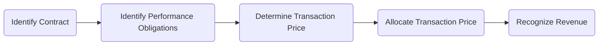

## B.2 Recent Pronouncements Impacting CPA Exam

This section delves into critical accounting and auditing pronouncements that have reshaped practice standards and continue to influence the CPA Exam. From the Revenue Recognition standard (ASC 606) to reimagined auditor reporting guidelines under SAS 134–140, each topic is crucial for aspiring CPAs to grasp thoroughly. These changes introduce conceptual shifts and practical considerations that inform day-to-day audits, financial reporting, and professional judgment.

-----------------------------------------------
## Introduction

Recent years have seen a surge in significant updates to accounting and auditing standards. These changes are more than theoretical constructs—they can dramatically affect how companies recognize revenue, characterize leases, and report on audits. Because the Uniform CPA Examination is continuously updated to reflect the latest standards, it is vital for candidates to be intimately familiar with these pronouncements. This chapter aims to:

• Highlight each pronouncement’s significance and key requirements  
• Offer practical examples and suggested best practices  
• Provide diagrams that illustrate important processes (e.g., the Five-Step Revenue Recognition Model)  
• Reference official resources and real-world guidance materials  

By understanding these recent pronouncements, CPA candidates will be better equipped to tackle exam questions, as well as to apply best practices in their professional roles.

-----------------------------------------------
## 1. Revenue Recognition (ASC 606 / ASU 2014-09)

### 1.1 Overview of ASC 606

The new revenue recognition standard revolutionizes the way companies across various industries recognize and present revenue. ASC 606 (codified from ASU 2014-09) introduces a single, principles-based framework for contracts with customers. This framework aims to standardize revenue accounting across diverse transactions, alleviating inconsistencies among legacy industry-specific guidance.

### 1.2 The Five-Step Revenue Recognition Model

ASC 606 is grounded in a five-step model designed to guide auditors and accounting professionals in identifying, measuring, and recognizing revenue. Below is a Mermaid diagram illustrating the sequence:

1. **Identify the contract with a customer**: Evaluate contract criteria (such as mutual assent, commercial substance, and collectability).  
2. **Identify the performance obligations**: Distinct goods or services promised in a contract are considered separate performance obligations.  
3. **Determine the transaction price**: Estimate the amount of consideration (e.g., fixed or variable) expected to be received.  
4. **Allocate the transaction price**: Assign the determined price among each performance obligation based on relative standalone selling prices.  
5. **Recognize revenue**: Record revenue when (or as) the entity satisfies performance obligations.

### 1.3 Practical Considerations

• **Variable Consideration**: Auditors must ensure management applies an appropriate estimation approach (the “expected value” or “most likely amount”).  
• **Contract Costs**: Some ancillary costs (e.g., commissions) may be capitalized.  
• **Disclosures**: ASC 606 enhances revenue disclosures, requiring more detailed and transparent reporting.

### 1.4 Audit Implications

For auditors, revenue recognition typically bears a high inherent risk, either because of its material significance or potential for fraud. ASC 606 demands robust documentation of management’s judgments, requiring auditors to critically evaluate estimates, internal controls surrounding contracts, and overall compliance. Expect exam questions involving:

• Assessing contract terms and identifying separate performance obligations  
• Evaluating controls for capturing revenue data accurately  
• Testing estimates and assessing any manipulations in variable consideration  

-----------------------------------------------
## 2. Leases (ASC 842 / ASU 2016-02)

### 2.1 Key Changes Under the New Lease Standard

ASC 842 significantly alters the accounting for leases, primarily from the lessee’s perspective. Virtually all leases—except short-term, low-value, or certain specialized leases—must be capitalized, requiring recognition of a Right-Of-Use (ROU) asset and a lease liability.

### 2.2 Key Components of ASC 842

• **ROU Asset and Lease Liability**: Lessees record the present value of future lease payments on the balance sheet.  
• **Classification**: Leases are classified as either finance leases or operating leases. Although the income statement presentation may differ, most leases end up on the balance sheet regardless of classification.  
• **Renewal and Purchase Options**: Auditors must evaluate the likelihood that options will be exercised, as these factors affect lease term and measurement.  
• **Disclosures**: ASC 842 introduces detailed disclosures, such as maturity analyses of lease liabilities and weighted-average discount rates.

### 2.3 Audit Implications

• **Transition Adjustments**: Auditors must verify the client’s transition approach, checking calculations for beginning balances of ROU assets and lease liabilities.  
• **Controls Over Lease Data**: With multiple separate lease agreements, there is room for error when aggregating data. Auditors should confirm the existence of robust internal controls to track and value leases.  
• **Implementation Challenges**: Entities may need new systems or procedures, and auditors should be alert to the potential for incomplete or erroneous system conversions.

-----------------------------------------------
## 3. SAS 134–140 Series: Updated Auditor Reporting Guidelines

### 3.1 Purpose and Objectives

The suite of standards in SAS (Statements on Auditing Standards) 134 through 140 aims to modernize and clarify the auditor’s report, incorporating a more transparent structure and enhanced disclosures regarding auditor responsibilities and the audit process.

### 3.2 Key Elements of SAS 134

• **Opinion Section First**: The revised auditor’s report presents the opinion at the beginning, rather than near the end.  
• **Basis for Opinion**: This section explains management’s responsibility, the auditor’s responsibilities, and relevant ethical requirements, giving stakeholders greater clarity about the audit scope.  
• **Emphasis-of-Matter and Other-Matter**: Clarified definitions and usage; if an auditor needs to draw attention to specific disclosures, they use Emphasis-of-Matter.  
• **Changes to Private Company Reporting**: Although primarily relevant for non-issuers (private companies), the shift toward transparency aligns with global trends in financial reporting.

### 3.3 SAS 135–140 and Related Updates

In tandem with SAS 134, the subsequent SASs (135–140) address:  
• **Required Supplementary Information**: Auditor responsibilities when certain supplementary information accompanies the financial statements.  
• **Other Information**: Clarifies how to address or disclaim certain items outside the financial statements that might escape typical audit procedures.  
• **Communication of Internal Control Matters**: Reiterates the importance of timely communication with those charged with governance.

### 3.4 Audit Implications

• **Increased Transparency**: The updated reporting format can further highlight any complexities or issues in the financial statements.  
• **Exam Focus**: Candidates may encounter questions analyzing how an auditor decides to use Emphasis-of-Matter paragraphs, or how the new report structure influences disclaimers, qualified opinions, and other modifications.

-----------------------------------------------
## 4. SSAE 18: Attestation Engagements (SOC 1, SOC 2, Etc.)

### 4.1 Scope of SSAE 18

SSAE 18 (Statements on Standards for Attestation Engagements) reshapes how CPAs perform and report on examinations, reviews, and agreed-upon procedures. Notably, it governs Service Organization Controls (SOC) engagements, facilitating user organizations’ reliance on robust internal controls at third-party service providers.

• **SOC 1**: Focuses on financial controls relevant to financial reporting.  
• **SOC 2**: Addresses controls around security, availability, processing integrity, confidentiality, and privacy.  
• **SOC 3**: Intended for general use distribution, often in marketing or on service providers’ websites.

### 4.2 New Requirements and Clarifications

• **Risk Assessment**: Requires a deeper analysis of the risks associated with attestation services, paralleling many of the risk-based procedures used in financial statement audits.  
• **Monitoring**: Service organizations must demonstrate that they monitor subservice organizations (if any) to ensure adequate controls.  
• **Enhanced Written Representations**: Management is required to provide more robust representations regarding control designs and operating effectiveness.

### 4.3 Audit Implications and Relevance to CPA Exam

• **Integration with Financial Statement Audits**: If a client uses third-party service providers, a SOC 1 or SOC 2 report can serve as audit evidence. Auditors must validate the control environment and test relevant controls.  
• **Examination vs. Review**: SSAE 18 differentiates between the level of assurance in different engagements, which is often tested in the AUD section’s attestation-related content.

-----------------------------------------------
## 5. Glossary of Key Terms

| Term       | Definition                                                                                     |
|------------|-------------------------------------------------------------------------------------------------|
| **ASC 606** | Framework introducing a 5-step revenue recognition model focused on transfer of control.        |
| **ASC 842** | Lease guidance requiring recognition of ROU assets and corresponding liabilities for most leases. |
| **SAS 134** | Standard restructuring the auditor's report, emphasizing the opinion section and basis for opinion. |
| **SAS 135–140** | Series covering updates on communications about internal control, supplementary information, and more. |
| **SSAE 18** | Overarching attestation standard that introduced updated requirements for SOC 1, 2, and other engagements. |

-----------------------------------------------
## 6. References and Resources

• **FASB Implementation Q&As** for revenue recognition and leases:
  - [Revenue Recognition Implementation Q&As](https://www.fasb.org/revenue)  
  - [Leases (ASC 842) Implementation Q&As](https://www.fasb.org/leases)

• **AICPA “Auditor Reporting FAQs” for SAS 134**:
  - [AICPA Auditor Reporting FAQs](https://www.aicpa.org/interestareas/frc/auditattest/auditorreporting)

• **Major CPA Firm Guidance** (e.g., “Centers of Excellence”):
  - Many large CPA firms, such as Deloitte, PwC, EY, KPMG, and BDO, offer comprehensive, free “help desk” reports or specialized documentation outlining best practices for tackling new standards.

• **FASB Accounting Standards Codification**:  
  - [Access the Codification](https://asc.fasb.org)

• **PCAOB and AICPA** official sites for ongoing updates and exposure drafts of future changes.

-----------------------------------------------
## 7. Concluding Thoughts

Staying current with recent pronouncements such as ASC 606, ASC 842, SAS 134–140, and SSAE 18 is essential for both day-to-day audit practice and success on the CPA Exam. These newer standards demand a more thorough understanding of processes, controls, and disclosures—ultimately fostering transparency and consistency in financial reporting. For CPA candidates, mastery of these topics will enhance analytical abilities and critical thinking skills, both necessary for professional growth.

-----------------------------------------------

## Recent CPA Exam Pronouncements: Test Your Knowledge



### Which of the following best describes the main feature of ASC 606 regarding revenue recognition?

- [ ] It retains industry-specific guidance for certain niche sectors.
- [x] It introduces a principles-based five-step framework for all industries.
- [ ] It only applies to large public companies.
- [ ] It eliminates the need for variable consideration disclosures.

> **Explanation:** ASC 606 implements a five-step revenue recognition process applicable across all industries, reducing previous reliance on fragmented, industry-specific guidance.

### Under ASC 842, what is the significant change for lessees compared to previous lease accounting guidance?

- [ ] Lessees are no longer required to classify leases as operating or finance.
- [x] Most leases must now be recognized on the balance sheet as a Right-Of-Use asset and a corresponding lease liability.
- [ ] Short-term leases are subject to extensive disclosure requirements.
- [ ] Lease expense calculations remain unchanged from previous standards.

> **Explanation:** ASC 842 mandates that lessees record nearly all leases on their balance sheets, distinguishing it from prior off-balance-sheet options under older guidance.

### SAS 134 mainly restructured which key audit document?

- [ ] Audit engagement letters.
- [x] The auditor’s report, moving the opinion section to the beginning.
- [ ] Internal control deficiency memos.
- [ ] Management representation letters.

> **Explanation:** SAS 134 repositions the auditor’s opinion message at the front of the report and updates the “Basis for Opinion” section, providing greater clarity to users.

### Which statement accurately captures the aim of SAS 135–140 updates?

- [ ] They exclusively address the definitions of fraud in audit engagements.
- [x] They refine communications on supplementary information, internal controls, and other matters in auditor reporting.
- [ ] They are unrelated to auditor reporting; they focus on revenue recognition.
- [ ] They eliminate the opinion paragraph entirely from auditor reports.

> **Explanation:** SAS 135–140 clarifies auditors’ responsibilities and increases transparency when addressing supplementary information, communications about internal control, and other aspects of the audit report.

### Which of the below standards is specifically focused on attestation engagements involving service organization controls?

- [ ] SAS 134
- [ ] ASC 606
- [x] SSAE 18
- [ ] ASC 842

> **Explanation:** SSAE 18 deals with attestation engagements, including SOC 1 and SOC 2 reports, which typically handle controls at service organizations relevant to user entities’ financial reporting or data security.

### When conducting a SOC 2 engagement under SSAE 18, which characteristic is typically tested?

- [zip] The client’s compliance with IFRS standards.
- [x] Controls related to security, availability, processing integrity, confidentiality, or privacy.
- [ ] The client’s treatment of intangible assets under GAAP.
- [ ] The classification of operating and finance leases.

> **Explanation:** SOC 2 focuses on service organizations’ controls over security, availability, processing integrity, confidentiality, and privacy of data.

### Which pronouncement would be most directly relevant when auditing a company that offers subscription-based cloud software services?

- [ ] ASC 842, because it deals with intangible assets.
- [ ] SAS 135, because it focuses on intangible asset disclosures.
- [x] ASC 606, as subscription arrangements fall under the five-step revenue model.
- [ ] SAS 134, because it only modifies the layout of the auditor’s report.

> **Explanation:** Subscription-based services often fall under the purview of ASC 606, which covers the timing, measurement, and disclosure of revenue from contracts with customers.

### Which of the following benefits does the updated auditor reporting model (SAS 134) aim to provide?

- [x] Enhanced transparency for users by placing the opinion and basis for opinion prominently.
- [ ] Decreased emphasis on the auditor’s responsibilities and ethical standards. 
- [ ] Complete elimination of emphasis-of-matter paragraphs.
- [ ] Simplified going concern disclosures.

> **Explanation:** SAS 134 addresses the need for greater transparency in audit reporting by restructuring the report format and clarifying the distinction between management’s and auditor’s responsibilities.

### Which concept is vital for determining the lease term under ASC 842?

- [ ] The present value of future variable payments only.
- [ ] The concept of “implied interest rate” alone.
- [x] The reasonable certainty of exercising renewal or termination options.
- [ ] The discount rate set forth by IFRS alone.

> **Explanation:** Under ASC 842, the lease term includes periods covered by extension or termination options if it is reasonably certain that such options will be exercised (or not exercised).

### True or False: SSAE 18 engagements can provide varying levels of assurance, such as a review-level or examination-level assurance.

- [x] True
- [ ] False

> **Explanation:** SSAE 18 covers different types of attestation engagements, including examinations (reasonable assurance) and reviews (limited assurance). The scope and procedures differ depending on the level of assurance requested.



---

## For Additional Practice and Deeper Preparation

**[Auditing & Attestation CPA Mock Exams (AUD): Comprehensive Prep](https://www.udemy.com/course/aud-cpa-mock-exams/?referralCode=D064EF7BD4A84FC6403D)**  
• Tackle full-length mock exams designed to mirror real AUD questions—from risk assessment and ethics to internal control and substantive procedures.  
• Refine your exam-day strategies with detailed, step-by-step solutions for every scenario.  
• Explore in-depth rationales that reinforce understanding of higher-level concepts, giving you a decisive edge on test day.  
• Boost confidence and reduce exam anxiety by building mastery of the wide-ranging AUD blueprint.

_Disclaimer: This course is not endorsed by or affiliated with the AICPA, NASBA, or any official CPA Examination authority. All content is created solely for educational and preparatory purposes._
