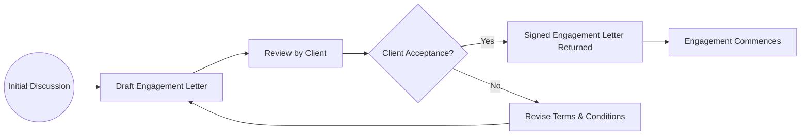

## D.1 Engagement Letters

Engagement letters are foundational documents that define the legal and professional relationship between the external auditor (or accountant) and a client. They clarify the nature, scope, and limitations of the audit or other professional services, such as reviews, compilations, or agreed-upon procedures, and set out respective responsibilities of both the auditor and management. By carefully documenting these roles and responsibilities, engagement letters help to avoid misunderstandings, reduce disputes, and ensure that each party’s obligations are properly understood and fulfilled.

This section provides a comprehensive discussion of the importance of engagement letters, their typical scope, mandatory and best-practice provisions, and references to authoritative bodies, including the AICPA and PCAOB. We also provide illustrative components and discuss variations and disclaimers needed for different kinds of engagements.

---

## 1. Purpose and Importance of Engagement Letters

Engagement letters serve as an explicit contract between the auditor and the client, detailing agreed-upon services and responsibilities. Their primary objectives include:

• Defining the scope of work, including references to the auditing standards (e.g., Generally Accepted Auditing Standards [GAAS] or PCAOB standards).  
• Outlining the auditor’s responsibilities, such as planning and performing the audit, maintaining independence, and providing a final report.  
• Clarifying management’s responsibilities, including the preparation and fair presentation of financial statements, maintaining effective internal controls, and granting access to pertinent information.  
• Establishing timelines, milestones, and schedules for the completion of audit procedures.  
• Communicating fees, billing arrangements, and any additional expenses.  
• Describing common risks and limitations, including disclaimers related to the scope of assurance (especially for compilations or non-audit engagements).

When properly drafted, an engagement letter significantly reduces the possibility of disputes, as both auditor and client can reference the documented terms if any issues arise.

---

## 2. Key Components of an Engagement Letter

While the specific content and structure may vary depending on the type of engagement (audit, review, compilation, or agreed-upon procedures), typical components include:

### 2.1 Scope of Services

This section stipulates the exact nature of the engagement. In audits, for example, the auditor states that the engagement will be performed in accordance with GAAS or PCAOB standards. For reviews or compilations, reference is made to appropriate Statements on Standards for Accounting and Review Services (SSARS), such as AR-C 90 for reviews and AR-C 80 for compilations.

### 2.2 Auditor’s Responsibilities

Often referred to as the Responsibilities Clause, this section discusses:  
• Conduct of the engagement with professional skepticism.  
• Compliance with applicable auditing standards (GAAS/PCAOB).  
• Communication of significant matters to those charged with governance.  
• Maintenance of independence and confidentiality.  
• Required documentation and retention in accordance with regulatory requirements.

### 2.3 Management’s Responsibilities

This section details the client’s obligations regarding:  
• Preparation and fair presentation of financial statements.  
• Establishment and maintenance of an effective system of internal controls.  
• Provision of all relevant data, records, and supporting documentation in a timely manner.  
• Unrestricted access to personnel and premises for examination.  
• Acknowledgment of ultimate responsibility for the financial statements and related disclosures.

### 2.4 Timing, Planning, and Fees

A practical, user-friendly engagement letter includes details on:  
• Expected deadlines or milestones.  
• The audit team’s projected start and end dates.  
• Fee structure, payment terms, reimbursable expenses, and circumstances that may lead to additional fees (e.g., scope expansion).  
• How unforeseen issues or delays might affect timelines and budgets.

### 2.5 Independence and Ethical Considerations

The engagement letter should reassert the auditor’s commitment to ethical standards and independence. For attest engagements involving public clients, PCAOB requirements on independence (and SEC regulations, when applicable) are often cited explicitly. For private entities, reference to AICPA Code of Professional Conduct is common.

### 2.6 Form and Content of Reports

This primarily addresses what sort of reporting deliverables the client can expect. For an audit, it spells out that the final outcome is the issuance of an auditor’s report with an unmodified or modified opinion. For a compilation, the deliverable is typically a compilation report without an opinion, while a review leads to a limited assurance report.

### 2.7 Disclaimers and Disclosures

Many engagement letters contain disclaimers of liability or other disclosures. In compilation engagements, for instance, the practitioner disclaims that no audit or review procedures will be performed and, therefore, no assurance is provided. Some engagement letters may also include limitation of liability clauses, depending on jurisdictional allowances.

### 2.8 Acceptance and Signatures

Engagement letters conclude with signature blocks for authorized representatives from both the audit firm and client. Both parties should sign and date the letter, signaling mutual agreement and acceptance of the terms.

---

## 3. Typical Engagement Letter Example

Below is a high-level excerpt of what a simple audit engagement letter might look like:

────────────────────────────────────────────
[Date]

[Client]
[Address]

Subject: Audit Engagement Letter

Dear [Client Contact Name]:

We are pleased to confirm our understanding of the services we will provide to [Client Name] for the fiscal year ending [Date]. This letter outlines the nature of our engagement and related arrangements:

1. SCOPE OF SERVICES  
   We will conduct our audit in accordance with [GAAS/PCAOB Standards]. The objective of our audit is to express an opinion on the financial statements of [Client Name].

2. AUDITOR’S RESPONSIBILITIES  
   We will plan and perform the audit with professional skepticism and in compliance with professional standards. We will obtain reasonable, but not absolute, assurance that the financial statements are free from material misstatement.

3. MANAGEMENT’S RESPONSIBILITIES  
   You are responsible for the fair presentation of the financial statements, the design and implementation of internal controls, and providing unrestricted access to records and personnel.

4. FEES AND BILLING  
   Our fees are based on the time required and our standard hourly rates. We estimate the total fees for this engagement to be approximately [$XXX]. Payment terms are [Specific Terms].

5. REPORTING  
   Upon completion of the audit, we will express our opinion on the financial statements. If any circumstances arise that inhibit us from completing the engagement or forming an opinion, we will discuss this with you promptly.

6. INDEPENDENCE  
   We confirm that we are independent with respect to [Client Name] within the meaning of [Relevant Standards].

7. OTHER MATTERS  
   This letter shall be governed by the laws of [Jurisdiction]. No waiver or modification shall be valid unless expressly agreed in writing.

If you agree with the terms of our engagement, please sign this letter and return one copy to us. We look forward to working with you.

Sincerely,  
[Audit Firm Name]  
[Partner or Authorized Signatory]

Acknowledged and Accepted by:  
[Client Representative Name]  
[Title]  
Date: _____________________
────────────────────────────────────────────

---

## 4. Visualizing the Engagement Letter Process

Below is a simple Mermaid diagram illustrating the flow of engagement letter activities between auditor and client:

• Initial Discussion (A) – Preliminary brainstorming and scoping.  
• Draft of Engagement Letter (B) – Auditor prepares the document based on relevant standards.  
• Review by Client (C) – Client evaluates the letter’s feasibility, scope, and financial impact.  
• Client Acceptance (D) – If the client agrees, they sign; if they do not, renegotiation occurs.  
• Commencement (G) – Once the letter is signed, the engagement officially begins.

---

## 5. Variations for Different Engagement Types

### 5.1 Review Engagements (AR-C 90)

In a review engagement, the practitioner obtains limited assurance that no material modifications need to be made to the financial statements. The engagement letter typically emphasizes the reduced level of assurance as compared to an audit.

• The letter notes that the accountant is not performing an audit and is not providing an opinion.  
• Key disclaimers often indicate that review procedures consist primarily of inquiry and analytical procedures.  
• Management’s responsibilities remain similar to audit engagements, including the preparation and fair presentation of financial statements.

### 5.2 Compilation Engagements (AR-C 80)

In a compilation, the accountant is engaged to present financial statements based on information provided by management, without undertaking to obtain or provide any assurance. The engagement letter includes:

• A disclaimer that the financial statements may not be suitable for all audiences, and the accountant is not issuing an opinion or assurance.  
• Clear articulation that management is responsible for the accuracy and completeness of the financial data.  
• Details on responsibilities for discovering errors or fraud typically do not apply under compilation engagements.

### 5.3 Agreed-Upon Procedures

When the client requests specific procedures (e.g., verifying cash balances, checking specific contractual terms, or other targeted objectives), the engagement letter:

• Outlines the precise procedures to be performed.  
• Specifies that no opinion is rendered, as the user (specified parties) must form their own conclusions.  
• May clarify that the agreed-upon procedures report is restricted to those parties who have agreed upon the procedures.

---

## 6. Limitation of Liability and Other Jurisdictional Considerations

Some engagements include clauses attempting to limit the auditor’s liability in specific ways, but these must be carefully evaluated for compliance with local laws and professional standards. Many jurisdictions have limitations on enforceability or require certain disclaimers to be explicitly stated. In all circumstances, the engagement letter should not contradict the auditor’s professional obligations under GAAS, PCAOB standards, or other regulatory frameworks.

---

## 7. Best Practices, Common Pitfalls, and Strategies

• Maintain Clear Communication: Engage in open discussion with management to address questions or concerns before finalizing the letter.  
• Provide Sufficient Detail: Ensure scope and responsibilities are thoroughly explained. Vague language often leads to misunderstandings.  
• Update Annually or as Needed: Engagement letters should be revisited for recurring engagements to incorporate changes in scope, regulatory standards, or fee structures.  
• Watch for “Scope Creep”: If additional requests arise that are not in the previously signed engagement letter, consider issuing an addendum.  
• Stay Current with Standards: Evolving standards, such as revised audit or review guidance from AICPA or PCAOB, may require updated engagement letters.

---

## 8. References and Resources

• AICPA Sample “Audit Engagement Letter” – Visit the AICPA website for standardized templates that practitioners can adapt to their specific engagements.  
• AR-C 80 and AR-C 90 – Provide detailed guidance on compilation and review engagements, respectively.  
• AICPA Code of Professional Conduct – Offers ethical guidelines that should underpin all engagements.  
• PCAOB Auditing Standards – Essential for auditors of public companies and for references to independence rules.  

---

## Engagement Letters Knowledge Check Quiz



### Engagement letters outline which of the following key aspects?
- [x] Scope, responsibilities, fees, and reporting format.
- [ ] Only the contact information of the auditor and client.
- [ ] The auditor's professional background.
- [ ] The final audit opinion.
> **Explanation:** Engagement letters primarily focus on delineating the scope of services, responsibilities of both parties, associated fees, and the nature of the final deliverable (e.g., report format).

### The Responsibilities Clause in an engagement letter primarily addresses:
- [x] Management’s obligations, including providing financial data and access to records, and the auditor’s obligation to conduct procedures in conformity with professional standards.
- [ ] Only the auditor’s obligations under GAAS.
- [ ] How the auditor will remain independent.
- [ ] Project management timelines.
> **Explanation:** The Responsibilities Clause focuses on both auditor and management responsibilities, confirming that management holds ultimate responsibility for the financial statements and must provide all necessary information.

### Which standard commonly applies to review engagements in the United States?
- [x] AR-C 90.
- [ ] AR-C 80.
- [ ] PCAOB AS 2105.
- [ ] International Financial Reporting Standards (IFRS).
> **Explanation:** AR-C 90 governs review engagements under the SSARS (Statements on Standards for Accounting and Review Services). AR-C 80 governs compilation engagements.

### In a compilation engagement letter, which disclaimer is most often emphasized?
- [x] No assurance is provided on the financial statements.
- [ ] The auditor is fully responsible for detecting fraud.
- [ ] The engagement is identical to an audit.
- [ ] The client’s financial records are not subject to any verification.
> **Explanation:** A compilation engagement letter should clarify that the practitioner merely presents information without providing assurance about its reliability or completeness, significantly contrasting with an audit or review.

### Which of the following statements regarding limitation of liability clauses is accurate?
- [x] They may be permissible but are subject to jurisdictional rules and professional standards.
- [ ] They always release the auditor from any legal liability.
- [ ] They do not require client consent to be effective.
- [ ] They are mandatory in all engagement letters by AICPA regulation.
> **Explanation:** Limitation of liability clauses can be included, but their enforceability depends on local laws and cannot override professional obligations or client rights without explicit agreement.

### In an agreed-upon procedures engagement, the letter typically specifies:
- [x] Exactly which procedures the accountant will perform and states that no opinion is rendered.
- [ ] Only that limited assurance is provided.
- [ ] That the engagement will be conducted as if it were an audit.
- [ ] That unlimited liability is assumed by the accountant.
> **Explanation:** In agreed-upon procedures, the precise tasks to be completed are dictated by the client’s requests, and the accountant does not issue an opinion or provide assurance beyond those procedures.

### Why should recurring engagement letters be updated periodically?
- [x] Changing standards, scope alterations, or fee adjustments necessitate updated terms.
- [ ] They should not be updated, as the original letter is permanently valid.
- [ ] Only changes in management call for letter updates.
- [ ] They cannot be modified once signed, without court approval.
> **Explanation:** Auditing standards, fees, or engagement scope may change over time. Updating the engagement letter ensures both parties have accurate, current terms guiding their relationship.

### Which component is typically NOT included in an audit engagement letter?
- [x] A detailed quality review of every subsidiary’s financial statements by default.
- [ ] The scope of the audit.
- [ ] Reference to standards being used (GAAS or PCAOB standards).
- [ ] Management’s responsibilities.
> **Explanation:** An engagement letter outlines the strategy, responsibilities, and scope, but it typically does not encompass full details of procedures for every subsidiary, unless it is explicitly part of the engagement.

### What is the primary benefit of an engagement letter for both auditor and client?
- [x] Minimizing misunderstandings by clearly defining mutual expectations.
- [ ] Guaranteeing an unmodified audit opinion.
- [ ] Providing the final financial statements.
- [ ] Ensuring that management will eliminate all risks of fraud.
> **Explanation:** The key purpose is to establish clarity to prevent disputes and confusion about the scope of services, responsibilities, and fees.

### Is an auditor required to mention independence considerations in an engagement letter?
- [x] True
- [ ] False
> **Explanation:** Independence is a fundamental principle for auditors, especially for attestation services. Many engagement letters explicitly remind clients of this requirement.



---

## For Additional Practice and Deeper Preparation

**[Auditing & Attestation CPA Mock Exams (AUD): Comprehensive Prep](https://www.udemy.com/course/aud-cpa-mock-exams/?referralCode=D064EF7BD4A84FC6403D)**  
• Tackle full-length mock exams designed to mirror real AUD questions—from risk assessment and ethics to internal control and substantive procedures.  
• Refine your exam-day strategies with detailed, step-by-step solutions for every scenario.  
• Explore in-depth rationales that reinforce understanding of higher-level concepts, giving you a decisive edge on test day.  
• Boost confidence and reduce exam anxiety by building mastery of the wide-ranging AUD blueprint.

_Disclaimer: This course is not endorsed by or affiliated with the AICPA, NASBA, or any official CPA Examination authority. All content is created solely for educational and preparatory purposes._
