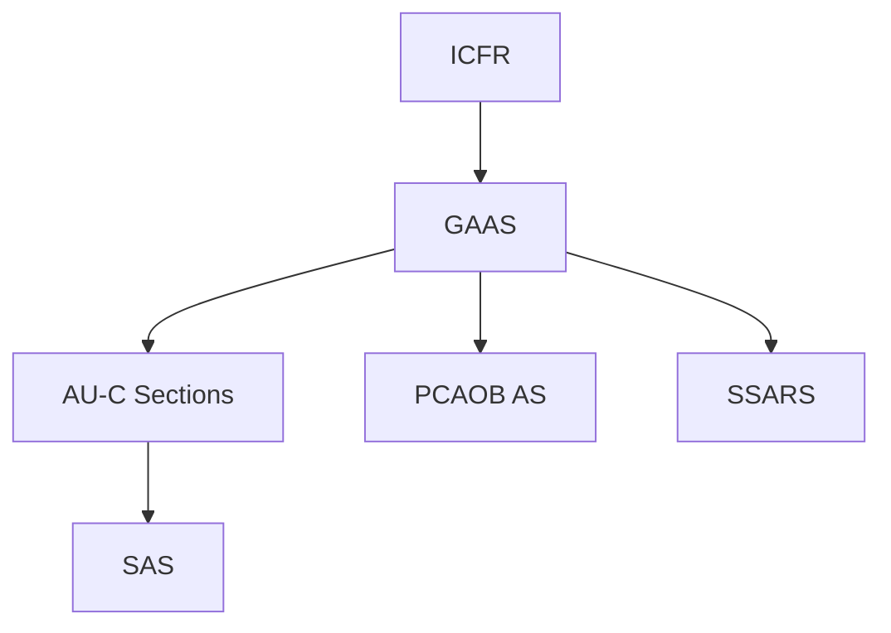

## E.1 Comprehensive Definitions

A well-structured glossary is crucial for mastering the Auditing and Attestation (AUD) exam content. Below, you’ll find an extensive list of key terms, abbreviations, and conceptual phrases commonly encountered across audit engagements, regulatory guidelines, and professional standards. While this comprehensive reference aligns closely with the AICPA and PCAOB frameworks, remember that each public or private engagement may involve unique requirements.

Use this glossary to clarify the distinctions between various standards (GAAS, PCAOB AS, SSARS, SSAE), specialized forensic terms, IT auditing concepts, and more. As the auditing profession evolves with new regulations, technologies, and best practices, staying fluent in these terms ensures competence and agility in audit engagements.

---

Figure: A simplified overview of how various auditing standards interconnect with GAAS as the broader framework.

---

### 1. AU-C (Clarified Statements on Auditing Standards)
• Definition: “AU-C” refers to the Clarified Statements on Auditing Standards (SASs) issued by the AICPA’s Auditing Standards Board (ASB). They are the codified standards guiding non-issuer (non-public) audit engagements under Generally Accepted Auditing Standards (GAAS).  
• Purpose: AU-C sections address the auditor’s responsibilities, from risk assessment to reporting, ensuring consistent application of professional standards across engagements.  
• Notable Points:  
  – The “clarified” standards restructured older SASs into an easier-to-navigate framework.  
  – AU-C 200, for example, outlines the overarching objectives and the nature of an audit (responsible use of professional judgment, obtaining reasonable assurance, etc.).

### 2. PCAOB AS (Public Company Accounting Oversight Board Auditing Standards)
• Definition: PCAOB AS stands for the auditing standards set forth by the Public Company Accounting Oversight Board.  
• Applicability: These standards apply primarily to audits of issuers (public companies in the U.S.) and certain broker-dealers.  
• Why It Matters:  
  – PCAOB standards emphasize risk assessment, documentation, and engagement quality reviews.  
  – They place substantial focus on internal control over financial reporting (ICFR) in integrated audits for public companies.

### 3. SAS (Statements on Auditing Standards)
• Definition: SAS are pronouncements by the AICPA Auditing Standards Board before and after the clarification project. Although more recent guidance is codified in the AU-C sections, many auditors still refer to updated “SAS” numbers when referencing new or revised standards.  
• Relationship with AU-C: Each SAS is transformed into a corresponding AU-C section. For instance, SAS 135 becomes part of the codified AU-C sections on required communications with those charged with governance.  
• Best Practices: Familiarize yourself with both the SAS number and the related AU-C section to navigate older professional references effectively.

### 4. SSARS (Statements on Standards for Accounting and Review Services)
• Definition: SSARS are promulgated by the AICPA’s Accounting and Review Services Committee (ARSC). These standards guide accountants performing reviews, compilations, and preparation engagements for non-public entities.  
• Key Differentiators:  
  – SSARS engagements provide limited (reviews) or no assurance (compilations, preparations) on financial statements.  
  – Unlike a full-scope audit, practitioners under SSARS do not express an opinion on the financial statements’ fairness.

### 5. SSAE (Statements on Standards for Attestation Engagements)
• Definition: SSAE are standards issued by the AICPA for attest engagements other than audits or reviews of historical financial statements. These include examinations, reviews, or agreed-upon procedures over subject matters such as compliance, prospective financial statements, or controls at service organizations.  
• Examples: SSAE 18 established a new attestation framework, which forms the basis for SOC reports (e.g., SOC 1, SOC 2).  

### 6. SOC (System and Organization Controls)
• Definition: SOC refers to a suite of assurance engagements under SSAE, focusing on various levels of controls at service organizations.  
• Main Types:  
  – SOC 1: Addresses controls relevant to user entities’ internal control over financial reporting (ICFR).  
  – SOC 2: Evaluates controls related to security, availability, processing integrity, confidentiality, and privacy (commonly used in IT service environments).  
  – SOC 3: Similar to SOC 2 but intended for a broader, more general-use audience.  

### 7. ICFR (Internal Control over Financial Reporting)
• Definition: ICFR encompasses an entity’s processes designed to provide reasonable assurance regarding the reliability of financial reporting and the preparation of financial statements in accordance with GAAP.  
• Importance:  
  – ICFR is vital in integrated audits of public companies as mandated by PCAOB.  
  – Deficiencies in ICFR can lead to increased risk of material misstatement in financial statements.

### 8. ERISA (Employee Retirement Income Security Act)
• Definition: ERISA is a U.S. federal law that sets minimum standards for pension and welfare benefit plans, safeguarding employee retirement assets.  
• Auditor’s Role:  
  – Many employee benefit plan audits must comply with both ERISA and DOL requirements.  
  – Specific auditing guidelines ensure proper coverage of participant eligibility, contributions, benefit payments, and plan investments.

### 9. SEC (Securities and Exchange Commission)
• Definition: The SEC is the federal agency responsible for enforcing federal securities laws, regulating the securities industry, and overseeing U.S. stock exchanges.  
• Significance in Auditing:  
  – Public companies must file periodic reports (10-K, 10-Q, 8-K) in compliance with SEC requirements.  
  – The SEC has authority over PCAOB standard-setting and registration of public accounting firms that audit public entities.

### 10. COSO (Committee of Sponsoring Organizations of the Treadway Commission)
• Definition: COSO is a joint initiative of private-sector organizations dedicated to improving organizational performance through developing frameworks for internal control, enterprise risk management (ERM), and fraud deterrence.  
• Core Components of COSO Internal Control Framework:  
  – Control Environment  
  – Risk Assessment  
  – Control Activities  
  – Information and Communication  
  – Monitoring Activities  
• Why It Matters: COSO remains the primary framework under which ICFR is evaluated in both public and private engagements.

### 11. NIST (National Institute of Standards and Technology)
• Definition: A U.S. Department of Commerce agency that develops technology, metrics, and standards including prominent cybersecurity frameworks like the NIST Cybersecurity Framework (NIST CSF).  
• Relevance to Audit:  
  – Auditors assessing cybersecurity risk may reference NIST guidelines.  
  – NIST’s approach to identifying, protecting, detecting, responding, and recovering from cyber threats complements an organization’s existing internal control assessments.

### 12. GAO (Government Accountability Office)
• Definition: The GAO is an independent, nonpartisan agency that works for Congress, often called the “Congressional Watchdog.”  
• Auditing Impact:  
  – GAO issues Government Auditing Standards (the “Yellow Book”), which includes standards for audits of government entities, programs, activities, and functions.  
  – When single audits are conducted (for federal awards), GAO guidance often comes into play.

### 13. FASB ASC (Financial Accounting Standards Board Accounting Standards Codification)
• Definition: The FASB ASC is the single source of authoritative non-governmental GAAP in the United States.  
• Structure: ASC organizes pronouncements from FASB, EITF (Emerging Issues Task Force), and other relevant bodies into an online database of accounting topics.  
• Significance for Auditors:  
  – Knowledge of the ASC is pivotal for evaluating the appropriateness of financial statement presentations and disclosures.  
  – Frequent updates to the ASC require ongoing awareness of changes in GAAP.

### 14. GAAS (Generally Accepted Auditing Standards)
• Definition: GAAS are a set of systematic guidelines used by auditors when conducting audits of financial statements. They are primarily established by the AICPA’s Auditing Standards Board for non-issuer engagements.  
• Categories of GAAS:  
  – General Standards: Relate to the qualifications and quality of work performed by the auditor.  
  – Standards of Fieldwork: Focus on planning, understanding of internal control, and gathering sufficient appropriate audit evidence.  
  – Standards of Reporting: Address the form and content of the auditor’s report.  

### 15. GAAP (Generally Accepted Accounting Principles)
• Definition: GAAP represents the common set of U.S. accounting principles, standards, and procedures that companies must follow when they compile their financial statements.  
• Source: Primarily the FASB for nongovernmental entities and GASB for governmental entities.  
• Relation to FASB ASC: All GAAP guidance is now consolidated within the ASC for easier reference and consistent application.

### 16. PCAOB (Public Company Accounting Oversight Board)
• Definition: Established by the Sarbanes-Oxley Act of 2002, the PCAOB oversees audits of public companies to protect the interests of investors.  
• Key Activities:  
  – Registration of public accounting firms.  
  – Setting auditing and professional practice standards.  
  – Conducting inspections of registered firms.  
  – Enforcing compliance with PCAOB and SEC rules.

### 17. AICPA (American Institute of Certified Public Accountants)
• Definition: The AICPA is the national professional organization for Certified Public Accountants in the United States.  
• Role in Auditing:  
  – Issues standards via the Auditing Standards Board (ASB).  
  – Provides resources, continuing education, and guidelines for CPA members.  
  – Publishes the Uniform CPA Examination in conjunction with NASBA.  

### 18. Forensic Accounting
• Definition: A specialty practice area of accounting that describes engagements resulting from actual or anticipated disputes or litigation.  
• Uses in Audit:  
  – Forensic accounting services may involve investigating suspected fraud.  
  – Reports may serve as evidence in legal proceedings or for insurance claims.

### 19. Materiality
• Definition: A concept that guides an auditor’s judgments about whether misstatements, individually or in aggregate, could reasonably influence the economic decisions of users based on the financial statements.  
• Types:  
  – Overall Materiality (Planning Materiality).  
  – Performance Materiality (Used for scope and testing thresholds).

### 20. Fraud Triangle
• Definition: A theoretical model explaining factors contributing to fraud: Pressure, Opportunity, and Rationalization.  
• Audit Impact:  
  – Emphasized in risk assessment procedures.  
  – Auditors look for red flags indicating one or more triangle components.

---

## References and Resources

• Official Websites:  
  – [AICPA](https://www.aicpa.org/)  
  – [PCAOB](https://pcaobus.org/)  
  – [FASB](https://www.fasb.org/)  
  – [GAO](https://www.gao.gov/)  

• Reading Recommendations:  
  – “Master Glossary in the FASB ASC,” available at [asc.fasb.org](https://asc.fasb.org/).  
  – AICPA’s “Professional Standards,” including up-to-date SAS, SSARS, and SSAE.  
  – [journalofaccountancy.com](https://www.journalofaccountancy.com/) for ongoing discussions and definitions of new audit terms.  

• Internal Use Tools:  
  – Online auditing and accounting dictionaries, either from professional bodies or recognized publishers.  
  – AICPA’s Audit & Attest Guides for deeper dives on specialized topics.

---

## Test Your Knowledge: Comprehensive Auditing Terminology Quiz



### Which entity issues Government Auditing Standards (the “Yellow Book”)?

- [ ] FASB  
- [ ] PCAOB  
- [x] GAO  
- [ ] AICPA  

> **Explanation:** The Government Accountability Office (GAO) publishes the Yellow Book, which provides standards and guidance for government audits and single audits.

### What framework is commonly used to evaluate Internal Control over Financial Reporting (ICFR)?

- [ ] NIST  
- [x] COSO  
- [ ] ERISA  
- [ ] FASB ASC  

> **Explanation:** The COSO Internal Control–Integrated Framework is the primary benchmark for assessing ICFR in both public and non-public entities.

### Which of the following is a set of standards designed specifically for attestation engagements?

- [ ] SSARS  
- [x] SSAE  
- [ ] AU-C  
- [ ] PCAOB AS  

> **Explanation:** SSAE (Statements on Standards for Attestation Engagements) governs examinations, reviews, or agreed-upon procedures other than historical financial statement audits.

### In the "Fraud Triangle," which of the following is NOT one of the three core elements?

- [ ] Opportunity  
- [ ] Pressure  
- [x] Complexity  
- [ ] Rationalization  

> **Explanation:** The Fraud Triangle consists of pressure, opportunity, and rationalization. Although complexity can contribute to fraud, it is not a core triangle component.

### Which standard-setting body oversees audits of public (issuer) companies in the U.S.?

- [ ] AICPA  
- [x] PCAOB  
- [ ] GAO  
- [ ] FASB  

> **Explanation:** The Public Company Accounting Oversight Board (PCAOB) sets the standards that govern public company audits, as authorized by the SEC.

### Under SSARS, a compilation provides which level of assurance on financial statements?

- [ ] Reasonable assurance  
- [ ] Limited assurance  
- [x] No assurance  
- [ ] Negative assurance  

> **Explanation:** A compilation engagement under SSARS entails helping to prepare and present financial statements without providing any assurance.

### An audit of employee benefit plans such as a 401(k) generally must comply with which federal law?

- [ ] PCAOB AS  
- [x] ERISA  
- [ ] SEC Act of 1934  
- [ ] NIST  

> **Explanation:** Employee benefit plan audits in the United States typically fall under the purview of ERISA (Employee Retirement Income Security Act) regulations.

### Which of the following statements is TRUE about the PCAOB?

- [x] The PCAOB conducts inspections of registered public accounting firms.  
- [ ] The PCAOB sets all global auditing standards.  
- [ ] The PCAOB’s jurisdiction includes government audits.  
- [ ] The PCAOB manages U.S. tax regulations.  

> **Explanation:** Under the Sarbanes-Oxley Act, the PCAOB must inspect registered public accounting firms that audit publicly traded companies. Its scope is specific to U.S. issuer-company audits and certain broker-dealers.

### Where can you find a single source of authoritative non-governmental U.S. GAAP?

- [ ] COSO  
- [ ] GAO Yellow Book  
- [x] FASB ASC  
- [ ] PCAOB AS  

> **Explanation:** The Financial Accounting Standards Board Accounting Standards Codification (FASB ASC) is the single, authoritative body of U.S. GAAP for non-governmental entities.

### GAAS stands for Generally Accepted Auditing Standards. Which statement is TRUE about GAAS?

- [x] GAAS form the baseline requirements for audits of non-public entities.  
- [ ] GAAS are identically applied to public company audits overseen by the PCAOB.  
- [ ] GAAS only covers the reporting standards of an audit.  
- [ ] GAAS is optional guidance, not mandatory.  

> **Explanation:** GAAS, issued by the AICPA’s Auditing Standards Board, provide the foundation for audit engagements of non-public entities in the U.S., covering general, fieldwork, and reporting standards.



---

## For Additional Practice and Deeper Preparation

**[Auditing & Attestation CPA Mock Exams (AUD): Comprehensive Prep](https://www.udemy.com/course/aud-cpa-mock-exams/?referralCode=D064EF7BD4A84FC6403D)**  
• Tackle full-length mock exams designed to mirror real AUD questions—from risk assessment and ethics to internal control and substantive procedures.  
• Refine your exam-day strategies with detailed, step-by-step solutions for every scenario.  
• Explore in-depth rationales that reinforce understanding of higher-level concepts, giving you a decisive edge on test day.  
• Boost confidence and reduce exam anxiety by building mastery of the wide-ranging AUD blueprint.

_Disclaimer: This course is not endorsed by or affiliated with the AICPA, NASBA, or any official CPA Examination authority. All content is created solely for educational and preparatory purposes._
