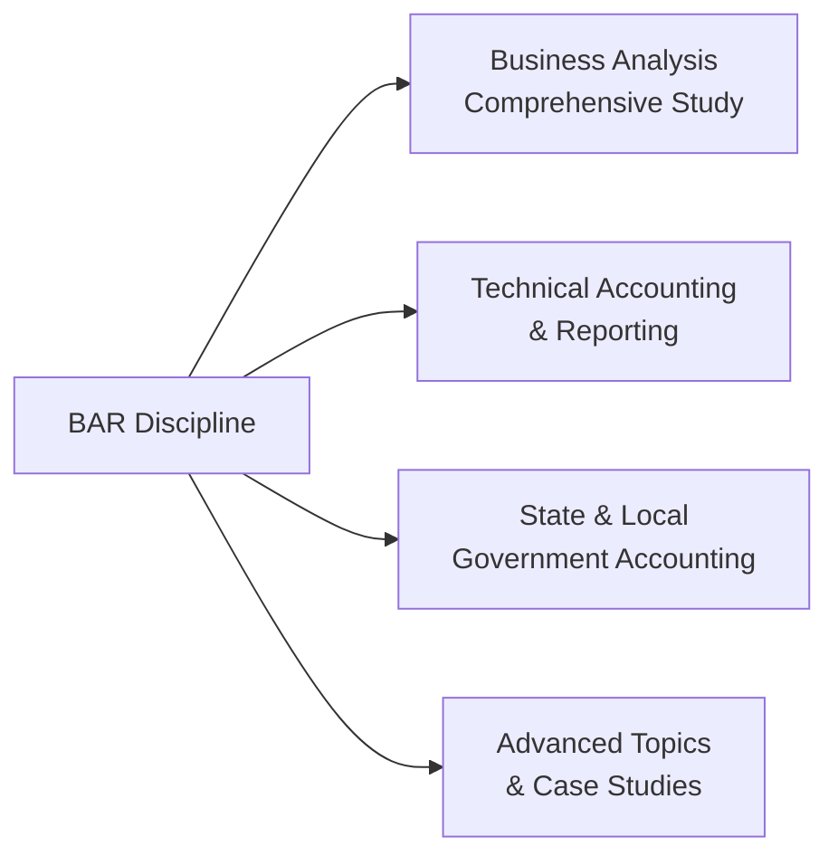
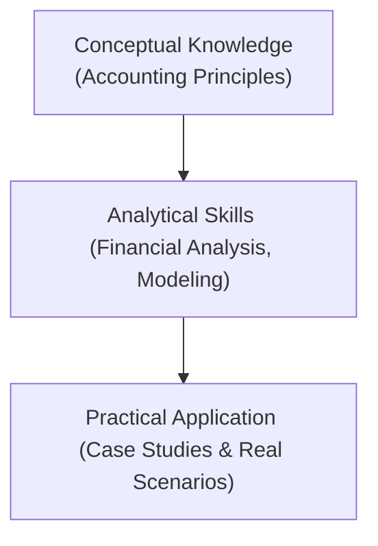

## 1.1 Scope and Structure of the BAR Discipline

The Business Analysis and Reporting (BAR) section of the Uniform CPA Examination is designed to test a candidate’s proficiency in critically evaluating and interpreting financial information. By synthesizing traditional financial accounting knowledge with forward-looking analytical techniques, BAR equips future CPAs with the skill set necessary to advise on strategic business decisions. This blend of financial literacy, analytical rigor, and technological competence reflects the evolving demands placed on accounting professionals in an era defined by complex data and real-time reporting needs.

While the BAR section leans heavily on conceptual and technical accounting foundations, it also emphasizes managerial insights, forecasting, and risk assessment. In essence, BAR goes beyond the preparation of financial statements—candidates are expected to leverage both quantitative and qualitative data to identify trends, perform valuations, gauge uncertainties, and guide business strategy.

Below, this section explores how the BAR discipline is organized in the CPA blueprint, the key topics it covers, and why it is essential for the modern CPA. Throughout this discussion, you will find references to deeper learning opportunities in other chapters of this guide, including critical areas such as data analytics (Chapter 3), technical accounting disclosures (Chapters 10–18), and emerging trends (Chapter 23).

  
## Purpose and Key Objectives of BAR

The Business Analysis and Reporting discipline serves multiple objectives that align with the broader mission of the CPA exam:

• Cultivate a Holistic View of Financial Management: BAR underscores the interconnectedness of accounting, finance, data analytics, and strategic business operations. CPAs must not only understand regulations but also interpret and communicate financial impacts on organizational performance.

• Develop Analytical Skills and Forecasting Capabilities: Technical accounting knowledge is only the first step. BAR challenges candidates to analyze historical and real-time data, employ managerial costing, evaluate performance using KPIs, and perform scenario-based planning.

• Reinforce Critical Thinking and Decision-Making: BAR encourages CPAs to adopt a critical eye on reporting, focusing on how decisions about capital structure, budgeting, and valuation may affect the future sustainability of an entity.

• Promote Integrity and Professional Judgment: The discipline highlights ethical considerations, internal controls, and governance frameworks—critical components for ensuring data reliability, reducing fraud risk, and upholding public trust.

  
## Major Content Pillars of the BAR Discipline

Though the BAR exam categories are closely interlinked, the content can be broadly organized into four major pillars. Understanding these will help you navigate the material, prepare efficiently, and piece together how each concept supports broader business analysis tasks.

### 1) Business Analysis and Financial Management
This broad pillar emphasizes the candidate’s ability to evaluate a company’s financial health using ratio analysis (Chapter 4), cost management (Chapter 5), non-financial performance measures (Chapter 6), and budgeting techniques (Chapter 7). You will also be required to understand prospective analysis (Chapter 8), capital structure decisions, and capital budgeting in real-world contexts. These topics require mastery not only of formulas and analysis but also of interpretation and professional skepticism.

### 2) Data Analytics and Decision Support
The second pillar underscores the rising importance of technology and data in modern accounting. Covered initially in Chapter 3, data analytics tools and techniques support streamlined processes, from automating repetitive tasks to rapidly integrating large datasets for advanced forecasting. As you progress through the discipline, you will see data analytics and automation concepts merged with traditional financial reporting. This synergy paves the way for more precise recommendations to stakeholders. 

### 3) Technical Accounting and Reporting
A substantial body of knowledge within BAR focuses on the proper application of U.S. GAAP (and comparisons to IFRS) for topics such as revenue recognition (Chapter 12), business combinations (Chapter 14), derivatives (Chapter 15), leases (Chapter 16), and public company reporting essentials (Chapter 17). Mastery of the technical guidance behind intangible assets (Chapter 10), stock-based compensation (Chapter 13), and employee benefit plans (Chapter 18) is critical for ensuring accuracy and compliance in financial reporting.

### 4) Governmental Accounting and Advanced Topics
BAR places emphasis on government accounting fundamentals (Chapters 19–22) to equip CPAs with specialized knowledge of how public sector entities differ from private for-profit companies. Candidates also need a perspective on advanced topics such as IFRS vs. U.S. GAAP differences, blockchain, and cryptoassets (Chapter 23). This combination ensures a well-rounded competency in handling diverse and evolving reporting requirements.

  
## Visual Overview of BAR Content Structure

Below is a simplified diagram illustrating how the BAR discipline’s content pillars intersect. This high-level outline shows how each major category feeds into the overarching goal of transforming raw financial data and processes into actionable business insights.

In practice, these “pillars” are not strictly siloed. Rather, they blend and reinforce one another as you develop competencies that span the entire spectrum of business reporting and decision-making.

  
## Relevance of BAR for Modern CPAs

Traditionally, CPAs were perceived as stewards of financial records, ensuring compliance with accounting rules. The role has steadily evolved, now requiring a far broader skill set:

• Consulting on Strategic Initiatives: Corporate leaders and boards expect CPAs to forecast market trends, assess project feasibility, and advise on financing decisions.  
• Integrating Technology: With the growth of big data, artificial intelligence, and blockchain, CPAs must harness technology to glean deeper insights from financial and operational data.  
• Regulatory Compliance and Transparency: Reporting standards continue to expand in complexity, prompting CPAs to stay abreast of rules for intangible assets, financial instruments, and cross-border transactions.  
• Ethical Oversight: Stakeholders expect a high level of professional integrity in data collection, analysis, and dissemination.

As you progress through the BAR blueprint, these responsibilities will repeatedly surface. From mastering managerial costing (Chapter 5) to implementing advanced data analytics strategies (Chapter 3), each proficiency strengthens your ability to serve as a trusted advisor.

  
## Exam Components and Typical Structure

The BAR exam component typically includes multiple-choice questions (MCQs), task-based simulations (TBSs), and in some cases, small sets of integrated scenarios that require deeper, written analysis. While official weighting may vary, many candidates can expect approximately 40–50% of their test content to revolve around financial analysis and reporting, 20–25% around planning and performance management, 10–15% around data analytics, and 10–20% around governmental and advanced topics. Actual percentages may shift, so consult the official AICPA blueprint for the latest updates.

### Multiple-Choice Questions (MCQs)
MCQs test your retention of conceptual frameworks, definitions, and computational abilities. You may see questions that prompt you to interpret financial ratios or scenario-based questions requiring integrated knowledge of multiple topics.

### Task-Based Simulations (TBSs)
The TBSs emphasize real-world application, often requiring you to prepare consolidations, identify journal entries for differently structured transactions, or evaluate how certain accounting guidance affects financial statements. You might also be tasked with analyzing a set of data or performing data manipulations that echo the daily realities of data analytics in practice.

### Integrated Scenarios
In these more comprehensive tasks, you may be asked to step into a hypothetical role—e.g., staff auditor or financial analyst—and respond to queries from management or the audit committee. This involves integrating knowledge of budgeting, variance analysis, revenue recognition, intangible assets, or even applying governmental accounting rules in a single question set.

  
## Exam Strategy and Approach

While each candidate’s journey is unique, some core study strategies include:

• Building Strong Foundations: Start by reviewing essential accounting standards in Chapters 10–18 to reinforce your technical knowledge. Many exam questions build from these fundamentals.  
• Developing Analysis and Interpretation Skills: As covered in Chapters 4–9, it’s not enough to compute financial ratios or same-store sales metrics. You must interpret and derive meaningful conclusions that drive business decisions.  
• Emphasizing Data Analytics: The CPA exam increasingly expects advanced Excel, data modeling, or trending skills. Chapter 3 offers practical tools to apply data analytics in an exam environment.  
• Familiarizing Yourself with Governmental Concepts: Governmental accounting remains a key testing ground for core accounting principles under a different framework (GASB). Keep reviewing Chapters 19–22, especially topics like fund-based financial statements and unique measurement focuses.  
• Incorporating Real-World Examples: Flesh out your knowledge by studying real companies’ financial statements, reading financial news, and examining current events that highlight risk assessment, valuation complexities, or budgetary outcomes.  

  
## Case Study: Forecasting and Strategic Planning

A mid-sized electronics manufacturer, “TechOne Industries,” finds its operating margins are declining due to rising raw material costs. Management wants to introduce a new product line to capture more market share. As a CPA candidate with BAR expertise:

• You review historical income statements, segment performance, and variable cost components (Chapters 4 and 5).  
• You build a flexible budgeting model (Chapter 7), performing what-if analyses on overhead costs, sales volumes, and product pricing across multiple geographic regions.  
• You incorporate non-financial metrics (Chapter 6), such as customer satisfaction scores and supply chain lead times, to evaluate the broader implications of the new product line.  
• You assess the capital structure implications of raising debt or issuing equity (Chapter 8) to finance large-scale product development.  

Your analysis reveals that while initial capital needs are high, strategic cost management and robust marketing can yield a significant return on the new product line. The BAR discipline equips you to address each step—from data gathering and cost analyses to prospective cash flow forecasts and final recommendations to management.

  
## Common Pitfalls and Challenges

• Overemphasis on Computation over Interpretation: Many candidates become adept at quick calculations but fail to draw persuasive, well-reasoned conclusions from the data.  
• Insufficient Understanding of Data Quality: Advanced analytics can be colorful but irrelevant if data is incomplete or poorly structured. Chapter 3 discusses best practices for ensuring data integrity.  
• Neglecting Governmental Accounting: Candidates often postpone reviewing governmental accounting because it seems niche. Yet it remains a critical part of the exam’s blueprint and can be heavily tested.  
• Underestimating Changes in Regulation: Accounting standards and the exam itself evolve. Keep track of newly issued FASB updates and IFRS developments covered in Chapter 23.

  
## Tools, Techniques, and Recommended Study Aids

• Flowcharts and Process Maps: Create process flow diagrams to visualize transaction cycles, internal controls, and data movement—particularly relevant for Chapters 2, 3, and 19–22.  
• Ratio and Formula Reference Sheets: Summaries of key ratios, capital budgeting formulas, and intangible asset impairment tests can accelerate your learning.  
• Practice Datasets: Obtain or build short practice spreadsheets. Perform pivot table analyses, run regression models, and experiment with scenario tools as guided in Chapter 3.  
• Professional and Academic Journals: Keep your knowledge current by reviewing accounting and finance journals, especially regarding new regulations or evolving data analytical methods.

  
## Additional Insights Through Diagrams

Below is a simplified representation of the skill progression that BAR fosters—helping you move from basic conceptual knowledge through to complex practical decision-making processes.

Each layer builds on the next. First, you must understand the conceptual underpinnings of financial reporting. Next, you apply analytical tools to interpret data. Finally, you engage in real or simulated casework, making informed recommendations that drive business decisions.

  
## Looking Ahead

The remainder of this guide will delve into each BAR content area in detail:

• Chapters 2 and 3 frame essential accounting methodologies and data analytics foundations.  
• Chapters 4–9 guide you through business analytics techniques, budgeting, risk assessment, and valuation.  
• Chapters 10–18 present technical accounting topics critical to advanced corporate and public company reporting.  
• Chapters 19–22 cover the unique world of state and local government reporting.  
• Chapters 23–26 highlight emerging issues, case studies, and exam strategies.  
• Finally, Chapters 27–30 provide comprehensive references, formulas, templates, and additional tools to solidify your exam readiness.

Approach this journey methodically. Embrace the interdisciplinary nature of BAR by exploring how each concept is applied in real-world scenarios. The scope of BAR is broad, but mastery of this discipline positions you as a forward-thinking CPA who not only understands the financial past but can also shape the financial future.

  
## Mastering the BAR Discipline: Key Takeaways Quiz



### Which of the following best describes the Business Analysis and Reporting (BAR) discipline?
- [ ] It focuses exclusively on auditing standards and ethical frameworks.  
- [x] It integrates financial reporting, data analytics, and strategic business evaluation.  
- [ ] It covers only governmental fund accounting.  
- [ ] It is limited to the five-step revenue recognition process.  

> **Explanation:** BAR encompasses financial reporting expertise, data-driven analytical skills, and broader strategic evaluation. It’s more than compliance—it's about interpreting and using information to drive business decisions.

### What is one major risk for candidates who focus primarily on calculations without deeper interpretation?
- [ ] Not encountering enough MCQs on the exam.  
- [x] Missing the analytical insight to make meaningful recommendations.  
- [ ] Lack of exposure to IFRS regulations.  
- [ ] Forgetting foundational GAAP concepts.  

> **Explanation:** The BAR discipline emphasizes the ability to interpret results and apply them to various decision-making scenarios. Pure calculations, without the insight to act on those numbers, undercut the broader goals of business analysis.

### Why is it critical for CPAs to stay updated on new FASB or IFRS pronouncements when studying for BAR?
- [x] The exam frequently integrates the most current standards and evolving practices.  
- [ ] Only older standards are tested.  
- [ ] Because IFRS is not recognized in BAR.  
- [ ] Standards rarely change, so it’s less important.  

> **Explanation:** Accounting standards and guidance evolve regularly, and BAR candidates must reflect that awareness and adaptability in their exam performance.

### Which of the following topics is most relevant to measuring performance beyond traditional financial metrics?
- [ ] Accounts receivable aging.  
- [x] Customer satisfaction scores and operational KPIs.  
- [ ] Journal entries for leases.  
- [ ] Foreign currency translation.  

> **Explanation:** While financial data is essential, BAR encourages broader performance evaluations using non-financial metrics, like customer satisfaction and process efficiency, to capture a complete view of corporate health.

### What is an effective strategy for integrating data analytics into your BAR exam preparation?
- [x] Practice with spreadsheets and pivot tables for real-world data interpretation.  
- [ ] Memorize FASB codification sections.  
- [x] Understand common automation tools like RPA.  
- [ ] Focus solely on ratio formulas.  

> **Explanation:** Data analytics skills are tested in scenarios where you interpret data, glean insights, and validate results. Familiarity with spreadsheet models, pivot tables, and automation tools provides a competitive edge on exam day.

### When evaluating a case study that involves forecasting future cash flows, which aspect is particularly important?
- [x] Integrating both financial trends and non-financial elements.  
- [ ] Focusing only on historical data.  
- [ ] Overlooking uncertainties in market demand.  
- [ ] Ignoring capital structure considerations.  

> **Explanation:** Forecasting requires forward-looking data. In the BAR context, this means combining financial metrics, external market indicators, operational KPIs, and assumptions about future demand or risk factors.

### Which statement highlights a common pitfall in approaching governmental accounting for BAR?
- [ ] Governmental accounting follows the same standards as for-profit.
- [x] Candidates may overlook its importance and focus only on private sector topics.  
- [ ] Governmental accounting is irrelevant to the CPA exam.  
- [ ] The BAR section never tests on fund-based statements.  

> **Explanation:** Governmental accounting is a distinct area often tested in BAR. Avoid postponing or neglecting it, as mastery is pivotal to a complete skill set and can appear in simulations and scenario-based questions.

### In the BAR discipline, why does professional judgment and ethics remain crucial?
- [x] CPAs serve as custodians of accurate, unbiased financial information.  
- [ ] The discipline purely focuses on speed of calculations.  
- [ ] Ethical considerations are minimal in external reporting.  
- [ ] Judgment is unnecessary when following formulaic guidelines.  

> **Explanation:** CPAs need to exercise integrity when interpreting and presenting financial information. The public and other stakeholders rely on accurate, ethical, and transparent reporting practices.

### Which of the following best characterizes the structure of task-based simulations in the BAR exam?
- [x] They often simulate real-world tasks like producing consolidated financials or forecasting budgets based on specific data sets.  
- [ ] They require essay-based, open-ended answers with no data.  
- [ ] They are composed of purely theoretical questions about IFRS.  
- [ ] They rely on long-form memorized paragraphs to be copied into the answer field.  

> **Explanation:** TBSs typically replicate actual job tasks faced by CPAs in business environments, including data manipulation, applying correct accounting treatment, and concluding on complex scenarios where multiple issues intersect.

### True or False: Integration of technology, such as data analytics tools and automations, is largely irrelevant for BAR candidates.  
- [ ] False  
- [x] True (This is a trick question: the statement as written is false, but the correct answer to the question “Is this statement True or False?” is True because it’s instructing that the statement is indeed false. Please see explanation below.)  

> **Explanation:** The integration of technology is highly relevant in the BAR discipline. Data analytics, cloud platforms, and automation tools are part of modern accounting. The statement is false, meaning technology is very relevant.  



  
## For Additional Practice and Deeper Preparation

### [Business Analysis and Reporting (BAR) CPA Mock Exams](https://www.udemy.com/course/bar-cpa-mock-exams/?referralCode=ADBE2E84BEE9CB6243CA)  

**Business Analysis and Reporting (BAR) CPA Mocks:** 6 Full (1,500 Qs), Harder Than Real! In-Depth & Clear. Crush With Confidence!

- Tackle full-length mock exams designed to mirror real BAR questions.  
- Refine your exam-day strategies with detailed, step-by-step solutions for every scenario.  
- Explore in-depth rationales that reinforce higher-level concepts, giving you an edge on test day.  
- Boost confidence and minimize anxiety by mastering every corner of the BAR blueprint.  
- Perfect for those seeking exceptionally hard mocks and real-world readiness.  

_Disclaimer: This course is not endorsed by or affiliated with the AICPA, NASBA, or any official CPA Examination authority. All content is for educational and preparatory purposes only._
