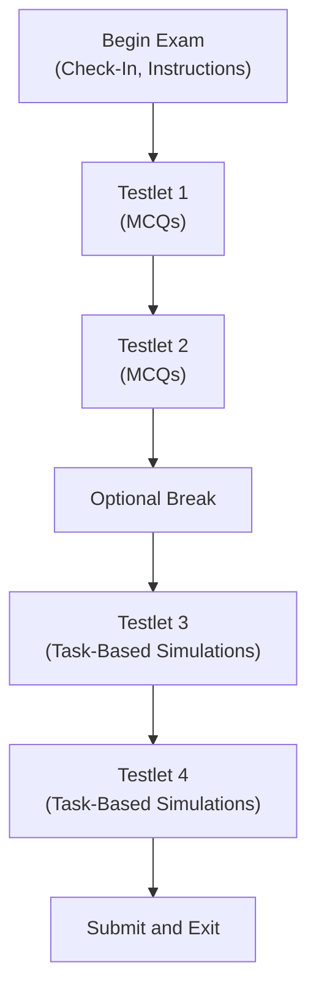
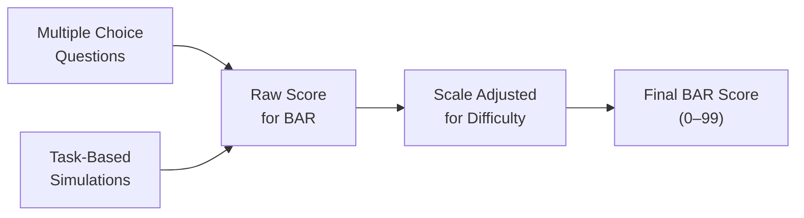

## 1.2 Exam Format, Scoring, and Time Allocation

The Business Analysis and Reporting (BAR) section of the CPA exam evaluates a broad array of competencies ranging from financial statement analysis to advanced accounting applications. Understanding how the exam is structured—and how it is scored—is vital for effective time management and success on exam day. This guide highlights question types, scoring approaches, and recommended pacing to help you maintain a steady rhythm throughout the test. When combined with robust technical knowledge (Chapter 2) and proven study strategies (Chapter 1), these insights will give you the confidence to tackle the BAR exam with clarity and purpose.

### Overview of the BAR Exam Format

Although the exact format may evolve over time to reflect updates by the AICPA and changes in professional standards, the BAR section generally includes multiple-choice questions (MCQs) and task-based simulations (TBS). For candidates sitting for the exam under the 2025 CPA blueprint, these two question types aim to assess not only direct knowledge but also practical application of concepts across scenarios that closely mirror real-world accounting, financial analysis, and reporting challenges.

Before diving deeper, here is a high-level flow of a typical BAR exam session:

• You’ll start with instructions and any preliminary screens.  
• Your first two testlets typically contain only MCQs.  
• An optional break often appears after the second testlet. Taking or skipping this break can be strategic, depending on your pacing.  
• The remaining testlets typically house task-based simulations.  

This structure may be subject to slight variations, but the general pattern stands: the BAR section is composed of a combination of question sets focused on conceptual understanding and more applied tasks that gauge critical thinking and the ability to synthesize information.

### Question Types and Weighting

MCQs in the BAR section test your understanding of fundamental accounting, business, and analytic concepts. Typically, these questions address areas such as:

• Financial Statement Analysis (e.g., ratio interpretation, trending)  
• Managerial and Cost Accounting (e.g., cost classifications, variances)  
• Data and Analytics (e.g., interpreting data sets, basic data integrity checks)  
• Advanced Technical Accounting (e.g., intangible assets, revenue recognition nuances)  

Task-Based Simulations (TBS) are more comprehensive. They’ll require you to solve multidimensional problems that replicate actual accounting tasks, including analysis of financial statements, consolidation entries, or identifying misclassifications in financial data. Many TBS are scenario-based, meaning you receive a set of financial statements or a narrative describing a business situation and must respond to prompts that test how thoroughly you can apply your knowledge.

Although exact weightings can vary, the following distribution is a common approximation under current CPA exam guidelines:

• 50% MCQs  
• 50% TBS  

This breakdown can shift as AICPA refines the exam design, but plan on roughly half of your final score coming from your success in multiple-choice questions and half from your performance in the simulations.

### Scoring Methodology

One of the first points to note about the CPA exam is that a passing score is 75 on a scale that typically ranges from 0 to 99. Keep in mind:

• The BAR section uses an Item Response Theory (IRT) model for scoring in many respects, which means question difficulty is factored into your final scaled score.  
• TBS questions generally offer partial credit. Even if you cannot complete an entire simulation accurately, correctly finishing a portion of it can still earn you points.  
• There is no penalty for guessing. This means you should never let any question remain unanswered; an incorrect guess and an unanswered question both yield zero points, but a guess can at least yield partial or full credit if it happens to be correct.  
• Some TBS might involve extraneous data or multiple layers of analysis. Others could include authoritative literature references you must navigate to find answers.  

Scoring is not a simple percentage of right over wrong. After you submit, your raw score is scaled to reflect question difficulty and performance across the testlets. Because of this, two candidates—even with the same raw score—might see slightly different scaled scores, particularly if their routes through varying question difficulties differ. The good news is that you can focus on consistently answering to the best of your ability rather than attempting to “game” the system.

### Time Allocation and Pacing Strategies

A major challenge in the BAR section is effectively allocating your time. Each section of the CPA exam, including BAR, typically runs 4 hours in total (240 minutes). The length can be subject to updates, so always check AICPA or your state board for official timing guidelines.

Balancing your efforts between MCQs and TBS is critical. If you move too slowly on the MCQs, you risk having insufficient time for the more complex TBS. Move too quickly, and you jeopardize consistency and accuracy in interpreting questions. Below is a suggested pacing guide for the BAR exam, though you should refine it based on your actual practice test performance:

• Initial 2 MCQ Testlets  
  – Aim for around 60–75 minutes total (about 30–37 minutes each).  
  – Typically, each testlet has ~30 MCQs, but exact counts can differ.  
  – Plan on about 1 to 1.25 minutes per MCQ, keeping some buffer for reading more detailed stems thoroughly.  

• Optional Break  
  – If you have the option of a break, consider using it to clear your mind.  
  – However, do not let it extend too long if you feel pressed for time.  

• Remaining TBS Testlets  
  – Allocate the remaining ~165 to 180 minutes for TBS, including any ill-defined tasks that might take you longer to interpret.  
  – Some TBS tasks may be quite quick, while others might be more involved, requiring multiple steps and cross-referencing.  

An effective time management approach:

1. Skim the TBS quickly before diving in. Assess which simulations are more straightforward and allocate time accordingly.  
2. Prioritize simulations that you can confidently address. Return to more complex tasks if time allows.  
3. Use a watch, on-screen time tracker, or the exam interface to ensure you stay within your planned pacing, adjusting if you notice you’re running ahead or behind.

Time blocking can also help:

• Start with a broad time limit for the entire exam.  
• Subdivide that limit into more granular blocks for each question set plus any breaks.  
• Keep a close watch on how fast you’re moving through your allocated blocks.  

Be prepared to shift your strategy if you encounter an unexpectedly difficult TBS. You may need to shift a few minutes from easier TBS to ensure you complete the more complex tasks. Flexibility is key.

#### Practical Example: Allocating Time for an Unusually Complex TBS

Suppose the third testlet includes a sprawling set of financial statements, footnotes, and a data collection requiring a combination of ratio calculations and adjusting entries. After a quick review, you estimate you might need 25–30 minutes. Previously, you allocated 20 minutes on average per TBS. Here’s a strategy:

• Prioritize that complex TBS but monitor progress meticulously.  
• If you’re nearing your 25–30-minute mark, decide if you’ve captured enough points to move on.  
• Consider partial completion if you find certain parts especially time-consuming. Earn what you can, then revisit if time remains.

### Recommended MCQ Approaches

When tackling MCQs:

• Read Each Question and All Answers Carefully  
  – Many distractors look plausible on first glance.  
• Use the Process of Elimination  
  – Cross out answers that contradict basic principles or contain partial truths.  
• Be Mindful of Time  
  – If you find yourself stuck for over a minute, pick the choice you find most likely, flag the question, and move on. You can come back if you have leftover time.  

Half of the test’s scoring emphasis is often on MCQs, so strategic efficiency here can keep you from burning precious minutes that might be better invested in simulations.

### Recommended TBS Approaches

Task-based simulations require deeper analysis. Here are some best practices:

• Survey Each Tab or Document in the Simulation  
  – Understanding the layout is often half the battle.  
• Notice Any Guidance or Embedded Instructions  
  – Sometimes, TBS offer clues such as “using the data above” or “refer to the excerpt in Tab 3.”  
• Keep a Separate Scratch Outline  
  – Note down key data points, relevant formulas, or references to authoritative literature.  
• Don’t Overlook Partial Credit  
  – Even if you can’t complete the entire process, steps done correctly will earn you partial points.  

Some TBS will require you to toggle between multiple resources, such as authoritative literature and a scenario. Organizing your approach, using note-taking effectively, and maintaining calm under the clock are paramount.

### Common Pitfalls and Tips to Overcome Them

• Failing to Practice Under Timed Conditions  
  – Rehearse the exam experience with real or simulated time pressures. Use practice software that mirrors exam pacing.  
• Overinvesting in MCQs Early  
  – It’s easy to get bogged down in a tricky question. If stuck, pick your best guess, flag it, and revisit later.  
• Underestimating Reading Time for TBS  
  – Large volumes of data in TBS can cause panic if you haven’t practiced scanning for relevant details.  
• Ignoring Breaks Altogether  
  – Sometimes a quick 5-minute brain reset can drastically improve performance on the final testlets.  
• Second-Guessing Too Extensively  
  – Changing an answer should be done deliberately, usually when you’re certain your first choice was incorrect.

### Enhancing Your Score Through Preparation

• Practice Weighted Question Sets  
  – Attempt practice exams where MCQs and TBS are in the proportion you’ll likely see on the actual exam.  
• Build Endurance and Focus  
  – Four-hour blocks of intense concentration can be draining. Train your mind by simulating long sessions in your studies.  
• Use Official AICPA Resources  
  – Sample tests and the latest outlines help you get accustomed to the user interface and functionalities.  
• Seek Targeted Review for Weak Areas  
  – Review chapters that focus on specific concepts you find difficult (e.g., intangible asset accounting in Chapter 10, government fund accounting in Chapter 19).

### Diagram: Exam Scoring Emphasis

Below is a simplified flowchart that shows how multiple-choice questions and task-based simulations might feed into the final scaled score.

• A and B feed into the raw score, each portion carrying roughly equal weight.  
• The raw total is adjusted based on the difficulty encountered in each testlet.  
• The examinee’s final BAR score is produced on a scale of 0–99, with 75 deemed passing.

### Additional References for Further Exploration

• AICPA’s CPA Exam Blueprints: These official guidelines provide the most up-to-date details on exam structure and content.  
• NASBA Website: Offers general exam administration guidance and candidate bulletins.  
• Becker, Wiley, or Gleim CPA Review Courses: Industry-leading platforms with multiple practice questions and simulations.  

By planning your approach, allocating time wisely, and honing your ability to handle everything from straightforward MCQs to deeply layered TBS, you’ll minimize stress and maximize your performance on exam day.

## Comprehensive Knowledge Check: Exam Format, Scoring, and Time Allocation



### Which of the following best describes the weighting between multiple-choice questions (MCQs) and task-based simulations (TBS) in the BAR section for most candidates?
- [x] Approximately half of the overall score comes from MCQs, and half from TBS.
- [ ] TBS accounts for the majority of the total score, with MCQs being a minor component.
- [ ] MCQs are rarely used in the BAR section.
- [ ] The exact weighting between MCQs and TBS is fixed at 70% MCQs to 30% TBS.

> **Explanation:** Under most current models, MCQs and TBS generally split the overall score about 50/50 for the BAR section, although this could evolve with future updates to exam structure.

### Which approach is most useful when you’re stuck on a difficult MCQ and time is running out?
- [x] Make your best-educated guess, flag the question, and return later if time permits.
- [ ] Spend as long as you need to figure it out, no matter the time constraints.
- [ ] Skip it entirely to avoid losing points for a wrong response.
- [ ] Change your answer repeatedly until you feel more confident.

> **Explanation:** There is no penalty for guessing, and uncertain answers should be flagged for review later if time remains. Skipping yields no possibility of scoring points and can cost you valuable time.

### Which best practice should you adopt for TBS questions that reference multiple resources?
- [x] Keep a concise scratch outline of crucial points and references as you move between tabs.
- [ ] Switch tabs randomly to find answers without a systematic approach.
- [ ] Ignore any extra tabs if the TBS question is complicated.
- [ ] Resign yourself to guesswork if the TBS seems too complex.

> **Explanation:** TBS often require referencing a variety of documents. A concise outline or notes can help stay organized and earn partial or full credit for correct completions.

### How does Item Response Theory (IRT) mostly affect BAR exam scoring?
- [x] It adjusts your final score based on the difficulty of the questions you are presented.
- [ ] It guarantees all candidates see the exact same set of questions in the same order.
- [ ] It removes partial credit opportunities from TBS.
- [ ] It eliminates scaled scoring modifications entirely.

> **Explanation:** IRT adapts the scoring to reflect differences in difficulty among questions. Scaled scores reflect both correct answers and the complexity of those items.

### Which strategy often helps manage a time-consuming TBS with multiple parts?
- [x] Work quickly on parts you can complete accurately, then return to complex elements if time remains.
- [ ] Spend all your available time on this TBS to ensure every detail is correct.
- [x] Accept partial credit where possible if you can’t finish everything.
- [ ] Immediately guess on every part to save time.

> **Explanation:** Maximizing partial credit for sections you can accurately complete and managing your time wisely is crucial when facing multi-part TBS.

### Which is a common pitfall related to exam breaks in the BAR exam?
- [x] Not using the break at all or misusing it, leading to fatigue in later testlets.
- [ ] Taking a break that ensures you have enough time to rest, which is always beneficial.
- [ ] The break is automatically factored into your total exam time and doesn’t matter.
- [ ] Breaks remove valuable minutes but are mandatory for all candidates.

> **Explanation:** Breaks can benefit mental clarity but can also consume valuable time. Strategic use of optional breaks helps avoid fatigue and keeps you on pace.

### What is the recommended pace per MCQ on average during the BAR exam?
- [x] Around 1 to 1.25 minutes to ensure enough time for TBS.
- [ ] 3 to 4 minutes per MCQ, applying thorough reasoning.
- [x] A maximum of 2 minutes on straightforward questions if you still feel uncertain.
- [ ] 30 seconds per MCQ, guessing rapidly to save all the time for TBS.

> **Explanation:** A good guideline is around 1 minute to a little over a minute per MCQ, ensuring you don’t miss out on TBS. If your uncertainty remains, flag and revisit later.

### What is one benefit of partial-credit scoring on TBS?
- [x] You can still earn some points for correct parts even if you cannot complete an entire simulation accurately.
- [ ] You must get every piece of the TBS correct or receive zero points.
- [ ] It guarantees that you can pass without doing any TBS completely.
- [ ] It increases the difficulty level of each TBS.

> **Explanation:** TBS are designed to reward partial knowledge. Even if you can’t perfectly solve each step, correct sections still contribute to your overall score.

### What is the main reason the BAR exam’s scaled score can differ among candidates who have the same raw number of correct answers?
- [x] The difficulty of the testlets each candidate faces may vary, influencing the scaled score.
- [ ] Scores are randomly assigned to ensure fairness.
- [ ] Candidates are given different time allotments, affecting scaled outcomes.
- [ ] Some testlets are always assigned more weight than others for no transparent reason.

> **Explanation:** Under the IRT model with adaptive or semi-adaptive elements, different question difficulties can offset or elevate a raw score after scaling.

### True or False: A passing score of 75 on the BAR exam corresponds to a raw test score of 75%.
- [x] True
- [ ] False

> **Explanation:** CPA exam scores are scaled; a 75 is not a simple percentage of correct answers. Instead, it reflects a candidate’s performance relative to the difficulty of the questions answered.



## For Additional Practice and Deeper Preparation

### [Business Analysis and Reporting (BAR) CPA Mock Exams](https://www.udemy.com/course/bar-cpa-mock-exams/?referralCode=ADBE2E84BEE9CB6243CA)

**Business Analysis and Reporting (BAR) CPA Mocks:** 6 Full (1,500 Qs), Harder Than Real! In-Depth & Clear. Crush With Confidence!

- Tackle full-length mock exams designed to mirror real BAR questions.  
- Refine your exam-day strategies with detailed, step-by-step solutions for every scenario.  
- Explore in-depth rationales that reinforce higher-level concepts, giving you an edge on test day.  
- Boost confidence and minimize anxiety by mastering every corner of the BAR blueprint.  
- Perfect for those seeking exceptionally hard mocks and real-world readiness.  

_Disclaimer: This course is not endorsed by or affiliated with the AICPA, NASBA, or any official CPA Examination authority. All content is for educational and preparatory purposes only._
