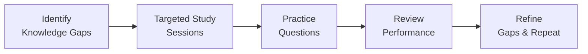

## 1.4 Study Approaches and Time Management

Preparing for the Business Analysis and Reporting (BAR) section of the Uniform CPA Examination can be a daunting undertaking, whether you are completely new to accounting or a seasoned professional looking to update your knowledge. However, with a structured study approach and disciplined time management, you can ease the burden, deepen your understanding of key financial and analytical concepts, and significantly increase your chances of success on exam day.

Below, we explore various study strategies, practical scheduling tips, and proven review methods to help you develop the confidence and capability needed for the BAR exam. From constructing a comprehensive study schedule to employing cutting-edge review tools, you can adapt these methods to your personal learning style and professional commitments.

### Building a Structured Study Plan

A well-designed study plan provides a roadmap for your entire exam prep journey. It ensures you cover all critical topics in a way that aligns with your learning pace, work schedule, and target exam date. For references to core topics, see Chapter 2 within this guide for a refresher on essential accounting and business concepts. Here are key steps to follow:

• Identify your goals. Before drafting a plan, clarify the goals you wish to achieve. Do you want to master advanced valuation techniques discussed in Chapter 9? Or are you seeking a firm foundation in governmental accounting from Chapters 19 through 22? Having specific objectives will keep you focused and motivated.  
• Break down the blueprint. Compare your knowledge level against the BAR blueprint (Effective January 2025). List the domains where you need a thorough review (e.g., intangible assets, revenue recognition, internal controls) and focus your study sessions accordingly.  
• Schedule strategically. Focus on your hardest topics when you have the most mental energy (usually early in the day or on weekends). Dedicate these hours to reading, problem-solving, or working through advanced exercises. Assign lighter tasks—like reviewing flashcards or re-reading previously studied materials—to times when your energy is lower.

A simple approach to scheduling can be seen in the table below:

| Study Segment  | Description                                  | Time Allocation (per day/week) | Objective                                     |
|----------------|----------------------------------------------|--------------------------------|------------------------------------------------|
| Thesis Reading | Read textbook segments, standards, or notes  | 1–2 hours daily                | Build foundational knowledge                   |
| Practice MCQs  | Solve multiple-choice questions              | 1 hour daily / 2 hours weekend | Reinforce understanding, identify weak spots   |
| Simulations    | Work on scenario-based tasks                 | 2 hours twice a week           | Practice exam-like environment                 |
| Review & Revise| Summarize errors, revisit difficult concepts | 1 hour daily                   | Strengthen retention, clarify ambiguities      |
| Rest/Break     | Unplug, relax, recharge                      | As needed                      | Prevent burnout, maintain mental well-being    |

### Scheduling Practice Sessions

Practice questions and simulations remain one of the most effective ways to prepare for the BAR exam. They challenge your understanding, highlight weak points, and help you adapt to the exam format. Keep these tips in mind:

• Allocate consistent blocks of time. Aim to complete anywhere from 50 to 100 multiple-choice questions (MCQs) in a week, supplemented by at least one or two Task-Based Simulations (TBS) or scenario-based practice sets.  
• Embrace the difficult questions. Prioritize tough topics, such as derivative accounting (Chapter 15), foreign currency transactions (Chapter 14), and not-for-profit fund structures (Chapters 19–22), to sharpen your critical-thinking skills and reduce exam-day anxieties.  
• Track your progress diligently. Create a log of your practice scores, highlighting areas where you consistently underperform. This record allows you to revisit topics more efficiently, rather than devoting equal time to subjects you’ve already mastered.

### Strategic Review Methods

Memorizing large volumes of information is time-consuming and often ineffective without the right strategies. Strategic review combines targeted repetition and active learning to cement crucial concepts. The following approaches can help:

• Spaced repetition. Spread out your review of a given topic over days or weeks. For instance, if you study goodwill impairment testing from Chapter 10 today, revisit it briefly two days later, then a week later, and finally two weeks later. This leverages the psychological spacing effect, which increases long-term retention.  
• Active recall. Use flashcards, quizzes, or short summaries to actively challenge your mind. Passive reading leads to lower retention. Active recall ensures you check understanding on the spot.  
• Interleaving. Instead of studying one topic in isolation for hours, rotate through multiple lower-level concepts, such as recognition of internally developed software (Chapter 11), stock-based compensation (Chapter 13), and managerial costing (Chapter 5) within the same study block. This variety trains your brain to identify and adapt to context shifts.

### Balancing Work, Life, and Studies

Bar exam candidates often juggle full-time employment, family commitments, or other personal responsibilities. Here are methods for efficiently balancing these pressures:

• Time blocking. Divide your day into fixed blocks allocated to specific tasks: morning block for reading new materials, midday break for flashcards or quick problem sets, evening block for practice questions or simulation reviews.  
• Utilize commutes and downtime. Listen to audio recordings of accounting summaries or watch short educational videos on your phone during commutes, lunch breaks, or in between appointments.  
• Delegate and communicate. If possible, share responsibilities at home or at work. Inform your family or supervisor of potential schedule changes for the exam study period. Being transparent about your commitments fosters understanding and support.

### Leveraging Flowcharts and Visual Aids

Complex topics, such as hedge accounting, governmental fund conversions, or multi-entity consolidations, are simpler to grasp when broken down into visually structured components. Diagrams help you see the “big picture” and remember procedural steps more effectively. Below is a simple mermaid flowchart illustrating an iterative study cycle:

This cyclical representation underscores how each stage of study builds upon the insights of the previous one. Repetition ensures you consistently address knowledge gaps.

### Sample Weekly Study Layout

If you are searching for a concrete example of how to schedule your week, consider this structure:

• Monday: Two-hour study block (morning) to read new materials in Chapters 2–5; 30-minute review block (evening) to create flashcards.  
• Tuesday: One-hour block of MCQs focusing on cost classifications (Chapter 5) and ratio analysis (Chapter 4).  
• Wednesday: Two-hour block for Task-Based Simulations on advanced topics—goodwill impairment and intangible assets (Chapters 10 and 11).  
• Thursday: One-hour block for re-reading and summarizing tricky concepts discovered during Wednesday’s simulations; 30-minute flashcard drill.  
• Friday: One-hour block of practice questions on managerial topics (Chapter 5) and analysis (Chapter 4); short review of heavily missed questions.  
• Saturday: Two-hour comprehensive review session with interleaved topics from earlier in the week; track error patterns.  
• Sunday: Rest day or short 30-minute session for light reading on upcoming topics in Part II or Part III of this guide.

### Technology Tools and Resources

Digital applications can drastically streamline your study efforts:

• Flashcard apps. Platforms like Anki or Quizlet use spaced repetition algorithms to help you review terms like EBITDA pitfalls or intangible asset criteria right when you’re most likely to forget them.  
• Online test banks. These typically include thousands of MCQs, TBSs, and in-depth solutions to illustrate real-world CPA exam question styles. They also offer performance tracking and analytics.  
• Time management apps. Digital planners or scheduling apps can send you reminders, track your daily tasks, and maintain an updated to-do list that aligns with your study objectives.

### Relevance of Data Analytics

As you progress in your BAR studies, remember that data analytics (Chapter 3) increasingly plays a central role in modern financial accounting and auditing. Practice interpreting dashboards or data visualizations quickly. Understanding how technology drives the analysis of large data sets can prove invaluable, both in exam simulations and real-world scenarios.

### Common Pitfalls and How to Avoid Them

• Procrastination. Cramming a vast syllabus in the final weeks before the exam drastically reduces retention. Instead, commit to bite-size chunks across several months.  
• Over-reliance on memorization. Concepts like comparing IFRS versus U.S. GAAP (Chapter 23) or reconciling governmental financial statements (Chapters 20 and 21) require deeper conceptual understanding rather than pure rote memorization.  
• Ignoring weaker areas. Consistent practice with tough topics (e.g., derivatives in Chapter 15 or sale-leaseback transactions in Chapter 16) often reveals new angles, clarifications, or shortcuts even if progress feels slow at first.

### Case Study: Accelerated 8-Week Plan

A busy manager with a partial background in accounting needed to complete the BAR exam within eight weeks. After reviewing Chapter 2’s fundamentals, she realized her biggest gaps were in governmental accounting (Chapters 19–22) and in advanced financial instruments (Chapter 15). Here is how she structured her time:

• Week 1–2: Emphasis on bridging fundamental knowledge, focusing on consistent daily reading and flashcard creation for the most common IFRS vs. U.S. GAAP differences (Chapter 23).  
• Week 3–4: Shift to government-wide statements, reconciling funds (Chapter 21), and tackling multiple MCQs and practice TBSs.  
• Week 5–6: Dive into derivatives, hedge accounting (Chapter 15), and test understanding with advanced scenario questions.  
• Week 7–8: Final review of all missed questions, concentrating on especially tricky areas. She used physical note-cards, intense weekend simulation practice, and a short daily recap (15 minutes) on previously covered topics.

By focusing on high-risk areas, scheduling consistent practice, and systematically revisiting trouble areas, she passed the BAR section on the first attempt, with a higher-than-expected score in the advanced financial instrument domain.

### Monitoring Your Progress

The secret to effective time management isn’t just about planning. It’s also about measuring progress and refining your strategy. Use a simple chart or spreadsheet to log:

• Topics covered vs. topics remaining  
• Daily or weekly practice question performance  
• Simulation success rates and rework results  
• Changes in confidence and mental state  

This feedback loop quickly pinpoints if you are falling behind or if certain topics (e.g., intangible asset disclosures from Chapter 10) require additional study periods.

### Adjusting and Re-Assessing

If you are consistently missing your goals, be flexible. For example, you may need to reduce social outings or postpone low-priority tasks in favor of more study time. Conversely, if you exceed your goals, sustain that momentum by shifting some time to your weaker areas, or by tackling more advanced simulations in neglected topics like employee benefit plans (Chapter 18) or foreign currency remeasurement (Chapter 14).

### References for Further Exploration

• AICPA’s Official CPA Exam Blueprints: Provides the authoritative breakdown of each exam section’s content allocation.  
• Journal of Accountancy: Offers timely articles on updates in GAAP, IFRS, and specialized accounting approaches.  
• Becker CPA and Wiley CPAexcel: Known for structured study programs, test banks, and interactive review modules.  
• Ascend Analytics for CPAs: Focuses on data analysis in accounting, which aligns well with BAR’s increased emphasis on analytics tools.

Remember, each candidate’s journey is unique. The key is to maintain consistency, self-awareness, and a willingness to adapt. With an organized approach and well-planned time management, you will master the rigorous demands of the BAR exam and be well on your way to your CPA certification.

---

## Master Your BAR Exam Prep: Study Approaches & Time Management Quiz



### How can creating a structured study plan benefit CPA BAR exam candidates?

- [x] It allocates study time efficiently and helps target critical areas.
- [ ] It guarantees a perfect score without additional practice.
- [ ] It replaces the need for reading the exam blueprint.
- [ ] It removes the need to practice simulations.

> **Explanation:** Developing a study plan helps manage limited exam prep time, ensuring you focus on key exam domains and organize your study schedule for maximum efficiency.

### Which of the following is a key advantage of spaced repetition in your study sessions?

- [x] It strengthens long-term retention by revisiting content over spaced intervals.
- [ ] It eliminates the need for any last-minute cramming.
- [ ] It forces you to study multiple topics at once.
- [ ] It only applies to calculations, not conceptual material.

> **Explanation:** Spaced repetition reintroduces topics at carefully planned intervals, reinforcing neural pathways and improving recall.

### What is the main goal of active recall methods (e.g., flashcards, quizzes)?

- [x] To challenge yourself to retrieve the information, deepening retention.
- [ ] To memorize entire textbooks without reading.
- [ ] To minimize study time by repeating material passively.
- [ ] To discourage reviewing any missed questions.

> **Explanation:** Active recall tasks your brain to retrieve information, creating stronger memory connections compared to passive reading or highlighting.

### Why is it often recommended to prioritize difficult or unfamiliar topics early in the day?

- [x] You have maximum mental energy and focus, making it easier to grasp complex concepts.
- [ ] It ensures you do your easiest tasks in the evening when you have more free time.
- [ ] It prevents boredom by reading simpler items first.
- [ ] It helps you avoid needing practice sessions or simulations later.

> **Explanation:** Tackling challenging areas when your mind is fresh increases comprehension and reduces burnout over the course of the day.

### In terms of balancing work, life, and your BAR studies, which strategy can be most helpful?

- [x] Time blocking for study, practice, and family commitments.
- [ ] Only studying on weekends and focusing exclusively on work during weekdays.
- [x] Communicating with family or colleagues about your study schedule.
- [ ] Avoiding any discussion of your study obligations.

> **Explanation:** Time blocking and open communication ensure you designate appropriate study periods and gain support from those around you, reducing stress and potential conflicts.

### What is the primary purpose of using tools like test banks?

- [x] To see diverse question styles, track performance, and gain exam-day readiness.
- [ ] To eliminate the need for reading textbooks altogether.
- [ ] To memorize the answers to questions likely to appear on the exam.
- [ ] To skip advanced topics, focusing only on the easiest parts of the exam.

> **Explanation:** Test banks offer a variety of question types, help pinpoint weaknesses, and provide an environment for exam simulation and performance tracking.

### Which of the following best describes a typical drawback of ignoring weaker areas in your study plan?

- [x] It can lead to knowledge gaps that resurface during the exam.
- [ ] It allows you to expedite preparations by focusing only on strengths.
- [x] It prevents you from exploring advanced concepts you might need.
- [ ] It ensures you remember everything you studied thoroughly.

> **Explanation:** Overlooking your weaknesses can create significant risk if those topics appear heavily on the exam. Addressing these areas builds a robust foundation.

### Why might a candidate use diagrams or mermaid flowcharts in their BAR exam prep?

- [x] They can visualize processes, relationships, and complex structures more effectively.
- [ ] Diagrams replace thorough reading or understanding of standards.
- [ ] Flowcharts reduce the material’s volume by removing large chunks of content.
- [ ] They trivialize advanced concepts, making them easy to guess on the exam.

> **Explanation:** Flowcharts and diagrams are powerful visualization tools for complex concepts, helping you form a mental map and recall each step more easily.

### What is a key advantage of reviewing missed practice questions?

- [x] It pinpoints knowledge gaps and clarifies misunderstandings.
- [ ] It helps you avoid advanced simulation practice sessions.
- [ ] It ensures you only focus on topics you’re already strong in.
- [ ] It doubles the amount of time spent re-reading content passively.

> **Explanation:** Focused review of incorrect or tricky questions helps you discover errors in reasoning or blind spots in your knowledge, guiding you to further study in those areas.

### True or False? Over-reliance on memorization alone without understanding fundamental concepts can hinder performance on the BAR exam.

- [x] True
- [ ] False

> **Explanation:** Relying primarily on memorization fails to prepare you for complex, scenario-based questions that require application of critical concepts, professional judgment, and in-depth analytical skills.



---

## For Additional Practice and Deeper Preparation

### [Business Analysis and Reporting (BAR) CPA Mock Exams](https://www.udemy.com/course/bar-cpa-mock-exams/?referralCode=ADBE2E84BEE9CB6243CA)

**Business Analysis and Reporting (BAR) CPA Mocks:** 6 Full (1,500 Qs), Harder Than Real! In-Depth & Clear. Crush With Confidence!

- Tackle full-length mock exams designed to mirror real BAR questions.  
- Refine your exam-day strategies with detailed, step-by-step solutions for every scenario.  
- Explore in-depth rationales that reinforce higher-level concepts, giving you an edge on test day.  
- Boost confidence and minimize anxiety by mastering every corner of the BAR blueprint.  
- Perfect for those seeking exceptionally hard mocks and real-world readiness.  

_Disclaimer: This course is not endorsed by or affiliated with the AICPA, NASBA, or any official CPA Examination authority. All content is for educational and preparatory purposes only._
