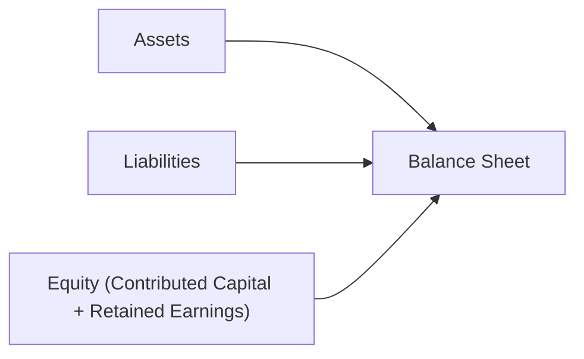

## 2.2 Basic Financial Statement Relationships

Understanding how the three primary financial statements—Balance Sheet, Income Statement, and Statement of Cash Flows—relate to one another is paramount in accounting. These statements do not exist in isolation; rather, they form an interconnected framework to present a company’s financial performance, position, and cash flows. A thorough understanding of these interrelationships benefits not only CPAs and aspiring BAR examinees, but also business analysts, audit teams, and anyone involved in financial decision-making.

This guide will walk you through each financial statement’s purpose, how they link together, and practical steps and examples to master their essential relationships. By the end of this section, you should be able to confidently trace figures from one statement to another and explain how changes in a company’s performance, operations, and financing activities manifest across these statements.

---

## The Balance Sheet (Statement of Financial Position)

The Balance Sheet, often referred to as the Statement of Financial Position, provides a snapshot of a company’s financial standing at a specific point in time. It presents a summary of what a company owns (assets), what it owes (liabilities), and the residual interest belonging to the owners (equity).

### Key Elements and the Accounting Equation

• Assets: Resources controlled by the entity that can generate future economic benefits.  
• Liabilities: Obligations that the entity has to external parties or claims on the company’s resources.  
• Equity: The net assets after deducting liabilities. It typically comprises contributed capital (e.g., common stock, preferred stock, additional paid-in capital) and accumulated earnings (or losses) retained in the business (retained earnings).

These elements are governed by the fundamental accounting equation:

(1)  

   \text{Assets} = \text{Liabilities} + \text{Equity}


When an organization’s market environment or internal operations change, the above equation must always remain in balance. Every transaction is recorded in a way that keeps this fundamental relationship intact.

### Retained Earnings: The Link to the Income Statement

Retained earnings represent the accumulated net income (or net losses) that a company keeps in the business over time. The closing process of the Income Statement’s final figure, net income (or net loss), flows into the retained earnings balance on the Balance Sheet. Dividends paid, or distributions to owners, also reduce retained earnings. Therefore, a company’s net income and dividend policy have a direct influence on the equity section of the Balance Sheet.

---

## The Income Statement (Statement of Operations)

The Income Statement, sometimes called a Profit and Loss Statement or Statement of Operations, measures the results of a company’s operations over a specified period (e.g., a quarter or a year). It communicates how revenue is earned and how expenses are incurred to generate those revenues.

### Basic Structure

At its simplest level, the Income Statement follows this formula:

(2)  

   \text{Revenues} - \text{Expenses} = \text{Net Income (or Loss)}


• Revenues: Inflows or enhancements of assets, or settlements of liabilities, resulting from delivering goods, rendering services, or other activities constituting the entity’s central operations.  
• Expenses: Outflows or uses of assets, or incurrence of liabilities, attributable to delivering goods or services or other activities constituting the entity’s central operations.  
• Net Income (or Net Loss): The remainder after deducting all expenses from revenues.

### Relationship to Other Statements

1. Balance Sheet: As noted, net income increases retained earnings in equity, while a net loss decreases it.  
2. Statement of Cash Flows: Net income often serves as the starting point in the operating activities section (when using the indirect method).

### Short Numerical Example

Imagine a new company, Redwood Designs, generating total revenues of \$100,000 and incurring \$70,000 in total expenses in its first year. Net income is therefore:


   \$100,000 - \$70,000 = \$30,000 \quad (\text{Net Income})


This \$30,000 net income will flow into the retained earnings account in the Balance Sheet. If Redwood Designs decides to distribute \$10,000 as dividends, the resulting change in retained earnings is \$20,000.

---

## The Statement of Cash Flows

The Statement of Cash Flows provides insight into the company’s actual cash movements over a period. It is divided into operating, investing, and financing activities:

• Operating Activities: Relate to primary business activities—revenues, expenses, and working capital changes.  
• Investing Activities: Purchases or sales of long-term assets, investments, or marketable securities.  
• Financing Activities: Sources of capital (e.g., issuing shares, taking on new loans) and uses of capital (e.g., repaying debt, paying dividends).

### Indirect vs. Direct Method

For operating activities, there are two popular presentation methods:  
• Indirect Method: Begins with net income and adjusts for non-cash charges (such as depreciation) and changes in working capital (accounts receivable, inventories, accounts payable, etc.).  
• Direct Method: Lists the specific operating cash receipts and payments (cash received from customers, cash paid to suppliers, etc.). While often more transparent, the direct method is less common in practice.

### Linking Cash Flows to the Income Statement and Balance Sheet

1. Net Income → Operating Section: Under the indirect method, the net income from the Income Statement is typically the first line of the operating activities section. This figure is then reconciled to net cash provided by (or used in) operating activities through non-cash adjustments and changes in current assets and liabilities.  
2. Investing Activities → Long-Term Assets: Changes in the purchase or sale of property, plant, and equipment (PPE) or intangibles are reflected on the Balance Sheet, and the resulting cash inflow/outflow appears in the investing section.  
3. Financing Activities → Long-Term Liabilities and Equity: Cash raised by issuing shares or obtaining long-term debt (liabilities), and cash used to repay those liabilities or to distribute dividends, appears in the financing section. These mirror changes in the Balance Sheet’s liabilities and equity.

---

## How the Financial Statements Connect: A Larger Numerical Illustration

Below is a simplified example illustrating how the three statements interrelate. It builds on Redwood Designs’ hypothetical first year of operation:

1. Income Statement (For the Year Ended December 31)

   • Revenues: \$100,000  
   • Expenses: \$70,000  
   • Net Income: \$30,000  

2. Dividend Declaration: \$10,000 paid to shareholders.

3. Balance Sheet (As of December 31, Before Closing Entries)

   • Assets = \$70,000  
   • Liabilities = \$0  
   • Equity:  
     • Contributed Capital: \$50,000  
     • Retained Earnings (Beginning): \$0  
     • Total Equity (Before Net Income): \$50,000  

Closing process for net income and dividends:
   • Retained Earnings is updated for the \$30,000 net income.  
   • Reduced by \$10,000 in dividends.

   Post-closing equity stands at:  
   
     \$0 + \$30,000 - \$10,000 = \$20,000 \quad (\text{Ending Retained Earnings})
   

   Now the updated Balance Sheet shows:

   • Assets = \$70,000  
   • Liabilities = \$0  
   • Equity = Contributed Capital of \$50,000 + Retained Earnings of \$20,000  
   • Total Equity = \$70,000  
   • Balanced equation: \$70,000 = \$0 + \$70,000

4. Statement of Cash Flows (For the Period)

   Assume the following simplified transactions for Redwood Designs:  
   • Issuance of shares (Financing Activity): \$50,000  
   • Purchase of equipment (Investing Activity): \$15,000  
   • Revenues were all collected in cash (Operating Activity inflow): \$100,000  
   • Expenses paid in cash (Operating Activity outflow): \$70,000  
   • Dividends paid in cash (Financing Activity outflow): \$10,000

   Under the indirect method, you might see the operating section starting with net income of \$30,000 and adjusting for no additional accruals (for simplicity, assume no changes in working capital). So net cash from operating activities is \$30,000. Summarized:

   • Net Cash Provided by Operating Activities: \$30,000  
   • Net Cash (Used in) Investing Activities: -\$15,000  
   • Net Cash Provided by Financing Activities: \$40,000  
     (Breakdown: \$50,000 from issuing shares - \$10,000 paid in dividends)

   Ending cash = Beginning cash (\$0) + \$30,000 (Operating) - \$15,000 (Investing) + \$40,000 (Financing) = \$55,000.

Although extremely simplified, this example illustrates how increases or decreases appear across all three financial statements. Understanding that these statements tie together, especially net income feeding into retained earnings and net income creating the basis for operating cash flow, is critical for verifying accuracy and performing effective analysis.

---

## Visualizing the Connections Using Mermaid Diagrams

It can help to visualize how an entity’s net income, retained earnings, and cash flows interact. Below is a simple flow diagram to reflect these relationships.

Explanation:  
• Net income (A) from the Income Statement directly influences the Balance Sheet’s Retained Earnings (B).  
• Operating activities in the Statement of Cash Flows (C) often begin with net income under the indirect method and reflect adjustments that tie back to changes reported on the Balance Sheet.

Another way to visualize the core equation is:

Explanation:  
• The Balance Sheet (E) is composed of Assets (D), Liabilities (F), and Equity (G). Retained Earnings, part of Equity, is the cumulative result from the Income Statement net income (minus any dividends).

When these diagrams become second nature, you can quickly trace how a single transaction (e.g., issuing stock, incurring an expense, or paying off debt) cascades across all three statements.

---

## Best Practices in Reviewing Financial Statement Interrelationships

• Reconcile Net Income to Retained Earnings: At each closing period, verify that net income carried forward on the Statement of Retained Earnings or directly in the equity section matches the Income Statement’s bottom line. Check dividends.  
• Confirm Closing Cash Balances: The ending balance of the Statement of Cash Flows must match the cash account on the Balance Sheet.  
• Validate Accruals and Deferrals: Understand that accrual entries (e.g., accrued salaries) will affect both the Income Statement (expense recognized) and the Balance Sheet (liability recognized).  
• Keep a Close Eye on Adjusting Journal Entries (AJEs): Adjusting entries like depreciation, amortization, and accruals can significantly alter the reported expenses on the Income Statement and corresponding asset or liability balances on the Balance Sheet. They also affect the starting point for the cash flow’s operating activities (under the indirect method).

---

## Common Pitfalls and Errors

• Misclassifying an Expense as an Asset: Leading to overstated net income and overstated assets.  
• Failing to Update Retained Earnings: Forgetting to close net income or factor in dividends can lead to discrepancies between the Income Statement and the equity section of the Balance Sheet.  
• Double Counting or Omitting Cash Transactions: Mistakes often happen when adjusting net income to derive net cash flow from operations, such as forgetting to remove non-cash items, incorrectly handling changes in working capital, or misclassifying cash flows as operating vs. investing activities.  
• Out-of-Balance Situations: If the accounting equation does not balance after recording transactions, it indicates an error (e.g., a debit without a corresponding credit).

---

## Real-World Scenario: Rapid Scaling Company

Consider Cliffline Technologies, a startup with rapid revenue growth:

• Year 1: The company has minimal liabilities, invests heavily in R&D, and finances operations by issuing common stock.  
• Year 2: They secure a large bank loan to fund a major equipment purchase. R&D leads to intangible assets recognized on the Balance Sheet if they meet certain capitalization criteria (further discussed in Chapter 11).  
• Year 3: Revenues triple, profitability soars. Net income jump means retained earnings balloon. But the company might still have negative cash flows from operations if significant amounts of revenue are uncollected at year-end (increasing accounts receivable).

Simultaneously, the Statement of Cash Flows might tell a very different story than net income due to working capital fluctuations and large capital expenditures.

This scenario underscores why analyzing one statement alone can be misleading. Observing how a net income figure might not translate into cash on hand—and how financed purchases tilt the Balance Sheet toward higher liabilities—allows you to gauge a company’s risk and sustainability.

---

## Strategies for Analyzing and Leveraging the Statements

1. Use Ratios Wisely: By connecting Income Statement items (e.g., net sales, cost of goods sold) to those on the Balance Sheet (e.g., inventory or accounts receivable), you can identify turnovers (accounts receivable turnover, inventory turnover) or measure liquidity (current ratio).  
2. Model Cash Flow Forecasts: Combine expected changes in operations (Income Statement) with capital spending (Balance Sheet) and financing assumptions (Equity and Liabilities) to forecast future cash flows.  
3. Conduct “What If” Scenarios: For budgeting processes (see Chapter 7 on Budgeting and Forecasting), changing a single assumption (e.g., sales growth, interest rates) can ripple through net income, retained earnings, and borrowing needs.

---

## Final Thoughts on Basic Financial Statement Relationships

Mastering the linkages between the Balance Sheet, Income Statement, and Statement of Cash Flows builds a strong accounting foundation for success on the BAR Exam and beyond. Grasping these relationships not only helps you spot discrepancies and errors but also allows you to gain deeper insights into a company’s liquidity, solvency, and overall health. By continuously practicing with real examples and verifying that each statement is telling a consistent story, you will refine your analytical skills and foster the professional skepticism needed in finance and accounting work.

---

## Test Your Knowledge: Financial Statements Interconnectivity Quiz



### Which statement best describes how the Income Statement links to the Balance Sheet?

- [ ] The Income Statement does not affect the Balance Sheet.
- [x] Net income from the Income Statement is closed into retained earnings on the Balance Sheet.
- [ ] Net income is only included in the Statement of Cash Flows.
- [ ] The Income Statement appears as a supplement but never ties directly.

> **Explanation:** The net income or loss reported on the Income Statement is added (or subtracted) to retained earnings within the equity section of the Balance Sheet.

### In the indirect method of the Statement of Cash Flows, which item is typically the starting point for calculating net cash provided by operating activities?

- [ ] Total revenues
- [ ] Dividends paid
- [x] Net income
- [ ] Total expenses

> **Explanation:** Under the indirect method, a business starts with net income from the Income Statement, then adjusts for non-cash items and changes in working capital to reconcile to net cash from operating activities.

### Suppose a company earned net income of $40,000 and paid dividends of $5,000. By how much does retained earnings increase on the Balance Sheet?

- [ ] $0
- [x] $35,000
- [ ] $45,000
- [ ] $40,000

> **Explanation:** Retained earnings increase by net income ($40,000), then decrease by dividends ($5,000), yielding a net increase of $35,000.

### Which of the following best describes the relationship between the Balance Sheet and the Statement of Cash Flows?

- [ ] The Statement of Cash Flows only contains operating items.
- [ ] The two statements never align because they measure different aspects.
- [x] The Statement of Cash Flows reflects changes in the Balance Sheet’s cash account over a specific period.
- [ ] Balance Sheet items only impact the Income Statement, not the Statement of Cash Flows.

> **Explanation:** The Statement of Cash Flows explains the period’s change in the cash balance, which is reported as an asset on the Balance Sheet.

### What is a key reason net income might differ greatly from net cash flow from operations?

- [x] Accrual accounting often recognizes revenues when earned and expenses when incurred, regardless of cash flow timing.
- [ ] A company only reports cash-based expenses on the Income Statement.
- [x] Depreciation is a direct cash inflow.
- [ ] All transactions are always recorded on a cash basis.

> **Explanation:** Under accrual accounting, timing differences can cause net income and operating cash flow to diverge. Additionally, non-cash expenses like depreciation are part of net income but do not involve actual cash outflow.

### If a business records a large depreciation expense, how does this affect net income and operating cash flow (indirect method)?

- [x] Net income decreases, but operating cash flow is unaffected directly (depreciation is added back).
- [ ] Net income increases, and operating cash flow decreases.
- [ ] Both net income and operating cash flow rise.
- [ ] Both net income and operating cash flow decline.

> **Explanation:** Depreciation decreases net income but is added back to net income in the operating activities section under the indirect method, thus no direct impact on net cash flow from operations.

### A company issues new common stock for $100,000. Where would this transaction appear?

- [ ] Operating activities
- [x] Financing activities
- [ ] Investing activities
- [ ] Not reported, since it is not an expense or revenue

> **Explanation:** Issuing shares is a financing transaction because it reflects how a business raises capital. The cash inflow will appear in the financing section of the Statement of Cash Flows and in the equity section on the Balance Sheet.

### Which statement is true regarding the Balance Sheet at the end of the accounting period?

- [ ] It combines with the Income Statement to form the trial balance.
- [ ] It primarily shows only revenue and expenses.
- [x] It provides a snapshot of the company’s financial position, listing assets, liabilities, and shareholders’ equity at a point in time.
- [ ] It only details the company’s liquidity positions.

> **Explanation:** By listing assets, liabilities, and equity, the Balance Sheet reflects the company’s financial standing at a specific moment, not revenues and expenses.

### When a business purchases a piece of equipment partially with cash and partially through a note payable, how does it affect the financial statements?

- [x] Assets increase by the total cost of equipment; cash decreases by the cash payment portion; liabilities increase by the note payable portion.
- [ ] Only expenses are recognized on the Income Statement.
- [ ] Retained earnings decrease equivalently.
- [ ] There is no effect on the Balance Sheet since the equipment was financed.

> **Explanation:** An equipment purchase is capitalized as an asset; any note payable is recorded as a liability. While cash outflow would appear on the Statement of Cash Flows, the ongoing effect on the Balance Sheet includes an increase in assets and liabilities.

### The cash balance on the Balance Sheet at period-end should match which item on the Statement of Cash Flows?

- [x] The ending cash and cash equivalents balance shown at the bottom of the statement
- [ ] The total of all operating, investing, and financing activities
- [ ] The net cash provided by operating activities
- [ ] Net income plus depreciation

> **Explanation:** The Statement of Cash Flows reconciles the beginning and ending cash balances. The ending balance should agree with the Balance Sheet’s cash account.



---

## For Additional Practice and Deeper Preparation

### [Business Analysis and Reporting (BAR) CPA Mock Exams](https://www.udemy.com/course/bar-cpa-mock-exams/?referralCode=ADBE2E84BEE9CB6243CA)

**Business Analysis and Reporting (BAR) CPA Mocks:** 6 Full (1,500 Qs), Harder Than Real! In-Depth & Clear. Crush With Confidence!

- Tackle full-length mock exams designed to mirror real BAR questions.  
- Refine your exam-day strategies with detailed, step-by-step solutions for every scenario.  
- Explore in-depth rationales that reinforce higher-level concepts, giving you an edge on test day.  
- Boost confidence and minimize anxiety by mastering every corner of the BAR blueprint.  
- Perfect for those seeking exceptionally hard mocks and real-world readiness.  

_Disclaimer: This course is not endorsed by or affiliated with the AICPA, NASBA, or any official CPA Examination authority. All content is for educational and preparatory purposes only._
