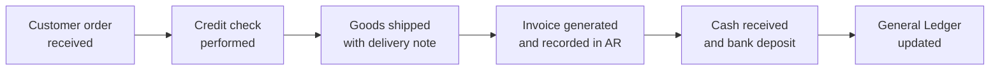
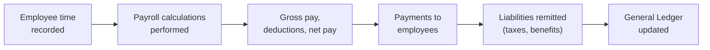

## 2.3 Business Processes and Transaction Cycles

A robust understanding of business processes and transaction cycles is essential for financial professionals preparing for the Business Analysis and Reporting (BAR) section of the CPA Examination. Transaction cycles serve as the building blocks by which financial data enters and populates the accounting system. In the following material, we examine the primary transaction cycles—sales/receivables, purchases/payables, and payroll—and explain how information flows into the general ledger (GL), ultimately impacting the organization’s financial statements. We will also explore best practices, potential pitfalls, and ways to integrate automated solutions and internal controls for effective, reliable accounting. 

### Why Business Processes Matter
Business processes establish an organization’s operational framework and directly influence financial reporting. The accuracy, timeliness, and consistency of these processes provide management, regulators, and stakeholders with confidence in reported figures. Inaccurate or incomplete processes—in areas such as revenue recognition, purchase approvals, or payroll calculations—can lead to incorrect financial statements, regulatory violations, or even fraud. As you prepare for the BAR exam, remember that a deep understanding of core transaction cycles will enhance your ability to analyze, interpret, and verify financial information.

### Foundational Documents and Procedures
Before diving into specific cycles, keep in mind that each transaction cycle typically involves:
• Source documents (e.g., sales order, purchase order)  
• Authorizations (e.g., approvals, credit checks)  
• Recording mechanisms (e.g., journals, subsidiary ledgers)  
• Reconciliation processes (e.g., matching invoices to receiving reports)  

These elements help prevent errors and detect irregularities early, safeguarding data integrity. Many controls are embedded within these processes and act as checks and balances to ensure transactions are properly executed and recorded.

---

### The Sales / Receivables Cycle

The sales/receivables cycle captures revenue transactions from the moment a customer places an order until payment is received and recorded. Accurate handling of this cycle is paramount for recognizing revenue according to proper guidelines—such as ASC 606’s Five-Step Model (see Chapter 12: Revenue Recognition)—and for maintaining healthy cash flow.

#### Overview
1. Customer Order and Credit Approval: The customer initiates the cycle by placing an order. A credit check ensures the customer’s ability to pay.  
2. Shipment of Goods or Delivery of Services: Once approved, the company ships goods or provides services to the customer. Shipping documents such as delivery notes confirm the transaction.  
3. Billing/Invoice Generation: After confirming delivery, the company generates an invoice detailing the products or services delivered, the price, and the terms of payment.  
4. Recording the Receivable: The invoice is recorded in the Accounts Receivable (AR) subsidiary ledger, increasing the customer’s outstanding balance.  
5. Cash Receipt and Deposit: Upon receiving payment, the organization issues a receipt and deposits the funds into the bank.  
6. Reconciliation and General Ledger Posting: All AR postings are periodically reconciled with the general ledger. Adjustments, if needed, are recorded (for example, to account for sales returns or allowances).

#### Key Documents
• Sales Order: Authorizes production or order fulfillment.  
• Shipping Document (Bill of Lading/Packing Slip): Evidence of goods shipped.  
• Invoice: Details the amount owed by the customer.  
• Remittance Advice: Accompanies payment, indicating what invoice(s) the payment covers.

#### Control Points
• Segregation of Duties: Ensure different individuals handle authorization, custody, and recording.  
• Credit Limit Authorization: Enforce credit checks to mitigate uncollectible accounts.  
• Shipping and Billing Match: Reconcile quantities and goods shipped with those invoiced.  
• Cash Handling Controls: Separate deposit preparation from recordkeeping.

#### Flow into the General Ledger
Once invoices are generated and recorded in the AR subsidiary ledger, the AR total is posted to the general ledger. Receipts are credited to AR and debited to cash or bank accounts. The net result, after each cycle closes, is an updated AR and cash balance in the GL.

Below is a simple flowchart illustrating the sales/receivables process:

In this diagram, each step generates source documents or records that funnel data into the general ledger. The control environment ensures these records are both accurate and properly authorized.

---

### The Purchases / Payables Cycle

The purchases/payables cycle encompasses procurement activities starting from the need for goods and services through payment to vendors. Properly managing this cycle ensures that companies satisfy vendor obligations on time and maintain a solid reputation, all while preventing overpayments or fraudulent transactions.

#### Overview
1. Requisition and Order Placement: Internal requests trigger a purchase requisition, which is then converted into a purchase order (PO) authorized by a designated manager.  
2. Receipt of Goods/Services: Goods received (or services rendered) are documented with a receiving report. Vendors often attach a packing list with delivered goods.  
3. Vendor Invoice Verification: The invoice is compared against the PO and receiving report to ensure quantity and price accuracy (three-way match).  
4. Recording the Payable: Once verified, the invoice is recorded in the Accounts Payable (AP) subsidiary ledger, increasing the amount owed to the vendor.  
5. Payment Authorization: Payment is scheduled and processed for the due date, typically via check, ACH, or other electronic transfer.  
6. Payment Execution and Reconciliation: Payment is posted to AP, and the vendor’s balance is reduced accordingly. Reconciling the AP ledger with the general ledger helps detect variances.

#### Key Documents
• Purchase Requisition: Internal request for needed items.  
• Purchase Order (PO): Documents terms and quantity agreed upon with the vendor.  
• Receiving Report: Confirms receipt of goods, matching them to the PO and packing list.  
• Vendor Invoice: Bill issued by the supplier, matched against the PO and receiving report.

#### Control Points
• Approval Policies: Purchase requisitions and orders should be authorized by delegated personnel.  
• Three-Way Match: Compare the PO, receiving report, and vendor invoice before recording liability.  
• Segregation of Duties: Keep vendor approval, invoice processing, and check signing under separate individuals.  
• Duplicate Payment Controls: Employ invoice numbering or other processes to avoid paying the same invoice multiple times.

#### Flow into the General Ledger
Once the three-way match confirms vendor invoices, the company records a credit to Accounts Payable and a debit to the appropriate expense or asset account. Upon payment, AP is debited, and cash or the bank account is credited. The AP subsidiary ledger is reconciled with the general ledger to keep the financial statements accurate.

Below is a flowchart illustrating the purchases/payables process:

In practice, modern companies often use Enterprise Resource Planning (ERP) systems to automate matching, invoice processing, and payment scheduling, reducing manual tasks and helping eliminate errors.

---

### The Payroll Cycle

The payroll cycle manages the calculation and disbursement of wages/salaries to employees. This cycle includes tracking wages, benefits, payroll taxes, and other withholdings. Errors in payroll processing can lead to disgruntled employees, tax penalties, and compliance issues—making accuracy and timeliness non-negotiable.

#### Overview
1. Employee Time/Attendance Data: Data on hours worked (hourly employees) or salaries (exempt employees) is collected from timecards or automated systems.  
2. Payroll Calculation: The payroll software calculates gross earnings and withholdings (taxes, social security, retirement contributions, etc.).  
3. Payroll Run and Payments: Checks or direct deposits are issued to employees.  
4. Employer Liabilities and Payment Remittances: The employer withholds and remits taxes and other deductions to the appropriate agencies or benefit providers.  
5. General Ledger Posting: Payroll expenses, liabilities, and cash or bank account outflows are recorded.  
6. Payroll Reconciliation: Ensuring that total wages, deductions, and withholdings match W-2 forms, tax filings, and the GL.

#### Key Documents
• Timecard/Attendance Reports: Comprehensive data of hours worked.  
• Payroll Register: Summarizes gross pay, withholdings, and net pay for each employee.  
• Pay Stubs: Issued to employees, detailing how net pay was calculated.  
• Government Returns: Such as Form 941 (in the U.S.) for employer’s quarterly federal taxes.

#### Control Points
• Approval and Accuracy: Supervisor approval of time worked.  
• Payroll Authorization: Segregate those who handle employee master data from those who process payroll.  
• System Access Controls: Restrict the ability to create “ghost employees.”  
• Reconciliations: Reconcile payroll bank accounts monthly, verify salary changes or adjustments.

#### Flow into the General Ledger
After running payroll, the finance team posts wage expense and payroll tax expenses as debits, while recording corresponding credits to cash accounts and various payroll liabilities (e.g., withholdings, benefits owed). Once deductions are remitted, the liability accounts are cleared, typically through a credit to cash or bank and a debit to each liability.

Below is a simplified payroll flowchart:

An up-to-date, accurate payroll system is essential for timely and correct financial statement presentation, and for meeting regulatory obligations related to taxes and benefits.

---

### Integrating Transaction Cycles into the General Ledger

Each transaction cycle runs according to its own timetable but ultimately intersects at the general ledger. Think of the GL as a central repository where all subsidiary ledgers and financial data converge. Proper integration means:

• Timely Posting: Ensures real-time or near real-time insights on financial positions.  
• Accurate Classification: Links each transaction to the correct account (expense, revenue, liability, or asset).  
• Consistency in Cutoff: Transactions close within the proper accounting period, disallowing overlaps.  
• Reconciliation: Periodic matching of subsidiary ledgers (e.g., AR, AP, payroll) with the corresponding GL accounts.

When these conditions are met, the general ledger reliably reflects the organization’s financial health, facilitating the creation of the balance sheet, income statement, statement of cash flows, and other key reports.  

---

### Common Internal Controls, Pitfalls, and Technology Considerations

Strong internal controls within each cycle help maintain data integrity:

• Authorization Controls: Prevent unauthorized purchases, sales, or payroll additions.  
• Physical Controls: Secure inventory or assets to prevent misuse or theft.  
• IT and System Controls: Lockdown of user-access privileges, built-in transaction thresholds, and automatic reconciliation.  
• Data Analytics and RPA: Automated three-way matching, exception reporting, or inventory reorder points powered by data analytics can remove human error and reduce processing time.  

Common pitfalls include:

• Overlooking the timing of transaction recognition (e.g., revenue recognized before the performance obligation is satisfied).  
• Failing to reconcile subsidiary ledgers frequently, which can cause unnoticed discrepancies.  
• Lacking segregation of duties, leading to potential fraud or errors.

Modern accounting systems, especially ERP platforms like SAP or Oracle, can integrate these cycles seamlessly, reducing redundant data entry and improving oversight. As you prepare for the BAR exam, realize that exam simulations might require you to interpret flowcharts, diagnose control weaknesses, or spot potential misstatements in these transaction cycles.

---

### Practical Example: A Simplified Manufacturing Company

Consider a mid-sized manufacturing company, ABC Fabrics, that processes daily customer orders. When a customer relationship is established, credit limits are set. If a returning customer places an order, ABC Fabrics staff checks real-time inventory levels. Goods are then produced or picked from stock, shipped out, and an invoice is emailed to the customer and posted to AR.  

During procurement, the production manager issues a purchase requisition when raw materials run low. A purchasing officer converts the requisition into a purchase order after verifying budget codes. When materials arrive, they are checked against the PO and a receiving report is updated. After invoice verification, ABC Fabrics records the payable in the AP ledger and schedules payment.  

For payroll, employees and supervisors confirm monthly timesheets using an automated clock-in system. Deductions for healthcare, taxes, and 401(k) are processed, and net pay is distributed via direct deposit. The payroll software interfaces with the general ledger, recording wage expenses and clearing liabilities as the company remits withheld amounts.  

By reconciling their AR, AP, and payroll ledgers to the general ledger every month, ABC Fabrics ensures that its financial statements accurately reflect operational realities.

---

### Best Practices
• Maintain written policies for each transaction cycle, including approval limits.  
• Deploy real-time or weekly reconciliations of key accounts (bank statements, AR, AP, etc.).  
• Monitor exceptions, such as credit overrides or invoice mismatches, through automated alerts.  
• Train personnel thoroughly on relevant system modules and processes.  

---

### References for Further Exploration
• AICPA. (n.d.). Audit and Accounting Guides – Offers deep dives into internal controls and transaction testing.  
• COSO Enterprise Risk Management Framework – For understanding risk-based approaches to controls.  
• Kaplan, R. & Cooper, R. (1998). Cost & Effect: Using Integrated Cost Systems to Drive Profitability and Performance –  Addresses efficient costs flows in production cycles.  
• Online ERP Tutorials (Oracle, SAP, Microsoft Dynamics) – Many vendors provide free educational materials or simulations.  

---

## Mastering Business Processes and Transaction Cycles: Practice Quiz



### Which document typically authorizes production or order fulfillment in the sales/receivables cycle?

- [ ] Credit memo
- [x] Sales order
- [ ] Bank statement
- [ ] Remittance advice

> **Explanation:** The sales order acts as the primary internal document that triggers the fulfillment process, ensuring clarity on quantity and price before production or order preparation begins.

### In a purchases/payables cycle, which best describes the three-way match?

- [x] Matching purchase order, receiving report, and vendor invoice
- [ ] Comparing vendor invoice to cash disbursement journal and bank statement
- [ ] Verifying payment terms with the master budget
- [ ] Matching purchase order to an unrelated sales order

> **Explanation:** The three-way match involves reconciling the PO, receiving report, and vendor invoice to confirm correct quantities, pricing, and terms, thereby detecting errors or fraudulent charges.

### What is the primary standard used to recognize revenue in U.S. GAAP for sales transactions?

- [ ] ASC 280
- [ ] IFRS 15
- [x] ASC 606
- [ ] ASC 810

> **Explanation:** Under U.S. GAAP, ASC 606 outlines the Five-Step Model for revenue recognition (see Chapter 12), which aligns revenue recognition with the fulfillment of performance obligations.

### In the payroll cycle, which of the following safeguards helps prevent creation of “ghost employees”?

- [x] Restricting access to the employee master file
- [ ] Using generic logins for payroll staff
- [ ] Reconciling sales orders and time sheets
- [ ] Ignoring direct deposit transactions

> **Explanation:** Maintaining strict access controls over the master file—as well as segregating responsibilities for hiring, payroll processing, and direct deposit setup—helps eliminate unauthorized employee entries.

### A common best practice for segregating duties in the sales/receivables cycle includes:

- [x] Separating credit approval from the shipping and billing departments
- [ ] Combining invoice generation with AR posting
- [x] Splitting the cash receipts process from AR record updates
- [ ] Allowing the same person to do credit approvals and bank reconciliations

> **Explanation:** Segregation of duties requires that no single individual controls multiple aspects of a transaction flow. Splitting these tasks reduces the risk of fraud and errors.

### Which statement is true regarding the impact of transaction cycles on financial statements?

- [x] Accurate transaction cycles ensure that balance sheet and income statement amounts are correct.
- [ ] Transaction cycles are unrelated to the final figures in the general ledger.
- [ ] Transaction cycles only affect internal reporting, not external reporting.
- [ ] The payroll cycle is excluded from the general ledger.

> **Explanation:** Each cycle’s accurate recording feeds the general ledger, directly impacting the balance sheet, income statement, and other financial statements, whether used internally or externally.

### What is the main goal of reconciliations between subsidiary ledgers (like AP, AR) and the general ledger?

- [x] To ensure detailed transaction data aligns with summary balances in the GL
- [ ] To identify new products to sell
- [x] To spot irregularities such as double payments or unrecorded receipts
- [ ] To eliminate the use of the general ledger entirely

> **Explanation:** Reconciliations ensure that each individual account (e.g., for a specific vendor or customer) tallies with the summarized GL figures, catching discrepancies before financial statements are generated.

### Which of the following documents is generated when goods are shipped in the sales/receivables cycle?

- [x] Delivery note or bill of lading
- [ ] Purchase requisition
- [ ] Receiving report
- [ ] Bank statement

> **Explanation:** A delivery note, or bill of lading, provides proof that goods have been shipped. The customer can use it to verify items and quantities received.

### In the purchases/payables process, why should the person authorized to issue checks not also maintain the vendor master file?

- [x] Combining both roles may lead to fraudulent disbursements
- [ ] It helps with bank reconciliation
- [ ] It allows immediate invoice approvals
- [ ] There is no need for segregating these duties

> **Explanation:** Entrusting one individual with both creating/updating vendor records and issuing checks invites the risk of creating fictitious vendors and diverting funds.

### In a normal payroll cycle, wages/salaries are recorded as an expense while the corresponding liability accounts for withholdings and taxes are:

- [x] Credited until remittances are made 
- [ ] Debited until the end of the year
- [ ] Ignored completely
- [ ] Posted directly to owners’ equity

> **Explanation:** When wages or salaries are earned by employees, the company debits Wage Expense (or Salaries Expense) and credits associated liability accounts (taxes payable, health insurance payable, etc.) until payment or remittance occurs.



---

## For Additional Practice and Deeper Preparation

### [Business Analysis and Reporting (BAR) CPA Mock Exams](https://www.udemy.com/course/bar-cpa-mock-exams/?referralCode=ADBE2E84BEE9CB6243CA)

**Business Analysis and Reporting (BAR) CPA Mocks:** 6 Full (1,500 Qs), Harder Than Real! In-Depth & Clear. Crush With Confidence!

- Tackle full-length mock exams designed to mirror real BAR questions.  
- Refine your exam-day strategies with detailed, step-by-step solutions for every scenario.  
- Explore in-depth rationales that reinforce higher-level concepts, giving you an edge on test day.  
- Boost confidence and minimize anxiety by mastering every corner of the BAR blueprint.  
- Perfect for those seeking exceptionally hard mocks and real-world readiness.  

_Disclaimer: This course is not endorsed by or affiliated with the AICPA, NASBA, or any official CPA Examination authority. All content is for educational and preparatory purposes only._
