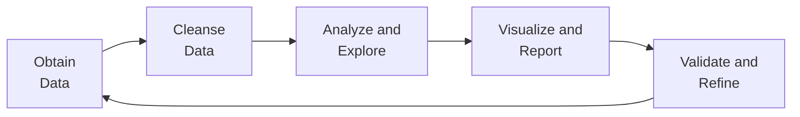
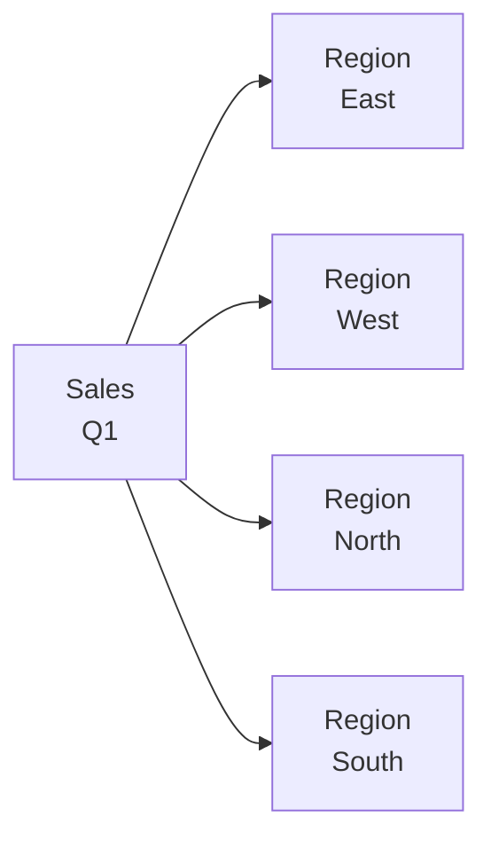

## 3.1 Data Analytics for BAR: Tools and Techniques

Data analytics has become an indispensable component of modern accounting, enabling professionals to uncover hidden relationships, detect anomalies, predict outcomes, and derive actionable business insights. In the context of the Business Analysis and Reporting (BAR) section of the Uniform CPA Examination, a robust grounding in data analytics is essential for both new and experienced accountants. This chapter focuses on the fundamental tools, techniques, and concepts that CPAs need to harness when approaching financial data for analysis and reporting. 

A well-structured data analytics approach empowers professionals to identify trends, uncover outliers, and deepen their understanding of how various factors influence financial statements. By employing effective methods—from descriptive statistics and data visualization to predictive models and machine learning—a CPA can transform raw financial and operational data into meaningful insights.

This chapter builds on earlier concepts, such as revisiting the role of technology in modern accounting (see Chapter 2.4), and provides a framework for integrating data analytics throughout different areas: from ratio analysis (Chapter 4), to budgeting and forecasting (Chapter 7), and even governmental accounting applications (Chapters 19–22).

------

Use the headings below as a roadmap to harness data analytics effectively for the BAR section of the CPA exam and your broader professional practice.

### Importance of Data Analytics in BAR

Data analytics drives strategic decision-making, risk assessment, and performance evaluation in corporate, governmental, and not-for-profit environments. From identifying cost efficiencies to spotting potential fraud, data-driven insights can direct organizations toward more profitable and ethical operations. In the BAR discipline, analytics not only helps you understand the story behind the numbers but also ensures that your interpretation remains objective and grounded in evidence.

Key reasons why data analytics is central to BAR:
• Enhanced Accuracy: Automated checks and algorithms help discover errors in transactions or ledgers.  
• Improved Efficiency: Automated scripts, tools, and workflows reduce manual reconciliations.  
• Deeper Insights: Advanced techniques such as trend analysis, predictive modeling, and machine learning shed light on future opportunities or potential liabilities.  
• Risk Mitigation: Timely identification of anomalies helps reduce the likelihood of fraud or material misstatements.  

------

### Data Analytics Lifecycle in Accounting

Although data analytics can appear daunting due to the variety of tools and methods, a structured lifecycle simplifies the process. This lifecycle ensures each stage from data collection to final reporting is well-managed.

#### 1. Obtain Data
Data acquisition is the first step. BAR analysts leverage multiple data sources—enterprise resource planning (ERP) systems, internal transaction records, governmental databases, market data, or even social media feeds. Good data governance (see Chapter 2.4) is crucial, as the accuracy and reliability of the analysis depend on the quality of the source data.

#### 2. Cleanse Data
Raw data often arrive with inaccuracies, missing values, or inconsistencies. Data cleansing includes removing duplicates, addressing missing entries, and standardizing date, currency, or textual fields. As CPAs, ensure that cleansing processes do not inadvertently manipulate factual data, especially if dealing with potential audit evidence. Appropriate documentation and version control are also best practices at this stage.

#### 3. Analyze and Explore
After cleaning, the dataset is ready for preliminary exploration. This stage involves:  
• Summarizing basic statistics (mean, median, mode, standard deviation).  
• Checking for outliers (using z-scores, box plots, or scatter plots).  
• Identifying patterns or correlations among variables (e.g., correlation analysis between cost drivers and overhead).  

Common tools include spreadsheet software (Microsoft Excel), databases (SQL), and statistical platforms (R, Python, or specialized accounting software). Your choice depends on project scope, data volume, and complexity.

#### 4. Visualize and Report
Next, findings are presented in an easily interpretable manner using visualization tools like Excel charts, Microsoft Power BI, or Tableau. Graphical representations—bar charts, line graphs, bubble charts—are instrumental in highlighting trends, anomalies, or relationships that may not be immediately obvious from raw data.

#### 5. Validate and Refine
Finally, results are validated for accuracy and reliability. Engage in critical review: Does the analysis align with known industry benchmarks? Are the findings replicable with a different sample period or dataset? Adjust assumptions or refine models as necessary before final reporting. Feedback loops are essential for continuous improvements in analytical methods.

------

### Tools for Data Collection and Wrangling

The first challenge in any data analytics project is gathering relevant, accurate data. Below are common tools and techniques to handle data collection and wrangling.

#### Databases and SQL
Many organizations store transactional data in relational databases managed by Oracle, MySQL, or Microsoft SQL Server. As a CPA, basic familiarity with SQL (Structured Query Language) enables direct querying of large datasets to extract essential fields. This skill is often crucial for analyzing large-scale sales records, inventory logs, or other operational data.

#### Cloud-Based Tools
Cloud platforms such as Amazon Web Services (AWS), Microsoft Azure, and Google Cloud provide robust data storage, elasticity, and computational capabilities. These services often include data pipelines, serverless computing functions, and data warehousing solutions like Redshift, Azure Synapse, or BigQuery. Cloud-based environments facilitate enterprise-scale analytics projects with improved security, reliability, and integration options.

#### Python, R, and Data Wrangling Libraries
Programming environments (Python or R) offer libraries designed for data wrangling. In Python, the “pandas” library is a go-to for merging, filtering, and cleaning large datasets. Similarly, in R, tidyverse packages (e.g., dplyr, tidyr) streamline data manipulation. While advanced, these tools allow for more complex tasks such as text mining and advanced statistical modeling.

#### Spreadsheets
For smaller datasets, spreadsheets remain a cornerstone of accounting analytics. Tools like Microsoft Excel or Google Sheets are well-suited for moderate-scale tasks such as reconciliations, standard ratio calculations, or budgeting scenarios. They also offer built-in pivot tables and basic scripting languages (VBA in Excel or Google Apps Script) to automate recurring tasks.

------

### Techniques for Identifying Patterns, Outliers, and Trends

One of the central aims of data analytics in BAR is to spot unusual activities or deviations from the norm. Below are several widely used approaches:

#### Descriptive Statistics
Descriptive statistics summarize the salient features of a dataset. Examples:  
• Mean, Median, and Mode for measuring central tendency.  
• Standard Deviation and Variance for measuring spread or volatility.  
• Skewness and Kurtosis for understanding the shape and distribution of data.

In a BAR context, descriptive statistics help identify whether certain transactions or expense lines deviate considerably from established norms and might require further inquiry.

#### Time-Series Analysis
Time-series analysis focuses on data points collected over regular intervals, enabling CPAs to detect seasonality, trends, or cyclical patterns. Techniques range from simple moving averages to more complex ARIMA modeling. These approaches are especially useful in budgeting and forecasting (see Chapter 7) to project future financial performance.

#### Correlation and Regression
Correlation analysis checks for linear relationships between two variables (e.g., revenue and marketing expenses). Regression goes further, modeling relationships (e.g., a linear regression to predict cost of goods sold based on production volume). These techniques illuminate cost drivers, detect potential outliers, and highlight risk exposures for capital budgeting decisions (see Chapter 8).

#### Outlier Detection
Outliers can signal fraudulent transactions, errors in data entry, or legitimate but atypical events (e.g., extraordinary gains). Techniques include:  
• Z-scores: Determining how many standard deviations a point lies from the mean.  
• Box Plots: Visualizing quartiles and spotting extreme points.  
• Density-Based Methods (DBSCAN): Particularly efficient for large datasets, isolates clusters and unusual points.  

When done properly, outlier detection helps refine the narrative behind financial data and flags potential risk or opportunities for deeper examination.

#### Advanced Analytics (Machine Learning)
Machine learning models—like decision trees, random forests, or neural networks—can uncover complex, non-linear patterns in data. While not typically the first line of analysis for a routine audit, these methods can be invaluable for large data sets with hidden relationships. Many finance teams employ machine learning to forecast demand, detect anomalies, or support real-time decision-making.

------

### Visualization Approaches

Visualizing data helps CPAs and stakeholders interpret data more rapidly. A few best practices:

• Choose the Right Chart: Time series? Line chart. Composition breakdown? Pie or stack chart. Comparing multiple categories? Bar charts or bullet graphs.  
• Simplify Labels: Use concise titles, clear axis labels, and minimal text.  
• Highlight Key Items: Colors, annotations, or bold text help direct attention to insights.  
• Encourage Dynamic Exploration: Interactive dashboards (e.g., in Microsoft Power BI or Tableau) empower users to drill down into details, filter data, or change variables in real time.

Below is a simple depiction of how one might compare quarterly sales by region in a bar chart, highlighting patterns:

In practice, each bar’s height or color indicates performance, with additional details—such as footnotes on significant events—illuminating possible reasons for variance.

------

### Integrating Data Analytics with BAR Concepts

Data analytics is not a standalone discipline; it interconnects with many accounting and finance areas covered throughout this guide:

• Financial Statement Analysis (see Chapter 4): Tools such as ratio analysis or horizontal/vertical analysis become more powerful when combined with dynamic dashboards that instantly reflect different time frames or scenarios.  
• Managerial and Cost Accounting (Chapter 5): ABC (Activity-Based Costing) or job order costing can be augmented by advanced data visualization to track overhead allocation in near-real time.  
• Budgeting and Forecasting (Chapter 7): Rolling forecasts rely on sophisticated data analysis, particularly in industries with rapidly changing demand. Predictive analytics refine traditional top-down or bottom-up approaches.  
• Risk Assessment and Valuation (Chapters 8 and 9): Sensitivity analyses, capital budgeting decisions, or valuations become more robust with integrated and automated data analytics.  

------

### Best Practices in Data Analytics for BAR

#### Documentation and Audit Trail
All transformations and analyses should be transparent. This practice not only simplifies reviews by external auditors but also helps replicate and validate results over time.

#### Collaboration with IT and Data Teams
Accountants often need to coordinate with IT professionals for data extraction and system-level configurations. Particularly in advanced analytics projects, synergy with data scientists or system administrators significantly reduces errors.

#### Data Security and Privacy
When handling sensitive information—financial statements, employee records, or strategic plans—ensure compliance with relevant regulations (e.g., GDPR, HIPAA if applicable, or state privacy laws). Implement access controls such as role-based permissions.

#### Ongoing Skill Development
Given the pace of technological innovation, CPAs should regularly update their data analytics skillsets. Workshops, online tutorials, or advanced software certifications can help you stay at the forefront of emerging tools and methodologies.

------

### Common Pitfalls and Recommendations

• Overreliance on Tools: Tools are only as effective as their operators. A robust foundation in accounting principles and professional skepticism remain paramount, especially when data outputs conflict with established expectations.  
• Poor Data Quality: Biased, incomplete, or erroneous data will produce misleading results. Thorough data cleansing and validation mitigate these issues.  
• “Analysis Paralysis”: Overanalyzing can stall decision-making. Define clear objectives and key metrics before diving into complex analytics.  
• Insufficient Stakeholder Engagement: Data analytics often requires cross-functional input. Engage relevant teams early to ensure that the analysis aligns with strategic goals.  

------

### Case Study Example

Consider a mid-sized manufacturing company suspecting cost overruns in its product line. The CFO tasks the BAR team with investigating potential anomalies. Using data analytics, the team:

1) Extracts six months of transactional data from the ERP, including materials, labor hours, and overhead allocations for each product.  
2) Cleans and merges the data, removing duplicate records and standardizing cost center codes.  
3) Runs descriptive statistics and correlation analysis to see which variables significantly drive cost. They notice a spike in overhead allocation for a particular product line, pegged to hours worked in a newly automated assembly department.  
4) Creates a dashboard in Power BI that tracks overhead rates weekly, highlighting anomalies where overhead rates diverge from the historical norm by more than two standard deviations.  
5) Discovers an erroneous overhead allocation configuration in the ERP that assigned extra overhead to each unit produced.  

Outcome: By correcting the allocation formula, the company properly states the cost of goods sold, avoids inflating product costs, and clarifies profit margins for strategic pricing decisions.

------

### References and Further Exploration

• Harvard Business Review: “Data Science and the Art of Persuasion” – a practical take on how to make your analytics results impactful.  
• Kaggle (www.kaggle.com) – a collaborative community for data analytics and machine learning, offering datasets and competitions.  
• Microsoft Power BI and Tableau official websites – for tutorials, customer case studies, and certification paths.  
• Python for Finance (2nd Edition) by Yves Hilpisch – focuses on applying Python analytics in a finance context.  

------

## Quiz: Data Analytics for BAR



### Which stage in the data analytics lifecycle involves removing duplicates and standardizing values to ensure accuracy?
- [ ] Obtain Data
- [x] Cleanse Data
- [ ] Visualize and Report
- [ ] Analyze and Explore

> **Explanation:** The data cleansing stage involves cleaning the raw dataset by removing duplicates, filling in or removing missing values, and standardizing formats to ensure accuracy.

### Which tool is commonly used to interact directly with relational databases in large accounting environments?
- [ ] Microsoft Excel Pivot Tables
- [x] SQL 
- [ ] Tableau
- [ ] QuickBooks

> **Explanation:** SQL (Structured Query Language) is the standard language used to query and manage data in relational databases.

### Which measure indicates how many standard deviations a data point is from the mean, helpful in identifying outliers?
- [x] Z-score
- [ ] P-value
- [ ] Confidence Interval
- [ ] Coefficient of Determination (R²)

> **Explanation:** A Z-score helps determine whether a data point is abnormally high or low compared to the rest of the dataset.

### What is one primary benefit of interactive dashboards, such as those created in Power BI or Tableau?
- [x] They enable real-time user exploration and filtering of data.
- [ ] They remove the need for data cleansing.
- [ ] They replace the entire budgeting process.
- [ ] They completely automate accounting tasks.

> **Explanation:** Tools like Power BI and Tableau allow users to drill down into specific dimensions, dynamically filter data, and visualize real-time results without manually recreating charts.

### In a time-series analysis, which of the following can be easily identified?
- [x] Seasonal patterns
- [ ] Consolidation adjustments
- [x] Overall trends
- [ ] Currency translation methods

> **Explanation:** Time-series analysis focuses on data points over time, helping identify trends, seasonality, or cyclical behavior. It does not directly address consolidation or foreign currency translation.

### Which type of modeling might a CPA use to predict cost of goods sold based on multiple cost drivers?
- [x] Regression Analysis
- [ ] Sampling Analysis
- [ ] Probability Distributions
- [ ] Gantt Chart

> **Explanation:** Regression analysis is used to identify relationships between dependent (COGS) and independent (cost drivers) variables, aiding in forecasting and optimization.

### When employing advanced analytics with machine learning, what is a key consideration for accounting data?
- [x] Data must be large and sufficiently representative for predictive modeling.
- [ ] Machine learning completely eliminates the need for audits.
- [x] Data sources should be confidential to ensure no external collaboration.
- [ ] Charts and graphs should be minimized.

> **Explanation:** Machine learning often requires large, representative datasets to create predictive models. Audits and external collaborations remain essential, as does thorough data documentation.

### Why is maintaining an audit trail critical in data analytics?
- [x] It ensures repeatability and validates the integrity of the analysis.
- [ ] It removes the step of data cleansing.
- [ ] It automatically corrects misstatements.
- [ ] It eliminates the need for version control.

> **Explanation:** Documenting each step of analysis, including transformations and assumptions, fosters transparency, allowing third parties (e.g., auditors, regulators) to verify results.

### Which of the following best describes “analysis paralysis” in the context of data analytics?
- [x] Overanalyzing data to the point of delaying or preventing decisions.
- [ ] Underanalyzing data leading to incorrect decisions.
- [ ] Creating dashboards without any actual data.
- [ ] Outsourcing all analytics to external parties.

> **Explanation:** “Analysis paralysis” refers to a situation where an individual or team overcomplicates or over-extends the analysis process, hindering timely decision-making.

### Applying data visualization best practices, which statement is TRUE?
- [x] Color and annotation should be used sparingly to highlight critical insights.
- [ ] Pie charts are always preferable to line charts.
- [ ] Eliminate all legends and data labels for simplicity.
- [ ] Use as many colors as possible to impress stakeholders.

> **Explanation:** While color and annotations can enhance understanding, overloading a chart with too many elements can confuse the viewer. Effective visualization focuses on clarity and relevance.



------

## For Additional Practice and Deeper Preparation

### [Business Analysis and Reporting (BAR) CPA Mock Exams](https://www.udemy.com/course/bar-cpa-mock-exams/?referralCode=ADBE2E84BEE9CB6243CA)

**Business Analysis and Reporting (BAR) CPA Mocks:** 6 Full (1,500 Qs), Harder Than Real! In-Depth & Clear. Crush With Confidence!

- Tackle full-length mock exams designed to mirror real BAR questions.  
- Refine your exam-day strategies with detailed, step-by-step solutions for every scenario.  
- Explore in-depth rationales that reinforce higher-level concepts, giving you an edge on test day.  
- Boost confidence and minimize anxiety by mastering every corner of the BAR blueprint.  
- Perfect for those seeking exceptionally hard mocks and real-world readiness.  

_Disclaimer: This course is not endorsed by or affiliated with the AICPA, NASBA, or any official CPA Examination authority. All content is for educational and preparatory purposes only._
