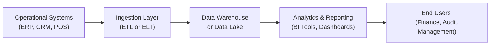

## 3.2 Integrating Data from Multiple Sources

A core challenge in today’s data-driven financial landscape is blending information from numerous systems—ranging from operational and financial platforms to third-party external sources. This step is essential in the path to meaningful analysis and reporting. In Section 3.1, we introduced tools and techniques that power data analytics in the Business Analysis and Reporting (BAR) discipline. Here, we will focus on the processes and best practices that ensure smooth, accurate, and secure integration of data from multiple sources.

This section supports concepts explored in Chapter 2.4 regarding modern accounting technology, prepares you for prospective analytics in Chapters 7 and 8, and extends directly into more advanced data workflows in Chapter 3.3 on automation. As a CPA candidate, developing a concrete understanding of multi-source data integration will equip you to better interpret and leverage consolidated financial information. Beyond exam preparation, the ability to integrate diverse data sets is an invaluable skill for your professional advancement in finance and accounting.

  
### Why Data Integration Matters

Merging data into a coherent structure is vital for comprehensive business analysis, timely decision-making, and regulatory compliance. When performed correctly, data integration:

• Enables a 360° view of financial and operational metrics  
• Reduces manual effort and errors by automating transformations  
• Improves consistency and quality in financial statements and management reports  
• Enhances predictive analytics and advanced modeling accuracy  
• Provides a sustainable strategy for managing enterprise-level data growth  

Failing to integrate or incorrectly integrating can result in duplicated records, incomplete transactions, or even contravening audit and compliance standards. Thus, integration is not merely a technical step; it is a cornerstone of producing reliable, decision-useful information.

### Common Sources of Financial and Operational Data

Organizations typically gather data from a multitude of internal and external platforms. Recognizing these sources is the first step in a successful integration strategy:

• Enterprise Resource Planning (ERP) Systems – Provide core financial data on revenue, expenses, procurement, and inventory.  
• Customer Relationship Management (CRM) Systems – Contain sales leads, customer demographics, and transactional history.  
• Point of Sale (POS) Systems – Especially relevant in retail environments for real-time revenue tracking and customer purchase data.  
• Manufacturing Execution Systems (MES) – Track production, labor, and inventory usage for cost accounting and variance analysis.  
• Human Resource Management (HRM) Systems – Holds payroll, compensation structures, and workforce metrics.  
• External Market Data – Stock prices, currency rates, industry benchmarks, and macroeconomic indicators.  
• Third-Party Applications and APIs – Data feeds, cart services, or credit agencies that provide supplementary information for credit risk, compliance, or KYC (Know Your Customer).  

Each data source may come with unique formats, data types, refresh rates, and validation processes, which underscores the need for a well-designed and well-documented integration plan.

### Key Data Integration Models

Modern organizations leverage multiple data integration models based on size, complexity, and reporting needs.

• Data Warehousing (ETL or ELT) – Traditionally, Extract-Transform-Load (ETL) or the more recent Extract-Load-Transform (ELT) approach. The data is consolidated into a central repository (Data Warehouse) for standardized reporting.  
• Data Virtualization – Allows queries across multiple sources in real-time without physically moving or transforming data into a single storage.  
• Data Lake – Particularly useful for storing large volumes of raw, unstructured, or semi-structured information that can later be queried or transformed.  
• Hybrid Approaches – Combining a data warehouse for structured, mission-critical reporting with a data lake for big data analytics and unstructured exploration.  

Choosing the right model often depends on factors like organizational scale, reporting frequency, system budgets, and the complexity of the data sources.  

### Designing a Robust Integration Architecture

Developing an intelligent end-to-end architecture that addresses data ingestion, transformation, storage, and access is pivotal. A simplified conceptual framework appears below:

• Operational Systems – This is where data originates (e.g., ERP, CRM).  
• Ingestion Layer – Data is extracted and validated, then it undergoes transformations or is loaded directly.  
• Data Warehouse or Data Lake – Stores clean, consistent data that supports analytics, advanced modeling, and external reporting.  
• Analytics & Reporting – Business Intelligence (BI) tools, predictive modeling, and dashboards that feed into finance, accounting, and management applications.  
• End Users – Professional stakeholders who need fast, reliable insights for strategic decision-making.  

Within each stage, it’s crucial to define processes for governance, data lineage, enrichment, and error handling.

### Data Quality: Ensuring Completeness and Reliability

Accurate data integration requires well-defined processes to ensure all relevant details are captured, validated, and fit for further analysis. Among the core considerations:

Data Governance  
Organizational structures and policies that define who is responsible for data quality, ownership, and stewardship. Effective governance limits redundant copies and ensures consistent definitions.

Data Cleansing  
Systems must identify and correct (or remove) inaccurate records—e.g., spelling issues in customer names, missing invoice numbers, or duplicated entries.

Data Validation  
Automated checks, business rules, and user-defined constraints identify anomalies. For instance, a negative quantity in production data or shipping date preceding order date. These errors may point to integration flows that require logic updates.

Data Profiling  
Comprehensive review of data to discover metadata (such as distribution, patterns, and anomalies). Understanding data properties enables more accurate transformation and analysis.

Data Lineage  
Recording where each data point comes from, what transformations it undergoes, and when changes occur. Data-lineage tracking is vital for compliance, especially under regulatory frameworks requiring audit trails.

Ensuring completeness and reliability is not a one-time check, but a continuous process of monitoring, auditing, and iterative improvement. These data quality frameworks often tie back to standardized internal controls. Aligning with the COSO ERM (Enterprise Risk Management) framework—discussed in Chapter 8.3—can help reinforce robust governance policies throughout the data lifecycle.

### Practical Integration Strategies and Techniques

A variety of technical and procedural strategies guide seamless data integration:

• Mapping Source-to-Target – Document data elements in each source (e.g., “InvoiceID in ERP” vs. “OrderID in CRM”) and map them to the final structure.  
• Incremental Loads – Instead of reprocessing the entire database each time, only integrate recent or changed records, reducing latency and resource usage.  
• API-Driven Integrations – Many modern systems expose REST or SOAP APIs for direct, near-real-time data flows. This approach is flexible and reduces the reliance on manual file uploads.  
• Batch vs. Real-Time Processing – Evaluate how often the data needs to be refreshed. Batch jobs may suffice for daily or weekly reporting, whereas near-real-time feeds are typically essential for daily CFO dashboards or forecasting.  
• Standardized Data Models – Use common reference structures (e.g., a standard chart of accounts or universal product codes) to unify data from multiple systems.  
• Use of Metadata – Central repositories (data dictionaries) that detail consistent definitions, permissible ranges of each element, and transformation logic.  

Where possible, rely on robust software platforms or cloud-based solutions that come with built-in connectors to leading ERP, CRM, or other specialized tools.

### Common Pitfalls and How to Avoid Them

Despite the importance of multi-source data integration, many organizations encounter issues that undermine the reliability of their financial information. Below are some pitfalls and prevention tips:

Data Silos  
When each department’s data remains locked within separate systems, cross-functional analysis becomes challenging. Solution: Central data governance committees and project sponsors from each business unit help break down silos.

Inconsistent Key Fields  
In mergers or acquisitions, or simply across different legacy tools, primary keys such as customer IDs or product SKU codes may diverge. Solution: Plan a unified master data management (MDM) system or mapping tables to synchronize and unify key definitions.

Poorly Defined Data Ownership  
If a discrepancy arises (e.g., mismatch in sales data between CRM and ERP), who is responsible for resolving it? Solution: Clearly define data owners and escalation paths.

Lack of Ongoing Monitoring  
Initial integration might work well, but data can drift due to system updates or new business processes. Solution: Establish routine checks, audits, and performance metrics.

Excessive Customization  
Overly customized integration scripts can be fragile, hard to maintain, and prone to failure after system updates. Solution: Use standardized integration modules or well-documented open-source frameworks to reduce complexity and maintenance overhead.

### Real-World Scenarios and Case Studies

Below are examples showing how multi-source integration is implemented and the business benefits:

Retail Chain Integrated POS and ERP for Real-Time Inventory  
A major retailer combined daily data from store-level POS systems and their corporate ERP. By correlating sales, returns, and inventory acquisitions in near-real-time, finance prepared rolling daily accounting entries and identified stockouts early. The result was a 25% reduction in inventory carrying costs and more accurate revenue reporting.

Manufacturing Company Leveraged CRM, Production, and Procurement  
A global manufacturing enterprise integrated CRM data about customer orders with MES data on production scheduling. This synergy helped them streamline job costing, shortened lead times, and improved variance analyses (Chapter 5.3). Executives used dashboards that connected cost center and customer profitability metrics, enhancing investment decisions on expansions.

Online Subscription Service Merging Financial Data with Market Indicators  
A SaaS (Software as a Service) provider combined revenue and customer churn data from internal databases with external market data indicating changes in consumer preferences and macroeconomic indicators like interest rates (Chapter 8.4) and foreign exchange fluctuations. Trend analysis revealed how broader market health impacted subscription renewals. This timely insight guided marketing and pricing strategies, mitigating churn and supporting stable growth.

### Advanced Analytics and Automation (Preview)

In Chapter 3.3, we will delve deeper into automations, RPA, and cloud platforms. The reliability of these advanced techniques directly depends on the quality of underlying data integration methods. Without well-structured, accurate data inflows, any robotic process or AI-driven system will produce flawed outputs, no matter how elegantly designed.

### Summary and Best Practices

• Start with a data integration strategy that aligns with organizational goals and scale.  
• Emphasize data governance to define roles and responsibilities for quality and completeness.  
• Adopt or develop standardized data dictionaries and metadata management.  
• Conduct continuous data cleansing and validation to uphold reliability.  
• Coordinate with the IT department to maintain synergy among different functional areas.  
• Incorporate automation only after verifying robust integration pipelines.  

By following these guidelines, CPAs, financial analysts, and management teams can confidently rely on integrated data for producing timely, accurate, and forward-looking insights.

## Quiz: Integrating Data from Multiple Sources



### Which of the following best describes the primary reason for integrating data from multiple sources?

- [x] To create a unified and accurate view of an organization’s operations  
- [ ] To decrease the volume of data collected  
- [ ] To hide information from management  
- [ ] To produce more manual tasks for cross-functional teams  

> **Explanation:** Merging data from multiple sources provides a comprehensive, holistic picture of company operations and financial performance, reducing manual tasks and enhancing decision-making.

### Which of the following is typically considered the most foundational step before merging datasets?

- [x] Establishing common data definitions and mapping fields  
- [ ] Prioritizing marketing data over financial data  
- [ ] Eliminating all references to historical transactions  
- [ ] Restricting data access from the finance team  

> **Explanation:** Common definitions and field mappings ensure consistency, aligning data from diverse systems into a single, coherent representation.

### In a retail environment, which data sources would likely provide the most immediate insights for KPIs like daily sales revenue and inventory levels?

- [x] POS systems feeding into an integrated ERP platform  
- [ ] Archival government census data  
- [ ] Historical environmental records  
- [ ] Press releases about upcoming product launches  

> **Explanation:** POS integration with the ERP ensures near-real-time synchronization of sales and inventory data, driving immediate operational decisions.

### Why is data cleansing a crucial part of any integration process?

- [x] It ensures that erroneous, duplicate, or incomplete records do not compromise analytical results  
- [ ] It replaces advanced analytics with manual checks  
- [ ] It discourages automation and prevents real-time reporting  
- [ ] It is exclusively used for compliance with marketing regulations  

> **Explanation:** Data cleansing improves the validity and reliability of integrated datasets by fixing or removing inaccuracies and duplicates.

### Which of the following integration models is best suited for organizations dealing with significant volumes of unstructured data?

- [x] Data Lake  
- [ ] Spreadsheet-driven manual integration  
- [x] Data Warehouse  
- [ ] Only storing data in on-site file systems  

> **Explanation:** A Data Lake is more flexible in handling large volumes of raw, unstructured, or semi-structured data for advanced analytics.

### What is a key benefit of adopting an API-driven integration approach over manual file transfers?

- [x] Real-time or near-real-time data flow for dashboards and analytics  
- [ ] Increased manual labor for accounting staff  
- [ ] Greater complexity in data lineage tracking  
- [ ] Dependence on untested open-source software  

> **Explanation:** API-driven integrations swiftly pass data between systems, enabling timely updates and reducing the risk of errors caused by manual processes.

### Select all that apply: Which of the following are best practices in ensuring data completeness and reliability?

- [x] Routine data audits  
- [ ] Storing data only in spreadsheets without version control  
- [x] Assigning clear data ownership  
- [ ] Avoiding data validation rules  

> **Explanation:** Regular audits and clear ownership help maintain data quality. Data validation and governance structures further mitigate inaccuracies.

### How does master data management (MDM) mitigate risks associated with merging data from multiple systems?

- [x] By standardizing key reference fields (e.g., Product IDs, Customer IDs) across the enterprise  
- [ ] By eliminating all local system records  
- [ ] By restricting employees from editing records  
- [ ] By using only single-source data from a legacy system  

> **Explanation:** MDM ensures uniformity in core reference data, thus avoiding conflicting records and clarifying the system of record for each key entity.

### When deciding between batch processing and real-time data integration, which factor is most significant?

- [x] The frequency and urgency of reporting requirements  
- [ ] Ensuring that only historical data can be processed  
- [ ] Completely isolating the finance team’s systems from IT  
- [ ] Strictly avoiding incremental loads  

> **Explanation:** Organizations that need continuous or near-continuous insights for decision-making often use real-time or near-real-time integration, while less frequent updates can leverage batch processes.

### Data integration typically enhances internal control processes because:

- [x] It centralizes data and creates consistent audit trails  
- [ ] It makes data more vulnerable to unauthorized access  
- [ ] It eliminates the need for independence in financial reporting  
- [ ] It is another name for data destruction  

> **Explanation:** A centralized and consistently audited data pool strengthens internal controls, offering traceability and reducing the risk of overlooked discrepancies.



## For Additional Practice and Deeper Preparation

### [Business Analysis and Reporting (BAR) CPA Mock Exams](https://www.udemy.com/course/bar-cpa-mock-exams/?referralCode=ADBE2E84BEE9CB6243CA)

Business Analysis and Reporting (BAR) CPA Mocks: 6 Full (1,500 Qs), Harder Than Real! In-Depth & Clear. Crush With Confidence!

- Tackle full-length mock exams designed to mirror real BAR questions.  
- Refine your exam-day strategies with detailed, step-by-step solutions for every scenario.  
- Explore in-depth rationales that reinforce higher-level concepts, giving you an edge on test day.  
- Boost confidence and minimize anxiety by mastering every corner of the BAR blueprint.  
- Perfect for those seeking exceptionally hard mocks and real-world readiness.  

_Disclaimer: This course is not endorsed by or affiliated with the AICPA, NASBA, or any official CPA Examination authority. All content is for educational and preparatory purposes only._
