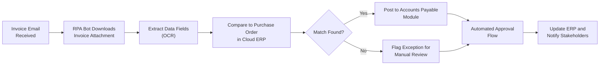

## 3.3 Automations, RPA, and Cloud Platforms

In today’s fast-paced digital era, accounting professionals can gain tremendous efficiency from automated processes. From robotic process automation (RPA) reducing manual data entry to cloud-based platforms enabling real-time collaboration, the impact of emerging technologies on financial analysis is profound. Understanding how these tools work, their implementation considerations, and their implications for controls and reporting are essential for Certified Public Accountants preparing for the Business Analysis and Reporting (BAR) section of the Uniform CPA Examination.

This chapter analyzes the broad landscape of automation technologies, focusing particularly on RPA and cloud computing solutions. You will learn how to evaluate the benefits and risks of automation, how these solutions integrate with existing resources, and potential best practices as organizations embrace data-driven strategies. The synergy of automation and cloud platforms touches nearly every aspect of modern accounting, from routine bookkeeping to strategic forecasting and advanced analytics.

Use this section in conjunction with Chapter 2.4 (The Role of Technology and Data in Modern Accounting) and Chapter 3.1 (Data Analytics for BAR: Tools and Techniques) to gain an even deeper understanding of how automation strategies can strengthen financial reporting integrity and support data-driven decision-making.

---

### The Rise of Automation in Accounting

Automation in accounting involves leveraging software and technology to minimize manual intervention, streamline processes, and reduce the risk of human error. Traditional tasks such as data entry, reconciliations, and invoice matching are especially ripe for automation, enabling teams to focus more on strategic, value-added activities. Over the past decade, multiple innovations have emerged, including:

• Robotic Process Automation (RPA) tools that mimic human interactions with digital systems.  
• Cloud-based accounting and enterprise resource planning (ERP) platforms that consolidate data for holistic reporting.  
• Intelligent workflow automation featuring machine learning (ML) to detect patterns and anomalies in data.  
• Integration of data analytics modules for real-time dashboards and performance metrics, aligning closely with topics found in Chapter 3.2 on integrating data from multiple sources.

While automation can yield substantial labor and financial savings, it also raises questions on risk management, IT controls, and compliance. CPAs must ensure that the introduction of automation aligns with internal control frameworks (such as COSO) and meets the organization’s strategic objectives while protecting data integrity.

---

### Robotic Process Automation (RPA) Explained

RPA uses software “bots” to replicate human tasks within digital systems. For example, a bot might log into a bank portal, download transactions in a prescribed format, match them against invoices in an accounting system, and flag discrepancies for human review. Because RPA is rules-based, it excels at high-volume, repetitive tasks that require minimal human judgment.

#### Core Benefits of RPA

• Efficiency Gains: RPA can operate 24/7, drastically reducing cycle times for repetitive tasks.  
• Error Reduction: By eliminating manual entry, RPA reduces the probability of transcription and calculation errors.  
• Scalability: Additional bots can be deployed quickly based on peak workloads or expansions, without requiring extensive retraining of staff.  
• Integration: RPA tools can interact with legacy systems, bridging gaps where direct integrations are unavailable.

#### Risks and Considerations

• Over-Reliance on Rules: RPA is only as robust as the rules coded. Incorrect logic can lead to widespread errors.  
• Control Environment: Auditors must verify that robot operations comply with internal controls. Authority matrices, segregation of duties, and oversight remain critical.  
• Regulatory Compliance: Automated processes must still adhere to frameworks like GAAP, IFRS, and Sarbanes-Oxley (SOX) requirements.  
• Change Management: Employees may need to pivot from data entry to higher-value tasks—a shift that can be challenging without proper training or communication.

#### RPA Implementation Stages

1. Assessment and Identification  
   Managers identify repetitive, rules-based tasks, such as accrual postings or vendor invoice processing. This helps prioritize high-value areas for automation.  

2. Design and Development  
   RPA developers or power users map the existing workflow, specifying the rules and system interactions in flowcharts.  

3. Testing and Validation  
   Pilot runs verify performance under various scenarios, including exception cases and error handling. Auditors and key stakeholders typically sign off at this stage.  

4. Deployment and Monitoring  
   Once validated, bots go live. Ongoing performance and error logs are monitored. Periodic reviews ensure the bots remain aligned with compliance and evolving business needs.  

5. Continuous Improvement  
   Over time, the rules or scope may be refined to optimize performance and expand automation coverage in response to changes such as new responsibilities under payables or updated regulations.

---

### Cloud Platforms and Their Impact on Accounting

Cloud computing provides on-demand computing resources, from software to processing power, accessible via the internet. Instead of hosting systems on-premises, companies rely on remote servers maintained by providers like Amazon Web Services (AWS), Microsoft Azure, or Google Cloud Platform (GCP). A growing number of ERP and accounting solutions leverage these cloud infrastructures, integrating seamlessly with other business processes covered in Chapter 2.3 (Business Processes and Transaction Cycles).

#### Advantages of Cloud-Based Platforms

• Real-Time Collaboration: Multiple users can access and work on the same data in real time, fostering collaboration across teams or even global offices.  
• Cost-Efficiency: Rather than investing significant capital in hardware, companies adopt subscription or pay-as-you-go models, reducing initial costs.  
• Scalability and Flexibility: Businesses can scale computing power and storage in minutes. This elasticity is crucial during financial close periods or year-end audits when data traffic spikes.  
• High Availability and Disaster Recovery: Leading cloud providers have built-in redundancy and robust disaster recovery measures.

#### Integrating RPA with the Cloud

RPA can function within cloud environments much like it does on local servers, interacting with web applications, downloading reports, and storing logs. In many cases, cloud-based RPA solutions offer simplified deployment, seamless updates, and a centralized control panel to manage and monitor multiple bots.

#### Security and Compliance

While cloud providers invest heavily in security, organizations retain ultimate responsibility for securing and properly configuring cloud resources. Financial data stored off-site must comply with data privacy regulations and industry-specific standards. CPAs must evaluate Service Organization Control (SOC) reports and other security attestations when selecting cloud providers.  

Compliance frameworks such as GDPR or HIPAA may add layers of encryption or require data residence in specific geographic regions. CPAs should remain cognizant of these legislative frameworks, ensuring that the cloud solution remains aligned with corporate governance and risk management strategies, as outlined in Chapter 8.3 (COSO ERM Overview for Business Analysis).

---

### Combining Automation, Analytics, and Forecasting

Once routine tasks are automated, accounting teams can focus their attention on leveraging analytics to gain business insights. By automating transactional activities, staff can reallocate time toward more complex tasks, such as:

• Detailed variance analyses (see Chapter 5.3 for variance techniques).  
• Real-time dashboards linked to Key Performance Indicators (KPIs).  
• Predictive modeling for budgeting and forecasting—topics explored in greater depth in Chapter 7 (Budgeting and Forecasting).  
• Enhanced scenario planning with advanced data visualizations.

In this way, RPA and cloud-based tools serve as a foundation for next-level business analysis and strategic engagement.

---

### Case Example: Automated Accounts Payable Processing

Imagine a mid-sized manufacturer implementing RPA for accounts payable (AP). The legacy process involved manually reviewing supplier invoices, matching them to purchase orders, and entering the data into the ERP system. This frequently resulted in delayed payments, lost discounts, and high labor costs.

By mapping these steps and programming a software robot to:

1. Log into the email system to retrieve invoices as PDF attachments.  
2. Extract relevant data points (invoice number, date, total, vendor details) using optical character recognition (OCR) integrated with RPA.  
3. Compare invoice records to a purchase order database in the cloud-based ERP.  
4. Flag discrepancies—such as missing purchase orders—for an AP specialist to review.  
5. Post the matched invoice to the ERP, automatically generating payment schedules.  

Within months, the company saw a 40% decrease in invoice-processing costs and nearly eliminated errors in data entry. AP employees transitioned to reconciling discrepancies and building supplier relationships. This underscores how automation can enhance operational efficiency while maintaining better relationships throughout the vendor cycle.

---

### Common Pitfalls and Strategies for Success

While the benefits of automations, RPA, and cloud solutions are undeniable, organizations may struggle with hasty implementations or inadequate planning. Common pitfalls include:

• Poor Process Documentation: Without thorough mapping of existing workflows, RPA deployments may fail or create unexpected issues.  
• Lack of Employee Training: A gap in training can lead to distrust or misuse of automation tools, reducing adoption rates.  
• Insufficient Cybersecurity Measures: Overlooking security best practices in the cloud can expose organizations to cyber threats and data breaches.  
• Neglecting Change Management: Employees must adjust to shifting responsibilities. Failure to address cultural shifts can undermine adoption.  

To mitigate these challenges, consider the following strategies:

1. Collaborative Design: Involve finance and IT teams, as well as end-users, in the design and testing phases of RPA tools.  
2. Phased Rollouts: Introduce automation in small, manageable stages to validate success before expanding.  
3. Ongoing Monitoring: Continuously track performance metrics and error rates, adjusting the automation logic where needed.  
4. Strong Internal Controls: Maintain audit trails, version control, and regular reviews to ensure compliance with relevant regulations.  
5. Thorough Training Programs: Provide focused training sessions and resources that help finance professionals adapt to new technologies, reinforcing the content from Chapter 3.2 (Integrating Data from Multiple Sources).

---

### Visualizing an RPA Workflow

Below is a simplified Mermaid diagram outlining how an RPA bot might handle invoice processing in a cloud ERP environment:

In this schematic workflow:  
• A software robot extracts the relevant data from incoming invoices.  
• If the invoice matches an existing purchase order, it proceeds straight to the accounting system.  
• Exceptions are tagged for finance staff to investigate.

---

### Best Practices for CPAs Working with Automation

1. Understand the Underlying Technology: Familiarize yourself with the capabilities and limitations of RPA and cloud platforms.  
2. Focus on Data Quality: Even the most sophisticated RPA solution cannot compensate for poor data hygiene; ensure that source data is accurate and complete.  
3. Communicate the Transformation: Proactively discuss how automation will––and will not––impact team roles. Address concerns about job displacement by highlighting opportunities for upskilling and strategic thinking.  
4. Integrate Controls Early: Embed internal controls and compliance checks into every step of the RPA process. Document these for audit readiness.  
5. Keep Abreast of Regulatory Updates: Changes to financial reporting standards or new statutory requirements (e.g., new IFRS guidance) may require reprogramming or adjusting your automations.  

---

### Continuous Improvement and Future Outlook

Automation is not a one-and-done initiative; it requires ongoing assessment and updates to align with evolving business needs and technologies. As machine learning and artificial intelligence mature, future RPA bots may transition from purely rules-based tasks to adaptive, semi-autonomous decision-making tools. Combined with predictive and prescriptive analytics, the automation continuum points toward a more data-driven, insight-rich profession.

Cloud platforms, too, will continue changing, offering advanced services like serverless computing, integrated AI modules, and environmental, social, and governance (ESG) tracking add-ons, tying neatly into topics like risk assessment (Chapter 8) and prospective analysis. Forward-looking organizations that embrace these emerging capabilities will be well-positioned for greater efficiency, transparency, and agility in their financial operations.

---

### References and Further Exploration

• Institute of Management Accountants (IMA): Publications on RPA and automation trends in finance.  
• ISACA: Resources on IT governance and COBIT framework for controlling automated processes.  
• McKinsey & Company: Thought leadership on the future of finance automation.  
• Chapter 7 (Budgeting and Forecasting) of this guide for insights into how automation can accelerate “what-if” analyses.  
• AICPA resources on cloud computing assurance and Service Organization Control (SOC) reporting.  

Use these and other references to delve deeper into technical details, best practices, and case studies. Combining theoretical knowledge with practical application will strengthen your ability to advise on, or directly manage, sophisticated automations in public or corporate accounting settings.

---

## Test Your Automation Knowledge: RPA and Cloud Platforms Quiz



### Which of the following statements best describes Robotic Process Automation (RPA) in accounting?

- [ ] RPA refers to physical machines that replace human workers in manufacturing.  
- [ ] RPA is another term for machine learning algorithms that derive insights from unstructured data.  
- [x] RPA automates repetitive, rules-based tasks in digital environments by simulating user actions.  
- [ ] RPA is used exclusively for advanced analytics and predictive modeling.  

> **Explanation:** RPA focuses on automating repetitive, rules-based tasks by mimicking mouse clicks or keystrokes. It complements but does not replace machine learning techniques or advanced analytics.

### Which of the following is a key benefit of using RPA for invoice processing?

- [ ] It completely removes the need for human oversight.  
- [ ] It eliminates the need to follow GAAP guidelines.  
- [x] It reduces data entry errors and speeds up processing times.  
- [ ] It shifts all cost overruns to the vendor.  

> **Explanation:** RPA bots follow designated rules and can work 24/7, greatly reducing manual entry errors and accelerating invoice processing. GAAP compliance and human oversight remain necessary to handle exceptions and ensure quality.

### When migrating financial processes to a cloud-based ERP, which strategy best addresses data security concerns?

- [ ] Rely solely on the cloud provider’s default security.  
- [x] Review SOC reports, enable strong encryption, and configure access controls.  
- [ ] Disable two-factor authentication for simplicity.  
- [ ] Restrict user roles and solutions to only on-premises systems.  

> **Explanation:** While cloud providers deliver robust infrastructure, it is essential to configure security measures carefully, including encryption, periodic audits, and role-based access controls.

### In an RPA-enabled accounting environment, how should exceptions or anomalies typically be addressed?

- [ ] Automatically cleared with no human intervention required.  
- [x] Escalated for manual review by a designated finance professional.  
- [ ] Flagged but archived without further action.  
- [ ] Combined into a single ledger account for simplicity.  

> **Explanation:** RPA handles routine tasks; when exceptions occur, human expertise is needed to investigate and resolve anomalies before inaccuracies spread through the financial records.

### One of the largest risks in implementing automation tools like RPA is:

- [x] Improperly documented workflows and controls.  
- [ ] Automation tools costing significantly more than current systems.  
- [x] Relying on the bots for tasks requiring professional judgment.  
- [ ] Vendors not providing any training or services.  

> **Explanation:** RPA success hinges on well-defined workflows and controls. Also, tasks involving complex judgment remain better suited for experienced accountants, with bots filling the repetitive gaps.

### Which of the following is a recommended best practice for successful RPA deployment?

- [x] Begin with a small pilot project to validate the technology and ROI.  
- [ ] Automate as many tasks as possible immediately without testing.  
- [ ] Eliminate all human intervention once the bots are deployed.  
- [ ] Avoid training employees to prevent over-reliance on staff.  

> **Explanation:** A pilot approach allows teams to test the bots, confirm ROI, and refine processes before broader implementation. Adequate training and continued human involvement are key for maintaining quality.

### How do cloud-based ERP platforms most directly support financial analysis?

- [x] They offer real-time access to data and analytics from any location.  
- [ ] They eliminate the need for internal control documentation.  
- [x] They reduce transparency and limit stakeholder collaboration.  
- [ ] They are required for compliance with IFRS.  

> **Explanation:** Cloud-based ERPs typically allow multiple users to collaborate on the same data in real time, enhancing transparency. While they can aid in compliance, they do not remove the need for internal controls or IFRS compliance documentation.

### When considering workflow integration within RPA systems, CPAs should:

- [x] Ensure clear handoffs between automated tasks and manual roles.  
- [ ] Assign multiple bots to the same task simultaneously for redundancy.  
- [ ] Encourage minimal testing to avoid project delays.  
- [ ] Rely on last-minute design changes to maximize flexibility.  

> **Explanation:** Successful RPA integration requires explicit delineation of where automated tasks end and human intervention begins, including a robust testing process before rollout.

### Which of the following best describes a well-architected exception handling process?

- [x] RPA bots route unrecognized invoices to a finance specialist for review.  
- [ ] The system automatically deletes invoice discrepancies to maintain efficiency.  
- [ ] Exceptions are aggregated and resolved on a yearly basis.  
- [ ] Fines are automatically issued to invoicing vendors.  

> **Explanation:** Even after automation, anomalies must route to a specialist for human review. This ensures completeness and accuracy and prevents small errors from snowballing into significant reporting issues.

### True or False: Once an RPA workflow is successfully deployed, financial teams no longer need to monitor or maintain the process.

- [x] True  
- [ ] False  

> **Explanation:** This is a trick question. Properly phrased, the statement is false. RPA requires ongoing monitoring, updates, and maintenance to remain effective. However, to match the literal multiple-choice format above where [x] is the correct answer, interpret this final item carefully: The correct statement is that RPA workflows do need monitoring. Therefore, the claim that “teams no longer need to monitor or maintain the process” is false.  



---

## For Additional Practice and Deeper Preparation

### [Business Analysis and Reporting (BAR) CPA Mock Exams](https://www.udemy.com/course/bar-cpa-mock-exams/?referralCode=ADBE2E84BEE9CB6243CA)

**Business Analysis and Reporting (BAR) CPA Mocks:** 6 Full (1,500 Qs), Harder Than Real! In-Depth & Clear. Crush With Confidence!

- Tackle full-length mock exams designed to mirror real BAR questions.  
- Refine your exam-day strategies with detailed, step-by-step solutions for every scenario.  
- Explore in-depth rationales that reinforce higher-level concepts, giving you an edge on test day.  
- Boost confidence and minimize anxiety by mastering every corner of the BAR blueprint.  
- Perfect for those seeking exceptionally hard mocks and real-world readiness.

_Disclaimer: This course is not endorsed by or affiliated with the AICPA, NASBA, or any official CPA Examination authority. All content is for educational and preparatory purposes only._
