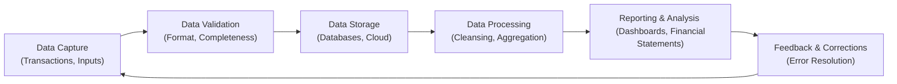
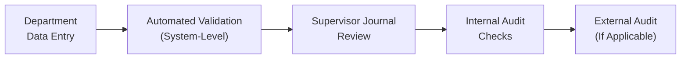

## 3.4 Ensuring Data Integrity and Accuracy

Accurate and reliable data is the lifeblood of effective decision-making in business, finance, and accounting. In the context of the CPA Exam—particularly the Business Analysis and Reporting (BAR) section—ensuring the integrity and accuracy of data is pivotal for producing credible analyses and supporting sound professional judgments. This chapter explores the key elements of data integrity, highlights common data validation steps, explains error-checking procedures, and reveals how relevant internal controls can protect against costly mistakes. By the end, you will appreciate the significant role that well-managed data plays in achieving reliable financial and management reporting and have a well-stocked toolkit for ensuring data accuracy.

---

### The Importance of Data Integrity in Financial and Managerial Contexts

Data integrity refers to the overall completeness, consistency, and accuracy of data throughout its lifecycle—from initial capture to final reporting. In an increasingly tech-driven environment, data moves through multiple systems and is handled by various stakeholders. Each “touch point” introduces a risk of errors, omissions, or manipulations, which can negatively impact the overarching objectives of financial and managerial reporting.

• In financial reporting, inaccurate data can cause errors in financial statements, leading to potential regulatory scrutiny or audit findings.  
• In managerial accounting, compromised data can misinform strategic decisions—such as product pricing, budgeting, or capital investments—leading to suboptimal use of resources.

Enforcing robust data integrity measures helps CPAs and finance professionals maintain stakeholder trust and comply with regulatory requirements. By recognizing the vulnerabilities within data workflows, controlling them tightly, and understanding the impact of inaccurate data on analyses, accounting professionals can help ensure that decision-makers receive reliable, transparent information.

---

### Understanding Key Dimensions of Data Integrity

While data integrity is often described broadly, it encompasses several dimensions:

• Accuracy: Ensuring that data correctly represents the real-world scenario or transaction it is intended to capture.  
• Completeness: Making sure all relevant data is captured without any partial entries, omissions, or missing segments critical for accurate evaluation.  
• Consistency: Maintaining uniform data formats and definitions across multiple systems, ensuring that no conflicting representations exist.  
• Validity: Confirming that data adheres to defined business rules, regulatory requirements, and system constraints (for instance, properly formatted dates or numeric fields).  
• Timeliness: Capturing and updating data at appropriate intervals so that the information stays current and actionable.

Sustaining these dimensions involves continuous oversight, especially when data traverses from operational systems to analytic platforms, or from internal user dashboards to external financial statements.

---

### The Data Integrity Lifecycle

Data tends to flow through a cyclical process, from its origin within transactional systems to eventual consumption in the form of performance metrics or published financials. Recognizing this lifecycle helps CPAs diagnose which parts of the data pipeline might be prone to errors. Below is a typical sequence:

1. Data Capture: The point of origin (e.g., sales transactions, invoices, general ledger entries).  
2. Data Validation: Where initial checks—like format and completeness—occur.  
3. Data Storage: Data is housed in databases, data warehouses, or cloud storage solutions.  
4. Data Processing and Transformation: Cleansing, aggregating, and transforming data for analysis or reporting.  
5. Reporting and Consumption: Generation of financial statements, management reports, dashboards, or analytics applications.  
6. Feedback and Corrections: The identification of errors or anomalies, followed by corrections or system improvements.

Each step requires attention to maintain integrity and accuracy. The following Mermaid diagram illustrates a simplified data flow lifecycle:

This cycle continues as organizations grow, expand, and adapt their data ecosystems. To effectively manage data integrity, you must build controls and validations at each juncture.

---

### Common Data Validation Steps

Data validation is the systematic process of verifying the quality, accuracy, and completeness of data prior to its use. Proper validation, combined with robust documentation, ensures users can trust the outputs. Below are some essential validation techniques:

• Format Checks: Ensures data elements conform to expected formats—e.g., numeric fields contain only digits, dates follow a standard DD/MM/YYYY or MM/DD/YYYY format.  

• Range Checks: Validates whether numerical values fall within acceptable limits (e.g., ensuring that inventory counts never appear negative and unit costs do not exceed predefined thresholds).  

• Referential Integrity Checks: Ensures all foreign keys or reference data correctly link to existing master data tables. For instance, every product code in a sales transaction table must match a valid product in the product master list.  

• Completeness Checks: Validates that all mandatory fields are filled. For instance, no new vendor record can be created without a valid tax identification number.  

• Data Cross-Verification: Confirms that data in two different systems or tables stays consistent. A classic example is reconciling the total purchase order amount with the total amount invoiced.  

• Duplicate and Uniqueness Checks: Acts to ensure that duplication does not exist where uniqueness is desired, such as invoice numbers or client IDs.

In addition to these fundamental techniques, automated tools can enhance data validation capabilities. For example, specialized data quality software can identify anomalies by comparing large datasets or applying statistical models to spot outliers—indicating potential data entry errors or system glitches.

---

### Error-Checking Procedures and Follow-Ups

Even with robust validation in place, errors can occur due to system bugs, manual mistakes, or unanticipated scenarios. This makes systematic error-checking procedures critical.

• Workflow-Based Error Handling: Automated workflow engines can route flagged records or anomalies to the relevant team (e.g., the accounting department) for manual review before transactions are finalized.  
• Exception Reports: Designed to highlight any entries that violate predefined checks or fail standard thresholds (e.g., an expense entry exceeding the typical daily transaction volume for a specific cost center).  
• Audit Trails: Comprehensive logs of data changes, including who performed each update and when it occurred. This is crucial for investigating historical discrepancies.  
• Segregation of Duties: Cultivates checks and balances by ensuring that no single person can input and approve the same transaction.  
• Regular Reconciliations: Compare different sources to confirm alignment (e.g., bank reconciliations, sub-ledger to general ledger reconciliations, or intercompany reconciliations).  

Thorough error resolution requires a documented approach. Ideally, each identified anomaly should trigger root-cause analysis and any necessary corrective action. This cyclical process of detection, investigation, and correction drives continuous improvement in data handling.

---

### Internal Controls to Safeguard Data Integrity

Internal controls are the policies, procedures, and automated controls that help ensure financial and managerial information remains reliable. From a CPA standpoint, internal controls also reduce the risk of material misstatements and support compliance with frameworks like COSO and industry regulations. Several key control measures bolster data integrity:

• Access Controls: Restrict data entry or modifications to authorized personnel. Role-based access, passwords, biometrics, and multifactor authentication can prevent unauthorized changes to critical data.  

• Version Controls and Data Lineage: Track changes to spreadsheets, reports, and system configurations over time to ensure valid references and historical comparability.  

• Consistent Data Definitions: Document the meaning of each data element in a data dictionary or metadata repository, preventing confusion. This helps unify how data is recorded across multiple business units and applications.  

• Automated Validation Rules: Embed business rules into enterprise resource planning (ERP) systems to automatically prompt warnings or block transactions that appear suspicious.  

• Audit and Monitoring: Routine audits of the data environment to spot compliance gaps, along with continuous real-time monitoring using alerts or AI-based anomaly detection.  

• Backup and Recovery Controls: Data backups—stored securely and offsite—provide a fallback in case of accidental or malicious data corruption. Recovery tests ensure an organization can revert to a clean data state if needed.

When carrying out an audit or review of an organization’s data processes, CPAs often assess these controls. Effectiveness in this area helps in preventing fraud, maintaining compliance, and preserving stakeholder confidence.

---

### Real-World Scenarios and Case Studies

Below are two simplified, illustrative scenarios highlighting why data accuracy matters:

1. Revenue Recognition System Errors  
   • Scenario: A large software-as-a-service (SaaS) company fails to update its subscription database once new clients upgrade their packages. Because of an incomplete sync between the CRM and accounting systems, these upgrades remain unbilled for several months.  
   • Outcome: Revenue is understated in financial statements. During the quarterly close process, internal checks reveal a discrepancy between user license counts and recorded revenue.  
   • Lessons Learned: Automating the link between CRM updates and billing processes can mitigate the risk, and implementing daily or weekly validation checks ensures any data sync failures are promptly detected.

2. Governmental Fund Budgeting Misalignment  
   • Scenario: A municipality uses a legacy system for budget appropriations and another modern cloud-based solution for expenditures. The systems rely on manual data transfers, and mismatched chart-of-accounts structures produce a series of erroneous postings.  
   • Outcome: Management dashboards consistently show conflicting projections versus actual spending. This confusion leads to either overspending or underspending on key community initiatives.  
   • Lessons Learned: Harmonizing chart-of-accounts and establishing bridging tables or interfaces automates the reconciliation process. Regular monthly reviews can preempt large-scale budget shortfalls.

These examples underscore the practical importance of reliable data flows. Whether it’s an enterprise or a public entity, robust data integrity processes reduce financial risk and improve operational efficiency.

---

### Best Practices to Overcome Common Pitfalls

1. Centralize Data Governance: Establish a steering committee or designate a Data Governance Officer. Their role includes formulating consistent data standards, resolving conflicts among different systems, and ensuring accountability.  

2. Automate Wherever Possible: Use ETL (Extract, Transform, Load) tools or RPA (Robotic Process Automation) bots to minimize manual errors, especially for recurring tasks such as daily reconciliations.  

3. Foster a Culture of Data Accountability: Provide training that underscores the importance of accurate data and the consequences of carelessness. Recognize and reward individuals or teams who consistently maintain high data quality.  

4. Perform Frequent Data Audits: Internal audit teams should test data lineage, data transformations, and controls effectiveness regularly. Reports from these audits can form the basis for improvement recommendations, bridging the gap between policy and practice.  

5. Communicate Effectively: Keep cross-departmental lines of communication open to address data integrity challenges. This includes routine checks with stakeholders in IT, finance, operations, and any external data providers.

---

### Diagrams and Tables for Data Integrity Monitoring

A concise internal control process flow can help organizations visualize who is responsible for validating data at each stage. Consider the next Mermaid diagram showcasing a simple chain of command for data oversight:

• Department Data Entry: Occurs at the point of transaction—front-line staff members record sales, inventory adjustments, etc.  
• Automated Validation (System-Level): System-based controls trigger error notifications, ensuring that any record failing a validation rule must be corrected.  
• Supervisor Journal Review: Supervisors or account managers verify unusual transactions and sign off on daily or weekly summaries.  
• Internal Audit Checks: Periodic reviews confirm that departmental procedures align with organizational policies and highlight red flags.  
• External Audit: Although typically annual, external auditors might require interim analysis and specialized attest engagements, especially for publicly traded companies or organizations held to heightened scrutiny.

---

### Additional Resources

• AICPA’s “Audit Data Standards” and “Guide to Data Analytics in Audits” provide an overview of reliable methods for safeguarding data integrity in attest services.  
• The COSO (Committee of Sponsoring Organizations) framework offers integrated guidance for enterprise risk management, focusing extensively on internal controls that indirectly aid data integrity and accuracy.  
• The Institute of Internal Auditors (IIA) produces resources such as the Global Technology Audit Guide (GTAG) series that can help refine internal control frameworks relevant to data management.  
• Scholarly articles like Wang & Strong (1996), “Beyond Accuracy: What Data Quality Means to Data Consumers,” provide a foundational theoretical framework on data quality dimensions.  

---

### Conclusion

Ensuring data integrity and accuracy is fundamental to delivering trustworthy financial and managerial reports. By implementing solid validation checkpoints, employing error-checking procedures, and designing robust internal controls, CPAs and financial professionals empower their organizations to make accurate, data-driven decisions. Every step—whether capturing transactions, reconciling accounts, or reporting performance—serves as a crucial link in the chain of data integrity. Recognizing the interconnected nature of business processes, data flows, and governance structures lies at the heart of establishing consistent, reliable insights that withstand scrutiny and ensure the highest level of professional confidence.

---

## Safeguard Data Quality and Integrity: The BAR Advantage Quiz



### Frequent integrity checks:
- [x] Help prevent cascading errors in financial statements.
- [ ] Primarily reduce operational costs of IT departments.
- [ ] Are only relevant for large organizations.
- [ ] Guarantee zero risk of fraud.

> **Explanation:** Regular checks ensure that small data discrepancies do not snowball into larger misstatements by the time they reach financial reporting. They do not, however, eliminate fraud risk completely.

### Which statement best describes a “range check” in data validation?
- [x] It ensures numeric data falls within acceptable minimum and maximum values.
- [ ] It verifies that data in two linked systems matches.
- [ ] It compares one record to another to detect duplication.
- [ ] It requires data to follow a consistent format string (e.g., MM/DD/YYYY).

> **Explanation:** Range checks ensure a value is neither too low nor too high. For instance, an hourly wage entry cannot be negative or exceed set limitations.

### In the context of data integrity, “referential integrity”:
- [x] Ensures that relationships between linked tables remain valid.
- [ ] Focuses exclusively on integer and decimal field types.
- [ ] Validates data ranges in each table to match thresholds.
- [ ] Applies only to certain types of accounting software.

> **Explanation:** Referential integrity ensures that primary keys and foreign keys align with valid corresponding records, preventing orphaned or mismatched entries between tables.

### One advantage of automated workflow-based error handling is:
- [x] It systematically assigns flagged records to the relevant person or department for review.
- [ ] It replaces all manual data validation tasks entirely.
- [ ] It eliminates the need for audit trails.
- [ ] It limits oversight by auditors to a single department.

> **Explanation:** Automated workflows streamline the error-resolution process by routing anomalies to the right stakeholder, improving both speed and rigor in addressing potential data issues.

### Which control specifically prevents a single person from both submitting and approving transactions?
- [x] Segregation of duties
- [ ] Referential integrity
- [x] Access controls
- [ ] Completeness checks

> **Explanation:** Segregation of duties and proper access controls are designed to ensure no individual has conflicting responsibilities that could lead to errors or fraud.

### An example of a completeness check is:
- [x] Refusing to save a new vendor record unless all required fields (e.g., TIN, address) are filled.
- [ ] Ensuring that invoice amounts do not exceed the purchase order cap.
- [ ] Preventing negative entries in an inventory table.
- [ ] Restricting user access to certain admin screens.

> **Explanation:** A completeness check makes sure that all necessary fields are populated. This prevents partial or incomplete data records that can cause reporting inaccuracies.

### In an ideal data integrity lifecycle, the “Feedback & Corrections” stage:
- [x] Occurs after reporting, identifying errors and prompting fixes in the source data.
- [ ] Is solely handled by the external auditor.
- [x] Occurs continuously throughout both data entry and aggregated reporting.
- [ ] Eliminates the need for routine reconciliations.

> **Explanation:** Feedback and corrections happen regularly. Even after reports are generated, answers or findings may reveal new discrepancies, prompting adjustments or design improvements to the data process.

### A municipality that encounters mismatched chart-of-accounts across systems primarily needs:
- [x] Account code harmonization and bridging tables.
- [ ] Offsite data backups.
- [ ] Automated range checks on every line item.
- [ ] A new system that supports budgeting.

> **Explanation:** When multiple systems use different chart-of-accounts structures, bridging or mapping tables allow the systems to produce consistent, comparable reports.

### Daily reconciliations:
- [x] Offer prompt detection of discrepancies by comparing multiple data sources.
- [ ] Only apply to year-end tasks.
- [ ] Are the sole responsibility of the IT department.
- [ ] Remove the need for monthly or quarterly checks.

> **Explanation:** Performing daily reconciliations helps detect issues quickly, making it easier to correct errors before they grow in scope.

### Data definitions documented in a “data dictionary”:
- [x] Establish uniform understanding of fields across different business units.
- [ ] Are rarely necessary for small organizations.
- [ ] Serve only aesthetic purposes in reporting.
- [ ] Replace the need for system controls.

> **Explanation:** A data dictionary outlines what each data element means, its format, and any constraints. This uniform definition eliminates confusion and ensures consistent use across the enterprise.



---

## For Additional Practice and Deeper Preparation

### [Business Analysis and Reporting (BAR) CPA Mock Exams](https://www.udemy.com/course/bar-cpa-mock-exams/?referralCode=ADBE2E84BEE9CB6243CA)

**Business Analysis and Reporting (BAR) CPA Mocks:** 6 Full (1,500 Qs), Harder Than Real! In-Depth & Clear. Crush With Confidence!

- Tackle full-length mock exams designed to mirror real BAR questions.  
- Refine your exam-day strategies with detailed, step-by-step solutions for every scenario.  
- Explore in-depth rationales that reinforce higher-level concepts, giving you an edge on test day.  
- Boost confidence and minimize anxiety by mastering every corner of the BAR blueprint.  
- Perfect for those seeking exceptionally hard mocks and real-world readiness.  

_Disclaimer: This course is not endorsed by or affiliated with the AICPA, NASBA, or any official CPA Examination authority. All content is for educational and preparatory purposes only._
