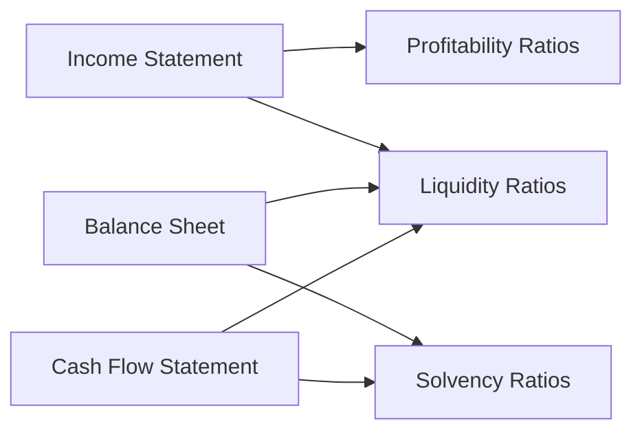

## 4.1 Ratio Analysis (Profitability, Liquidity, Solvency)

Ratio analysis is a cornerstone of financial statement analysis, providing a structured way for accountants, auditors, and analysts to interpret complex financial information quickly and clearly. By computing ratios—mathematical relationships drawn from the data on balance sheets, income statements, and statements of cash flows—stakeholders gain actionable insights into a company’s performance, stability, efficiency, and risk profile. This section delves into three primary categories of ratios: profitability, liquidity, and solvency. Each category addresses a different perspective of business health and can guide strategic decisions, identify red flags, and help benchmark performance against industry peers.

A thorough understanding of ratio analysis hinges on appreciating the context and specifics of each ratio: its formula, the underlying financial statement data, and how its values fluctuate from one reporting period to another, or across companies. As highlighted in Chapter 2, “Essential Accounting and Business Concepts,” maintaining a robust foundation in basic financial statements is critical to accurately calculate and interpret these ratios. In this section, we build upon that foundation to provide a deep, practical dive into ratio analysis, aligned with the BAR (Business Analysis and Reporting) Examination requirements.

---

Building a cohesive picture often involves computing multiple ratios at once to examine a firm’s overall performance, risks, and operational strengths. For example, a high net profit margin might seem appealing, but if the company experiences deteriorating liquidity or excessive leverage, such profit could be overshadowed by future risks. This holistic perspective is particularly vital when making cross-company and industry comparisons, as various industries have distinct norms, capital structures, and operational patterns.

Below is a high-level visual overview of how the three ratio categories relate to information from the income statement, balance sheet, and statement of cash flows:

Profitability ratios rely primarily on data from the income statement, although some relate net income to balance sheet figures like assets or shareholders’ equity. Liquidity ratios heavily incorporate current assets and current liabilities (balance sheet items), while solvency ratios expand beyond the short term into the company’s capital structure and cash-generating capacity, leveraging data from both balance sheets and cash flows.

---

### Understanding Profitability Ratios

Profitability ratios measure how effectively a company generates profit from its operations. They can reveal whether a firm is controlling costs, operating efficiently, and pricing its products or services appropriately. Key users of profitability ratios include investors, creditors, and management. 

Common profitability ratios include:

Gross Profit Margin  
• Formula:  
  Gross Profit Margin = (Gross Profit ÷ Net Sales) × 100  
• Calculation:  
  Gross Profit = Net Sales − Cost of Goods Sold  
• Interpretation:  
  This ratio indicates how efficiently a company produces and sells its goods, reflecting both production efficiency and pricing strategy. A rising gross profit margin often signals improved cost controls or pricing power, while a declining margin may point to higher production costs or competitive pressures.

Operating Margin  
• Formula:  
  Operating Margin = (Operating Income ÷ Net Sales) × 100  
• Calculation:  
  Operating Income = Gross Profit − Operating Expenses  
• Interpretation:  
  This ratio focuses on profit from core operations, excluding interest and taxes. It provides insights into how well a firm manages its direct and indirect operating costs. A higher operating margin indicates stronger operational efficiency.

Net Profit Margin  
• Formula:  
  Net Profit Margin = (Net Income ÷ Net Sales) × 100  
• Interpretation:  
  The net profit margin, or return on sales, conveys how much of each dollar of sales is ultimately translated into net income. It factors in all costs—operating, financing, and taxes. It is a comprehensive measure of a company’s profitability.

Return on Assets (ROA)  
• Formula:  
  ROA = (Net Income ÷ Average Total Assets) × 100  
• Calculation:  
  Average Total Assets = (Beginning Total Assets + Ending Total Assets) ÷ 2  
• Interpretation:  
  ROA captures how efficiently a firm uses its assets to generate profits. Higher ROA percentages suggest the company is leveraging its asset base effectively. Capital-intensive industries can show relatively lower ROAs, while technology or service-oriented firms often exhibit higher ROAs.

Return on Equity (ROE)  
• Formula:  
  ROE = (Net Income ÷ Average Stockholders’ Equity) × 100  
• Calculation:  
  Average Stockholders’ Equity = (Beginning Equity + Ending Equity) ÷ 2  
• Interpretation:  
  ROE measures how effectively management uses shareholders’ invested capital. It also offers current and potential investors a quick snapshot of a company’s profitability relative to its equity financing. When comparing ROEs across companies, be mindful of varying capital structures, profit retention, and dividend policies.

Practical Case Example:  
Imagine Company A, a software-as-a-service (SaaS) provider, reporting net sales of \$5 million, cost of goods sold of \$1 million, and an array of operating expenses totaling \$2 million, resulting in net income of \$1.5 million. Suppose the company’s total assets average \$6 million, and average equity stands at \$4 million. Computing relevant profitability ratios might look like this:

• Gross Profit Margin = [(5,000,000 − 1,000,000) ÷ 5,000,000] × 100 = 80%  
• Operating Margin = [(5,000,000 − 1,000,000 − 2,000,000) ÷ 5,000,000] × 100 = 40%  
• Net Profit Margin = (1,500,000 ÷ 5,000,000) × 100 = 30%  
• ROA = (1,500,000 ÷ 6,000,000) × 100 = 25%  
• ROE = (1,500,000 ÷ 4,000,000) × 100 = 37.5%  

With 30% net profit margin, 25% ROA, and 37.5% ROE, Company A appears to be operating quite effectively, especially for a SaaS business where high gross profit margins are common. Cross-referencing such ratios with others in the same industry is essential for meaningful benchmarking.

---

### Exploring Liquidity Ratios

Liquidity ratios measure an entity’s ability to meet its immediate and short-term obligations. For many stakeholders—particularly short-term creditors, vendors, and some operational managers—liquidity is often more pressing than long-term solvency. Liquidity ratios typically center on current assets (cash, marketable securities, receivables, inventory) and current liabilities.

Key liquidity ratios include:

Current Ratio  
• Formula:  
  Current Ratio = Current Assets ÷ Current Liabilities  
• Interpretation:  
  A current ratio of 2.0 indicates the company has twice as many current assets as current liabilities, theoretically implying enough liquidity to manage near-term obligations. However, an excessively high current ratio might also indicate underutilized assets or poor working capital management (e.g., surplus inventory).

Quick Ratio (Acid Test)  
• Formula:  
  Quick Ratio = (Cash + Marketable Securities + Net Receivables) ÷ Current Liabilities  
• Interpretation:  
  The quick ratio refines the current ratio by excluding less liquid items such as inventory or prepaid expenses. It focuses on assets readily convertible to cash within a short period. Firms with a higher quick ratio are generally better positioned to manage unexpected cash flow requirements.

Cash Ratio  
• Formula:  
  Cash Ratio = (Cash + Cash Equivalents) ÷ Current Liabilities  
• Interpretation:  
  The cash ratio is an even stricter measure of liquidity, assessing how quickly a company can pay off its current liabilities using only the most liquid resources on hand. While a high cash ratio may alleviate short-term financial stress, cash hoarding can also signal missed opportunities for higher returns on significant surpluses.

Net Working Capital  
• Formula:  
  Net Working Capital = Current Assets − Current Liabilities  
• Interpretation:  
  Net working capital is not a ratio but a widely referenced metric for understanding short-term financial health. A positive net working capital indicates the company can cover its current liabilities with its current assets. Large fluctuations in net working capital can signal operational changes, expansions, or liquidity strain.

Practical Case Example:  
Company B, a mid-sized retail chain, reports the following:  
• Current Assets: \$800,000 (of which \$150,000 is inventory and \$50,000 is prepaid expenses)  
• Current Liabilities: \$500,000 (all short-term)  
• Cash and Cash Equivalents: \$80,000  
• Net Receivables: \$300,000  
• Marketable Securities: \$50,000  

Calculations might look like this:

• Current Ratio = 800,000 ÷ 500,000 = 1.6  
• Quick Ratio = (80,000 + 300,000 + 50,000) ÷ 500,000 = 0.86  
• Cash Ratio = 80,000 ÷ 500,000 = 0.16  
• Net Working Capital = \$800,000 − \$500,000 = \$300,000  

While the current ratio of 1.6 indicates reasonable coverage of short-term liabilities, the quick ratio of 0.86 signals the company is partially reliant on inventory to meet near-term obligations. The low cash ratio (0.16) suggests a lean cash balance, potentially risky if business conditions worsen unexpectedly.

---

### Assessing Solvency Ratios

Solvency ratios examine a firm’s long-term financial stability and its capacity to service both principal and interest on debt. Creditors, long-term investors, and strategic partners often prioritize solvency metrics to assess the risk of default or financial distress. These ratios typically consider the company’s overall debt burden, equity structure, and ability to generate cash flows to cover ongoing obligations.

Common solvency ratios include:

Debt to Equity Ratio  
• Formula:  
  Debt to Equity = Total Liabilities ÷ Stockholders’ Equity  
• Interpretation:  
  This ratio shows how a company is financing its operations—through debt or equity. A higher ratio often indicates increased financial risk and leverage, while a too-low ratio may imply the company is missing potential opportunities to leverage debt for growth. The “ideal” ratio is context-dependent, varying widely by industry.

Debt Ratio  
• Formula:  
  Debt Ratio = Total Liabilities ÷ Total Assets  
• Interpretation:  
  Depicts the proportion of a company’s assets financed by debt. A higher figure tends to indicate greater financial risk, suggesting that a large percentage of the asset base is tied to creditor financing. Some highly capital-intensive sectors (e.g., utilities) may display higher tolerable leverage than service sectors.

Times Interest Earned (Interest Coverage)  
• Formula:  
  Times Interest Earned = Earnings Before Interest & Taxes (EBIT) ÷ Interest Expense  
• Interpretation:  
  This ratio demonstrates how comfortably a firm can cover its interest payments. A higher value suggests a better cushion against unforeseen downturns. Values significantly below 2.0 raise concerns about the firm’s ability to meet interest obligations.

Operating Cash Flow to Total Debt  
• Formula:  
  Operating Cash Flow to Total Debt = Operating Cash Flow ÷ Total Debt  
• Interpretation:  
  Integrates the cash-generating ability of the firm with its total debt load, focusing on liquidity from operations rather than accrued profits. Companies with strong operational cash flow relative to total debt generally present a more stable risk profile, as they can more readily meet obligations.

Practical Case Example:  
Company C, a manufacturing firm, has substantial fixed assets financed by both debt and equity. Its key figures are:  
• Total Liabilities: \$4 million  
• Stockholders’ Equity: \$1 million  
• Total Assets: \$5 million  
• EBIT: \$800,000  
• Annual Interest Expense: \$200,000  
• Operating Cash Flow: \$750,000  

Solvency ratios are calculated as follows:

• Debt to Equity = 4,000,000 ÷ 1,000,000 = 4.0  
• Debt Ratio = 4,000,000 ÷ 5,000,000 = 0.8 (80%)  
• Times Interest Earned = 800,000 ÷ 200,000 = 4.0  
• Operating Cash Flow to Total Debt = 750,000 ÷ 4,000,000 = 0.1875 (18.75%)  

A debt to equity ratio of 4.0 indicates the firm is heavily leveraged, which can magnify returns for shareholders in good times, but also introduces higher risk during industry downturns. Despite the high leverage, a 4.0 interest coverage ratio is relatively comfortable. A vigilant eye on the operating cash flow to total debt ratio is necessary; if cash flow dips significantly, the firm could struggle to service its obligations.

---

### Cross-Company and Industry Comparisons

Ratios are most powerful when used in comparative contexts. Evaluating a firm’s ratios against competitors, industry benchmarks, and previous periods provides much richer insights than simply looking at standalone values. Timing, sector-specific nuances, and unique corporate strategies all matter. For instance, a technology start-up may exhibit high growth and negative net income in early years, rendering certain profitability ratios less meaningful. However, liquidity and solvency considerations remain critically important in such a scenario.

When performing cross-industry comparisons, ensure the selected ratios are truly relevant to the sector’s operating model. In capital-intensive industries, higher leverage is common, and thus solvency ratios may appear less alarming than they would in a software sector. Variations in accounting methods, such as revenue recognition (discussed extensively in Chapter 12) or depreciation policies, can also influence ratio values.

---

### Interpreting Trending Data and Red Flags

Trend analysis highlights how ratios evolve over time. Subtle deteriorations in key ratios can serve as early warning signs. For instance, a slowly declining current ratio, accompanied by rising days payable outstanding, may point to a creeping liquidity risk. A rapidly increasing debt-to-equity ratio without a corresponding improvement in profitability metrics might signal exposure to insolvency risk. 

Common red flags to track include:  
• Declining or erratic profitability ratios despite stable or rising sales.  
• Rapid increases in current liabilities or short-term debt pushing liquidity ratios downward.  
• Rising leverage without corresponding growth in cash flows or coverage ratios.  
• Material discrepancies between a company’s internal forecasts and actual ratio trends.  

By proactively identifying these warning signs, management can take corrective steps—renegotiating payment terms, restructuring operations, or raising additional equity—to maintain financial health and investor confidence.

---

### Best Practices in Ratio Analysis

• Combine multiple ratios for a holistic view. Profitability, liquidity, and solvency ratios complement each other, providing well-rounded insights.  
• Consistently apply ratio formulas. Minor definitional variations (e.g., average vs. year-end figures) can create confusion.  
• Adjust for unusual or nonrecurring items. One-time gains or charges can distort ratio calculations.  
• Continually benchmark against industry norms and competitor performance, recognizing each industry’s unique capital structures and operational metrics.  
• Exercise professional skepticism. Ratios can be manipulated by aggressive accounting methods; always delve deeper when something appears too good or too bad.  

---

### Real-World Application and Case Study

Scenario: GlobalTech Group is a multinational manufacturing conglomerate operating in both high-tech and traditional manufacturing segments. Its income statement shows robust sales growth but rising costs due to supply chain disruptions. Its balance sheet reveals incremental short-term financing due to expansions, and the latest cash flow statement indicates moderate operational cash flows overshadowed by significant capital expenditures.

Using ratio analysis, the following emerges:  
• Profitability: Despite 15% year-over-year revenue growth, the net profit margin has dipped slightly due to rising costs of raw materials. ROA remains stable, but ROE has declined—a sign that additional equity or new acquisitions may reduce immediate returns to shareholders.  
• Liquidity: The current ratio stands at 1.3, consistent with industry norms, but down from 1.5 the previous year. A deeper look reveals that inventories spiked, suggesting potential inefficiency in inventory management or pending supply chain backlogs. The quick ratio (0.9) highlights reliance on inventory liquidation for short-term obligations.  
• Solvency: The debt to equity ratio went from 2.0 last year to 2.4, pointing to greater leverage. However, times interest earned has stabilized near 3.8, reflecting that the company can still comfortably manage interest payments. The operating cash flow to total debt ratio has dipped from 25% to 20%, warranting closer scrutiny of working capital management and potential changes in credit policy.

By focusing on the interplay among profitability, liquidity, and solvency, GlobalTech’s leadership can devise targeted strategies—such as revisiting pricing to offset higher input costs, optimizing inventory turnover, or negotiating better terms for debt financing to prevent unsustainable leverage.

---

### Practical Tips for BAR Candidates

• Revisit foundational accounting concepts from Chapter 2 to ensure a strong base for accurate calculations.  
• Practice with multiple real-life examples or annual reports—ideally from different industries—to build comfort in spotting trends and anomalies.  
• Maintain a ratio “cheat sheet” (also refer to Chapter 27, “Key Formulas, Ratios, and Quick Reference”) with standard definitions to ensure consistent usage.  
• Develop the habit of cross-referencing ratio movements with broader economic indicators (interest rates, commodity prices, etc.) and strategic developments within the firm.  

Whether you are answering structured exam questions or consulting for a client, ratio analysis remains indispensable. Mastering these metrics not only enhances your quantitative analysis toolkit but also fosters better judgment, business acumen, and strategic thinking.

---

## Quiz: Ratio Analysis for CPA Exam Candidates



### Which ratio specifically measures how efficient a company is in using its assets to generate profit?

- [ ] Gross Profit Margin
- [ ] Debt to Equity Ratio
- [x] Return on Assets (ROA)
- [ ] Current Ratio

> **Explanation:** ROA compares net income to average total assets, capturing a company's ability to use its asset base to drive earnings.

### Which ratio is most often used to assess a company's fundamental operating profitability, excluding interest and taxes?

- [ ] Net Profit Margin
- [x] Operating Margin
- [ ] Debt Ratio
- [ ] Quick Ratio

> **Explanation:** Operating Margin isolates the profitability from core operations before accounting for interest expenses and taxes, making it a clearer measure of purely operational efficiency.

### In determining liquidity, which ratio calculates a company’s ability to cover immediate obligations using only its most liquid current assets (cash, marketable securities, and receivables)?

- [ ] Net Profit Margin
- [ ] Current Ratio
- [x] Quick Ratio
- [ ] Debt to Equity Ratio

> **Explanation:** The Quick Ratio (acid test) focuses on cash, marketable securities, and net receivables, excluding inventory and other potentially less liquid current assets.

### What is a primary concern when a firm’s current ratio significantly exceeds industry benchmarks?

- [x] Underutilized current assets or inefficient allocation of resources
- [ ] Excess leverage and solvency risk
- [ ] Excess profitability relative to competitors
- [ ] Inability to expand during market downturns

> **Explanation:** An abnormally high current ratio could indicate that the company holds excessive inventory or idle cash, suggesting inefficiencies or missed investment opportunities.

### A Debt to Equity Ratio greater than 2.0 implies:

- [x] The company is highly leveraged, with liabilities exceeding twice the equity level
- [ ] The company has an unrealistic cost of capital structure
- [x] The firm may experience higher returns but also heightened risk
- [ ] The firm has negative cash flow

> **Explanation:** A Debt/Equity above 2 signals that for every dollar of equity, there are two dollars of liabilities, which can amplify both returns and financial risk.

### When analyzing the comfort with which a company can pay its interest obligations, which ratio should be prioritized?

- [ ] Net Working Capital
- [x] Times Interest Earned
- [ ] Return on Equity
- [ ] Quick Ratio

> **Explanation:** Times Interest Earned = EBIT ÷ Interest Expense; it highlights the extent to which earnings can meet interest payments.

### Which scenario might indicate a potential red flag in a firm’s financial stability?

- [x] Net profit margin and liquidity ratios both declining year over year
- [ ] Return on equity improving alongside stable inventory turnover
- [x] Rapidly increasing leverage without growing operating cash flow
- [ ] Moderate current ratio of 1.5 staying consistent

> **Explanation:** A decline in profitability coupled with eroding liquidity or a jump in leverage without supportive cash flows can signal mounting financial stress.

### For a technology startup that is not yet profitable, which ratio category becomes particularly critical?

- [x] Liquidity
- [ ] Profitability
- [ ] Return on Equity
- [ ] Fixed Asset Turnover

> **Explanation:** Liquidity measures ensure such startups can continue operations and meet immediate financial obligations, especially if profits are still negative.

### Which ratio would best assess how much of a company’s total assets are financed by debt?

- [x] Debt Ratio
- [ ] Current Ratio
- [ ] Gross Profit Margin
- [ ] Times Interest Earned

> **Explanation:** The Debt Ratio (Total Liabilities ÷ Total Assets) shows the proportion of a company’s assets financed by debt, indicating overall leverage.

### True or False: A high quick ratio exceeding 1.0 usually indicates an improved ability to settle short-term liabilities, even if inventory levels are low.

- [x] True
- [ ] False

> **Explanation:** The quick ratio excludes inventory from current assets, so values above 1.0 typically mean the company can cover its short-term liabilities with easily convertible assets like cash, securities, and receivables.



---

## For Additional Practice and Deeper Preparation

### [Business Analysis and Reporting (BAR) CPA Mock Exams](https://www.udemy.com/course/bar-cpa-mock-exams/?referralCode=ADBE2E84BEE9CB6243CA)  

**Business Analysis and Reporting (BAR) CPA Mocks:** 6 Full (1,500 Qs), Harder Than Real! In-Depth & Clear. Crush With Confidence! 

- Tackle full-length mock exams designed to mirror real BAR questions.  
- Refine your exam-day strategies with detailed, step-by-step solutions for every scenario.  
- Explore in-depth rationales that reinforce higher-level concepts, giving you an edge on test day.  
- Boost confidence and minimize anxiety by mastering every corner of the BAR blueprint.  
- Perfect for those seeking exceptionally hard mocks and real-world readiness.  

_Disclaimer: This course is not endorsed by or affiliated with the AICPA, NASBA, or any official CPA Examination authority. All content is for educational and preparatory purposes only._
