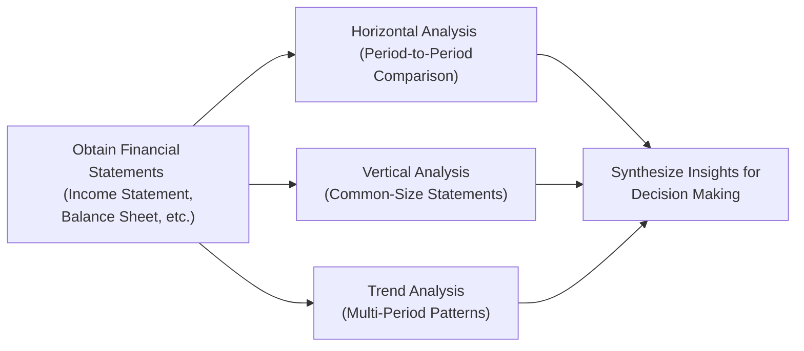

## 4.2 Horizontal, Vertical, and Trend Analysis

This section explores three critical techniques for examining financial statements: (1) Horizontal Analysis, (2) Vertical Analysis, and (3) Trend Analysis. Together with Ratio Analysis (see Section 4.1), these methods equip you with a robust toolkit to assess financial performance across multiple periods and against various benchmarks. By understanding how different financial line items evolve in scale, proportion, and pattern, you will be better positioned to identify risks, opportunities, and potential red flags in both corporate and governmental sectors.

These analytical procedures are fundamental in professional accounting and finance work. The AICPA Blueprint emphasizes analysis over simple memorization; thus, you should be acquainted with the conceptual underpinnings, calculation methods, and interpretation techniques to succeed on the BAR (Business Analysis and Reporting) portion of the CPA Exam. Whether you are advising a client, preparing for an internal audit, or evaluating a merger and acquisition, mastering these skills can significantly enhance your decision-making capabilities.

--------------------------------------------------------------------------------
## Introduction to Horizontal, Vertical, and Trend Analysis

Before we delve into the technical specifics, let’s establish a foundational understanding of each analysis type:

• Horizontal Analysis: Compares financial statement line items across several accounting periods, evaluating the absolute and percentage changes.  
• Vertical Analysis: Compares each line item to a common base figure (e.g., total sales or total assets) to see the relative size or percentage composition of each element.  
• Trend Analysis: Takes a longer horizon, examining financial items over multiple periods (three, five, or more years) to identify patterns, shifts, or anomalies in performance.

Financial professionals often use these analyses in tandem to gain a holistic perspective of a firm’s or government entity’s performance. For instance, horizontal analysis can pinpoint the largest period-over-period change, while a vertical analysis can tell you if that particular item represents a significant portion of your total resources, revenue, or expenses.

--------------------------------------------------------------------------------
## Horizontal Analysis

### Overview and Purpose
Horizontal analysis, often referred to as “comparative analysis,” examines changes in financial line items across two or more consecutive accounting periods. By highlighting the numerical increase or decrease (absolute change) and the proportional magnitude of growth or contraction (percentage change), horizontal analysis helps in uncovering trends or sudden shifts that may warrant further investigation.

For example, an entity may discover that its selling, general, and administrative (SG&A) expenses rose by 10% year-over-year, compared to a modest 2% rise in revenue—an early sign of inefficiency or cost-control issues.

### Core Calculation Steps
1. Select a Base Period: Typically, analysts start with the older or earliest reporting period.  
2. Compute the Absolute Difference:
   Absolute Change = (Current Period Figure) – (Base Period Figure)  
3. Compute the Percentage Difference:
   Percentage Change = (Absolute Change ÷ Base Period Figure) × 100%  
4. Interpret the Results: Examine whether the change is favorable or unfavorable, and whether external factors such as inflation, acquisitions, or operational changes may skew the raw results.

### Illustrative Example
Suppose a company’s Sales Revenue in 20X1 was $500,000, while in 20X2 it climbed to $550,000. Here, you might compute:

• Absolute Change = $550,000 – $500,000 = $50,000  
• Percentage Change = ($50,000 ÷ $500,000) × 100% = 10%  

If, at the same time, Cost of Goods Sold (COGS) soared 15%, management needs to investigate whether supply chain disruptions, higher input prices, or other anomalies triggered a disproportionate rise in COGS relative to Sales.

### Building Period-to-Period Comparison Schedules
To effectively manage horizontal analysis across multiple fiscal periods, it is good practice to build a comparative schedule. Assume you have data for three consecutive years (20X0, 20X1, 20X2). Your schedule might include:

• Column 1: Financial Statement Line Items (e.g., Revenue, COGS, Gross Profit, etc.)  
• Column 2: 20X0 Balances  
• Column 3: 20X1 Balances  
• Column 4: Absolute Change (20X1 – 20X0)  
• Column 5: Percentage Change ((20X1 – 20X0) ÷ 20X0) × 100%  
• Column 6: 20X2 Balances  
• Column 7: Absolute Change (20X2 – 20X1)  
• Column 8: Percentage Change ((20X2 – 20X1) ÷ 20X1) × 100%  

This structure allows for quick comparisons not only between consecutive periods (20X0 to 20X1, and 20X1 to 20X2) but also a cumulative view across the three-year window.

### Best Practices and Common Pitfalls
• Use Comparable Data: Ensure that each period’s financial information is consistent. If there have been restatements or changes in accounting policies, adjust the base period for an apples-to-apples comparison.  
• Investigate Major Deviations: Large swings in certain account balances should prompt a deeper dive to determine if the cause is structural (e.g., acquisitions, new product lines) or transitory (e.g., one-time charges).  
• Beware of Base Year Effects: If the base year is abnormally low or high, percentage changes can be misleading. Always contextually interpret the underlying drivers.

--------------------------------------------------------------------------------
## Vertical Analysis

### Overview and Purpose
Vertical analysis examines the relationship of individual components to a common base amount within a single accounting period. This method is particularly valuable for cross-sectional comparisons across product lines, business units, or industry peers, because it normalizes the data by expressing each item as a percentage of a key total—most commonly, total sales (in the income statement) or total assets (in the balance sheet).

By focusing on proportions rather than absolute dollar amounts, you can quickly assess how costs or specific asset classes are distributed relative to the overall organization’s scale.

### Core Calculation Steps
1. Select a Key Base Figure: For an income statement, total net sales is frequently used; on a balance sheet, total assets or total liabilities plus equity is typical.  
2. Divide Each Item by the Base Figure:
   Vertical Analysis Percentage = (Line Item Amount ÷ Base Figure) × 100%  
3. Compare Ratios Period-Over-Period: While vertical analysis focuses on one period, repeating the same approach for multiple years or quarters enables you to observe how proportions shift over time.

### Illustrative Example
Using the same example of $550,000 in Sales Revenue, if your entity has $220,000 in COGS during the same period, the vertical analysis calculation for COGS is:

COGS as a % of Sales = ($220,000 ÷ $550,000) × 100% = 40%

If your industry average COGS ratio is 35%, your firm may need to scrutinize supply chain efficiency or production methods.

### Vertical Analysis in the Balance Sheet
When applied to the balance sheet, vertical analysis can reveal how a firm’s assets, liabilities, and equity are distributed. For instance, you may discover that your accounts receivable represent 20% of total assets, whereas peer companies average 10%. Such variance might indicate a risk of collection issues or generous credit terms to customers.

### Best Practices and Common Pitfalls
• Industry Benchmarks: Always evaluate vertical percentages in the context of industry norms and competitor comparisons.  
• Use Realistic Allocations: If your company experiences seasonal fluctuations (e.g., high inventory buildup before the holidays), a single-year snapshot may not tell the full story.  
• Collaborate with Management: In practice, vertical analysis is best complemented by a thorough managerial explanation of cost structures or shifts in the strategic focus.

--------------------------------------------------------------------------------
## Trend Analysis

### Overview and Purpose
Trend analysis extends the idea of horizontal analysis across three or more periods to spot underlying sustainable patterns, cyclical variations, or unusual anomalies. Instead of just comparing the most recent period to the prior period, you focus on a broader timeline—three, five, or even ten years—to capture the direction and speed of change. This perspective helps in forecasting, valuation models, and risk assessments.

### Core Calculation Approaches
1. Base-Year Approach: Select the earliest year as the base (index = 100%) and express subsequent years as a percentage of that base.  
2. Rolling Analysis: Compare each period in the dataset to the immediately preceding period to see incremental changes.  
3. Statistical Tools: Advanced analysts might integrate regression analysis or moving averages (see Chapter 3: Data and Analytics) to interpret long-term trends.

### Illustrative Example
Suppose you wish to evaluate a company’s revenue over five years (20X0 to 20X4). If the revenue in 20X0 was $400,000, you might assign it an index of 100%. Then, if the revenue in 20X1 is $440,000, the new index is:

( $440,000 ÷ $400,000 ) × 100% = 110

Should 20X2 come in at $400,000 again, its index reverts to:

( $400,000 ÷ $400,000 ) × 100% = 100

Comparing the five-year index reveals whether revenue growth is consistent or erratic, and whether external factors such as market downturns or global events have impacted performance.

### Trend Analysis in Governmental Accounting
In governmental contexts, trend analysis may aid in understanding changes in revenue sources such as tax collections, grant funding, and user charges, especially when diagnosing potential budget shortfalls or infrastructure investment planning (see Chapters 19–22 for Governmental Accounting).

### Best Practices and Common Pitfalls
• Use Enough History: One or two data points are insufficient for establishing a meaningful trend. Aim for at least three to five periods.  
• Adjust for Extraordinary Items: One-time events—like legal settlements or disaster recoveries—can distort trends. Normalizing data for these events yields more reliable insights.  
• Incorporate Macroeconomic Factors: Inflation, interest rates, and consumer confidence often shape demand curves, so be aware of broader economic influences on your data.

--------------------------------------------------------------------------------
## Putting It All Together: Analyzing Financial Statements Holistically

Financial professionals combine horizontal, vertical, and trend analyses, along with ratio analysis (Section 4.1), to form a comprehensive picture of a company’s financial health. Here is a high-level visual illustrating how these methods interrelate:

In practice, you might begin by performing a horizontal analysis of the last two years’ data to flag any abrupt changes. Next, apply vertical analysis for each year to see how costs, expenses, and revenues scale in relation to total sales or total assets. Finally, incorporate a broader trend analysis stretching over three to five years (or beyond) to validate whether any changes observed are part of an ongoing pattern or are merely short-term fluctuations.

--------------------------------------------------------------------------------
## Practical Insights and Strategies

• Seek Corroboration: Combine these analytical modules with your knowledge of the company’s strategic initiatives, operational metrics, and external market trends for a holistic evaluation.  
• Recognize Biases in Data: Changes in accounting classifications, acquisitions, or expansions can skew your results unless you adjust for them.  
• Collaborate Across Departments: Financial analysis is not a siloed endeavor. IT, HR, operations, and other departments can provide critical insights on data sources and operational changes that help interpret anomalies.  
• Documentation: Keep clear workpapers showing assumptions, calculations, and rationale for all adjustments. This practice is vital for internal controls and external audits alike.  
• Review of Outliers: Any large percentage swings or new trends should be thoroughly investigated. Queries might include, “Were there large capital expenditures? Did the company discontinue a major product line?” or “Is the market experiencing a new technology shift?”

--------------------------------------------------------------------------------
## References for Further Exploration

1. “Financial Statement Analysis” by Charles H. Gibson – Offers detailed case studies on horizontal and vertical analysis.  
2. “Intermediate Accounting” by Kieso, Weygandt, and Warfield – Contains examples on constructing multi-year trend analyses.  
3. AICPA’s Online Library – Provides additional authoritative guidance on best practices for analyzing financial statements for the CPA Exam.  
4. Government Accounting Standards Board (GASB) Concepts Statements – Helpful for those applying these techniques in a governmental context.

--------------------------------------------------------------------------------
## Quiz: Horizontal, Vertical, and Trend Analysis



### Which type of analysis focuses on comparing line items over consecutive accounting periods?

- [x] Horizontal Analysis
- [ ] Vertical Analysis
- [ ] Ratio Analysis
- [ ] None of the above

> **Explanation:** Horizontal analysis helps you identify numerical and percentage changes from one period to another, revealing short-term shifts and potential red flags.

### In vertical analysis for an income statement, what is the most commonly used base figure?

- [ ] Total Assets
- [x] Total Sales (Net Revenue)
- [ ] Cost of Goods Sold
- [ ] Net Income

> **Explanation:** Vertical analysis typically expresses each income statement item as a percentage of net sales, allowing for straightforward comparison of cost components.

### Which statement best describes the primary goal of trend analysis?

- [x] Detecting patterns and consistency by examining three or more periods
- [ ] Calculating a single-year common-size statement
- [ ] Comparing financial data to industry benchmarks in one period
- [ ] Assessing the liquidity of a company relative to its prior period

> **Explanation:** Trend analysis extends beyond single-year or two-period comparisons by focusing on multi-year data to uncover lasting patterns or shifts.

### Which of the following is a key step in performing a horizontal analysis?

- [x] Subtracting the base period figure from the current period figure
- [ ] Calculating each line item as a percentage of total revenue
- [ ] Performing an index-based calculation against a base year
- [ ] Converting each liability account to a ratio of total equity

> **Explanation:** Horizontal analysis compares consecutive periods by determining changes in raw dollars, often alongside a corresponding percentage change.

### What is a major pitfall when interpreting the results of a vertical analysis across multiple years?

- [ ] Failing to compare each item to total assets
- [x] Neglecting internal or industry changes affecting the base figure
- [ ] Using the wrong inflation index
- [ ] Performing both decimal and percentage calculations

> **Explanation:** Because vertical analysis pegs each item to a base like sales or assets, changes in industry conditions or internal reorganizations can drastically shift the composition, potentially leading to unclear interpretations if these factors are ignored.

### In a multi-year comparative approach, the base-year method typically assigns which value to the earliest year?

- [ ] 0%
- [ ] 50%
- [x] 100%
- [ ] 200%

> **Explanation:** Under the base-year method, the oldest period is assigned an index of 100%, and subsequent years are calculated relative to that figure.

### How does horizontal analysis differ from trend analysis?

- [x] Horizontal analysis focuses on changes between two specific periods; trend analysis looks at patterns across multiple periods
- [ ] Trend analysis expresses each item as a percentage of total sales
- [x] They do not differ; they are essentially the same process
- [ ] Trend analysis only compares one period to the immediate preceding period

> **Explanation:** Horizontal analysis often involves pairwise comparisons (e.g., current vs. prior year), whereas trend analysis evaluates more extended periods to identify consistent direction or growth patterns.

### Which of the following is a valid reason for large fluctuations uncovered in a horizontal analysis?

- [x] Company acquisition or merger
- [ ] Decimal rounding methods
- [ ] Lack of knowledge of ratio analysis
- [ ] Changing a single reporting line item name

> **Explanation:** Significant corporate events such as acquisitions or mergers can cause large spikes or drops in financial line items, warranting deeper investigation.

### When applying vertical analysis to a balance sheet, which of these is the standard base figure?

- [x] Total Assets
- [ ] Retained Earnings
- [ ] Cost of Goods Sold
- [ ] Net Sales

> **Explanation:** For balance sheets, it is typical to measure each asset, liability, and equity account against total assets (or total liabilities and equity) to see the relative proportion each item represents.

### Is inflation something to consider in multi-year trend analysis?

- [x] True
- [ ] False

> **Explanation:** Inflation can distort financial figures, especially over extended periods. Adjusting for inflation or using constant dollars can clarify whether real growth or merely inflation-driven growth is taking place.



--------------------------------------------------------------------------------

## For Additional Practice and Deeper Preparation

### [Business Analysis and Reporting (BAR) CPA Mock Exams](https://www.udemy.com/course/bar-cpa-mock-exams/?referralCode=ADBE2E84BEE9CB6243CA)  

**Business Analysis and Reporting (BAR) CPA Mocks:** 6 Full (1,500 Qs), Harder Than Real! In-Depth & Clear. Crush With Confidence!  

- Tackle full-length mock exams designed to mirror real BAR questions.  
- Refine your exam-day strategies with detailed, step-by-step solutions for every scenario.  
- Explore in-depth rationales that reinforce higher-level concepts, giving you an edge on test day.  
- Boost confidence and minimize anxiety by mastering every corner of the BAR blueprint.  
- Perfect for those seeking exceptionally hard mocks and real-world readiness.  

_Disclaimer: This course is not endorsed by or affiliated with the AICPA, NASBA, or any official CPA Examination authority. All content is for educational and preparatory purposes only._
