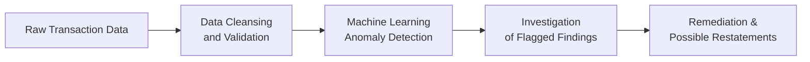
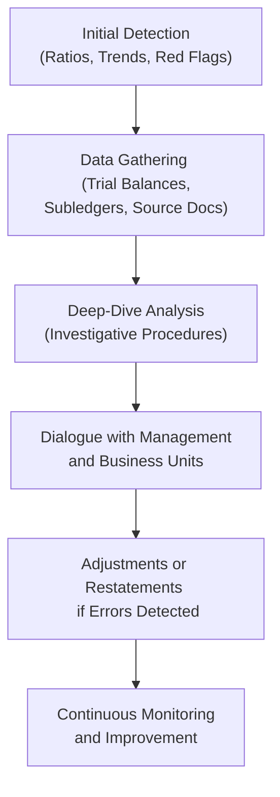

## 4.4 Identifying Anomalies and Potential Red Flags

Scrutinizing financial statements for anomalies and red flags is a critical skill for all professionals in accounting, finance, and business analysis. Even seemingly small irregularities can signal deeper, systemic issues that may impact a company’s profitability, liquidity, or even its legal standing. As discussed in earlier sections, such as Ratio Analysis (Section 4.1) and Horizontal/Vertical Examination (Section 4.2), a robust analytical toolkit helps isolate outliers in the data. This section delves deeper into the techniques, warning signs, and implications of identifying anomalies within financial statements.

Identifying anomalies goes beyond just crunching numbers: it involves an understanding of the underlying business activities, processes, and environment. Red flags can range from minor oversights to deliberate misstatements. Understanding their nature and possible implications is key to performing a comprehensive risk assessment and maintaining the integrity of reported financial results.

---

### The Importance of Detecting Irregularities

Financial statements serve as a global language of business performance. They convey reliability and comparability, enabling stakeholders—such as investors, creditors, regulators, and analysts—to make informed decisions. Anomalies or red flags not only distort the accuracy of these statements but can also lead to legal ramifications, reputational damage, and potential conflicts with governing institutions (e.g., SEC, PCAOB, or local regulatory bodies).

Potentially misleading or fraudulent data can often be hidden among vast transaction volumes. Anomalies might be intentional manipulations (e.g., revenue inflation) or inadvertent errors (e.g., misclassification of expenses). Regardless of intent, the risk to reliable reporting is paramount.

---

### Common Sources of Anomalies

1. Revenue Recognition Issues  
   • Premature revenue recognition (e.g., booking sales before goods are shipped).  
   • Multiple performance obligations incorrectly accounted for, as discussed in Chapter 12.  
   • Channel stuffing or artificially boosting sales at period-end.

2. Expense Manipulation  
   • Deferred expense recognition (e.g., capitalizing routine operating expenses).  
   • Improper accruals and reversals that alter expense timing.  
   • Failure to capture all period-related expenses, potentially understating liabilities.

3. Inconsistent Valuations  
   • Overstated or understated assets such as goodwill, intangible assets, or inventory.  
   • Aggressive assumptions in fair value estimations (refer to Chapter 15 for derivative-based valuations and Chapter 10 for intangible assets’ impairment).  
   • Understated or hidden liabilities (e.g., off-balance-sheet obligations, see Chapter 14 for consolidation guidelines).

4. Unusual Changes in Ratios  
   • Sudden shifts in liquidity (e.g., current or quick ratios).  
   • Spike in leverage measures (e.g., debt-to-equity ratio).  
   • Extreme fluctuations in profitability metrics (e.g., gross margin, ROA, ROE).

5. Complex Transaction Structures  
   • Transactions that lack clear economic substance (round-tripping, vendor financing, etc.).  
   • Related-party transactions with inflated or deflated pricing.  
   • Structured financing vehicles that obscure actual ownership or liability.

6. Management Overrides  
   • Top-down directives that bypass established internal controls.  
   • Excessive reliance on manual journal entries at period-end.  
   • Frequent adjustments without sufficient documentation.

---

### Analytical Techniques for Identifying Anomalies

A wide range of tools can help detect anomalies, from traditional ratio analysis to sophisticated data analytics. The following methods build upon Sections 3.1 and 4.1–4.3 of this guide and emphasize how each can reveal potential red flags.

#### Ratio Fluctuations

Ratios can suddenly deviate from historical trends or industry norms. While many factors can drive ratio changes (e.g., new product lines, expansions, acquisitions), significant, unexplained swings are often suspect. Examples of key ratios to watch:

• Profitability Ratios: Gross margin, net margin, and return on equity (ROE).  
• Liquidity Ratios: Current ratio, quick ratio, and operating cash flow ratio.  
• Solvency Ratios: Debt-to-equity, times interest earned.  
• Activity Ratios: Inventory turnover, accounts receivable turnover, days payable outstanding.

#### Trend and Common-Size Analyses

• Horizontal (Trend) Analysis: Looks at changes in specific financial statement items across multiple periods. Large year-over-year or quarter-over-quarter discrepancies prompt deeper investigation.  
• Vertical (Common-Size) Analysis: Expresses items as percentages of a base figure (e.g., revenue). This technique quickly highlights composition changes (e.g., a sudden jump in COGS as a percentage of sales).

#### Variance Analysis

A technique borrowed from managerial and cost accounting (see Chapter 5), variance analysis focuses on differences between expected and actual performance. Large discrepancies can point to:

• Cost Overruns: Indicate inventory theft, supplier price changes, or overhead misallocations.  
• Revenue Divergence: Suggest inaccuracies in sales forecasts or revenue manipulation.  
• Labor Variances: Reveal hidden inefficiencies or erroneous payroll accounting.

#### Data Analytics and Automation

In the modern accounting environment (see Chapter 3 on Data and Analytics), advanced tools such as AI-driven data mining or robotic process automation (RPA) can discover anomalies more efficiently:

• RPA Tools: Automate repetitive tasks such as invoice matching, highlighting inconsistent entries.  
• Machine Learning Algorithms: Flag unusual transaction patterns (e.g., out-of-cycle payments).  
• Continuous Monitoring: Real-time checks of transactional data can detect and alert for suspicious activity.

Below is a simplified flowchart illustrating the process of investigating anomalies using data analytics:

In this diagram:  
• A["Raw Transaction Data"] is extracted from accounting systems.  
• B["Data Cleansing   and Validation"] ensures data quality before analytical processes.  
• C["Machine Learning   Anomaly Detection"] searches for significant outliers.  
• D["Investigation   of Flagged Findings"] involves examining anomalies further.  
• E["Remediation &   Possible Restatements"] is where corrections or disclosures occur if necessary.

---

### Potential Red Flags and Their Implications

While numerical inconsistencies are a key bellwether of potential issues, certain qualitative details in disclosures, footnotes, and management discussions can also raise concerns.

#### Revenue-Related Red Flags

• Rapid acceleration of revenue growth without corresponding growth in cash collections.  
• Complex or vague revenue recognition policies, especially regarding multi-element arrangements (see Chapter 12).  
• Excessive sales returns after period close, suggesting possible “channel stuffing.”

#### Expense-Related Red Flags

• Sudden decrease in operating expenses relative to sales growth.  
• Internal memos urging staff to delay purchase orders or expense recognition.  
• Frequent classification changes of expenses between operating and non-operating categories.

#### Balance Sheet Anomalies

• Unusually large intangible assets, particularly goodwill, with minimal impairment consideration (refer to Chapter 10 for goodwill testing).  
• Complex off-balance-sheet arrangements masking debt (e.g., unconsolidated VIEs in Chapter 14).  
• Inventory building up without a clear sales trend to match.

#### Cash Flow Statement Discrepancies

• Persistent divergence between net income and operating cash flow, especially if net income is consistently high while cash flow is erratic or negative.  
• Frequent large non-cash adjustments that are not clearly explained.  
• Reclassifications that inflate operating cash flows or minimize financing outflows (e.g., mislabeling financing payments).

#### Other Qualitative Indicators

• Frequent changes in auditors: Could signal disagreements on accounting policies.  
• High turnover in key leadership positions, especially CFO or controller.  
• Complex or non-routine transactions at period-end, including “one-off” deals or private placements.  
• Excessive emphasis on short-term stock price, potentially leading to managerial pressure on earnings.

---

### Illustrative Case Studies

Below are several real-life-inspired scenarios that demonstrate the detection and outcomes of financial anomalies. (Note: Names and figures are fictionalized for illustrative purposes.)

**Case Study: Overstated Revenue at Merlin Tech Solutions**
Merlin Tech Solutions, a mid-sized software company, reported year-over-year revenue growth of 35%, far exceeding its historical growth rate of 12%. A look at its Days Sales Outstanding (DSO) ratio revealed it ballooned from 45 to 90 days within the same year. Anomalous patterns emerged where the company recognized revenue from software licenses at contract signing, well before product delivery. Additional research showed that the majority of these contracts remained open, indicating potential channel stuffing or possibly nonexistent customers. The company was forced to restate its revenue by 20% and faced legal scrutiny for fraudulent financial reporting.

**Case Study: Hidden Liability in Off-Balance-Sheet Financing**
A manufacturing firm, Titan Forgings, used a special-purpose entity (SPE) to lease expensive machinery. The arrangement artificially reduced Titan’s debt load on the consolidated balance sheet. However, the lease terms obligating Titan to pay certain guaranteed residual values were overlooked. During an internal review, analysts identified unusual lease payment structures, and further examination revealed Titan bore the risk of ownership. ASC guidance on consolidations (Chapter 14) mandated that the SPE be consolidated, resulting in a dramatic increase in recognized liabilities.

---

### Effective Strategies for Mitigating Risk

Detecting anomalies is only half the battle; the other half involves putting in place robust controls and best practices that minimize the occurrence of red flags in the first place.

• Strengthen Internal Controls: Implement segregation of duties, enhanced approval workflows, and regular audits of sensitive accounts.  
• Periodic Training: Foster awareness among finance and accounting teams about proper revenue, expense, and balance sheet treatment.  
• Board and Audit Committee Oversight: Ensure adequate corporate governance, with an independent audit committee that challenges management assumptions.  
• Data-Driven Culture: Encourage the use of dashboards, continuous monitoring tools, and real-time analytics to spot emerging issues faster.  
• Regular Reconciliations: Tie subledger balances to general ledger and investigate any unreconciled items promptly.

---

### Integrated Approach to Anomaly Detection

A comprehensive approach to identifying anomalies weaves together the tools covered in previous sections and references multiple chapters throughout this guide:

• Use ratio analysis (Sections 4.1–4.2) and variance analysis (Chapter 5) to set benchmarks and expected ranges.  
• Integrate data analytics (Chapter 3) to spot unusual patterns or outliers.  
• Reference budget analyses (Chapter 7) to catch deviations from projected figures.  
• Consult risk assessment (Chapter 8) for understanding macroeconomic or company-specific influences.  
• Examine disclosures in light of GAAP/IFRS differences (Chapter 23) to ensure consistent application of standards.

---

### Financial Statement Anomaly Investigation Diagram

Below is a simplified diagram illustrating a typical process that analysts may use to investigate financial statement anomalies:

- A["Initial Detection   (Ratios, Trends, Red Flags)"] could be triggered by unusual ratio fluctuations.  
- B["Data Gathering   (Trial Balances, Subledgers, Source Docs)"] ensures a thorough investigation.  
- C["Deep-Dive Analysis   (Investigative Procedures)"] can involve confirming shipments, physically verifying inventory, or reconciling bank statements.  
- D["Dialogue with Management   and Business Units"] clarifies the nature of each anomaly.  
- E["Adjustments or Restatements   if Errors Detected"] addresses material or immaterial adjustments.  
- F["Continuous Monitoring   and Improvement"] encourages iterative learning and system enhancement.

---

### Overcoming Practical Challenges

• Data Overload: Modern ERPs and data lakes generate enormous data volumes. Automate checks using scripts or specialized software to sift through large datasets.  
• Budget Constraints: Smaller organizations may lack resources for advanced analytics. Scalable cloud solutions or outsourced forensic analytics can offer cost-friendly entry points.  
• Cross-Functional Coordination: Collaborate with operations, legal, IT, and HR teams to verify the economic substance behind every transaction.  
• Skepticism vs. Trust: Strike a balance between healthy skepticism and constructive engagement with management. Overly aggressive suspicion can erode trust but complacency can hide errors.

---

### Best Practices for Maintaining Integrity

• Clear and Consistent Policies: Document revenue recognition, expense classification, and asset valuation policies in a manner consistent with authoritative literature.  
• Segregation of Duties: Minimize opportunities for concealment by separating authorization, recordkeeping, and reconciliation tasks.  
• Robust Audit Trail: Ensure all transactions can be traced from source documents to financial statements.  
• Regular Communication: Keep the board, audit committee, and external auditors informed about identified risks and the measures taken to address them.  
• Transparent Disclosures: Relay the nature, timing, and extent of unusual items within footnotes and MD&A (Management Discussion & Analysis).

---

### References for Further Exploration

• Association of Certified Fraud Examiners (ACFE): “Report to the Nations,” which presents common fraud schemes and detection techniques.  
• Public Company Accounting Oversight Board (PCAOB) Auditing Standards: Guidance on risk assessment, including indicators of possible misstatement.  
• AICPA’s Audit Risk and Materiality Guide: Comprehensive insights on identifying misstatements, whether due to fraud or error.  
• COSO’s Internal Control–Integrated Framework: Key for designing and evaluating the effectiveness of internal controls.

Readers wishing to develop an even deeper foundation in anomaly detection and red-flag analysis can also consult Chapter 3 (on Data Analytics) and Chapter 9 (on Valuation Techniques).

---

## Quiz: Identifying Financial Statement Red Flags



### Which of the following is a common indication of revenue-related anomalies?

- [x] A significant increase in revenue coupled with stagnant or declining cash collections
- [ ] A stable Days Sales Outstanding (DSO) metric
- [ ] An increase in operating expenses alongside revenue
- [ ] A decline in debt-to-equity ratio

> **Explanation:** A sudden rise in revenue without a similar increase in cash inflows often indicates early or inflated revenue recognition.  

### When analyzing financial statements, which ratio fluctuation is MOST likely to signal an anomaly?

- [x] A sudden and unexplained drop in operating expenses relative to sales
- [ ] A slightly higher cost of goods sold during a seasonal peak
- [x] A spike in the leverage ratio without supporting business rationale
- [ ] An uptick in the gross margin ratio aligned with product mix changes

> **Explanation:** Large, sudden deviations in operating expenses or leverage ratios without a logical business reason can be red flags.  

### Which of the following best describes the role of data analytics in detecting financial anomalies?

- [x] They help identify unusual patterns hidden in vast transaction data more efficiently.
- [ ] They replace the need for ratio analysis and internal controls.
- [ ] They serve solely as a documentation management system.
- [ ] They eliminate the need for professional judgment.

> **Explanation:** Advanced data analytics tools can flag irregularities that may remain undetected through manual review alone.  

### Why might high net income with persistently negative operating cash flow be a red flag?

- [x] It may indicate improper revenue recognition or hidden expenses.
- [ ] It generally reflects strong liquidity.
- [ ] It suggests conservative accounting policies.
- [ ] It confirms optimal cost containment.

> **Explanation:** When a company reports robust earnings but struggles with its operating cash flow, analysts often suspect aggressive or questionable accounting practices.  

### Which of the following is an effective strategy to mitigate the risks associated with potential red flags?

- [x] Implementing segregation of duties
- [ ] Restricting staff access to basic financial records
- [x] Encouraging continuous data monitoring
- [ ] Avoiding external audits to save costs

> **Explanation:** Segregating duties limits the possibility of concealment, and continuous monitoring helps catch anomalies early.  

### What type of transaction often masks problematic arrangements and leads to misrepresentations on financial statements?

- [x] Off-balance-sheet financing through special-purpose entities
- [ ] Standard vendor payments in line with credit terms
- [ ] Minimal intangible assets with straightforward valuation
- [ ] Simple cash purchases of inventory

> **Explanation:** Off-balance-sheet financing is sometimes used to hide liabilities or manipulate reported leverage.  

### Which qualitative indicator would be MOST concerning when assessing potential red flags?

- [x] A high turnover rate in CFO or controller positions
- [ ] A thorough disclosure of complex transactions
- [x] Frequent changes in external auditors
- [ ] Consistent revenue growth supported by strong consumer demand

> **Explanation:** Unusual management turnover and frequent auditor switches are often correlated with deeper accounting issues.  

### Which element of the cash flow statement, when showing unexplained inconsistencies, can be an obvious sign of potential foul play?

- [x] Operating cash flow that significantly diverges from net income
- [ ] Financing cash flow that periodically fluctuates
- [ ] Investing cash flow that changes due to asset acquisitions
- [ ] Depreciation expenses within the statement

> **Explanation:** Large discrepancies between operating cash flow and net income raise questions about revenue timing and expense recognition.  

### Which best practice helps ensure the integrity of financial data with regard to anomaly detection?

- [x] Maintaining a robust audit trail for transactions
- [ ] Minimizing internal reporting details
- [ ] Using the same password for all accounting systems
- [ ] Avoiding frequent reconciliations to reduce costs

> **Explanation:** A transparent audit trail is essential for tracing transactions and uncovering any manipulation.  

### A large, unexplained write-off of receivables in the quarter following a major revenue push is likely a red flag. True or False?

- [x] True
- [ ] False

> **Explanation:** Large write-offs may confirm prior revenue overstatements or a failure to properly assess credit risk.



---

## For Additional Practice and Deeper Preparation

### [Business Analysis and Reporting (BAR) CPA Mock Exams](https://www.udemy.com/course/bar-cpa-mock-exams/?referralCode=ADBE2E84BEE9CB6243CA)  

**Business Analysis and Reporting (BAR) CPA Mocks:** 6 Full (1,500 Qs), Harder Than Real! In-Depth & Clear. Crush With Confidence!

- Tackle full-length mock exams designed to mirror real BAR questions.  
- Refine your exam-day strategies with detailed, step-by-step solutions for every scenario.  
- Explore in-depth rationales that reinforce higher-level concepts, giving you an edge on test day.  
- Boost confidence and minimize anxiety by mastering every corner of the BAR blueprint.  
- Perfect for those seeking exceptionally hard mocks and real-world readiness.

_Disclaimer: This course is not endorsed by or affiliated with the AICPA, NASBA, or any official CPA Examination authority. All content is for educational and preparatory purposes only._
