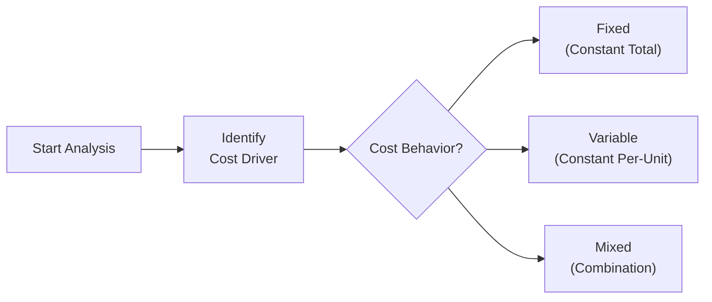

## 5.1 Cost Classifications (Fixed, Variable, Mixed)

Effective business analysis requires a solid grasp of how costs behave under varying operational conditions. Understanding whether a cost is fixed, variable, or mixed lays the groundwork for budgeting, forecasting, variance analysis, and strategic decision-making. This knowledge also helps managers and accountants assess profitability under different production or service volumes. In this section, we delve into fixed, variable, and mixed costs, illustrate their treatment within accounting systems, and discuss how they flow through financial statements for more robust and precise analysis.  

This section builds upon foundational concepts introduced in Chapter 2: Essential Accounting and Business Concepts, while laying the groundwork for more advanced topics such as Variance Analysis (Section 5.3) and Budgeting and Forecasting (Chapter 7).

--------------------------------------------------------------------------------

### Overview of Cost Behavior and Importance in Decision-Making

When analyzing costs, it is crucial to recognize that businesses operate within a “relevant range,” which represents the normal span of activities or production levels in which cost behavior patterns remain relatively consistent. For instance, the classification “fixed” typically holds true only within a certain level of production—if the production volume expands beyond a certain threshold, the fixed cost structure may change (e.g., a new facility may be needed, increasing rent expenses).  

Accountants and managers rely on cost classification for:

• Cost-Volume-Profit (CVP) analysis  
• Break-even calculations  
• Contribution margin analysis  
• Budget preparation and forecasts  
• Managerial decision-making (e.g., make-or-buy analyses and special order decisions)  

By separating total costs into the correct classification (fixed, variable, or mixed), stakeholders gain clarity on how profitability will shift in response to changes in volume, price, or product mix.

--------------------------------------------------------------------------------

### Fixed Costs

Fixed costs remain constant in total regardless of changes in the level of business activity, at least within the relevant range. Common examples include:  

• Rent or lease payments for a manufacturing facility  
• Depreciation on machinery or equipment (when calculated on a straight-line basis)  
• Salaries for administrative staff (who are not directly tied to production volume)  
• Property taxes and insurance  

#### Key Characteristics

1. Total fixed costs remain constant within the relevant range.  
2. Per-unit fixed costs decrease as activity increases because the total fixed cost is spread over more units.  

For instance, if a company leases a factory for $10,000 per month, this $10,000 remains the same whether the company produces 1,000 units or 10,000 units. However, on a per-unit basis, at 1,000 units the fixed cost is $10 per unit, whereas at 10,000 units it plummets to $1 per unit.  

#### Accounting Flow and Analysis

Fixed manufacturing overhead (e.g., factory lease) is generally allocated to units under absorption costing methods. However, it is treated as a period expense under variable costing approaches. These classifications matter for internal reporting, profitability analysis, and decision-making. In external financial statements, fixed costs that relate to manufacturing overhead become part of the cost of goods sold once the products are sold, though they remain “fixed” in nature from a managerial standpoint.  

Mistreating or misclassifying fixed costs can significantly distort financial analysis. Over- or underestimating fixed costs skews break-even points and can lead to suboptimal pricing decisions.

--------------------------------------------------------------------------------

### Variable Costs

Variable costs fluctuate in direct proportion to changes in the level of business activity. As production volume or sales increase, total variable costs rise, and vice versa. Common examples include:

• Direct materials (e.g., raw steel in automobile manufacturing, flour in a bakery)  
• Direct labor that is strictly tied to production output (e.g., assembly-line wages paid by the hour in some models)  
• Commissions based on sales revenue  
• Utilities that strictly vary with machine-hours (e.g., electricity usage in high-intensity production environments)  

#### Key Characteristics

1. Total variable costs change in proportion to volume.  
2. Per-unit variable cost remains constant across different production levels, assuming stable input prices and efficient production processes.  

For example, if the variable cost per unit for direct materials is $3 and an organization produces 100,000 units, total variable cost is $300,000. If the production volume doubles to 200,000 units, total variable cost doubles to $600,000, even though the per-unit cost of $3 remains unchanged.  

#### Accounting Flow and Analysis

Variable costs are typically expensed in the same period that the related revenue is recognized (in accrual-based accounting). Under both absorption and variable costing systems, direct materials and direct labor are part of product costs, thus flowing into Work in Process (WIP) and, eventually, Cost of Goods Sold (COGS) once the products are sold.  

In ratio analysis (see Chapter 4), understanding which costs are variable impacts calculations such as the contribution margin ratio:  

Contribution Margin = Sales – Variable Costs  

A higher proportion of variable costs relative to sales can signify more operational flexibility but lower operating leverage. Conversely, fewer variable costs and more fixed costs can mean higher operating leverage, increasing potential gains or losses as sales volumes shift.

--------------------------------------------------------------------------------

### Mixed Costs

Mixed costs, also known as semi-variable or semi-fixed costs, contain both fixed and variable components. A classic example is a utility bill featuring a fixed monthly meter charge plus a variable component that depends on usage (e.g., kilowatt-hours).

• Common examples:  
  – Telephone service with a flat charge plus per-minute rates  
  – Equipment maintenance combining a fixed monthly service fee plus additional charges for usage or parts  
  – Sales staff compensation that includes a base salary (fixed) plus commissions (variable)  

#### Decomposing Mixed Costs

Managers often use methods such as the High-Low Method, Scattergraph Analysis, or Regression Analysis to split mixed costs into their fixed and variable components:

• High-Low Method – Identifies the highest and lowest activity levels and corresponding costs, approximating a straight-line relationship between cost and volume.  
• Regression Analysis – Provides a more statistically rigorous approach, often used in advanced analytics (discussed in Chapter 3.1: Data Analytics for BAR).  

#### Accounting Flow and Analysis

In financial statements, mixed costs are typically separated into their fixed and variable portions to facilitate better budgeting, forecasting, and decision-making. For instance:

1. The fixed portion is treated like a fixed cost, ensuring it appears as a fixed expense in internal managerial reports.  
2. The variable portion is tracked in tandem with variable costs, allowing for accurate contribution margin analysis and flexible budgeting.  

Disregarding the mixed nature of certain costs can lead to inaccurate break-even points and flawed financial models. By accurately decomposing and classifying these costs, businesses can more effectively predict profitability under different operating conditions.

--------------------------------------------------------------------------------

### Visualizing Cost Behaviors

The following Mermaid diagram offers a simple illustration of how costs can be classified based on how they behave as production volume changes.  

• Fixed: Total cost remains flat as activity rises.  
• Variable: Total cost increases linearly with activity.  
• Mixed: The cost line starts above zero (the fixed component) and slopes upward (the variable component).

--------------------------------------------------------------------------------

### Examples of Cost Classifications in Practice

Below is a consolidated example table illustrating how fixed, variable, and mixed costs might behave and flow through accounts under different activity levels.

| Cost Item                     | Classification | Monthly Amount or Rate                          | Explanation                                                                 |
|------------------------------|----------------|-------------------------------------------------|-----------------------------------------------------------------------------|
| Factory Lease                | Fixed          | $10,000/month                                   | Does not vary with number of units produced.                                |
| Depreciation (Straight-Line) | Fixed          | $5,000/month                                    | Constant depreciation expense for initially purchased machinery.            |
| Utility (Electricity)        | Mixed          | $1,200 base + $0.08/kWh                         | Has a flat charge plus a variable component based on electricity usage.     |
| Direct Materials             | Variable       | $4 per unit                                     | Cost increases with each unit produced.                                     |
| Production Labor             | Variable       | $15/hour                                        | Tied to actual hours worked; more output typically requires more labor.      |
| Maintenance of Machinery     | Mixed          | $500/month + $1 per machine-hour                | Base contract fee plus a variable component depending on machine usage.      |
| Sales Commissions            | Variable       | 2% of sales revenue                             | Ties directly to sales volume generated.                                    |
| Salesperson’s Base Salary    | Fixed          | $3,000/month                                    | Guaranteed monthly salary irrespective of the number of units sold.          |

#### Flow Through Accounts

1. Direct Materials (Variable) and Production Labor (Variable) flow into Work in Process (WIP) and eventually Cost of Goods Sold (COGS) when production is complete and units are sold.  
2. Fixed overhead costs like a Factory Lease are allocated to products under absorption costing, but recognized immediately as expenses in variable costing internal reports.  
3. Mixed utilities are typically assigned to overhead and allocated partially to product costs if they directly relate to production; any portion not production-related appears as a period expense.  
4. Sales Commissions (Variable) and the Sales Base Salary (Fixed) are recorded as period expenses within Selling, General & Administrative (SG&A) costs.

When conducting managerial or cost accounting analysis, each of these costs needs to be separated and understood in its appropriate accounting treatment. This ensures that cost-volume-profit analysis, contribution margin calculations, and budget modeling remain accurate.

--------------------------------------------------------------------------------

### Relevance to Breakeven and Contribution Margin Analysis

Cost-Volume-Profit (CVP) analysis depends on accurately classifying costs to determine breakeven points and contribution margins. A typical CVP formula is:

Breakeven Point in Units  
= Fixed Costs ÷ (Sales Price per Unit – Variable Cost per Unit)

• Fixed costs are accounted for in the numerator.  
• The difference between the sales price per unit and variable cost per unit is the contribution margin per unit.  

Including any mixed costs incorrectly under fixed or variable can drastically alter the computed breakeven and disrupt planning decisions like how many units of a product must be sold to meet a targeted profit or how changes in product mix affect overall profitability (see Section 5.4: Volume, Price, and Mix Effects).

--------------------------------------------------------------------------------

### Strategy, Best Practices, and Common Pitfalls

1. **Regularly Reassess Cost Classifications**  
   In a dynamic business environment, costs may shift from variable to fixed, or vice versa. For instance, a business might transition from commission-only staff to salaried sales representatives, or it may switch from a fixed lease to a flexible coworking space that charges by the hour.

2. **Use Multiple Methods to Verify Classification**  
   Pair the High-Low Method with Regression Analysis or Scattergraph Analysis (refer to Chapter 3.1) for more accurate partitioning of mixed costs.

3. **Beware of Step Costs**  
   Some costs are neither purely fixed nor purely variable but can change in “steps” (e.g., hiring an additional supervisor every 20,000 units). Proper classification as step-variable or step-fixed will yield more precise cost estimates and budgeting outcomes.

4. **Remember the Relevant Range**  
   Costs may remain fixed only within certain operational levels. Exceeding or falling below a relevant range can necessitate reclassification or fresh estimates.

5. **Periodic vs. Product Cost Treatment**  
   For external reporting, certain fixed costs, including overhead, become part of an asset (inventory) until the product is sold. For internal analysis, variable costing can offer a clearer picture of incremental costs and immediate overhead burdens.

--------------------------------------------------------------------------------

### Real-World Case Study: Manufacturing Firm with Mixed Utilities

Imagine a mid-sized bicycle manufacturer, Velocity Wheels Inc., experiencing rapid customer demand growth:

• Over the past year, they paid a stable factory lease of $12,000 per month (Fixed Cost) and $4 per unit for direct materials (Variable Cost).  
• Their electricity bill moved from $1,100 per month at low capacity to $2,500 per month at high capacity due to both a fixed base fee of $800 and a variable charge of $0.06 per kilowatt-hour used (Mixed Cost).  

After analyzing monthly operational data, the company discovered that some portion of electricity costs correlated directly with machine runtime. Using the High-Low Method, they determined their fixed component was roughly $800 monthly, and the remaining variable portion of the utility cost was approximately $0.06 per kilowatt-hour.  

With this classification, Velocity Wheels Inc. could accurately forecast its monthly overhead based on expected production hours, preventing underestimation of key costs as demand fluctuated. This refined approach further aided decisions about expanding production lines and setting more competitive selling prices.

--------------------------------------------------------------------------------

### Practical Insights and Cross-References

• For deeper examination of how cost classifications interface with managerial decision-making, see Section 5.3 Variance Analysis.  
• Explore budgeting implications, particularly how to budget fixed vs. variable expenses in rolling forecasts, under Chapter 7: Budgeting and Forecasting.  
• Chapter 4: Financial Statement Analysis discusses how misclassification of cost behaviors can skew ratio interpretations, particularly if overhead analysis is incomplete.  

Referencing and integrating data analytics techniques in cost classification can be found in Chapter 3, where solutions like regression models can refine your cost partitioning to improve accuracy in forecasting.

--------------------------------------------------------------------------------

### Conclusion

Classifying costs correctly as fixed, variable, or mixed is foundational to robust managerial accounting and business analysis. A firm’s profitability, strategy, and tactical decisions hinge on understanding the dynamics between cost structures and activity levels. By diligently separating costs, employing reliable estimation methods, and updating classifications regularly, organizations can produce more accurate budgets, refine pricing strategies, and enhance overall financial performance.

The tools and methods introduced here are not just theoretical constructs; they are practical frameworks that inform day-to-day decisions and long-term strategies. As you integrate these concepts into real-world applications, focus on accuracy and consistency in your costing techniques—small misclassifications in cost structures can ripple through your financial statements and managerial decisions, often with significant business impacts.

--------------------------------------------------------------------------------

## Test Your Cost Classification Knowledge: A Managerial Accounting Quiz



### Which of the following statements correctly describes a fixed cost within the relevant range?

- [x] Total fixed costs remain constant regardless of changes in production volume.
- [ ] Fixed costs vary in direct proportion to production volume.
- [ ] Fixed costs per unit remain the same as production changes.
- [ ] Fixed costs are always non-manufacturing expenses only.

> **Explanation:** Within the relevant range, fixed costs do not fluctuate in total. Although the cost per unit may shift, the total fixed cost remains steadily the same over normal output levels.

### Which of the following is most likely a variable cost?

- [ ] Factory rent
- [x] Direct materials
- [ ] Company president’s salary
- [ ] Straight-line depreciation

> **Explanation:** Direct materials costs change directly with the number of units manufactured, making it a prototypical variable cost. Rent, president’s salary, and straight-line depreciation usually remain constant, irrespective of production volume.

### A company pays a flat monthly fee plus a charge per unit of electricity consumed. This cost is best classified as which of the following?

- [ ] Fixed
- [ ] Variable
- [x] Mixed
- [ ] Discretionary

> **Explanation:** A flat fee represents the fixed component, and the charge per kilowatt-hour is variable, indicating a mixed cost structure.

### Using the High-Low Method, what is the primary limitation of analyzing mixed costs?

- [ ] It always overestimates the fixed component.
- [x] It relies on only two data points and may be less accurate for irregular cost patterns.
- [ ] It can only be used with purely variable costs.
- [ ] It cannot factor in linear relationships.

> **Explanation:** The High-Low Method relies on the highest and lowest activity points, which may not represent typical operations, leading to inaccuracies if the data contains outliers or irregularities.

### Which best describes the impact on per-unit fixed costs as production volume increases?

- [x] Per-unit fixed costs decrease with higher production.
- [ ] Per-unit fixed costs remain the same.
- [x] Per-unit fixed costs increase if more units are produced.
- [ ] Per-unit fixed costs become entirely variable at high volumes.

> **Explanation:** Total fixed costs remain constant, so when more units are produced, the same total fixed cost is “spread” over more units, causing per-unit fixed costs to drop.

### In preparation for budget forecasts, managers often separate mixed costs into fixed and variable components because:

- [x] Accurate classification helps predict how costs change with production levels.
- [ ] There are legal requirements to classify costs in annual reports.
- [ ] Mixed costs are always recorded as liabilities.
- [ ] The IRS mandates complexities in overhead cost calculations.

> **Explanation:** Decomposing mixed costs into their fixed and variable parts makes budgeting more precise, aiding in forecasting total costs at various output levels.  

### Which of the following costs is generally NOT considered mixed?

- [x] Hourly wages exclusive of any fixed standard salaries.
- [ ] Utility bills combining a base charge and usage component.
- [x] Marketing staff pay that includes a base salary plus a commission rate.
- [ ] Monthly phone bills with unlimited data and overage fees.

> **Explanation:** Pure hourly wages exclusive of any base pay are typically fully variable, as they vary directly with hours worked and have no fixed component. Mixed costs have both fixed and variable elements.

### A step cost might commonly appear in which of the following contexts?

- [x] When your labor force grows in increments, such as hiring an extra supervisor for every 20,000 units.
- [ ] When total costs remain unchanged over any production level.
- [ ] When selling expenses are a fixed percentage of revenue.
- [ ] When variable costs decrease as production volume decreases.

> **Explanation:** Step costs behave like fixed costs within a range of activity but jump to a higher level once activity or volume crosses a threshold, such as requiring an additional supervisor.

### When performing CVP (Cost-Volume-Profit) analysis, properly classifying fixed and variable costs is important because:

- [x] An inaccurate classification can distort the breakeven point and profit predictions.
- [ ] The classification has no effect on the breakeven formula.
- [ ] Only variable costs appear in financial statements.
- [ ] Fixed costs are ignored in all managerial analyses.

> **Explanation:** CVP relies on the distinction between variable and fixed costs to determine contribution margin accurately and, thereby, calculate the breakeven point. Incorrect classification skews the entire analysis.

### True or False: Under absorption costing, all fixed and variable manufacturing costs are included in the cost of goods sold when inventory is sold.

- [x] True
- [ ] False

> **Explanation:** Absorption costing encompasses both fixed and variable manufacturing overhead in product costs, which become part of COGS upon the sale of goods.



--------------------------------------------------------------------------------

## For Additional Practice and Deeper Preparation

### [Business Analysis and Reporting (BAR) CPA Mock Exams](https://www.udemy.com/course/bar-cpa-mock-exams/?referralCode=ADBE2E84BEE9CB6243CA)
  
**Business Analysis and Reporting (BAR) CPA Mocks:** 6 Full (1,500 Qs), Harder Than Real! In-Depth & Clear. Crush With Confidence!  

- Tackle full-length mock exams designed to mirror real BAR questions.  
- Refine your exam-day strategies with detailed, step-by-step solutions for every scenario.  
- Explore in-depth rationales that reinforce higher-level concepts, giving you an edge on test day.  
- Boost confidence and minimize anxiety by mastering every corner of the BAR blueprint.  
- Perfect for those seeking exceptionally hard mocks and real-world readiness.  

_Disclaimer: This course is not endorsed by or affiliated with the AICPA, NASBA, or any official CPA Examination authority. All content is for educational and preparatory purposes only._

--------------------------------------------------------------------------------

### References for Further Exploration

• Horngren, C. T., Datar, S. M., & Rajan, M. V. (2021). Cost Accounting: A Managerial Emphasis. Pearson.  
• Garrison, R. H., Noreen, E. W., & Brewer, P. C. (2021). Managerial Accounting. McGraw-Hill Education.  
• For additional insights on cost accounting methods and trends, see the AICPA’s official resources at https://www.aicpa.org/.  

Stay vigilant in classifying costs, employ thorough analysis, and merge these findings with broader financial strategies to keep your organization focused and profitable. This robust foundation in cost behavior ensures more accurate planning, better decision-making, and a clear path toward organizational success.
