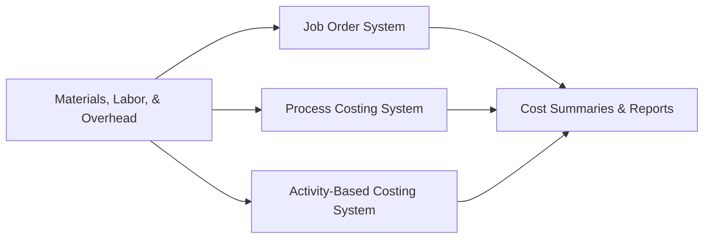

## 5.2 Cost Accumulation Systems (Job Order, Process, ABC)

Effective cost accumulation lies at the heart of managerial accounting, enabling organizations to capture and measure production and support costs accurately. This systematized approach informs leadership about the true cost of products or services and fosters better decision making across budgeting, pricing, and performance evaluation. In this section, we will explore the three primary cost accumulation systems encountered in practice:

• Job Order Costing  
• Process Costing  
• Activity-Based Costing (ABC)

We will illustrate their unique attributes, short implementation scenarios, and discuss how cost data under each system can be leveraged for budgeting strategies and performance assessments.

--------------------------------------------------------------------------------
### The Importance of Cost Accumulation Systems
Cost accumulation systems empower companies to:

• Determine accurate product or service costs  
• Support detailed budgeting and forecasting  
• Strengthen performance evaluation  
• Uncover inefficiencies and potential cost reduction opportunities  

Given the significance of managerial decisions based on cost data, it is crucial to choose the right system that aligns with an organization's operations and strategic goals.  

--------------------------------------------------------------------------------
### Job Order Costing
Job Order Costing assigns costs to specific jobs, batches, or unique customer orders. This method is effective when products or services are highly customized or produced in distinct batches.

#### Core Characteristics
• Costs are tracked separately for each job or batch.  
• Suitable for service firms (e.g., consulting, auditing) and manufacturing custom products (e.g., specialized machinery).  
• Direct materials and direct labor are traced to each job; manufacturing overhead costs are allocated with a predetermined rate or activity base.  

#### Steps in Job Order Costing
1. Production or service starts with a specific customer order.  
2. The accounting team prepares a job cost sheet for direct costs (materials and labor) and applies overhead using a chosen driver.  
3. On completion, the total job cost is summed and used for final invoicing, profitability analysis, and inventory valuation (if still in inventory).  

#### Short Scenario (Job Order Costing)
Imagine a boutique furniture workshop called Craft Legacy. Each piece is handcrafted to clients’ specifications. Because every table, chair, or bookshelf is unique, the workshop tracks the exact hours and materials spent on each order. The CFO sets an overhead rate based on labor hours. Once an order is complete, managers analyze each job’s profitability and use that data to refine labor estimates and expedite budgeting for subsequent orders.

  
--------------------------------------------------------------------------------
### Process Costing
Process Costing is used where outputs are homogeneous or produced on a continuous flow basis (e.g., chemical processing, paint manufacturing). Instead of tracking costs to specific jobs, costs are assigned to production processes, and costs flow from one process to the next until the finished goods emerge.

#### Core Characteristics
• Tracks total costs by department or process stage rather than by each unit.  
• Suitable for industries that produce similar (or identical) products in large volumes (e.g., oil refineries, snack food manufacturing).  
• Common to use equivalent units of production (EUP) to measure partial completions at period-end.  

#### Steps in Process Costing
1. Identify production processes or departments (e.g., mixing, molding, packaging).  
2. Assign direct materials, labor, and overhead to each process based on usage.  
3. Compute equivalent units for partially finished products.  
4. Calculate cost per unit by process.  
5. Transfer costs to the next process or to finished goods inventory upon completion.  

#### Short Scenario (Process Costing)
Consider Rainbow Paint Co., which produces high-volume batches of interior paint. The production cycle involves color blending, then filling, and finally packaging. Each department accumulates costs for materials (pigments, solvents), labor (operators), and overhead (factory utilities). At the end of each period, costs are divided by the equivalent units processed to determine the per-gallon paint cost. Managers leverage this data to evaluate departmental performance and adjust budgets for raw materials procurement and labor scheduling.

  
--------------------------------------------------------------------------------
### Activity-Based Costing (ABC)
Activity-Based Costing refines cost allocations by focusing on activities that drive resource consumption. Rather than applying overhead using a single blanket rate (e.g., per labor hour), ABC pinpoints multiple cost drivers to allocate indirect costs more precisely.

#### Core Characteristics
• Identifies various activities (e.g., machine setups, quality inspections) as cost pools.  
• Allocates costs from each cost pool to products or services based on consumption of activities (cost drivers).  
• Suitable for complex production environments, multiple product lines, or service industries where overhead is a significant portion of total costs.  

#### Steps in ABC
1. Identify key activities and group them into cost pools (e.g., machine setup pool, maintenance pool).  
2. Assign overhead to these activity cost pools.  
3. Determine activity cost drivers (e.g., number of setups, maintenance hours).  
4. Compute overhead rates for each pool.  
5. Allocate overhead to products, services, or customers based on their utilization of each activity.  

#### Short Scenario (ABC)
A technology support company, TechOne Solutions, has several service lines: basic troubleshooting, custom integrations, and advanced IT consulting. Using a single overhead rate based on labor hours proved inaccurate, as advanced consulting consumed more specialized tools and external experts. By shifting to ABC, TechOne assigned overhead based on distinct cost drivers, ranging from the number of project reviews required to the software licensing costs. This approach provided more accurate service costing and revealed that advanced IT consulting was actually more profitable than previously reported under a single-rate approach.

  
--------------------------------------------------------------------------------
### Comparative Overview

The following Mermaid.js diagram illustrates the flow of cost inputs (materials, labor, overhead) through each costing method, emphasizing how costs are gathered and summarized before they are ultimately used for analyses such as budgeting and performance evaluation:

• Job Order Costing emphasizes unique jobs, with a specific job cost sheet.  
• Process Costing accumulates costs by process/department for standardized products.  
• ABC focuses on activities and multiple drivers for greater accuracy.

  
--------------------------------------------------------------------------------
### Using Cost Data for Budgeting
Accurate cost data is an essential ingredient for constructing budgets—both for single-period forecasts and long-term strategic plans. Depending on the cost system, budgeting approaches might differ:

• Under Job Order Costing, historical job cost sheets can guide pricing decisions, future job bids, and resource allocations based on past cost experiences.  
• In Process Costing, managers prepare production and materials budgets using average (or per-unit) data from production runs. Budgeting can incorporate departmental cost benchmarks and expected production volumes.  
• ABC provides granular insights into activity costs, enabling more agile budgeting. High-cost activities may be scaled back if deemed non-value adding, or reengineered for efficiency.  

#### Example – Budgeting with ABC
If an electronics manufacturer discovers through ABC that product inspections (a single activity) represent a large portion of overhead, management might invest in automated testing equipment during the capital budgeting phase (see Chapter 8: Risk Assessment and Prospective Analysis). This decision not only could reduce inspection costs, but also free up skilled labor for more value-added tasks.

  
--------------------------------------------------------------------------------
### Performance Evaluation and Control
Beyond budgeting, cost information under each system supports robust performance evaluation. By comparing actual vs. budgeted costs, managers can pinpoint variances, investigate anomalies, and implement corrective actions.

• Job Order Costing: Evaluate profitability of individual jobs, enabling deeper insights into labor effectiveness or material overages.  
• Process Costing: Compare departmental performance and identify inefficiencies in multi-step production flows.  
• ABC: Track high-cost activities, measure process efficiency, and align resource usage with strategic priorities.  

#### Scenario – Performance Review with Job Order Costing
A custom software development firm updates its overhead allocation rate each quarter. After a project finishes, the difference between actual overhead and allocated overhead is tracked. If variances are consistently high for certain types of projects (e.g., e-commerce development), the firm reevaluates bidding strategies or invests in more efficient technologies to reduce overhead consumption.

  
--------------------------------------------------------------------------------
### Short Implementation Scenarios

Below are concise scenarios illustrating how choice of cost accumulation system directly impacts managerial decisions:

• A manufacturer of precision medical devices (small batches, customized features) adopts Job Order Costing to price accurately and minimize waste.  
• A large-scale paper mill uses Process Costing for standardized production—enabling them to compute cost-per-roll consistently and track department efficiency.  
• A diversified consumer electronics company embraces ABC to handle overhead complexities across multiple product lines, driving data-informed decisions on product mix and capacity planning.

  
--------------------------------------------------------------------------------
### Best Practices and Common Pitfalls
**Best Practices**  
• Align the costing system with the business model and complexity of operations.  
• Regularly review overhead allocation bases to ensure accuracy.  
• Involve cross-functional teams (e.g., production managers, cost accountants, IT) to capture reliable data.  
• Periodically reexamine cost drivers under ABC, as business processes and market demands evolve.  

**Common Pitfalls**  
• Underestimating implementation complexity for ABC (requires substantial data collection).  
• Clinging to a single overhead rate in a diversified production environment—leading to distorted product costs.  
• Not updating or calibrating overhead rates frequently enough to reflect operational changes.  
• Overlooking the importance of timely cost data, thus reducing its relevance for real-time decision making.

  
--------------------------------------------------------------------------------
### Additional References
• Horngren, C. T., Datar, S. M., & Rajan, M. V. (2021). Cost Accounting: A Managerial Emphasis.  
• Kaplan, R. S., & Cooper, R. (1998). Cost & Effect: Using Integrated Cost Systems to Drive Profitability.  
• For a deeper dive on allocating overhead and analyzing variances, see Chapter 5.3: Variance Analysis.  
• For insights into leveraging cost data for forecasting, reference Chapter 7: Budgeting and Forecasting.

  
--------------------------------------------------------------------------------
## Quiz: Cost Accumulation Systems



### Which costing system is most suitable for a company producing custom luxury yachts?

- [ ] Process Costing
- [x] Job Order Costing
- [ ] Activity-Based Costing
- [ ] Variable Costing

> **Explanation:** Custom yacht manufacturing involves unique orders and specific resource usage per yacht, making Job Order Costing the preferred method.

### In Process Costing, which concept is used to measure partially completed units at the end of the period?

- [ ] Conversion cost variance
- [x] Equivalent units of production (EUP)
- [ ] Standard units of measurement
- [ ] Variance-based throughput units

> **Explanation:** Equivalent units of production (EUP) allow managers to account for the degree of completion in partially finished products at period-end.

### What is a key advantage of Activity-Based Costing (ABC) over traditional overhead allocation methods?

- [ ] It always reduces overall costs
- [x] It assigns indirect costs more accurately by using multiple cost drivers
- [ ] It eliminates the need for direct material tracing
- [ ] It standardizes budget processes across departments

> **Explanation:** ABC refines overhead allocation by utilizing multiple cost drivers that capture underlying activities, resulting in more precise cost attribution.

### Under Job Order Costing, overhead is most commonly applied to jobs using:

- [ ] Process hours
- [x] A predetermined overhead rate
- [ ] Operating cash flows
- [ ] Comprehensive market data

> **Explanation:** Organizations typically use a predetermined overhead rate (e.g., based on labor hours or machine hours) to allocate overhead to specific job cost sheets.

### Which statement best describes a disadvantage of Process Costing?

- [ ] It results in overly detailed cost information.
- [x] It may obscure costs incurred by individual units since costs are averaged across all units.
- [ ] It does not allow for overhead allocation.
- [ ] It can only be used in job shops.

> **Explanation:** Process Costing allocates total process costs evenly across units, which can mask the specifics of cost variations between individual units.

### Which of the following would be considered an activity cost driver in an ABC system?

- [x] Number of machine setups
- [ ] Total sales revenue
- [ ] Direct labor hours only
- [ ] Units produced, regardless of complexity

> **Explanation:** Machine setups typically differ among product lines, creating a unique activity driver for overhead distribution in ABC.

### How can cost data from Job Order Costing be leveraged in performance evaluations?

- [x] Comparing actual job costs to budgeted figures for specific jobs
- [ ] Only by measuring batch-level overhead rates
- [x] By analyzing patterns of cost overruns for repeated job designs
- [ ] Solely by focusing on labor variances

> **Explanation:** By comparing actual to budgeted costs and analyzing repeated designs, managers can identify inefficiencies and improve future performance.

### A cereal manufacturing company uses Process Costing. What is the most relevant data for managers to track performance?

- [x] Cost per equivalent unit of production at each stage
- [ ] Overhead applied to each specific order
- [ ] Client-level profit margin on each package
- [ ] Time-driven ABC analysis

> **Explanation:** Process Costing relies on per-unit measures (e.g., cost per equivalent unit of production) at each production stage to gauge efficiency and cost trends.

### Which scenario most strongly indicates a need to shift from a single overhead rate to Activity-Based Costing?

- [x] Multiple product lines with significantly different consumption of resources
- [ ] A small, family-run store that sells one product
- [ ] A stable production process with near-identical products
- [ ] A straightforward process with negligible indirect costs

> **Explanation:** When multiple product lines consume various resources at different rates, a single overhead rate risks cost distortion, making ABC more advantageous.

### The main goal of cost accumulation is to provide accurate data for managerial decisions.

- [x] True
- [ ] False

> **Explanation:** Cost accumulation systems exist to provide managers with relevant, reliable cost information used for pricing, budgeting, and performance evaluations.



--------------------------------------------------------------------------------
## For Additional Practice and Deeper Preparation

### [Business Analysis and Reporting (BAR) CPA Mock Exams](https://www.udemy.com/course/bar-cpa-mock-exams/?referralCode=ADBE2E84BEE9CB6243CA)

**Business Analysis and Reporting (BAR) CPA Mocks:** 6 Full (1,500 Qs), Harder Than Real! In-Depth & Clear. Crush With Confidence!

- Tackle full-length mock exams designed to mirror real BAR questions.  
- Refine your exam-day strategies with detailed, step-by-step solutions for every scenario.  
- Explore in-depth rationales that reinforce higher-level concepts, giving you an edge on test day.  
- Boost confidence and minimize anxiety by mastering every corner of the BAR blueprint.  
- Perfect for those seeking exceptionally hard mocks and real-world readiness.  

_Disclaimer: This course is not endorsed by or affiliated with the AICPA, NASBA, or any official CPA Examination authority. All content is for educational and preparatory purposes only._
