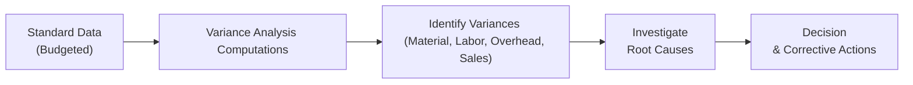

## 5.3 Variance Analysis (Material, Labor, Overhead, Sales)

Variance analysis is one of the most powerful tools in managerial and cost accounting, providing insights into how well an organization is executing its financial and operational plans. By examining variances between standard (or budgeted) costs and actual costs, management can identify the root causes of deviations, improve efficiency, and refine future planning. This section addresses the main categories of variances: material, labor, overhead, and sales, and demonstrates how each contributes to overall profitability and performance. Though the size and complexity of your organization will shape the exact form of variance analysis, the underlying principles remain fundamentally the same.

Organizations use standard costs (or budgeted costs) as benchmarks for evaluating performance. These benchmarks are typically derived from historical data, industry standards, or engineering specifications. Once actual results are measured, the difference between the actual outcome and the standard (the “variance”) indicates whether performance is above or below expectations. For professionals in cost management or business analysis, understanding variance analysis is a key component of effectively assessing both short-term operational efficiency and long-term strategic performance.

Below, we will explore the main categories of variances in detail, present computational approaches, explain common reasons for deviations, and illustrate real-world applications. By the end of this section, you will have a thorough understanding of how to compute, interpret, and leverage variance analysis in various organizational contexts.

---

## Understanding the Purpose of Variance Analysis

Variance analysis serves multiple objectives, including:

• Identifying areas of inefficiency and potential cost overruns.  
• Detecting and explaining deviations from planned or standard costs.  
• Offering insights into operational controls and resource utilization.  
• Providing a framework for continuous improvement and cost containment.  
• Guiding management in strategic decisions for resource allocation, pricing, and process redesign.  

By breaking down total variances into more specific subvariances, management can laser-target issues—whether it’s a price spike in raw materials, a drop in worker productivity, unexpected overhead expenditure, or a dip in sales volume.

---

## Types of Variances at a Glance

When discussing variance analysis, four broad categories regularly surface:

1) Material Variances  
2) Labor Variances  
3) Overhead Variances (both variable and fixed)  
4) Sales Variances  

Each variance illustrates a different dimension of the organization's operational performance. In practice, variance analysis might be supplemented by advanced data analytics, giving a deeper perspective on trends, patterns, and correlations.

Below is a simple flowchart illustrating how standard inputs flow into the variance analysis framework:

Companies typically cycle through this process repeatedly. By regularly computing variances, investigating root causes, and implementing corrective measures, they continuously refine their operations.

---

## Material Variances

Material variances measure whether the organization’s material costs align with expectations. They typically break down into two major categories:

• Material Price Variance (MPV)  
• Material Quantity (Usage) Variance (MQV)  

### Material Price Variance (MPV)

Material Price Variance examines how disparate the actual purchase price of direct materials is compared to the standard price. The general formula is:


\text{MPV} = (\text{Standard Price} - \text{Actual Price}) \times \text{Actual Quantity Purchased}


• If MPV is favorable (positive), the actual purchase price is lower than the standard price, indicating cost savings.  
• If MPV is unfavorable (negative), the actual purchase price exceeds the standard price, indicating higher-than-expected costs.

Reasons for Material Price Variances may include:  
• Changes in market prices for raw materials.  
• Bulk discounts or supplier negotiations leading to price advantages.  
• Inflationary pressures or currency fluctuations.  
• Shifts in supplier relationships and changes in supplier reliability.

### Material Quantity (Usage) Variance (MQV)

Material Quantity Variance measures how effectively the production process uses materials. The typical formula is:


\text{MQV} = (\text{Standard Quantity Allowed} - \text{Actual Quantity Used}) \times \text{Standard Price}


• If MQV is favorable, the actual usage of materials was less than the standard required, suggesting efficient usage.  
• If MQV is unfavorable, actual usage exceeded the standard.  

Reasons for Material Usage Variances may include:  
• Production inefficiencies, such as equipment malfunctions or poor worker training.  
• High wastage or scrap due to inferior quality materials.  
• Improved design or process changes that lower or raise material needs.  
• Mistakes in setting unrealistic (or outdated) standard consumption estimates.

#### Practical Example – Material Variances

Suppose a company’s standard cost for plastic resin is $2 per lb., and each unit of product requires 3 lbs. (so $6 standard direct material cost per unit). In the current month:

• The company purchased 10,000 lbs. of resin at an actual price of $1.90 per lb.  
• Only 9,500 lbs. were actually used, producing 3,100 units of the finished product.  

Let’s compute the variances:

1) Standard Price (SP) = $2.00 per lb.  
   Actual Price (AP) = $1.90 per lb.  
   Actual Quantity Purchased (AQP) = 10,000 lbs.  

   MPV = (SP – AP) × AQP  
   = ($2.00 – $1.90) × 10,000 = $1,000 favorable  

2) Standard Quantity Allowed (SQA):  
   Given each unit requires 3 lbs., total standard quantity for 3,100 units = 3 × 3,100 = 9,300 lbs.  

   Actual Quantity Used (AQU) = 9,500 lbs.  
   Standard Price (SP) = $2.00 per lb.  

   MQV = (SQA – AQU) × SP  
   = (9,300 – 9,500) × $2.00 = –$400 unfavorable  

Hence, the total material cost variance is $600 favorable (the net of +$1,000 MPV and –$400 MQV).

---

## Labor Variances

Labor variances generally reflect how well labor costs align with the budget. Similar to material variances, labor variances split into two subcomponents:

• Labor Rate Variance (LRV)  
• Labor Efficiency (Usage) Variance (LEV)  

### Labor Rate Variance (LRV)

Labor Rate Variance addresses differences between the standard hourly wage rate and the actual hourly wage rate paid:


\text{LRV} = (\text{Standard Rate} - \text{Actual Rate}) \times \text{Actual Hours Worked}


• A favorable labor rate variance occurs if the actual rate is lower than the standard rate.  
• An unfavorable labor rate variance arises if the actual rate exceeds the standard rate.

Factors leading to a Labor Rate Variance might include:  
• Changes in wage rates due to overtime, skill level requirements, or labor market conditions.  
• Misallocation of labor resources (e.g., using higher-skilled workers for tasks that don’t require that skillset).  
• Union negotiations that differ from initial projections.

### Labor Efficiency (Usage) Variance (LEV)

Labor Efficiency Variance measures how effectively the workforce uses its time compared to standard expectations:


\text{LEV} = (\text{Standard Hours Allowed} - \text{Actual Hours Worked}) \times \text{Standard Rate}


• If favorable, workers used less time than budgeted for a given level of production.  
• If unfavorable, workers took more time than anticipated.  

Possible reasons for Labor Efficiency Variances can be:  
• Technology improvements or better training reducing the required labor hours.  
• Equipment breakdowns or suboptimal scheduling increasing required labor hours.  
• High labor turnover causing inefficiencies in training new hires.  
• Overly strict or unrealistic labor standards.

---

## Overhead Variances

Overhead variances can be more complicated because overhead costs include both fixed and variable components, each driven by different factors. Typically, overhead variance analysis splits into two main tracks:

1) Variable Overhead Variances  
2) Fixed Overhead Variances  

### Variable Overhead Variance

Common subvariances include:

• Variable Overhead Spending Variance  
• Variable Overhead Efficiency Variance  

Key cost drivers (e.g., machine hours, direct labor hours, or a combination) determine how variable overhead is applied.  

#### Variable Overhead Spending Variance  
This variance focuses on the difference between the actual variable overhead rate and the standard rate.  


\text{Variable Overhead Spending Variance} 
= (\text{Standard VOH Rate} - \text{Actual VOH Rate}) \times \text{Actual Hours}


#### Variable Overhead Efficiency Variance  
This variance captures how efficiently the cost driver (such as machine hours) is used relative to standard.  


\text{Variable Overhead Efficiency Variance} 
= (\text{Standard Hours Allowed} - \text{Actual Hours}) \times \text{Standard VOH Rate}


### Fixed Overhead Variance

With fixed overhead, the most common subvariances are:

• Fixed Overhead Budget (Spending) Variance  
• Fixed Overhead Volume Variance  

#### Fixed Overhead Budget (Spending) Variance  
This indicates if the actual fixed overhead cost differs from the budgeted amount:


\text{Fixed Overhead Budget Variance} 
= \text{Budgeted Fixed Overhead} - \text{Actual Fixed Overhead}


#### Fixed Overhead Volume Variance  
Sometimes called the “denominator variance,” the volume variance shows how well you spread your fixed costs over the actual production volume compared to what was planned:


\text{Fixed Overhead Volume Variance} 
= (\text{Standard Hours Allowed for Actual Output} \times \text{Fixed Overhead Rate}) - \text{Budgeted Fixed Overhead}


A high production volume usually leads to a favorable fixed overhead volume variance because overhead is spread over more units. Conversely, lower-than-expected production volume concentrates fixed costs over fewer units, creating an unfavorable variance.

---

## Sales Variances

Sales variances measure how actual revenue compares with the expected (standard or budgeted) revenue. While not always grouped with cost variances, understanding sales variances is crucial for a holistic view of performance. Common breakdowns include:

• Sales Price Variance  
• Sales Volume Variance  

### Sales Price Variance


\text{Sales Price Variance} 
= (\text{Actual Selling Price} - \text{Budgeted Selling Price}) \times \text{Actual Units Sold}


• If the actual price is above the budgeted price, the variance is favorable.  
• If the actual price falls short of the budgeted price, the variance is unfavorable.

### Sales Volume Variance


\text{Sales Volume Variance} 
= (\text{Actual Units Sold} - \text{Budgeted Units}) \times \text{Budgeted Contribution Margin per Unit}


• If actual units sold exceed the budget, it’s typically favorable.  
• If actual units sold fall below the budget, it’s unfavorable.

---

## Common Causes of Variances

While each variance has specific drivers, some broad issues typically underlie most variances:

• **Market Conditions** – Price fluctuations in raw materials, labor markets, and overhead components.  
• **Operational Inefficiencies** – Downtime, inadequate training, and suboptimal processes.  
• **Budgeting/Standard Setting Errors** – Overly optimistic or conservative forecasts, outdated standard data, or methodological flaws.  
• **Quality Matters** – Poor material or labor quality can lead to rework, wastage, and overruns.  
• **External Factors** – Regulatory changes, force majeure events, or sudden shifts in consumer demand.  

Effective variance analysis involves looking beyond the numbers to the root causes. Often, an unfavorable variance is a symptom of a deeper problem that requires cross-departmental collaboration to resolve.

---

## Real-World Applications and Importance

### 1. Strategic Cost Management
Companies use variance analysis to refine product costing and pricing strategies. For example, an automobile manufacturer might adjust supplier contracts if persistent unfavorable material price variances arise from steel or aluminum cost increases.

### 2. Performance Evaluation
Variance analysis can shape employee performance appraisals. Managers whose departments record favorable variances are often rewarded, while unfavorable variances trigger investigation into managerial processes.

### 3. Forecasting and Budget Adjustments
Armed with variance data, companies may rework budgets more dynamically. If persistent unfavorable labor variances arise from overtime, management can decide whether to hire additional staff or invest in automation.

### 4. Resource Allocation
Directors and executives rely on variance reports to allocate resources effectively. If overhead variances point to a poorly maintained machine, the solution might be new capital investments or outsourcing certain production stages.

### 5. Data-Driven Insights
Modern business intelligence tools integrate cost accounting, ERP systems, and big data. Automated variance analysis dashboards can signal red flags or anomalies early, facilitating proactive solutions.

---

## Using Data Analytics in Variance Analysis

Accounting functions increasingly rely on data analytics to slice and dice variance metrics in real time. For instance:

• **Trend Analysis**: Evaluate variances over multiple periods to spot cyclical patterns, such as seasonal cost fluctuations.  
• **Benchmarking**: Compare variances across different plants, departments, or even third-party data sets to identify best practices.  
• **Predictive Modeling**: Machine learning algorithms might forecast potential unfavorable variances, enabling preemptive action.  

By visualizing data, organizations can quickly identify outliers or correlations. For example, a heatmap might show which product lines regularly exceed standard material usage due to design inefficiencies.

---

## Sample Calculation: Integrative Variance Example

Consider a manufacturer that produces 1,000 units of its product in a given period. The standard costs and selling price are:

• Standard direct material cost: 4 lbs. per unit × $5/lb. = $20 per unit  
• Standard direct labor cost: 2 hours per unit × $15/hour = $30 per unit  
• Standard overhead cost: 2 machine hours (MH) per unit × $4 per MH (variable) + $12,000 monthly fixed overhead planned (based on 1,000 units)  
• Standard selling price: $80 per unit  

Assume the actual results for the period are:

• Direct material used: 4,200 lbs. at $5.20/lb.  
• Direct labor: 1,820 hours at $16/hour  
• Variable overhead: $7,300 total (based on the same 1,820 machine hours used)  
• Fixed overhead: $13,000 total  
• Actual units sold: 1,050 units at an average selling price of $78 per unit  

You would compute:

1) Material Price Variance:  
   MPV = (SP – AP) × AQp  
   = ($5.00 – $5.20) × 4,200 = –$840 unfavorable  

2) Material Quantity Variance:  
   SQA = 4.0 lbs./unit × 1,000 units = 4,000 lbs.  
   MQV = (SQA – AQU) × SP  
   = (4,000 – 4,200) × $5.00 = –$1,000 unfavorable  

3) Labor Rate Variance:  
   LRV = (SR – AR) × AH  
   = ($15 – $16) × 1,820 = –$1,820 unfavorable  

4) Labor Efficiency Variance:  
   SHA = 2.0 hr./unit × 1,000 units = 2,000 hours  
   LEV = (SHA – AH) × SR  
   = (2,000 – 1,820) × $15 = +$2,700 favorable  

5) Variable Overhead Spending Variance:  
   Standard VOH = $4 per MH  
   Actual VOH Rate = $7,300 / 1,820 MH = $4.01 per MH (approx.)  
   Spending Variance = (Standard Rate – Actual Rate) × Actual MH  
   = ($4.00 – $4.01) × 1,820 = –$18.20 unfavorable (approx.)  

6) Variable Overhead Efficiency Variance:  
   Standard MH Allowed = 2.0 MH × 1,000 units = 2,000 MH  
   Efficiency Variance = (SHA – AH) × Standard VOH Rate  
   = (2,000 – 1,820) × $4.00 = +$720 favorable  

7) Fixed Overhead Budget (Spending) Variance:  
   = Budgeted FOH – Actual FOH  
   = $12,000 – $13,000 = –$1,000 unfavorable  

8) Fixed Overhead Volume Variance (based on planned 1,000 units):  
   The simplest approach is direct: (Actual production – Budgeted production) × FOH rate per unit.  
   Because we produced 1,000units (the same as budgeted), the volume variance relative to production is $0.  
   (If we had used standard hours for actual production, it might differ if there were different outputs. In this example, volume variance is zero from the perspective of production alone. However, if you measure output as 1,050 units sold, there might be an alternate approach for volume variance based on how overhead is allocated.)

9) Sales Price Variance:  
   SPV = (Actual Price – Budgeted Price) × Actual Units Sold  
   = ($78 – $80) × 1,050 = –$2,100 unfavorable  

10) Sales Volume Variance (often computed with budgeted contribution margin):  
    Let’s assume a standard contribution margin of $30 per unit (given standard cost is $50, standard price is $80).  
    = (Actual Units – Budgeted Units) × Budgeted Contribution Margin per Unit  
    = (1,050 – 1,000) × $30 = +$1,500 favorable  

By dissecting these numbers, you can see interplay between price, usage, and efficiency, allowing management to focus on big-ticket items—like the labor rate and material usage issues—and decide whether changes to processes, suppliers, or workforce policies are required.

---

## Best Practices and Strategies

• **Set Realistic Standards**: Overly strict or lax standards can lead to meaningless variances. Updating standards periodically ensures alignment with operational reality.  
• **Focus on Material Variances in High-Cost Items**: Pinpoint the items that carry the largest cost share for your products; small percentage changes can significantly sway margins.  
• **Investigate Significant Deviations**: Not all variances warrant detailed investigation, particularly if small or infrequent. Focus on significant or repetitive variances.  
• **Use Data Visualization**: Charts and dashboards can help communicate variance trends to non-accounting stakeholders, ensuring faster, more strategic responses.  
• **Coordinate Across Functional Areas**: Purchasing, production, and sales teams must collaborate to understand and address root causes.  

---

## Conclusion

Variance analysis stands as a cornerstone of managerial and cost accounting, illuminating the gap between expectations and actual outcomes in the domains of materials, labor, overhead, and sales. By investigating the underlying causes, organizations can address inefficiencies, adjust strategies, and use data-driven insights to boost overall performance. Though powerful, variance analysis is only as effective as the standards used, the thoroughness of investigations, and the timeliness of management responses. Coupled with modern analytics and effective cross-functional collaboration, variance analysis equips businesses to thrive in dynamic market conditions.

---

## Test Your Knowledge: Variance Analysis Essentials Quiz



### Which of the following best describes the purpose of variance analysis in managerial accounting?

- [x] It identifies and investigates differences between actual results and budgeted figures to improve efficiency.
- [ ] It is used solely for external financial reporting to comply with GAAP.
- [ ] It measures only the price deviations of direct materials.
- [ ] It is a process reserved for large multinational corporations.

> **Explanation:** Variance analysis helps organizations identify and investigate the root causes of differences between actual and standard (budgeted) costs or revenues, thereby guiding improvements in operations and resource allocation.  

### Which formula best represents the Material Price Variance (MPV)?

- [ ] (Actual Quantity – Standard Quantity) × Standard Price
- [x] (Standard Price – Actual Price) × Actual Quantity
- [ ] (Actual Quantity – Standard Quantity) × Actual Price
- [ ] (Standard Price – Actual Price) ÷ Actual Quantity

> **Explanation:** MPV specifically captures the difference in price multiplied by the actual quantity of materials purchased.  

### A labor efficiency variance is generally impacted by which factor?

- [x] The number of hours worked compared to the standard hours allowed for the output produced.
- [ ] The union-negotiated differentials in hourly wages.
- [ ] The amount of overtime pay in the total wage bill.
- [ ] The capital structure of the organization.

> **Explanation:** Labor efficiency variance pertains to the difference between actual hours and standard hours, reflecting how efficiently labor is utilized (not the wage rate itself).  

### A favorable material usage variance could result from:

- [x] Efficient production methods leading to lower-than-expected raw material usage.
- [ ] Purchasing lower-quality raw materials that cause rework.
- [ ] Substantial overtime for workers.
- [ ] Inaccurately high standard quantities in the budget.

> **Explanation:** A favorable usage variance often indicates either heightened production efficiency or reliance on higher-quality materials that yield less scrap or waste.  

### If the standard direct labor rate is $20/hour, and workers are actually paid $22/hour, the labor rate variance:

- [x] Is likely unfavorable if the same number of hours are worked.
- [ ] May be favorable if workers also produce more units.
- [x] Could be partially offset by a favorable labor efficiency variance.
- [ ] Is never offset by any other variance.

> **Explanation:** Paying a higher hourly rate typically creates an unfavorable labor rate variance; however, it may be indirectly offset if the workforce is more skilled and completes the job in fewer hours, resulting in a favorable labor efficiency variance.  

### Why might overhead variance analysis be more complex than direct material or direct labor variance analysis?

- [x] Overhead includes both variable and fixed components with different cost drivers.
- [ ] Overhead is always immaterial to total production costs.
- [ ] Overhead rates and costs never change.
- [ ] Overhead is determined solely by direct labor hours.

> **Explanation:** Overhead variance analysis is often more nuanced because it requires separating variable from fixed overhead costs, each with unique drivers and potential variances.  

### A company encounters a persistent, significant unfavorable materials usage variance over multiple periods. Which is the best next step?

- [x] Investigate whether machines, processes, or materials are causing excessive waste.
- [ ] Ignore it—small fluctuations are typical in manufacturing.
- [x] Evaluate if material quality or labor skills are below standard expectations.
- [ ] Simply increase production targets to spread material costs.

> **Explanation:** Repeated unfavorable usage variances suggest systemic inefficiencies in production processes, poor material quality, or insufficient worker training.  

### In sales variance analysis, which item is important to measure but is not typically part of cost variance analysis?

- [x] Differences in actual selling price versus budgeted selling price.
- [ ] Differences in fixed overhead rates versus actual overhead rates.
- [ ] Differences in direct labor rates versus standard labor rates.
- [ ] Differences in total overhead applied versus total overhead budgeted.

> **Explanation:** Sales variance analysis includes the comparison between the actual selling price and the budgeted selling price, a factor not captured in direct cost variance analysis.  

### Which of the following might cause a favorable fixed overhead volume variance?

- [x] Producing more units than budgeted, spreading fixed costs over additional output.
- [ ] Lower actual overhead spending than budgeted.
- [ ] A reduction in material price.
- [ ] Reduced labor hours per unit.

> **Explanation:** When a company produces more than the budgeted volume, fixed overhead costs are spread across a larger number of units, often causing a favorable volume variance.  

### A higher-than-expected demand leads to actual sales 20% above budget, which is likely to produce a(n):

- [x] True
- [ ] False

> **Explanation:** Surpassing budgeted sales volumes usually results in a favorable sales volume variance, given that more units sold brings in higher revenue (assuming contribution margin remains consistent).  



---

## For Additional Practice and Deeper Preparation

### [Business Analysis and Reporting (BAR) CPA Mock Exams](https://www.udemy.com/course/bar-cpa-mock-exams/?referralCode=ADBE2E84BEE9CB6243CA)

**Business Analysis and Reporting (BAR) CPA Mocks:** 6 Full (1,500 Qs), Harder Than Real! In-Depth & Clear. Crush With Confidence!

- Tackle full-length mock exams designed to mirror real BAR questions.  
- Refine your exam-day strategies with detailed, step-by-step solutions for every scenario.  
- Explore in-depth rationales that reinforce higher-level concepts, giving you an edge on test day.  
- Boost confidence and minimize anxiety by mastering every corner of the BAR blueprint.  
- Perfect for those seeking exceptionally hard mocks and real-world readiness.  

_Disclaimer: This course is not endorsed by or affiliated with the AICPA, NASBA, or any official CPA Examination authority. All content is for educational and preparatory purposes only._
