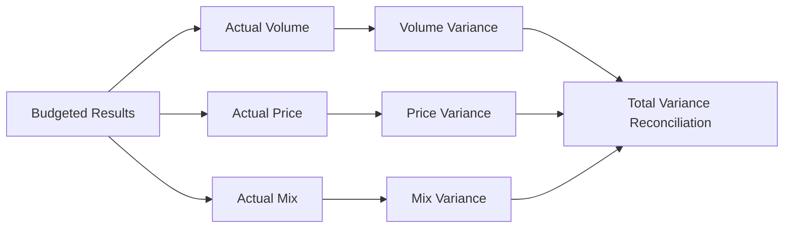

## 5.4 Volume, Price, and Mix Effects

Effectively managing and analyzing volume, price, and mix effects allows businesses to understand how individual factors contribute to overall financial performance. Each factor—volume (quantity sold), price (selling price per unit), and mix (proportional distribution between products or services)—exerts a distinct impact on revenue, cost, and profitability. By decomposing variances into these components, managers can pinpoint drivers of performance and make strategic decisions grounded in accurate, data-driven insights. This process is integral to operational planning, budgeting, and broader managerial and cost accounting functions.

Drawing from the foundational topics discussed in Section 5.1 (Cost Classifications) and Section 5.3 (Variance Analysis), a deep understanding of volume, price, and mix effects can illuminate areas where organizations may need to optimize production, adjust prices, manage product lines, or pivot in response to market demands. This section breaks down these effects, contextualizes them with illustrative examples, and offers best practices for incorporating variance analysis into managerial decisions.

---

## Why Volume, Price, and Mix Analysis Matters

Traditional variance analysis in managerial accounting often focuses on differences between actual and budgeted results. While this is useful, dissecting these differences further into their constituent parts—volume, price, and mix—helps uncover more actionable insights:

• Volume: Analyzing how changes in quantity sold (or produced) impact total revenue and profit.  
• Price: Investigating how deviations from planned or standard selling prices contribute to revenue variances.  
• Mix: Understanding shifts in the ratios of different products or services sold, each of which might have distinct margins, costs, and demand patterns.

By isolating these components, managers and CPAs can see precisely what drives any gap between actual and expected performance. This fosters more targeted improvements, whether it be adjusting inventory levels, rethinking pricing strategies, or rebalancing the product portfolio.

---

## Understanding Volume Variances

Volume variance measures how the change in the number of units sold or produced affects revenue and profitability. If your actual sales volume surpasses expectations, you generate a favorable variance (all else being equal). Conversely, selling fewer units than planned typically yields an unfavorable variance. Volume variance can also be extended to production scenarios in manufacturing contexts, focusing on output levels as opposed to just sales.

### Calculating Volume Variances

A simple formula for volume variance in terms of revenue might be:


\text{Volume Variance} = (\text{Actual Quantity} - \text{Budgeted Quantity}) \times \text{Budgeted Price}


This formula focuses on the impact of quantity sold on revenue, holding the budgeted price constant. A positive result indicates that selling more units than budgeted drove revenue above plan, and a negative result indicates fewer units sold than budgeted.  

In more advanced analyses, you could incorporate standard contribution margins rather than price alone, to see how changes in volume affect the bottom line more precisely.

### Example of Volume Variances

Suppose your company budgeted to sell 10,000 units of Product A at a standard price of \$50 per unit—thus expecting revenue of \$500,000. Actual sales turned out to be 12,000 units at the same standard price. Using the formula:


\text{Volume Variance} = (12{,}000 - 10{,}000) \times \$50 = 2{,}000 \times \$50 = \$100{,}000 \quad \text{(Favorable)}


This reveals an additional \$100,000 in revenue purely due to higher volume than anticipated.

### Managerial Considerations for Volume Variances

• Investigate capacity constraints: If volume rises rapidly, ensure production or service capacity is not overextended.  
• Check variable costs: Higher volume leads to increased variable costs (see Section 5.1 on cost classifications).  
• Evaluate demand drivers: Determine why volume surpassed or fell below expectations (e.g., marketing initiatives, market trends, competitor actions).  
• Scenario planning: If volume is uncertain, conduct sensitivity or scenario analyses to fine-tune budgeting and forecasting.

---

## Understanding Price Variances

Price variance isolates the effect of selling price changes from other potential factors. Sometimes referred to as sales price variance, it measures how differences between actual and budgeted selling prices affect revenue or profit.

### Calculating Price Variances

A simple price variance formula is:


\text{Price Variance} = (\text{Actual Price} - \text{Budgeted Price}) \times \text{Actual Quantity}


Here, the actual quantity is used to highlight how changes in price apply to the actual volume of units sold. This helps show the total financial impact purely from pricing deviations.

### Example of Price Variances

Using the same scenario above, assume you budgeted to sell Product A at \$50 but managed an actual price of \$53. Actual units sold remained at 12,000. Then:


\text{Price Variance} = (\$53 - \$50) \times 12{,}000 = \$3 \times 12{,}000 = \$36{,}000 \quad \text{(Favorable)}


This reveals how the difference in sale price alone contributed \$36,000 in additional revenue above the budgeted amount.

### Managerial Considerations for Price Variances

• Monitor market conditions: If your price is higher than budgeted, confirm that this does not negatively affect demand.  
• Competitor pricing: Understand how competitor actions influence your ability to adjust prices.  
• Value proposition: Ensure that higher prices are justifiable through quality, brand differentiation, or additional features.  
• Discounts and promotions: Price variance analysis can help track the success or drawback of promotional activities.

---

## Understanding Mix Effects

Sales mix refers to the composition of your sales across different products, services, or business segments. Even if total volume and average price remain the same, shifting proportions among product lines with different profit margins can significantly influence total profitability.

### Calculating Mix Effects

There are multiple ways to approach mix variance calculations, but one common approach is to compare the actual proportions sold to the budgeted proportions, factoring in each product’s relative weight in the overall portfolio. A simplified version of the sales mix variance formula might look like:


\text{Mix Variance (for each product)}  
= (\text{Actual Mix Percentage} - \text{Budgeted Mix Percentage})  
\times \text{Total Actual Volume} \times \text{Budgeted Contribution Margin per Unit}


By summing up these mix variances across all products, you can see how the entire portfolio’s shift in composition affects profitability. Note that more detailed mix variance techniques exist, incorporating standard contribution margins, standard volumes, or alternative profit metrics.

### Example of Mix Effects

Imagine you sell two products, Product A and Product B. Both are profitable, but Product B has a higher contribution margin. You budgeted an even 50/50 split in sales volume between A and B. However, actual results show that Product B captured 60% of total unit sales. If B’s contribution margin is considerably higher, the overall profit might exceed expectations due solely to the shift in product mix.

### Managerial Considerations for Mix Effects

• Focus on product profitability: When product lines with higher margins capture a greater share of the sales mix, total profit typically improves.  
• Balance promotional efforts: Monitor how marketing campaigns or discounts may inadvertently shift the product mix.  
• Strategic portfolio management: Use product mix analysis to decide which product lines to promote or discontinue, aligning with broader corporate strategies.  
• Inventory considerations: If certain products gain popularity, ensure adequate inventory to avoid stockouts and lost sales.

---

## Integrating Volume, Price, and Mix Analyses

Volume, price, and mix analyses are most insightful when viewed together. Each variance component adds a piece of the puzzle:

• Volume Variance: Reflects the impact of changes in sales or production quantities.  
• Price Variance: Reflects the impact of changes in the selling price of products or services.  
• Mix Variance: Reflects the impact of shifts in the relative composition of the products or services sold.

### Comprehensive Variance Reconciliation

A thorough revenue variance analysis begins with the difference between actual revenue and budgeted revenue, then breaks it down into the three components. The sum of volume variance, price variance, and mix variance should approximate the total difference in revenue (or profit) between actual and budgeted figures. Discrepancies may occur if different cost structures or more nuanced aspects (e.g., exchange rates, freight charges, or returns) are in play.  

Below is an example breakdown of how to reconcile total revenue variance:

• Total Actual Revenue - Total Budgeted Revenue = Overall Revenue Variance.  
• Decompose this variance into three parts: Volume Variance, Price Variance, and Mix Variance.  

In practice, you might further segment the analysis by region, distribution channel, or customer type to pinpoint specific drivers of performance.

---

## Visualizing Volume, Price, and Mix Relationships

A helpful way to visualize the data flow from the initial budget to actual results is with a flowchart. Below is a Mermaid diagram illustrating how organizations move from total budgeted figures all the way to breakouts of volume, price, and mix differences.

In the above flow:

• Start from Budgeted Results.  
• Compare budgeted vs. actual volume, price, and mix.  
• Compute each variance separately.  
• Summarize them to arrive at the total variance.  

This approach helps you confirm if the total revenue or margin variance can be fully explained by each of these three effects. If not, further reconciling factors such as currency translations, unexpected discounts, or returns may need investigation.

---

## Best Practices for Applying Volume, Price, and Mix Analysis

Ensure Data Integrity  
Employ robust data validation to make certain that unit quantities, selling prices, and cost information are accurate. Without reliable data, the best analysis will lead to misinformed decisions.

Drill Down by Segment  
A single, combined variance number for the entire business can obscure important details. Reviewing volume, price, and mix variances by region, departmental unit, or product group can offer powerful insight into root causes.

Consider Timing Differences  
If your fiscal year or quarter crosses seasonal boundaries, interpret volume variance carefully. Seasonal peaks or troughs in demand can lead to fluctuations that differ from “steady-state” operations.

Incorporate Market and Economic Context  
Find out if a favorable volume variance stems from a general market upswing, competitor failures, or internal improvements (e.g., marketing, product optimization, or distribution expansion). Conversely, an unfavorable price variance may be influenced by economic recessions or aggressive competition rather than poor internal pricing.

Use Technology and Automation  
As discussed in Chapter 3 (Data and Analytics), leveraging automated workflows or specialized analytical tools can vastly improve the efficiency and accuracy of variance calculations. Tools that integrate data from multiple sources (e.g., sales, operations, and finance systems) reduce manual errors and provide real-time insights.

Align with Strategic Objectives  
Ultimately, volume, price, and mix variances should inform strategic goals: is the company focusing on premium products (higher margins) or broadening its market share (higher volume)? Do short-term pricing changes align with the brand’s long-term positioning?

---

## Common Pitfalls and Challenges

Overemphasis on One Factor  
Focusing solely on volume, without analyzing price or mix, can lead you astray. For instance, you might drive volume up with heavy discounts that erode your margins, achieving higher sales at the expense of profitability.

Ignoring Interdependencies  
Changes in mix may affect your ability to command certain prices (e.g., premium vs. commodity product lines). Volume changes in one product can drive demand or costs for others in your portfolio, complicating direct variance analysis.

Inaccurate or Outdated Standards  
If your standard cost or budget assumptions are outdated, variance calculations may be misleading. Update these assumptions periodically to maintain relevant benchmarks.

Not Accounting for External Factors  
Global economic shifts, new regulations, and competitor moves all influence volume, price, and mix to varying degrees. A purely internal analysis, ignoring these broader industry or macroeconomic factors, may lead to suboptimal decisions.

---

## Real-World Scenarios and Illustrative Cases

• A tech hardware firm might see an unfavorable volume variance for its flagship device but a favorable mix variance if a higher-margin accessory line gains popularity, boosting overall margin.  
• A pharmaceutical company that releases a new, higher-priced medication could see both a favorable price variance and a favorable mix variance if physicians shift prescriptions from an older, lower-margin drug.  
• A retailer experiences decreased volume due to economic changes, but an unexpected favorable price variance emerges from an improved brand reputation and premium pricing strategy.  

In all cases, analyzing volume, price, and mix cumulatively allows managers to drill deeper into which levers are truly driving or hindering performance. It can guide decisions such as optimizing the product lineup, refining pricing strategies, and marketing investments.

---

## Practical Techniques for Managerial Decision-Making

Combine Variance Analysis with Forecasting  
After identifying variances, feed back any lessons learned into your rolling forecasts or budget planning (discussed in Chapter 7: Budgeting and Forecasting) for continuous improvement.

Conduct “What-If” Analyses  
Experiment with different scenarios:  
• What if volume remains constant but price changes?  
• What if prices remain static but the volume changes?  
• How does the sales mix evolve under each scenario?

Assess Product Life Cycles  
Products in decline might generate fewer sales at a lower price, severely harming contribution margins. Conversely, new or growing products might demand increased investment but offer robust returns. Incorporate product life cycle considerations into your volume, price, and mix analysis.

Coordinate Across Departments  
Collaborate with production, marketing, and supply chain teams to ensure that any shift in volume, price, or product mix is resource-backed. Surpassing volume targets is beneficial only if you can fulfill orders at standard costs and maintain product quality.

Develop Key Metrics  
Identify relevant performance metrics for each driver:  
• Volume KPI: Growth or decline in total units over time.  
• Price KPI: Average selling price per product.  
• Mix KPI: Proportion of high-margin SKUs sold vs. low-margin SKUs.

Tracking these metrics monthly or quarterly helps spot emerging trends and steer decisions promptly.

---

## References and Further Exploration

Below are references and resources to further deepen your knowledge of volume, price, and mix effects:

• Kaplan, R.S., & Atkinson, A.A. (1998). Advanced Management Accounting.  
• Horngren, C., Datar, S., & Rajan, M. (2015). Cost Accounting: A Managerial Emphasis.  
• Institute of Management Accountants (IMA) – Various papers on Business Performance Management.  
• Chapter 7 on Budgeting and Forecasting for examining how variance insights feed into forward-looking financial plans.  
• Chapter 3 on Data and Analytics for understanding advanced analytical tools and real-time analysis.

---

## Mastering Volume, Price, and Mix Effects Quiz



### In variance analysis, which one of the following best describes the concept of volume variance?

- [x] The difference arising due to actual units sold versus budgeted units sold.
- [ ] The difference between standard cost and actual cost per unit.
- [ ] The difference between actual price and budgeted price per unit.
- [ ] The shift in product portfolio proportions that influences total sales.

> **Explanation:** Volume variance isolates the effect of selling more or fewer units than anticipated, ignoring price and mix.

### Which statement about price variance is most accurate?

- [ ] It only applies when actual units sold equal budgeted units sold.
- [x] It measures the financial impact of deviations from the standard or budgeted selling price.
- [ ] It cannot be calculated if there are multiple products in the mix.
- [ ] It is unaffected by promotional discounts or re-pricing initiatives.

> **Explanation:** Price variance specifically measures how deviations in the selling price (relative to the budgeted price) affect total revenue.

### What is the primary driver behind mix variance?

- [x] Shifts in the proportion of different products or services sold.
- [ ] Fluctuations in overall market demand for goods.
- [ ] Changes in manufacturing cost per unit.
- [ ] The total difference between actual and budgeted sales volume.

> **Explanation:** Mix variance reflects changes in the composition of sales across multiple product or service lines, which can significantly affect profitability.

### A favorable volume variance indicates that:

- [x] More units were sold than originally budgeted, potentially increasing revenue.
- [ ] The company is selling each unit at a higher price than budgeted.
- [ ] The cost of producing each unit is lower than expected.
- [ ] A more profitable product line took precedence in sales.

> **Explanation:** A favorable volume variance arises when actual sales quantity exceeds budgeted sales quantity, generally leading to increased revenue (all else being equal).

### When reconciling total sales variance, managers typically look at which three components?

- [x] Volume variance, price variance, and mix variance.
- [ ] Materials variance, labor variance, and overhead variance.
- [ ] Budgeted variance, actual variance, and computed variance.
- [x] Price variance, market variance, and actual variance.

> **Explanation:** The classical three components of sales variance are volume, price, and mix. The listed “materials, labor, and overhead variances” relate to cost variances, not sales variances.  

### What is a potential downside of raising prices to achieve a favorable price variance?

- [x] Decreased sales volume if higher prices reduce customer demand.
- [ ] Lowered profitability if total costs go down.
- [ ] Improved brand reputation leading to unexpected demand increases.
- [ ] Greater synergy with product mix.

> **Explanation:** Higher prices can lead to lower sales volume if customers are unwilling to pay the increased amount, potentially negating the benefit of a higher margin per unit.

### How can an organization benefit from simultaneous volume and price increases?

- [x] By generating more revenue per unit while also selling more units overall.
- [ ] By eliminating product mix concerns.
- [x] By reducing the need for overhead variance analysis.
- [ ] By improving short-term revenue at the expense of long-term growth.

> **Explanation:** Selling higher volumes at higher prices positively impacts revenue multiplicatively, but managers should also consider sustainability and market conditions.

### Which of the following is a best practice when analyzing mix variances?

- [x] Break out data by product line or segment to identify which items drove the variance.
- [ ] Assume a single mix for all budget and actual calculations to simplify the model.
- [ ] Exclude contribution margin calculations from the analysis.
- [ ] Use mix variance solely for planning price changes.

> **Explanation:** Analyzing mix variances by product line or segment provides insight into which products are outperforming or underperforming. Contribution margin is also a critical element in mix variance calculations.

### Which scenario accurately describes a favorable mix variance?

- [x] A higher-margin product line takes a larger share of total sales than budgeted.
- [ ] The average selling price for a lower-margin product increases.
- [ ] Overall sales volume decreases, but total revenue remains unchanged.
- [ ] A discount campaign draws customers away from a high-margin product to a lower-margin product.

> **Explanation:** A product mix that skews toward higher-margin items than budgeted creates a favorable mix variance, boosting overall profitability.

### A company that sees an unfavorable volume variance but a highly favorable mix variance may still:

- [x] Increase overall profitability if the global shift toward higher-margin products offsets reduced volume.
- [ ] Generate less total revenue if prices remain constant.
- [ ] Lose market share and brand credibility regardless of margin.
- [ ] Cancel out all variances in the final reconciliation.

> **Explanation:** Despite lower-than-budgeted overall volume, if the sales mix skews disproportionately toward highly profitable items, the company can still enhance its overall bottom line.



---

## For Additional Practice and Deeper Preparation

### [Business Analysis and Reporting (BAR) CPA Mock Exams](https://www.udemy.com/course/bar-cpa-mock-exams/?referralCode=ADBE2E84BEE9CB6243CA)  

**Business Analysis and Reporting (BAR) CPA Mocks:** 6 Full (1,500 Qs), Harder Than Real! In-Depth & Clear. Crush With Confidence!

- Tackle full-length mock exams designed to mirror real BAR questions.  
- Refine your exam-day strategies with detailed, step-by-step solutions for every scenario.  
- Explore in-depth rationales that reinforce higher-level concepts, giving you an edge on test day.  
- Boost confidence and minimize anxiety by mastering every corner of the BAR blueprint.  
- Perfect for those seeking exceptionally hard mocks and real-world readiness.  

_Disclaimer: This course is not endorsed by or affiliated with the AICPA, NASBA, or any official CPA Examination authority. All content is for educational and preparatory purposes only._
