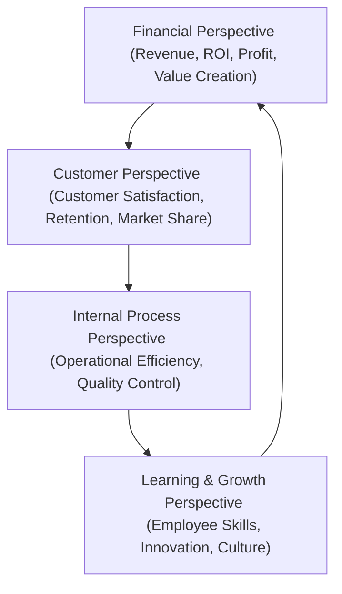
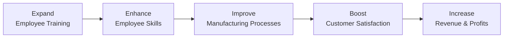

## 6.1 The Balanced Scorecard Approach

The Balanced Scorecard is a strategic performance management system that helps organizations align day-to-day operations with their long-term strategy. Developed by Dr. Robert Kaplan and Dr. David Norton in the early 1990s, the Balanced Scorecard provides a framework to measure performance from multiple perspectives—financial, customer, internal processes, and learning & growth—rather than relying solely on traditional financial metrics. In doing so, it offers a more balanced view of organizational successes and challenges, enabling more precise actions and decisions that drive sustainable value creation.

This section explains how these four perspectives come together, how to define measurable objectives in each area, and how to integrate them into your organization’s strategic planning. We will also illustrate best practices, common pitfalls, and real-world examples to deepen your understanding.

---

### Overview and Significance

The Balanced Scorecard addresses a critical shortfall in many organizations: the overreliance on purely financial measures. While metrics like revenue growth, return on investment (ROI), and earnings per share (EPS) are undeniably important, they often provide a backward-looking and narrowly focused snapshot of performance. Non-financial and forward-looking measures—such as customer satisfaction, process efficiency, and employee engagement—offer a broader and more predictive view of long-term viability.

By systematically incorporating both financial and non-financial indicators, the Balanced Scorecard:

• Aligns individual, departmental, and organizational goals.  
• Builds a cohesive strategy, linking goals and performance measures.  
• Encourages a forward-looking mindset, enhancing decision-making.  
• Spurs continuous improvement through periodic evaluations and adjustments.  

---

### The Four Perspectives of the Balanced Scorecard

In its classic form, the Balanced Scorecard has four perspectives:  
1. Financial  
2. Customer  
3. Internal Process  
4. Learning and Growth  

These perspectives create a multi-dimensional framework. Each perspective influences, and is influenced by, the others, forming a holistic system of metrics and objectives.

In a well-designed Balanced Scorecard, these perspectives form a continuous feedback loop. By reviewing results and adjusting strategies in one perspective, the organization influences performance in the other perspectives.

---

#### 1. Financial Perspective

The Financial perspective measures an organization’s ability to generate value for shareholders (or stakeholders, in nonprofit/government settings). Typical metrics include:

• Net Income, Revenue Growth, or Profit Margins  
• Return on Equity (ROE), Return on Investment (ROI), or Economic Value Added (EVA)  
• Cash Flow and Liquidity Ratios  

These metrics often constitute a “lagging” set of indicators because they reflect performance based on historical data. Nevertheless, they are essential for evaluating the ultimate viability of the business model.

---

#### 2. Customer Perspective

Customer-centric metrics track whether the organization is delivering on its value proposition. Common examples include:

• Net Promoter Score (NPS) or Customer Satisfaction Surveys  
• Market Share in Target Segments  
• Customer Retention Rate or Churn Rate  
• Average Revenue per Customer (ARPC)  

Because customer behavior and preferences can shift rapidly, it is critical to measure these perceptions frequently. The Customer perspective connects the organization’s strategic goals to the end user’s experience and focuses on what it needs to achieve to create and sustain customer loyalty.

---

#### 3. Internal Process Perspective

The Internal Process perspective focuses on how efficiently and effectively the organization performs activities critical to the chosen strategy. Typical key performance indicators (KPIs) include:

• Production Cycle Times or Throughput Rates  
• Defect or Error Rates and Quality Levels  
• Operational Cost per Unit of Production or Service  
• Process Innovation and Optimization Measures  

By monitoring these metrics, management can identify bottlenecks, eliminate inefficiencies, and boost overall productivity. This perspective often intersects with cost accounting for analyzing variance and cost drivers, as discussed in Chapter 5 (Managerial and Cost Accounting Essentials).

---

#### 4. Learning and Growth Perspective

The Learning and Growth perspective recognizes that innovation, employee development, and the corporate culture form the foundation for future success. Indicators here might include:

• Employee Training Hours and Learning Intervention Rates  
• Employee Engagement or Satisfaction Scores  
• Succession Planning and Leadership Development Metrics  
• Research and Development (R&D) Pipeline or Innovation Index  

This perspective underscores the importance of investing in people, culture, and new ideas to maintain a competitive edge. By fostering continuous learning, the organization will have the intellectual capital required to adapt to market shifts.

---

### Implementing the Balanced Scorecard

Implementing the Balanced Scorecard involves more than just picking a few metrics. Each perspective should directly link to the organization’s strategic objectives:

1. Define a Clear Vision and Strategy  
   Senior leadership should articulate the overarching objectives and strategy before diving into which metrics to track. This vision provides the compass for choosing meaningful KPIs.

2. Identify Critical Success Factors in Each Perspective  
   Determine the drivers of success for your specific industry and company. For example, in a client-facing consultancy, speed of service delivery and customer satisfaction might be paramount.  
   
3. Develop Key Performance Indicators (KPIs)  
   Once critical success factors are identified, create a handful of KPIs under each perspective. KPIs must be measurable, actionable, and relevant to the overall strategy.

4. Assign Targets and Benchmarks  
   Targets put your KPIs in context. Use historical data, industry benchmarks, or strategic aims to set quantifiable goals—e.g., “Increase customer satisfaction index from 80% to 85% in one year.”

5. Integrate with Existing Processes  
   The Balanced Scorecard is most effective when integrated into budgeting, forecasting, performance reviews, and everyday operational decisions. This cross-functional approach ensures consistency and buy-in across the organization.

6. Review and Update Periodically  
   Metrics and targets should not be static. Regularly assess whether the KPIs still reflect the strategic priorities and adjust as needed to remain agile.

---

### Sample Balanced Scorecard Table

Below is an illustrative table showing how an organization might align objectives in each perspective. Actual metrics will vary based on industry and strategic goals.

| Perspective       | Strategic Objective                | Potential KPIs                                      | Target/Goal                       |
|-------------------|------------------------------------|-----------------------------------------------------|------------------------------------|
| Financial         | Improve Profitability              | Net Profit Margin, ROE, EVA                         | Net Margin +3% YOY                |
| Customer          | Enhance Customer Loyalty           | NPS, Repeat Purchase Rate, Market Share            | NPS ≥ 50; Repeat Rate +10%        |
| Internal Process  | Optimize Operational Efficiency    | Cycle Time, Defect Rate, Internal Audit Observations| Cycle Time -15%; Defect Rate ≤ 1% |
| Learning & Growth | Foster Innovation and Employee Skill Development | Training Hours, Employee Engagement, # of New Product Ideas | 40 Hours/Employee; Engagement ≥ 75% |

---

### Linking Performance Measures to Strategy

An essential feature of the Balanced Scorecard is the cause-and-effect chain that connects operational activities to financial outcomes. For instance:

• An increase in training (Learning & Growth) leads to more skilled employees.  
• Those skilled employees reduce errors and improve cycle times (Internal Process).  
• Faster cycle times and greater consistency enhance the customer experience (Customer).  
• Satisfied customers increase revenue, boosting the bottom line (Financial).  

Balancing these perspectives ensures that short-term financial success does not come at the expense of long-term capabilities or customer relationships.

---

### Best Practices and Common Pitfalls

In practice, organizations often stumble in the following areas:

• Selecting Too Many Measures  
  Sprawling lists of metrics dilute focus. Stick to a manageable set that truly reflects priority areas.  
• Failing to Communicate the Scorecard  
  Leaders must communicate Balanced Scorecard goals and methodologies throughout the organization. Without broad-based understanding, buy-in suffers.  
• Not Assigning Ownership  
  Each KPI needs a clear owner responsible for performance and reporting.  
• Setting Unrealistic Targets  
  Overly ambitious targets can backfire, especially in learning-related or long-term initiatives.  
• Ignoring Qualitative Insights  
  While numbers are important, anecdotal feedback, observations, and exceptions can reveal hidden issues.  

Remember that a Balanced Scorecard is a tool supporting better decisions, not a rigid set of rules. Flexibility and ongoing refinement are key.

---

### Strategies to Overcome Implementation Challenges

• Develop Cross-Functional Teams  
  By involving employees from finance, operations, marketing, and HR, you obtain diverse viewpoints. This increases acceptance and ensures the Scorecard reflects the entire organization.  
• Align Incentives  
  Performance evaluations and reward systems should support Scorecard objectives. For example, bonuses could hinge on both financial and customer service metrics.  
• Phased Rollout  
  Start with pilot teams or departments before organization-wide implementation. Collect feedback, refine metrics, and showcase the value added.  
• Continuous Training and Communication  
  Provide regular updates and training sessions to keep the Balanced Scorecard alive and relevant.  

---

### Real-World Example: Mid-Size Manufacturing Firm

Consider a mid-sized manufacturing firm aiming to transition from a low-margin, commoditized product line to a specialized, high-margin offering. The firm introduced a Balanced Scorecard to monitor strategy execution:

• Financial Perspective: Increase gross margin by focusing on premium products.  
• Customer Perspective: Improve satisfaction in key accounts through reliability and on-time delivery.  
• Internal Process Perspective: Implement lean manufacturing to reduce defective products and streamline lead times.  
• Learning & Growth Perspective: Invest in employee technical expertise to support product innovation.  

Over 18 months, the firm trained its engineers, introduced an advanced production tracking system, and closely measured on-time deliveries and defect rates:

• Learning & Growth: Employee training hours tripled, focusing on new manufacturing techniques.  
• Internal Process: Defect rates dropped from 3% to under 1%. Lead time reduced by 25%.  
• Customer: Delivery reliability improved significantly, reflected in an increase in the firm’s Net Promoter Score from 32 to 50.  
• Financial: Profits rose due to higher-margin products coupled with operational efficiencies.

By carefully linking each perspective, the company created a virtuous cycle where enhanced employee capabilities produced superior results for the customer, ultimately benefiting financial performance.

---

### Visual Example: Cause-and-Effect Diagram

Below is a simplified cause-and-effect flow using the Balanced Scorecard methodology. Notice how each arrow denotes the logical sequence of improvements:

This chain underscores the synergy between the four perspectives, illustrating how strategic investments in learning and growth can ultimately enhance the bottom line.

---

### Integrating Non-GAAP and Non-Financial Measures

From a CPA perspective (see also Chapter 6.3, “Evaluating EBITDA, Free Cash Flow, and Other Non-GAAP Metrics”), the Balanced Scorecard effectively integrates non-GAAP measures—like operating efficiency, employee engagement, and product quality—into the organization’s overall assessment. These measures can be particularly powerful indicators of future profitability and strategic success. They often precede positive (or negative) financial developments and can help firms identify trends before they manifest in lagging financial variables.

---

### Continuous Improvement and Future Trends

The Balanced Scorecard concept has evolved with technology. Modern data analytics tools enable real-time dashboards that feed into the Scorecard, making it easier to align operational data with strategic KPIs. Incorporating predictive analytics or AI-driven forecasts into process metrics can further sharpen the Balanced Scorecard approach, enabling proactive rather than reactive decision-making. As platforms for data warehousing and automation improve (see Chapter 3.3, “Automations, RPA, and Cloud Platforms”), expect more dynamic and seamlessly integrated Balanced Scorecards in the future.

---

### Conclusion

The Balanced Scorecard Approach stands as a critical tool for strategic management and performance evaluation. By offering a well-distributed set of metrics across Financial, Customer, Internal Process, and Learning & Growth perspectives, it reveals both short-term performance and long-term potential. Correctly implemented, it helps align your employees, departments, and stakeholders around a shared strategy that goes beyond periodic profitability metrics.

This holistic convergence ensures that while your organization remains financially secure, it also invests in innovation, measures customer satisfaction, and leverages human capital—all of which are indispensable to sustainable success in a competitive market.

---

## Test Your Knowledge: Balanced Scorecard Mastery Quiz



### Which of the following statements best describes the primary purpose of the Balanced Scorecard?

- [ ] To focus solely on financial performance.  
- [x] To provide a multi-perspective approach linking financial and non-financial metrics.  
- [ ] To replace all non-financial measures with financial ones.  
- [ ] To standardize reporting across all business units without flexibility.  

> **Explanation:** The Balanced Scorecard is designed to integrate financial and non-financial measures, achieving a well-rounded view of performance rather than focusing on financial metrics alone.

### What is one key attribute of a well-selected KPI in the Balanced Scorecard?

- [ ] It should be broad and subjective, leaving room for interpretation.  
- [x] It should be specific, measurable, and aligned with strategic objectives.  
- [ ] It must be entirely qualitative without numeric goals.  
- [ ] It should be changed monthly to reflect daily operational changes.  

> **Explanation:** Balanced Scorecard KPIs must be specific, actionable, and directly related to the organization's strategy. Vague or constantly changing indicators undermine effectiveness.

### Which perspective in the Balanced Scorecard focuses on the effectiveness and efficiency of vital organizational processes?

- [ ] Financial  
- [ ] Customer  
- [x] Internal Process  
- [ ] Learning and Growth  

> **Explanation:** The Internal Process perspective aims to track and improve the critical processes that drive the firm’s operations, ensuring consistency and quality.

### Which of the following is an example of a measure used in the Customer perspective?

- [x] Net Promoter Score (NPS)  
- [ ] Return on Equity (ROE)  
- [ ] Defect Rate  
- [ ] Employee Engagement Index  

> **Explanation:** Net Promoter Score (NPS) evaluates customer loyalty and willingness to recommend a company, making it a core metric in the Customer perspective.

### Select the two answers below that best reflect key goals of the Learning & Growth perspective.

- [x] Employee skill enhancement  
- [ ] Maximizing short-term profitability  
- [x] Fostering innovation  
- [ ] Reducing customer complaints  

> **Explanation:** The Learning & Growth perspective includes building employee capabilities and driving innovation, both essential for long-term sustainability and adaptation.

### Which challenge often undermines the success of a Balanced Scorecard implementation?

- [x] Overloading the Scorecard with too many metrics  
- [ ] Including financial metrics in the Scorecard  
- [ ] Limiting non-financial KPIs  
- [ ] Focusing on communicating Scorecard results  

> **Explanation:** A common pitfall is choosing an excessive number of metrics, diluting attention and making it complex to align focus on what truly matters.

### Select two key benefits of using the Balanced Scorecard in strategic management.

- [x] It aligns departmental goals with corporate strategy.  
- [ ] It eliminates the need for financial reporting.  
- [x] It includes both lagging and leading performance indicators.  
- [ ] It disregards the importance of profitability in decision-making.  

> **Explanation:** The Balanced Scorecard helps align all tiers of the organization around a central strategy and blends both backward-looking (financial) and forward-looking (non-financial) measures.

### Which of the following is true about the cause-and-effect relationships in a Balanced Scorecard?

- [x] They link investments in learning & growth to improvements in internal processes, customer outcomes, and ultimately financial results.  
- [ ] They only apply to customer metrics, not financial metrics.  
- [ ] They are useful only in nonprofit organizations.  
- [ ] They are too abstract to have an impact on real-world decisions.  

> **Explanation:** Cause-and-effect logic underpins Balanced Scorecard models, showing how investments in employee capabilities and better process management drive better customer satisfaction and financial results.

### Which concept is essential for ensuring that employees understand and support the Balanced Scorecard?

- [x] Clear communication and training  
- [ ] Strictly keeping Scorecard data at executive levels  
- [ ] Creating new job titles without changing processes  
- [ ] Avoiding non-financial measures to simplify the system  

> **Explanation:** Without widespread awareness and training, employees will struggle to connect their daily actions to the Balanced Scorecard’s strategic outcomes.

### The Balanced Scorecard’s Learning and Growth perspective is primarily focused on building the foundation for future success.

- [x] True  
- [ ] False  

> **Explanation:** True. The Learning and Growth perspective relies on developing personnel, culture, and infrastructure to secure a strong competitive position in the long run.



---

## For Additional Practice and Deeper Preparation

### [Business Analysis and Reporting (BAR) CPA Mock Exams](https://www.udemy.com/course/bar-cpa-mock-exams/?referralCode=ADBE2E84BEE9CB6243CA)

**Business Analysis and Reporting (BAR) CPA Mocks:** 6 Full (1,500 Qs), Harder Than Real! In-Depth & Clear. Crush With Confidence!

- Tackle full-length mock exams designed to mirror real BAR questions.  
- Refine your exam-day strategies with detailed, step-by-step solutions for every scenario.  
- Explore in-depth rationales that reinforce higher-level concepts, giving you an edge on test day.  
- Boost confidence and minimize anxiety by mastering every corner of the BAR blueprint.  
- Perfect for those seeking exceptionally hard mocks and real-world readiness.  

_Disclaimer: This course is not endorsed by or affiliated with the AICPA, NASBA, or any official CPA Examination authority. All content is for educational and preparatory purposes only._
