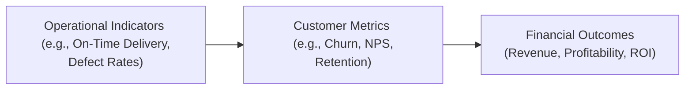

## 6.2 Operational Indicators and Customer Metrics

Non-financial and non-GAAP measures provide valuable insights when analyzing a company’s performance and future prospects. As covered in Section 6.1 (The Balanced Scorecard Approach), modern accounting does not rely solely on traditional financial metrics; it increasingly emphasizes key performance indicators (KPIs) spanning operational efficiency, customer satisfaction, and market presence. This section presents practical guidance for understanding and applying some of the most critical operational and customer metrics. By blending these metrics with standard financial analysis, accountants, analysts, and finance professionals can deepen organizational insights, detect potential risks and opportunities, and ultimately provide more robust and forward-looking recommendations.

-------------------------------------------------------------------------------

## The Significance of Operational and Customer Metrics

Financial statements, such as the balance sheet, income statement, and statement of cash flows, offer a historical picture of a company’s financial health. However, they often fail to account for intangibles, swift market shifts, or emerging risks that may affect long-term success. Operational and customer metrics address this gap by providing real-time or near-real-time performance signals, offering a more comprehensive perspective on the drivers behind financial results.

When supplemented with robust financial data, these KPIs can:

• Alert management to trends before they appear in financial statements.  
• Reveal inefficiencies or bottlenecks in production, service delivery, or sales processes.  
• Indicate heightened satisfaction or dissatisfaction among customers, influencing future revenues and brand loyalty.  
• Help predict revenue, working hand-in-hand with budgeting and forecasting (Chapter 7).  
• Enable comparative benchmarking within an industry while better incorporating intangible assets and brand reputation.  

By honing in on operational and customer metrics, professionals working under the CPA BAR (Business Analysis and Reporting) umbrella can offer decisive support that goes beyond the ledger, making these metrics a must-have in modern financial analysis.

-------------------------------------------------------------------------------

## Common Operational Indicators

### Throughput Time

Throughput time (also called cycle time) measures how long it takes to produce a good or deliver a service. In manufacturing contexts, it spans from initial input (raw materials) to final output (finished goods). A shorter throughput time often reflects higher efficiency, leading to lower production costs and quicker inventory turnover (see Chapters 4 and 5 for ratio analysis and cost management techniques).

### On-Time Delivery

On-time delivery (OTD) is the percentage of orders shipped or services rendered by the promised deadline. In highly competitive markets—particularly e-commerce and just-in-time manufacturing—OTD is a cornerstone metric for operational excellence. A low OTD often indicates supply chain, labor, or scheduling issues. A high OTD reflects solid logistical processes, effective capacity planning, and reliable supplier relationships.

### Production Yield and Defect Rates

Production yield quantifies the proportion of non-defective units produced. Defect rates capture the inverse metric, spotlighting the percentage of products or services that fail to meet quality standards. These metrics tie directly to managerial and cost-accounting insights (refer to Chapter 5.1 and 5.2), revealing opportunities to improve quality control, processes, and ultimately customer satisfaction.

### Capacity Utilization

Capacity utilization compares an organization’s current output to its maximum potential output. An optimal utilization rate balances efficiency (i.e., more production output per fixed overhead) against flexibility (i.e., room to scale if demand spikes). An underutilized capacity might indicate inefficiency or sluggish demand, whereas overutilized capacity may lead to burnout of equipment, subpar quality, or inability to handle surges in orders.

### Inventory Turns

Inventory turnover measures how often a company sells and replaces its inventory over a specific period. Higher turnover indicates strong demand management and efficient inventory control. Conversely, a sluggish turnover may suggest overstocking, outdated products, or weak sales. Monitoring inventory turns in tandem with on-time delivery and capacity utilization offers a holistic view of a company’s operational health.

-------------------------------------------------------------------------------

## Common Customer Metrics

### Customer Acquisition Cost (CAC)

Customer Acquisition Cost calculates the average cost of obtaining a new customer. This includes marketing expenses, advertising, lead generation, and sales commissions. CAC is instrumental in determining whether a company’s marketing strategies are cost-effective. High CAC relative to customer lifetime value can erode profitability.

### Customer Lifetime Value (CLV)

Customer Lifetime Value (CLV) estimates the net present value of the contributions generated by a particular customer over the entire customer relationship duration. It can be expressed as:

$$
\text{CLV} = \sum_{t=1}^{T}\frac{\bigl(\text{Revenue}_t - \text{Cost}_t\bigr)}{(1+r)^t}
$$

where:  
• \\( \text{Revenue}_t \\) is the revenue received from the customer in period \\( t \\).  
• \\( \text{Cost}_t \\) is the direct cost to serve the customer in period \\( t \\).  
• \\( r \\) is the discount rate.  
• \\( T \\) is the total number of periods in the projected customer relationship.

A high CLV to CAC ratio (e.g., 3:1 or better) generally indicates that marketing and sales efforts are lucrative. A balanced CLV approach also encourages a firm to invest in loyalty, personalization, and retention strategies to maximize returns per customer.

### Retention and Churn Rates

• Retention Rate: The percentage of existing customers who remain customers over a given time frame (e.g., monthly or yearly). Businesses beyond the software-as-a-service (SaaS) space now track retention diligently.  
• Churn Rate: The opposite of retention—a measure of how many customers discontinue service or fall off from their recurring relationship with the firm. Minimizing churn is critical for subscription-based and digital platform business models.

High churn signals potential dissatisfaction with products, pricing, or service quality. Investigating churn is essential to gauge how effectively a company retains relationships and fosters goodwill for the brand.

### Net Promoter Score (NPS) and Customer Satisfaction (CSAT)

Dive into intangible facets of customer sentiment with net promoter score (NPS) and CSAT:

• Net Promoter Score (NPS) is the difference between “Promoters” (customers rating the brand 9–10 on a 0–10 scale) and “Detractors” (those rating 0–6). NPS is a succinct barometer of brand advocacy.  
• Customer Satisfaction (CSAT) surveys gauge immediate satisfaction levels after a purchase or service interaction, often measured on a 1–5 scale.  

These qualitative indicators can supplement retention metrics, offering insights into loyalty and the likelihood of future referrals or repeat purchases.

### Average Revenue Per User (ARPU)

ARPU is particularly common in telecommunications, subscription-based, or consumer platform businesses. It’s calculated as the total revenue divided by the number of active users or subscribers. Tracking ARPU trends over time highlights how effectively a company can monetize its existing user base. ARPU can combine effectively with churn rate to assess overall growth potential and market penetration.

-------------------------------------------------------------------------------

## Case Example: Using Operational and Customer KPIs for a Manufacturing Firm

Imagine a mid-sized electronics manufacturer, TechGear, that sells custom computer components. The CFO wants to identify the root cause of a recent dip in net income and higher returns.

1. Internal data reveal rising defect rates (from 2.5% to 5%) in circuit boards, increasing rework costs and slowing factory throughput.  
2. On-time delivery rates drop from 98% to 88% within a quarter, leading to customer dissatisfaction and lost sales.   
3. Customer churn data from TechGear’s top 20 corporate accounts worsen—three of them shift a sizable share of their orders to competitors.  

By combining operational and customer metrics, TechGear identifies the quality control gap in circuit boards as the prime culprit behind late deliveries and customer dissatisfaction. This early detection triggers:

• Process redesigns and improved training for the assembly line.  
• Enhanced supplier screening for subcomponent quality.  
• Closer collaboration between sales and production to recalibrate delivery promises.  

Over time, these improvements reduce defect rates to 2% and restore OTD to above 95%, thereby increasing customer retention and sales.

-------------------------------------------------------------------------------

## Visualizing the Flow from Operational & Customer Metrics to Financial Performance

Below is a simplified Mermaid diagram illustrating the linkage among operational indicators, customer metrics, and profitability:

In this diagram, changes in operational indicators typically affect customer perceptions, loyalty, and likelihood of repeat purchases. Over time, satisfied and loyal customers drive better financial outcomes, including higher revenues and stable margins.

-------------------------------------------------------------------------------

## Integrating Non-Financial Metrics into Financial Analysis

### Linking to the Balanced Scorecard

Combining non-financial metrics with financial ones is a hallmark of the Balanced Scorecard (see Section 6.1). The Balanced Scorecard incorporates four key perspectives:  
• Financial  
• Customer  
• Internal Processes  
• Learning and Growth  

Operational and customer metrics are chiefly reflected in the Customer and Internal Processes perspectives. Integrating them systematically ensures both short-term profit goals and long-term strategy objectives receive equal, data-driven attention.

### Including Operational and Customer KPIs in Forecasting Models

Operational metrics like throughput, capacity utilization, and on-time delivery can refine cost projections within rolling forecasts (Chapter 7.2), while customer metrics (churn, CLV, ARPU) inform revenue predictions. Accounting professionals should align marketing, sales, and operational data to produce accurate scenario analyses and identify potential risk factors early.

### Allocating Resources for Improvements

By capturing a holistic picture of business health, organizations can better allocate capital among:  
• Process enhancements, such as automation or re-engineering the production line.  
• Customer retention programs, such as loyalty schemes or improved customer support.  
• Data analytics initiatives, bridging operational, customer, and financial information for deeper insights (see Chapter 3 for data analytics tools and techniques).

-------------------------------------------------------------------------------

## Common Pitfalls and Recommendations

1. Overemphasis on One Metric: Focusing solely on churn without regard to ARPU, or obsessing about on-time delivery without factoring in cost, can present a distorted view. Balance is key.  
2. Misaligned Measurement Windows: Operational and customer metrics can track daily or weekly changes, while financial statements provide a quarterly or annual snapshot. Ensure consistent time horizons for relevant decisions.  
3. Inconsistent Data Quality: Metrics like churn rate or capacity utilization are only as accurate as the underlying data. Collaborate with IT teams (see Chapter 25.2) to ensure clean, consistent data collection.  
4. Lack of Context: Benchmarking is crucial. A retention rate of 80% might be high in one industry but low in another. Stay informed about industry averages and best practices to contextualize your findings.  
5. Inattention to Data Visualization and Communication: Present operational and customer insights in dashboards or concise reports that highlight trends (Chapter 25.3). Clear visuals and narrative ensure decision-makers can act on the intelligence.

-------------------------------------------------------------------------------

## Practical Insights and Real-World Scenarios

• In B2C subscription services like digital media streaming, churn rate serves as the “lifeline metric.” Reducing churn by even one or two percentage points significantly affects lifetime revenue, making it a critical focus for cross-functional teams spanning product development and marketing.  
• In global supply chain contexts, on-time delivery is a crucial KPI that can directly influence entire downstream processes. For instance, a delayed shipment might cause a retailer to miss seasonal sales windows, impacting not only that retailer’s finances but also the supplier’s future contract viability.  
• Professional service firms (e.g., consulting, legal, and accounting) may prioritize “utilization rate” or “billable hours” for operational performance alongside NPS or CSAT metrics for client satisfaction. Balancing employee burnout and client demands is vital for sustainable growth.  
• E-commerce platforms leverage a combination of ARPU, customer acquisition cost (CAC), and conversion rate to evaluate digital marketing budgets, promotional events, and user-experience improvements.

-------------------------------------------------------------------------------

## References for Further Exploration

• Kaplan, R. S., & Norton, D. P. (1992). “The Balanced Scorecard—Measures That Drive Performance.” Harvard Business Review.  
• Harvard Business Review on Net Promoter Score (NPS): https://hbr.org/2003/12/the-one-number-you-need-to-grow  
• Financial Management Association (FMA) for white papers on linking non-financial metrics to enterprise value: https://www.fma.org/  

-------------------------------------------------------------------------------

## Test Your Knowledge: Operational Indicators and Customer Metrics



### Which of the following best defines on-time delivery (OTD)?
- [x] The percentage of orders or services delivered by the promised deadline
- [ ] The ratio of quality goods delivered to recycled goods
- [ ] The average number of orders processed per month
- [ ] The financial benchmark comparing a firm’s operations to its competitors

> **Explanation:** On-time delivery focuses on whether products or services are carried out or shipped within the agreed-upon timeframe, serving as a major indicator of logistics and operational efficiency.

### Which statement about churn rate is correct?
- [x] It measures the rate at which customers stop using a product or service over a given period
- [ ] It measures how many new customers have been gained in a given period
- [x] It measures the rate at which customers abandon a subscription after its first renewal
- [ ] It measures customer profits relative to industry averages only

> **Explanation:** Churn rate identifies how many customers discontinue their relationship with the organization. It can apply to new subscribers or existing patrons and signals potential dissatisfaction or changing needs.

### What does CLV (Customer Lifetime Value) represent?
- [x] The net present value of revenue generated by a customer minus the costs associated, over the relationship period
- [ ] The total marketing expenditure for one advertising campaign
- [ ] The difference between retained and lost customers in a year
- [ ] The ratio of selling price to cost components in production

> **Explanation:** CLV is a forward-looking metric that determines how profitable a customer is over the long term, accounting for both revenues and related costs, discounted back to present value.

### A rising production defect rate could most likely impact which two metrics negatively?
- [x] On-time delivery and customer churn
- [ ] Customer acquisition cost and brand expansion
- [ ] Net promoter score and interest expense
- [ ] ARPU and sales commissions

> **Explanation:** An increase in defect rates can slow down the production line, reducing on-time delivery performance, which can in turn erode customer satisfaction and increase churn among dissatisfied buyers.

### Which of the following is a key tenet of operational excellence?
- [x] Shortening throughput times to align with budget and demand
- [ ] Increasing marketing expense at any cost to boost brand presence
- [x] Maintaining consistent on-time delivery as a result of supply chain efficiency
- [ ] Reporting intangible assets as part of the GAAP balance sheet

> **Explanation:** Operational excellence involves optimizing production lead times and supply chain coordination to ensure timely delivery; intangible assets are not accounted for in traditional GAAP balance sheets in the same manner as operational KPIs.

### What is a common pitfall when analyzing operational and customer metrics?
- [x] Overemphasizing one metric at the expense of others
- [ ] Conducting frequent internal audits
- [ ] Comparing metrics to industry best practices
- [ ] Including metrics in the Balanced Scorecard

> **Explanation:** While measurement is beneficial, over-focusing on a single KPI can render an incomplete or distorted picture of overall performance. Balance across multiple metrics is vital.

### Which practice helps ensure operational and customer metrics lead to actionable insights?
- [x] Incorporating them into dashboards or concise reports for leadership
- [ ] Sharing them only with production line workers
- [x] Eliminating them from budgeting and forecasting processes
- [ ] Scheduling reports once every two years

> **Explanation:** Presenting these KPIs in an accessible manner is essential to facilitate informed decision-making. Combining data visualization and frequent reporting fosters transparency, timely intervention, and strategic alignment.

### A company's Net Promoter Score (NPS) is calculated by:
- [x] Subtracting the percentage of Detractors (0–6) from the percentage of Promoters (9–10)
- [ ] Multiplying the percentage of Promoters by the percentage of Passives
- [ ] Dividing the average revenue by cost of goods sold
- [ ] Adding the total number of Passives to the total sales

> **Explanation:** NPS is a measure of customer advocacy, calculated using a simple formula where Detractors are subtracted from Promoters. Passives (7–8) do not affect the final score.

### Customer Acquisition Cost (CAC) typically includes which of the following?
- [x] Marketing, advertising, and conversion costs to gain new customers
- [ ] Inventory write-offs and intangible amortization
- [ ] Sales taxes and overhead depreciation
- [ ] Only direct labor costs of manufacturing

> **Explanation:** CAC comprises the total expense of attracting and converting prospective customers, such as digital advertising costs, sales commissions, and marketing campaigns.

### A high rate of on-time delivery most directly suggests which of the following?
- [x] True
- [ ] False

> **Explanation:** If on-time delivery is high, it most directly suggests strong operational processes and supplier coordination. This KPI does not, by itself, guarantee profit, but typically correlates with greater customer satisfaction and retention.



-------------------------------------------------------------------------------

## For Additional Practice and Deeper Preparation

### [Business Analysis and Reporting (BAR) CPA Mock Exams](https://www.udemy.com/course/bar-cpa-mock-exams/?referralCode=ADBE2E84BEE9CB6243CA)

**Business Analysis and Reporting (BAR) CPA Mocks:** 6 Full (1,500 Qs), Harder Than Real! In-Depth & Clear. Crush With Confidence!

- Tackle full-length mock exams designed to mirror real BAR questions.  
- Refine your exam-day strategies with detailed, step-by-step solutions for every scenario.  
- Explore in-depth rationales that reinforce higher-level concepts, giving you an edge on test day.  
- Boost confidence and minimize anxiety by mastering every corner of the BAR blueprint.  
- Perfect for those seeking exceptionally hard mocks and real-world readiness.

_Disclaimer: This course is not endorsed by or affiliated with the AICPA, NASBA, or any official CPA Examination authority. All content is for educational and preparatory purposes only._


