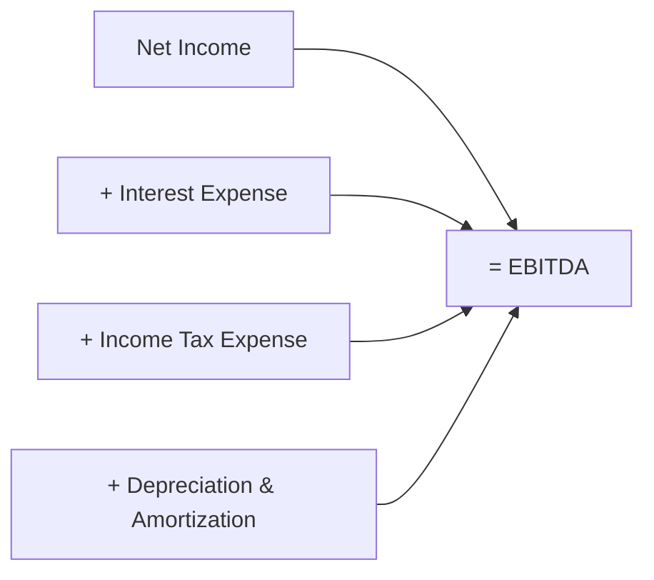
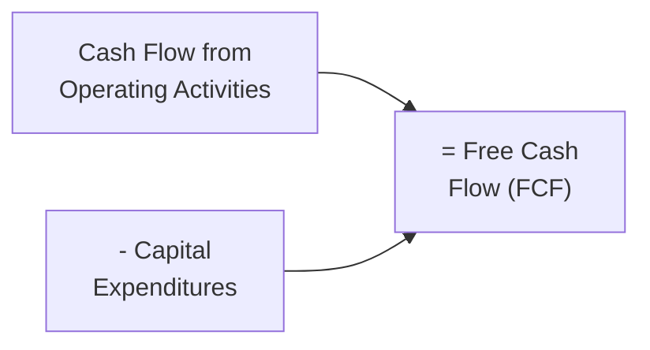

## 6.3 Evaluating EBITDA, Free Cash Flow, and Other Non-GAAP Metrics

Non-GAAP metrics have grown in popularity among investors, analysts, and corporate managers. These alternative performance measures offer insights into a company’s underlying business operations while removing or adjusting for certain accounting charges or items that some argue may obscure the “true” economic performance. At the same time, these measures must be handled with professional skepticism and clear disclosure requirements (see Chapter 6.4 for further discussion on professional skepticism regarding Non-GAAP disclosures). This section delves into three primary metrics—EBITDA, Free Cash Flow (FCF), and other common Non-GAAP measures—focusing on their calculations, uses, and critical limitations.

## Introduction

Financial statements prepared under U.S. GAAP or IFRS contain a wealth of information. However, the complexity of modern businesses and the various judgments and estimates required for compliance reporting have led many stakeholders to seek supplementary metrics that attempt to isolate core business performance. These supplementary figures—often referred to as Non-GAAP or “pro forma” measures—may exclude or add back items such as certain non-recurring charges, intangible asset amortization, or stock-based compensation expense. While these metrics can be valuable for assessing trends and forecasting, they can also be manipulated. Hence, a strong understanding of their calculation, relevance, and potential pitfalls is critical for any accounting professional.

## Understanding EBITDA

EBITDA stands for Earnings Before Interest, Taxes, Depreciation, and Amortization. While not recognized as a formal GAAP measure, EBITDA is seen as a proxy for operating performance because it focuses on the earnings derived from a company’s core operations without the effects of financing decisions (interest), tax strategies, and non-cash charges (depreciation and amortization).

### Calculation

A common approach to compute EBITDA is to start with Net Income and then add back the following items:

• Interest Expense (or Net Interest)  
• Income Tax Expense (or Benefit)  
• Depreciation Expense  
• Amortization Expense  

In formula form:

 \text{EBITDA} = \text{Net Income} + \text{Interest} + \text{Taxes} + \text{Depreciation} + \text{Amortization} 

Below is a simple Mermaid diagram illustrating how EBITDA is derived:

### Rationale and Usage

1. Operating Performance: By removing the impact of financing and accounting decisions, EBITDA can highlight core operational profitability.  
2. Comparability Across Firms: Stakeholders often use EBITDA to compare firms in capital-intensive industries or companies with different capital structures.  
3. Debt Service Analysis: Lenders and bondholders scrutinize EBITDA to gauge how much cash-like earnings are available to service debt obligations.

### Example

Consider a manufacturing company with the following reported annual figures:
• Net Income: $500,000  
• Interest Expense: $40,000  
• Income Tax Expense: $60,000  
• Depreciation and Amortization: $100,000  

Its EBITDA would be $500,000 + $40,000 + $60,000 + $100,000 = $700,000. While the company’s net income is $500,000, EBITDA suggests a higher level of operating profit when ignoring specific accounting or financing items.

### Limitations

1. Potential Overstatement: EBITDA strips out certain expenses that can be significant. Depreciation, despite being a non-cash expense, reflects capital outlays that wear out over time.  
2. Not a Substitute for Cash Flow: Non-cash items do matter, especially when considering large capital expenditures or intangible assets.  
3. Subject to Manipulation: Management might adjust components of EBITDA, making cross-company comparisons less reliable without consistent definitions.

## Understanding Free Cash Flow (FCF)

Free Cash Flow (FCF) is a non-GAAP metric that measures a company’s ability to generate cash flow after deducting capital expenditures (CapEx) needed to maintain or expand the asset base. Where EBITDA focuses on performance approximation, FCF focuses on the cash available to pay down debt, finance new projects, or distribute to owners—making it a crucial indicator of financial flexibility.

### Calculation

The most straightforward approach begins with Cash Flow from Operating Activities (CFO), found on the Statement of Cash Flows, and subtracts Capital Expenditures. This yields a “basic” measure of FCF:

 \text{FCF} = \text{CFO} - \text{Capital Expenditures} 

Diagrammatically:

Some companies may further refine FCF by adjusting items such as acquisitions, dividend payments, or proceeds from asset sales, resulting in variations like “Free Cash Flow to Equity (FCFE)” or “Adjusted Free Cash Flow.” It is essential to identify which version of FCF a company is using in its investor presentations or earnings releases.

### Rationale and Usage

1. Cash Generation: FCF reveals how efficiently a company converts sales into cash, once necessary reinvestments in major fixed or intangible assets are made.  
2. Debt and Dividend Capacity: A company generating robust FCF is better positioned to fund growth, retire debt, or return money to investors through buybacks or dividends.  
3. Valuation: FCF is a popular input in Discounted Cash Flow (DCF) valuation models. Investors often discount projected FCF to arrive at a company’s intrinsic value (see Chapter 9 for more on valuation techniques).

### Example

Suppose a retail chain reports:
• Cash Flow from Operating Activities: $2,000,000  
• Capital Expenditures: $400,000  

Its basic FCF would be $2,000,000 - $400,000 = $1,600,000. This represents the cash left over after maintaining and expanding physical store locations and infrastructure.

### Limitations

1. Timing Differences: Companies with seasonal or volatile cash flows might show short-term swings in FCF that do not reflect underlying long-term performance.  
2. Judgments in Capital Expenditures: Management decisions on what constitutes a “capital expenditure” can impact FCF, especially for software development, intangible initiatives, or maintenance CapEx.  
3. Not a Standalone Metric: Like EBITDA, FCF should be evaluated alongside GAAP measures to maintain a robust financial picture.

## Other Common Non-GAAP Metrics

Besides EBITDA and FCF, companies utilize various other measures to highlight performance:

### Adjusted EBITDA

Some companies report “Adjusted EBITDA,” adding back even more items deemed non-recurring or non-operating, such as restructuring costs, legal settlements, or share-based compensation. These adjustments can complicate comparability, as what is considered “non-recurring” may vary widely.

### Adjusted Net Income or Adjusted EPS

A company might report “Adjusted Net Income” or “Adjusted Earnings per Share (EPS)” by adding back non-core expenses (e.g., one-time merger costs) or subtracting certain gains (e.g., sale of a property). While these measures can clarify one-off impacts, they can also be overused, obscuring important data from investors. Always scrutinize the reconciliation to GAAP net income.

### Non-GAAP Revenue or “Billings”

Software-as-a-Service companies may report “Billings,” which include revenue still under deferred revenue arrangements, to help illustrate sales traction. This measure can provide insight into future revenue but is not strictly recognized under GAAP unless properly reconciled.

### Key Ratios and Operational Metrics

Beyond purely financial metrics, non-financial indicators—such as churn rate for subscription businesses, daily active users for social media, or same-store sales growth for retailers—can supplement GAAP data. While vital, these metrics require standardization to preserve comparability.

## Why Management Uses Non-GAAP Metrics

• Highlight Core Trends: By excluding one-off expenses or non-cash items, management argues that these metrics better reflect underlying operational performance.  
• Communicate Strategic Initiatives: A company undergoing significant restructuring or acquisitions might prefer presenting performance in a manner that excludes these “transitional” items.  
• Meet Investor Demands: Analysts, creditors, and rating agencies often request Non-GAAP metrics to compare companies operating in different accounting and regulatory environments, especially internationally.

Cross-reference to Chapter 4 on ratio analysis can provide additional context on how these Non-GAAP metrics complement (but do not replace) GAAP-based financial ratios. For broader insights, also see Chapter 6.4 on interpreting Non-GAAP reporting with professional skepticism.

## Potential Limitations, Pitfalls, and Regulations

Despite their utility, Non-GAAP metrics come with inherent risks:

• Lack of Standardization: There is no comprehensive set of GAAP or IFRS rules dictating how to calculate these measures. Companies have latitude in how they define and adjust metrics like Adjusted EBITDA or FCF.  
• Overly Aggressive “Add-Backs”: Some companies may remove recurring expenditures (like routine maintenance or certain operational costs) by labeling them as “extraordinary.”  
• Regulatory Scrutiny: The U.S. Securities and Exchange Commission (SEC) enforces strict disclosure rules for Non-GAAP measures. Public filers must reconcile these figures to the most comparable GAAP metric, and any presentation that is misleading or more prominent than GAAP measures could violate SEC regulations.  
• Comparability Issues: Talk of “apples-to-apples comparisons” can be misleading if each company defines its adjusted measures differently.

## Practical Illustrations and Case Studies

Case Study 1: Technology Startup with Heavy Stock-Based Compensation  
A SaaS-based startup has significant stock-based compensation expenses, drastically reducing its net income. Management presents an “Adjusted EBITDA” to reflect the company’s operational progress without these non-cash, equity-related costs. Investors must decide whether these expenses are truly “one-time” or if they represent an ongoing part of the compensation strategy.

Case Study 2: Long-Lived Assets and Depreciation  
A manufacturing giant invests heavily in new production lines, incurring high depreciation charges. By focusing on EBITDA, management emphasizes the robust production capacity and near-term profitability. However, ignoring depreciation could mislead investors regarding the cost of maintaining and replacing these lines over time.

Case Study 3: Retailer and FCF Patterns  
A multi-location retailer shows strong Cash Flow from Operating Activities yet invests heavily in new store construction. Substantial CapEx pushes free cash flow into negative territory. Management might highlight “FCF before expansion CapEx” to showcase the underlying capacity of existing stores, but that extra measure must be reconciled and explained so investors understand the growth-oriented investments being made.

## Best Practices for Evaluating Non-GAAP Measures

• Reconciliation to GAAP: Always consult the company’s official reconciliation table. The SEC requires public filers to show how their Non-GAAP figures relate to standard GAAP metrics.  
• Consistent Period-Over-Period Application: Look for consistent definitions across multiple reporting periods to spot trends and potential manipulation.  
• Evaluate Underlying Assumptions: Dig into “one-time” or “non-recurring” costs. Are these expenses truly non-recurring or are they likely to appear again?  
• Complement, Don’t Replace: Non-GAAP measures should not be substituted for audited financial statements. They are supplemental in nature and work best when understood in conjunction with GAAP results.  
• Read Management’s Discussion and Analysis (MD&A): MD&A often discloses the rationale behind certain adjustments, as well as management’s perspective on operating conditions.

## Conclusion

EBITDA, Free Cash Flow, and a variety of other Non-GAAP measures have become central tools for understanding a company’s operational health beyond the complexities of GAAP-reported figures. While these metrics can provide valuable windows into performance, those relying on them must maintain a thorough, balanced perspective—acknowledging potential distortions and ensuring consistent, transparent application. As an aspiring CPA or an experienced practitioner, your ability to critically evaluate these measures is critical for robust financial analysis and reliable decision-making.

## Test Your Knowledge: Evaluating EBITDA, Free Cash Flow, and Non-GAAP Metrics



### Which statement best describes a key advantage of using EBITDA?
- [x] It removes the effects of financing and non-cash expenses to focus on operating performance.
- [ ] It fully reflects the capital expenditures required to maintain the business.
- [ ] It is an official GAAP measure approved by the SEC.
- [ ] It includes the impact of non-recurring transactions more accurately than net income.

> **Explanation:** EBITDA excludes interest, taxes, depreciation, and amortization, aiming to isolate core operating performance.

### Which of the following items is generally subtracted from Cash Flow from Operating Activities to arrive at Free Cash Flow?
- [x] Capital expenditures
- [ ] Income taxes
- [ ] Depreciation expense
- [ ] Stock-based compensation

> **Explanation:** The simplest formula for FCF is CFO minus capital expenditures.

### Which action would most likely overstate a company's Adjusted EBITDA?
- [x] Treating recurring maintenance costs as non-recurring and adding them back to EBITDA
- [ ] Including interest and tax expenses in EBITDA
- [ ] Including depreciation for older assets in the calculations
- [ ] Separating financing cash flows from operating cash flows

> **Explanation:** Overstating Adjusted EBITDA often happens when regular, ongoing costs are labeled as “one-time” or “unusual,” inflating the metric.

### A company that is capital-intensive reports significant depreciation. Why might EBITDA differ substantially from Free Cash Flow?
- [x] Because depreciation is a non-cash expense but spending on capital is real cash outlay.
- [ ] Because EBITDA directly includes principal debt repayments.
- [ ] Because EBITDA is reduced by interest expenses.
- [ ] Because Free Cash Flow ignores operating cash inflows.

> **Explanation:** Even though depreciation is non-cash, the associated capital expenditures can be material, reducing actual Free Cash Flow.

### Which of the following is a primary risk associated with Non-GAAP metrics?
- [x] They can be easily manipulated by management due to a lack of standard rules.
- [ ] They precisely reflect the company’s core operations.
- [x] They are always more accurate than audited GAAP results.
- [ ] They are computed using standard formulas mandated by the FASB.

> **Explanation:** Because there are no uniform rules on how to calculate them, Non-GAAP measures can vary widely and be manipulated.

### In a technology startup, why might management highlight an adjusted metric that excludes stock-based compensation?
- [x] They claim stock-based compensation is a non-cash expense and not reflective of normal operations.
- [ ] They want to follow SFAS rules for intangible asset amortization.
- [ ] They are required by IFRS to exclude stock-based compensation.
- [ ] They intend to lower the reported net income for tax purposes.

> **Explanation:** Many startups consider stock-based compensation as a non-cash expense that should be excluded from “core” performance metrics.

### If a company has $500,000 in operating cash flow and $600,000 in capital expenditures, how would you interpret its Free Cash Flow?
- [x] It's negative, indicating the company spent more on capital investments than it generated in operating cash flow.
- [ ] It's zero, indicating balanced operational and capital spending.
- [x] It's positive, reflecting sound operational strength after investments.
- [ ] It's undefined, as FCF cannot be negative.

> **Explanation:** With $500,000 CFO and $600,000 CapEx, FCF is -$100,000, meaning the company must seek additional financing or use reserves.

### Which is a best practice when analyzing Non-GAAP metrics?
- [x] Consistently compare them across periods and require a clear reconciliation to GAAP measures.
- [ ] Avoid using them entirely and rely only on GAAP financials.
- [ ] Add them together to arrive at an overall performance measure.
- [ ] Rely on management’s claim that metrics are consistent without verification.

> **Explanation:** Non-GAAP measures should complement, not replace, GAAP numbers and must be reconciled consistently.

### What is a reason companies might report Adjusted Net Income or Adjusted EPS?
- [x] To remove the effects of unusual or non-recurring transactions for a clearer view of ongoing performance.
- [ ] To highlight depreciation expense more prominently.
- [ ] To ensure foreign exchange gains are double-counted.
- [ ] To decrease reported profit for tax advantages.

> **Explanation:** Adjusted Net Income/EPS often excludes transactions deemed one-off or non-recurring to provide insight into “core” operations.

### A company's consistent use of Non-GAAP metrics, such as EBITDA, with appropriate disclosures is generally:
- [x] True
- [ ] False

> **Explanation:** While there are risks, consistent use with clear reconciliation and disclosures can help stakeholders understand operational performance.



## For Additional Practice and Deeper Preparation

### [Business Analysis and Reporting (BAR) CPA Mock Exams](https://www.udemy.com/course/bar-cpa-mock-exams/?referralCode=ADBE2E84BEE9CB6243CA)

**Business Analysis and Reporting (BAR) CPA Mocks:** 6 Full (1,500 Qs), Harder Than Real! In-Depth & Clear. Crush With Confidence!

- Tackle full-length mock exams designed to mirror real BAR questions.  
- Refine your exam-day strategies with detailed, step-by-step solutions for every scenario.  
- Explore in-depth rationales that reinforce higher-level concepts, giving you an edge on test day.  
- Boost confidence and minimize anxiety by mastering every corner of the BAR blueprint.  
- Perfect for those seeking exceptionally hard mocks and real-world readiness.

_Disclaimer: This course is not endorsed by or affiliated with the AICPA, NASBA, or any official CPA Examination authority. All content is for educational and preparatory purposes only._
